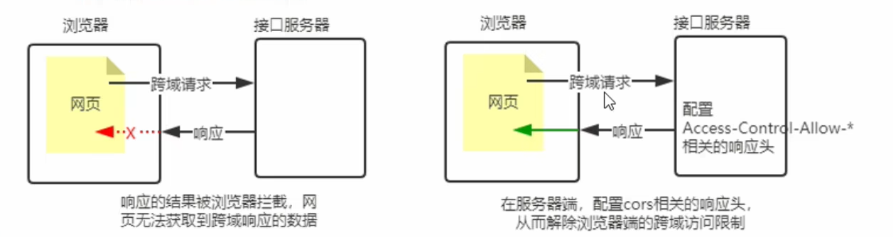

# [CORS 跨域資源共享](./day5/README.md)

## 概念
CORS(Cross-Origin Resource Sharing，跨域資源共享)
由一系列 **HTTP 響應頭** 組成，這些 **HTTP 響應頭** 決定瀏覽器是否阻止前端 **JS 代碼** 跨域獲取資源。
瀏覽器的[同源安全策略](https://zh.wikipedia.org/wiki/%E5%90%8C%E6%BA%90%E7%AD%96%E7%95%A5)
默認會阻止網頁 **跨域** 獲取資源，但如果接口服務器配置了 CORS 相關的 HTTP 響應頭，
就可以解除瀏覽器端的跨域訪問限制

> 此圖片截自: bilibili黑馬程序員-Node.js
默認情況下，CORS僅支持客戶端向服務器發送如下 9個請求頭 :
`Accept`、`Accept-Language`、`Content-Language`、`DPR`、`Downlink`、`Save-Data`、`View-Width`、`Width`、`Content-Type`。
默認情況下，CORS僅支持客戶端發起 **GET**、**POST**、**HEAD** 請求。

## 注意事項
* ### 1. CORS 主要在服務器端進行配置，客戶端瀏覽器無需做任何額外的配置，即可請求開啟了CORS接口。
* ### 2. CORS 在瀏覽器中有兼容性，只支持 **XMLHttpRequest Level2** 的瀏覽器，才能正常訪問開啟了 CORS 的服務器。
> 例如 :
>> IE10+、Chrome4+、FireFox3.5+。

## CORS 響應頭部
### 1. Access-Control-Allow-Origin
* 注意 : 星星符號(`*`)該符號是一個通配符，意思是 : 任何的。
該頭部可以指定哪些網站可以訪問我們的資源，語法如下
```
res.setHeader('Access-Control-Allow-Origin', 'http://example.com')
```
> origin : 指定哪些外部URL可以訪問該資源
下述語法則表示所有的外部URL都可以訪問我們的網站資源。
```
res.setHeader('Access-Control-Allow-Origin', '*')
```


### 2. Access-Control-Allow-Headers
* 注意 : 多個請求頭，只需要用逗號(`,`)進行分割就行。
如果客戶端向服務器**發送額外的請求頭信息**，則需要在服務器端，通過**Access-Control-Allow-Headers**對額外的請求進行聲明，
否則這次請求會失敗!
```
res.setHeader('Access-Control-Allow-Headers', 'Content-Type, X-Custom-Header')
```

### 3. Access-Control-Allow-Methods
如果客戶端希望通過 **PUT**、**DELETE** 等方式請求服務器的資源，則需要在服務器端，通過**Access-Control-Allow-Methods**，
來指明實際請求所允許使用的HTTP方法。
```js
res.setHeader('Access-Control-Allow-Methods', 'POST, GET, DELETE, HEAD')
```
以下述的語法表示，允許所有的HTTP請求方法。
```js
res.setHeader('Access-Control-Allow-Methods', '*')
```

## CORS請求分類
* 客戶端在請求CORS接口時，根據請求方式和請求頭的不同，可以分為以下兩大類。
### 1. 簡單請求
1. 請求方式 : GET、POST、HEAD 三者之一
2. HTTP頭部信息不超過基礎的9個請求頭

### 2. 預檢請求
在瀏覽器與服務器正式通信之前，瀏覽器會 **先發送 *OPTION請求* 進行預檢**，以獲知 **服務器是否允許該實際請求**，
所以這一次的 **OPTION** 請求稱為 **預檢請求**；服務器成功響應預檢請求後，才會發送真正的請求，並且攜帶真實數據。
只要符合以下任何一個條件的請求，都需要進行預檢 :
1. 請求方式為 : **GET**、**POST**、**HEAD** 之外的 Method 類型的請求。
2. 請求頭中包含自訂義頭部字段。
3. 向服務器發送了 **application/json** 格式的數據。  
