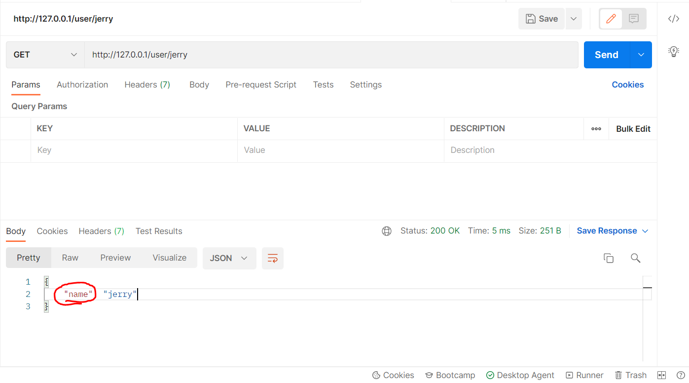
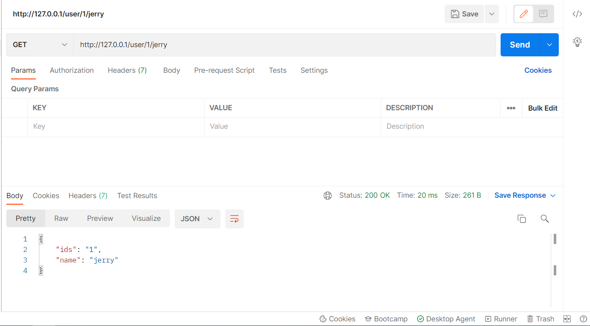
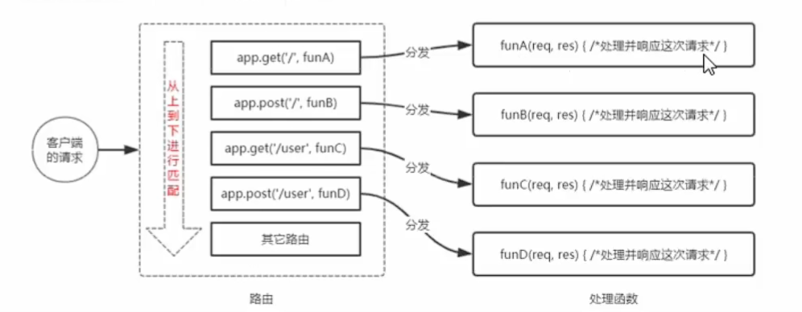
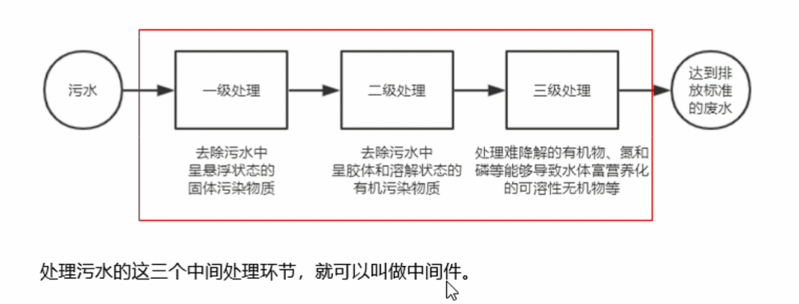
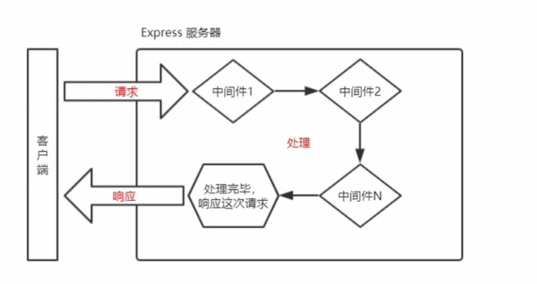
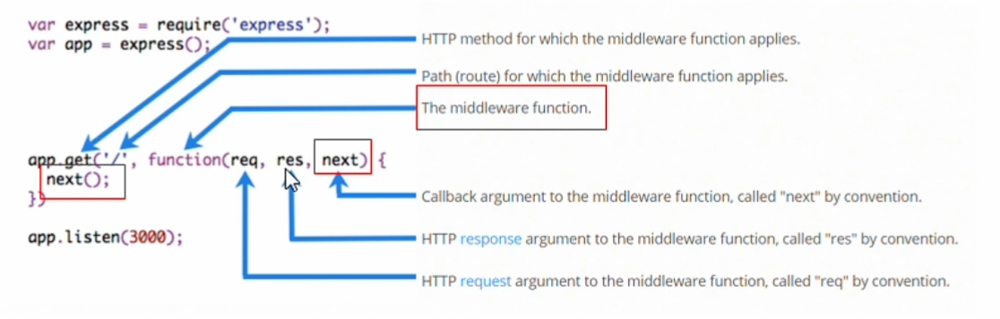

# Express
使用 **Express** ，我們可以方便、快速的創建 **Web網站** 的服務器或 **API接口** 的服務器。 
對於前端工程師來說，最常見的兩種服務器，分別是:
* **Web** 網站服務器 : 專門對外提供 **Web** 網頁資源的服務器。
* **API** 接口服務器 : 專門對外提供 **API** 接口的服務器。
## 1. [GET和POST](./day4/01.使用express創建最基本的服務器.js)
不管是`app.get()`或`app.post()`方法，都有幾個必要的參數:
> 參數1 : 
>>客戶端請求的URL地址
>
> 參數2 : 
>> `req` : 請求對象 (包含了與請求相關的屬性和方法)
>>
>> `res` : 響應對象 (包含了與響應相關的屬性和方法)
## 2. [響應給客戶端](./day4/01.使用express創建最基本的服務器.js)
若想將一些結果發送給客戶端，可以在`app.get()`或`app.post()`
的 **處理函數內(大括號內`{ }`)** 寫入`res.send()`方法。

## 3. [獲取URL中的查詢參數](./day4/01.使用express創建最基本的服務器.js)
所謂的查詢參數，通常指的是 **問號(`?`)** 後面接的參數
> 例如 : ?name=jerry&age=20
而可以通過 `req.query()` 方法，可以訪問到這些參數名。
>
> 例如 : `req.query.name`或`req.query.age`
注意，`req.query()` 默認是一個空對象

## 4. [獲取URL中的動態參數](./day4/01.使用express創建最基本的服務器.js)
* 附註 : 資料庫內可以有很多資料表
* 注意 : `req.params()` 默認是一個空對象
所謂的動態參數，有可能是資料庫內的資料表`id`，當一篇文章或圖片存入資料表時
資料表會給予每一個項目唯一的`id`。
1. 而當我們想要抓取該`id`，就可以使用`req.params()` 方法
2. `req.params()`裡面存放著，通過冒號 **(`:`)** 動態匹配到的參數
3. 冒號 **(`:`)** 後的參數名，不一定是固定的，所以當寫入什麼樣的參數名，服務器就會得到什麼樣的參數名
例如:
```js
app.get('/user/:name', (req,res) => {
    console.log(req.params)
    res.send(req.params)
})
```


4. 動態參數不一定只有一個，可以有兩個或以上的參數名
例如:
```js
app.get('/user/:ids/:name', (req,res) => {
    console.log(req.params)
    res.send(req.params)
})
```



## 5-1. [託管靜態資源](./day4/02.使用express.static對外提供靜態資源.js)
* 注意 : **Express** 在指定的靜態目錄中查找文件，並對外提供資源的訪問路徑；**因此存放在靜態文件的目錄名不會出現在 URL 中**。

express提供了一個函數名叫做 `express.static()`，通過它我們可以非常方便地創建一個靜態資源服務器。

例如，使用以下代碼就可以將 **clock** 目錄下的 **CSS**、**Javascript**、**html** 文件對外開放訪問
```js
app.use(express.static('./clock'))
```

## 5-2. [託管多個靜態資源](./day4/03.託管多個靜態資源.js)
* 注意 : 訪問靜態資源時，`express.static`函數會根據添加的順序查找所需要的文件。
  
若想要託管多個靜態資源目錄，只要多次調用`express.static()`函數，如下
```js
app.use(express.static('./clock'))
app.use(express.static('./files'))
```
> 若 **clock** 和 **files** 都有 `index.html`檔，因 **clock** 目錄先於 **files** 目錄被 `express.static()` 函數讀取，所以會先顯示 **clock** 目錄內的 `index.html`檔。
> 若 **clock** 目錄沒有 `index.html`檔，才會往 `files` 檔內讀取。

## 5-3. [掛載路徑前綴](./day4/04.在express.static前掛載路徑前綴.js)
* 注意 : 一般掛載的前綴會和訪問目錄同名。
如果希望在託管的 **靜態資源訪問路徑**之前，掛載路徑前綴，可以使用以下方法
```js
app.use('./files',express.static('./files'))
```
現在若想訪問 **files** 目錄下的資源，就必須要在前面加入帶有 `/files` 前綴地址來訪問。

## 6. Express路由
1. 路由從廣義上來說就是映射關係，**從現實生活中舉例 : 當我進一家醫院，我牙痛就去牙科，我肚子痛就去看腸胃科**，也就是說我想要得到什麼服務，路由就幫我導向什麼樣的服務。
2. 在 **Express** 中路由 **分3部分組成**，分別是 **請求的類型**、**請求的URL地址**、**處理函數**。
3. 每當有請求到達服務器之後，需要先經過路由的匹配，只有匹配成功，才會調用相對應的處理函數。
4. 在匹配時，會按照路由的順序進行匹配，如果 **請求類型** 和 **請求URL** 同時匹配成功，則 **Express** 會將這次請求，轉交給對應的`function`函數進行處理
* 注意 : 匹配是從上而下進行匹配，只要途中有匹配成功便會處理相對應的處理函數；如下圖。

> 圖片截自 : BiliBili-黑馬程序員的Node.js

## 7. [模塊化路由](./day4/07.Route.js)
為了方便對路由進行模塊化的管理，**Express不建議將路由直接掛載到app上**，而是**推薦將路由抽離為單獨的模塊**。

；以下為創建步驟。
1. 創建路由對應的**.js**文件
2. 調用`express.Router()`函數創建路由對象
3. 向路由對象上掛載具體的路由
4. 使用`module.exports`向外共享路由對象
5. 使用`app.use()`函數註冊路由模塊

* ### 補充第5小節
可能會覺得，奇怪 **[07.Route.js](./day4/07.Route.js)** ，已經是個對外公開的模塊了，為什麼在 **[06.模塊化路由.js](./day4/06.模塊化路由.js)** 時，還要導入 **express** ?
那是因為我只對外公開 `module.exports = router` 的 `router` 變數，
也就是說我在 **[06.模塊化路由.js](./day4/06.模塊化路由.js)** 導入 **[07.Route.js](./day4/07.Route.js)** 這個模塊時，
我只能調用跟`router`變數有關的其他函數。
例如 :
```js
router.get()
router.post()
```

### 7-2. [路由統一前綴](./day4/06.模塊化路由.js)
若要為路由貼加統一的前綴，只要在註冊函數`app.use()`的括號前貼加路徑字符串即可。

例如:
```js
app.use('/api', router)
```

## 8. [中間件概念](./day4/08.定義最簡單的中間件.js)
* 注意 : **錯誤級別中間件** 必須放在所有路由之後。
### 1. 所謂的中間件就是物件處理過程中的中間處理環節，以下為中間件的意象圖。

> 上圖截自 : BiliBili黑馬程序員-Node.js
### 2. 當一個請求到達**Express**服務器後，可以連續調用多個中間件，從而對這次請求進行**預處理**。


### 3. **Express**中的中間件格式，本質上就是一個`function()`處理函數，**Express**中間件的格式如下圖

* 注意 : 如果該函數是個中間件，他必須包含`next()`參數。而路由處裡函數中只包含`req`&`res`。
  
### 4. 中間件的作用，多個中間件之間 **共享同一份`req`和`res`**，基於這樣的特性，我們可以在**上游**的中間件，統一為`req`或`res`對象**添加自訂義的屬性或方法**，供**下游**的中間件或路由進行使用。

5. 中間件的分為五類，分別是 **[應用級別的中間件](./day4/08.js)**、**[路由級別中間件](./day4/07.js)**、**[錯誤級別中間件](./day4/13.js)**、**[Express內置的中間件](./day4/14.js)**、**第三方中間件**
> **應用級別的中間件** :
>> 通過 `app.use()` 或 `app.get()` 或 `app.post()`，綁定到app實例上的中間件，就叫 **應用級別的中間件**。
> **路由級別中間件**
>> 綁定到 `express.Router()` 實例上的中間件，叫做 **路由級別中間件**。
>> 它的用法和 **應用級別的中間件** 沒有區別，只不過一個是綁定到 app 實例上一個是綁定到 router 實例上。
> **錯誤級別中間件** :
>> 專門用來捕獲整個項目中發生的異常錯誤，從而防止項目異常崩貴的問題。
>> 它的 function 必須包含4個形參，順序從前到後分別是 `(err, req, res, next)`。
> **Express內置的中間件** :
>> Express 內置了 3個 常用的中間件，極大的提高了 Express 項目的開發效率和體驗，分別是 `express.static`、`express.json`、`express.urlencoded`。
>>> `express.static` : 快速託管靜態資源的內置中間件，例如 : HTML文件、圖片、CSS樣式等等
>>> `express.json` : 解析 JSON 格式的請求體數據
>>> `express.urlencoded` : 解析 URL-encoded 格式的請求體數據
> **第三方中間件** :
>> 非 Express 官方內置的，而是由第三方開發出來的中間件，叫做第三方中間件；在項目中，可以 **按需求下載並配置**。
>> 第三方中間件的[下載請看這裡](./指令.md)。


## 9. 使用中間件的5個注意點
1. 一定要在 **路由之前**，就先 **定義中間件**，這個代碼 **順序不能亂**。
2. 客戶端發送過來的請求，可以連續調用多個中間件進行處理。
3. 寫完中間件的業務代碼之後，不要忘記調用`next()`函數
4. 為了 **防止代碼邏輯混亂**，調用完 `next()` 函數後不要再寫額外的代碼了。
5. 連續調用多個中間件時，多個中間件之間，共享 `req` 和 `res` 對象。

## 10. Express-跨域問題
在編寫一個 **.html** 檔並直接開啟時，瀏覽器會根據 **.html** 檔在電腦中的存放路徑去進行存取，

，這樣就無法使用 **http** 類型的請求，為解決接口跨域問題的方案主要有兩種 :
1. CORS (主流的解決方案，推薦使用)
2. JSONP(有缺陷的解決方案 : 只支持GET請求)

Express與法: 
`app.get('請求URL', function(req,res) {/處理函數/})` : 該方法可以監聽客戶端的GET請求
`app,post('請求URL', function(req,res) {/處理函數/})` : 該方法可以監聽客戶端的POST請求
`app.use()` : 就是來註冊全局中間件
`res.send()` : 該方法可以把處理好的內容，發送給客戶端。
`req.query()` : 可以訪問到客戶端通過查詢字符串的形式，發送到服務器的參數。
`req.params()` : 可以訪問到 URL 中，通過(`:`)匹配到的動態參數
`express.static()` : 可以將靜態目錄內的資源，對外開放
`const router = express.Router()` : 路由模塊的單獨抽離。
`app.use((req, res, next) => { '處理函數' next() })` : 定義一個全局中間件
`express.json()` : 解析 JSON 格式的數據
`express.urlencoded(extended: false)` : 解析 URL-encoded 格式數據