# SQL 基本語法

* ### 1. 注意 : 在SQL中，他的註釋是長這樣的 (`-- `)，兩個橫槓加一個空白
* ### 2. 注意 : SQL語句中，關鍵字對大小寫不敏感。`SELECT` = `select`、`FROM` = `from` 等等。

## SELECT語句
SELECT 語句用於從表中查詢數據；執行的結果被儲存在一個結果表中(稱為結果集)，語法格式如下。
### 1. 從`FROM`查詢資料表內所有的結果，星號(`*`)表示所有欄位
```
SELECT * FROM 資料表名稱
```
### 2. 從`FROM`查詢資料表中，指定欄位的數據。
```
SELECT 欄位名稱 FROM 資料表名稱
```
### 3. 以下為示範圖
* 注意 : 若要執行語句，請點擊如圖中一樣的閃電圖標。

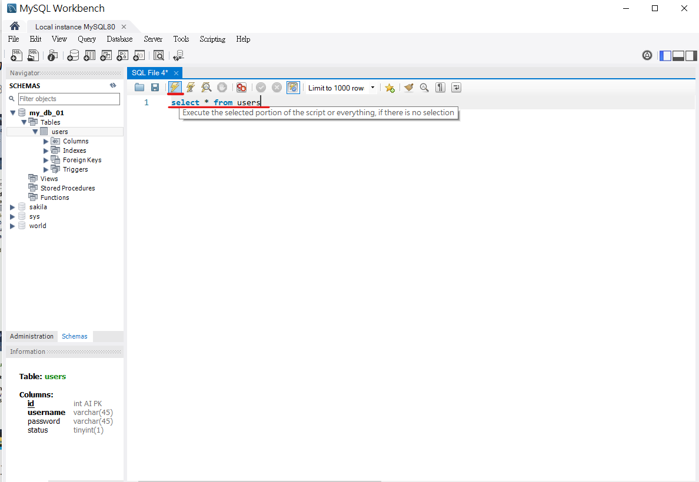
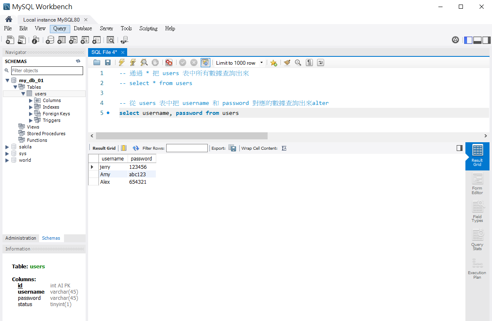

## INSERT TO 語句
INSERT TO 語句用於向資料表中插入新的數據行，語法格式如下。
### 1. 向資料表插入數據
```
INSERT INTO 資料表(欄位1, 欄位2 .....) VALUES (值1, 值2 .....)
```
### 2. 以下為示範圖
* 下圖可以在 **Output** 輸出面板中，看到新增成功，之後便可以用先前的 `SELECT` 語句查詢。

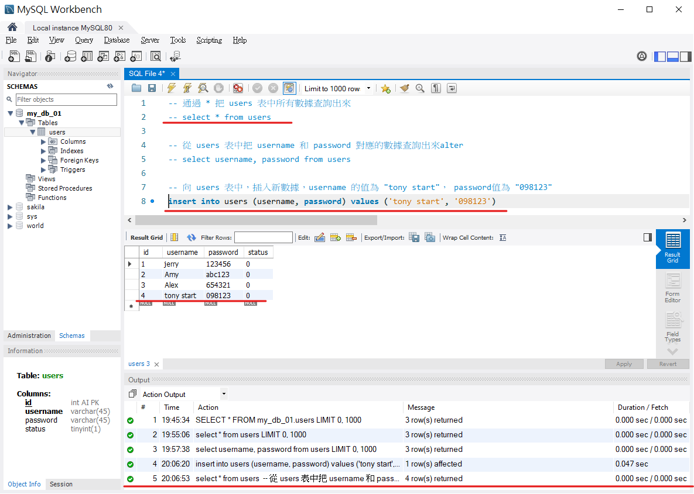

## UPDATE語句
* 注意 : 如果不加 `WHERE` 條件的話，會將整張表更新

Update語句用於修改表中的數據，語法格式如下。
### 1. 使用特定條件(`WHERE`)，更新表內的某一數據
```
UPDATE 資料表名稱 SET 欄位名 = 新值 WHERE 欄位名 = 某值
```

### 2. 將 id 為 4 的用戶密碼，更新成 888888
```
update users set password='888888' where id=4
```
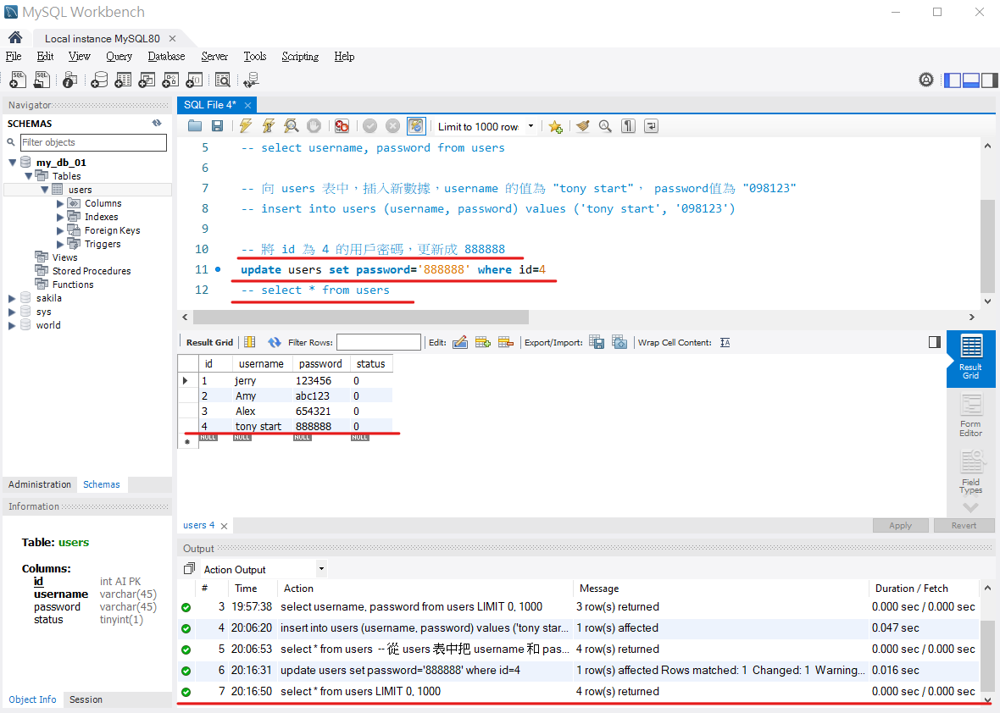

### 3. 把 users 表中 id 為 2 的用戶密碼和用戶狀態，分別更新為 `admin123`、`1`。
```
update users set password='admin123', status=1 where id=2
```
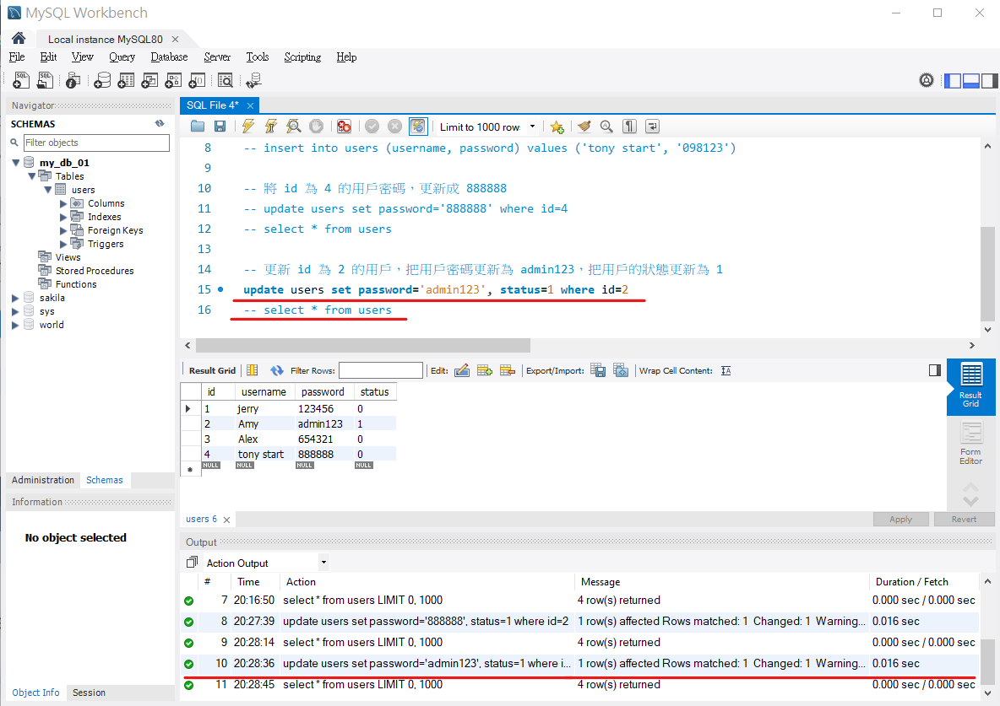

## DELETE語句
* ### 注意 : 請慎重且細心的使用`DELETE`語句，記得加條件語句(`WHERE`)，因為用不好整個表的數據會消失。
### 1. DELETE語句用於刪除表中的行，語法格式如下。
```
DELETE FROM 資料表名稱 WHERE 欄位名 = 值
```
### 2. 從 users 表中，刪除 id 為 4 的用戶。
```
DELETE FROM users WHERE id=4
```
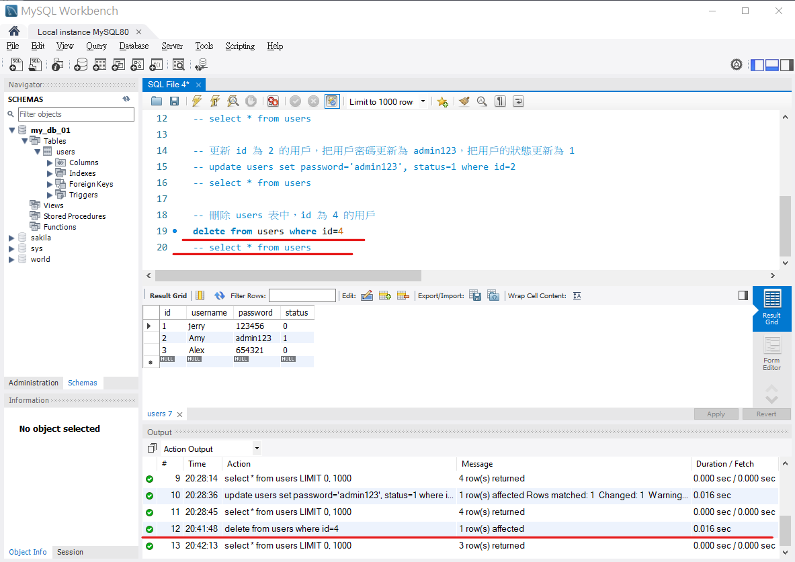

## WHERE子句
WHERE 子句用於 **限定選擇的標準；在 **SELECT、UPDATE、DELETE** 語句中，皆可以使用 WHERE 子句來限定選擇的標準。
### WHERE 基本格式
#### 1. 查詢語句, 中的 WHERE 條件
```
SELECT 欄位名 FROM 資料表名 WHERE 欄位 運算符 值
```
#### 2. 更新語句, 中的 WHERE 條件
```
UPDATE 資料表名 SET 欄位=新值 WHERE 欄位 運算符 值
```
#### 3. 刪除語句, 中的 WHERE 條件
```
DELETE FROM 資料表名 WHERE 欄位 運算符 值
```

### WHERE 子句運算符

* 注意 : `<>` 也可以寫成 `!=`

| 運算符 | 描述 |
| :-: | :- |
| = | 等於 |
| <> | 不等於 |
| > | 大於 |
| < | 小於 |
| >= | 大於等於 |
| <= | 小於等於 |
| BETWEEN | 在某個範圍內 |
| LIKE | 搜索某種模式 |

### 演示 WHERE 子句 + 運算符
#### 1. 查詢 `status` = 1 的用戶
```
select * from users where status=1
```
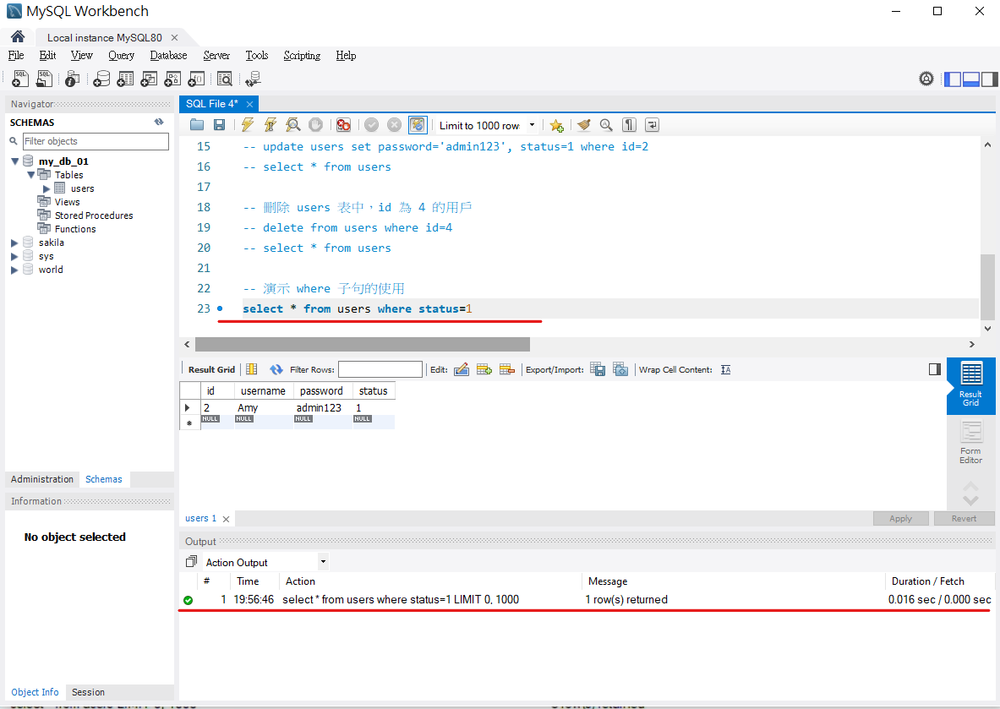

---

#### 2. 查詢 `id` > 2 的用戶
```
select * from users where id>2
```
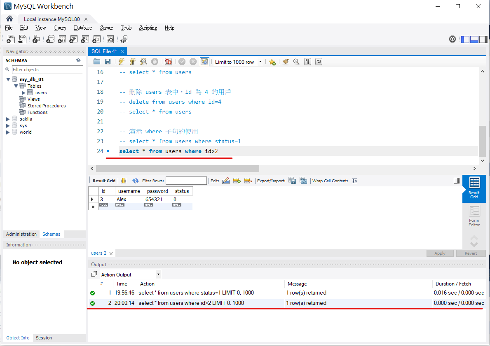

---

#### 3. 查詢 `username` 不等於 `Amy` 的所有用戶
```
select * from users where username<>'Amy'
``` 
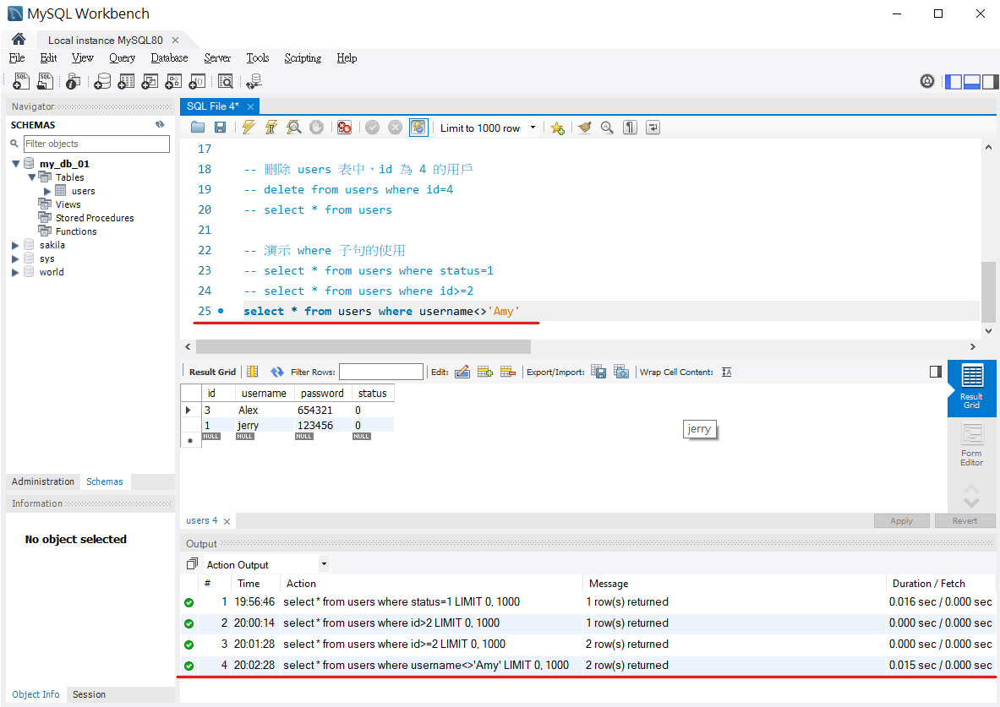

## AND 和 OR 運算符
* **AND 和 OR** 可在 **WHERE子語句** 中把兩個或多個條件結合起來。
### 1. 使用 AND 顯示所有 `status` 為 0，且 `id` 小於 3 的用戶
```
select * from users where status=0 AND id<3
```
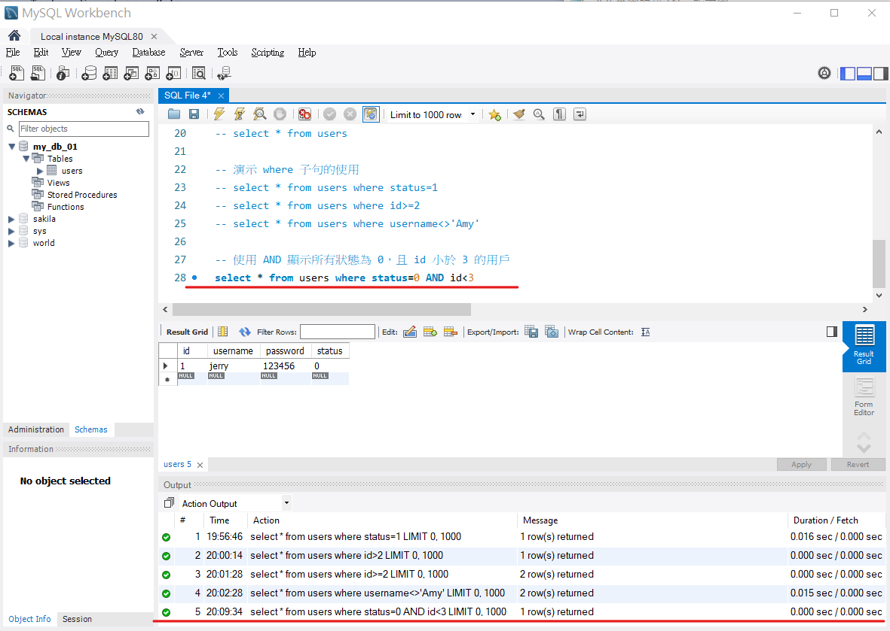

### 2. 使用 OR 顯示，所有 `status` 為 1，或者 `username` 為 `Alex` 的用戶
```
select * from users where status=1 OR username='Alex'
```
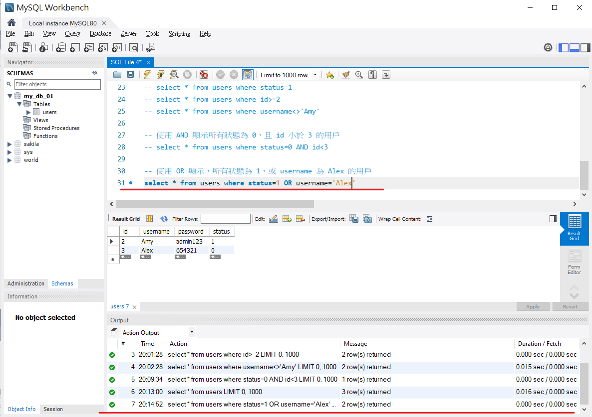

## ORDER BY 子句
1. ORDER BY 語句用於根據指定的欄位對結果集進行排序。
2. ORDER BY 默認情況下按照升序，對紀錄進行排序。
3. 如果希望按照降序的形式進行排序，可以使用 `DESC` 關鍵字。
### 1. 對 users 表中，對 `status` 欄位進行升序排序
```
select * from users order by status
```

### 2. 對 users 表中，對 `id` 欄位進行降序的排序
```
select * from users order by id desc
```
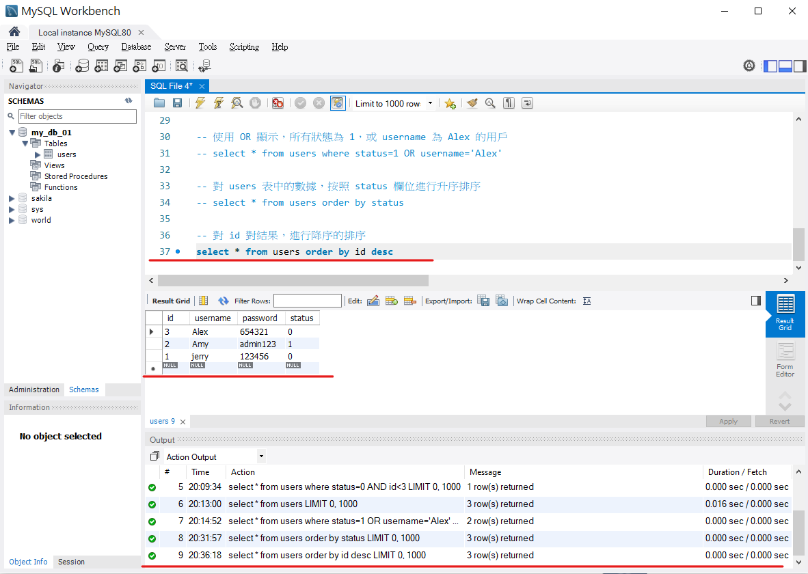
### ORDER BY 子句-多重排序
#### 1. 對 users 表中，先照 `status` 欄位進行降序，再對 `username` 的字母順序進行升序
```
select * from users order by status desc, username
```
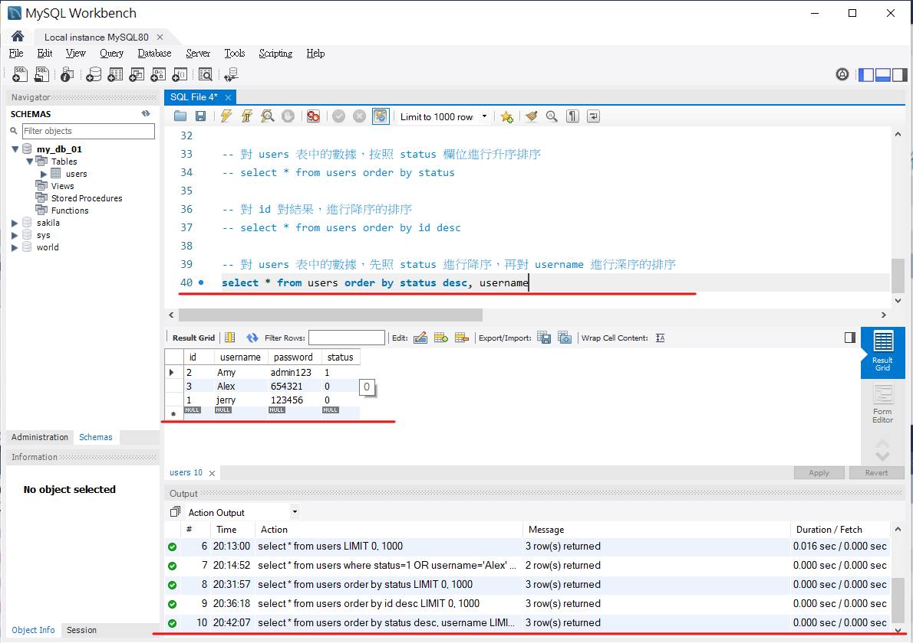

## COUNT(*) 函數
* #### COUNT(*) 函數用於返回查詢結果的總數據條數，語法格式如下。
```
SELECT COUNT(*) FROM 資料表名
```
### 1. 查詢 users 表中 `status` 為 0 的總數據條數
```
select coun(*) from users where status=0
```
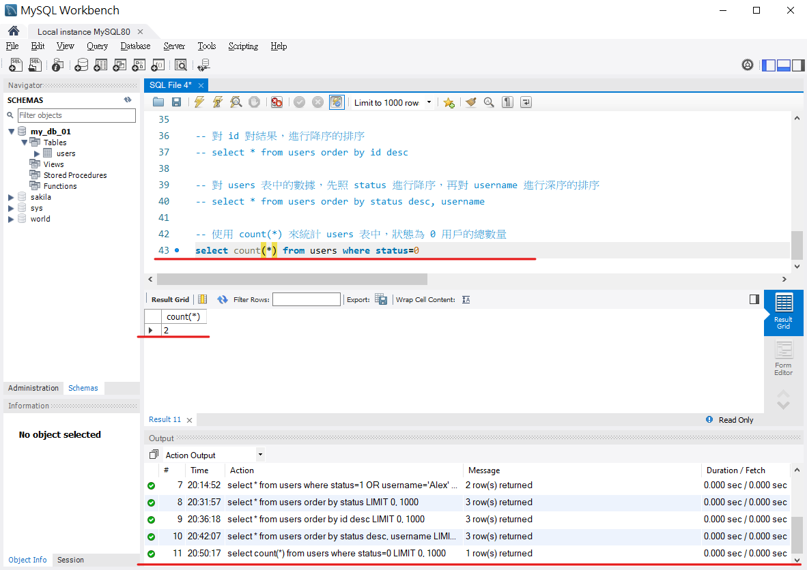

## 使用 AS 設置別名
如果希望給查詢出來的欄位名稱設置別名，可以使用 **AS** 關鍵字，如下。
### 1. 替 `count(*)` 函數設置別名
```
select count(*) as total from users where status=0
```
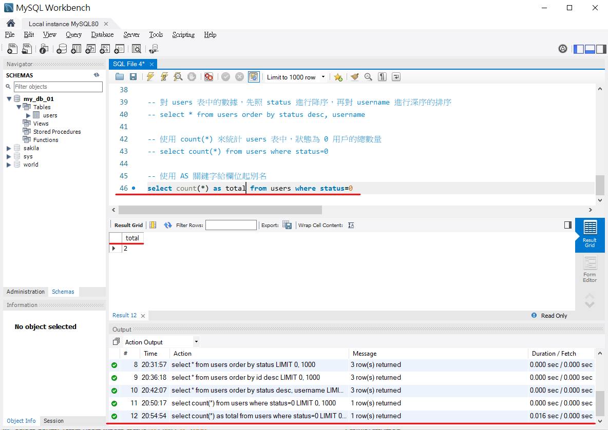
### 2. 替查詢 `username`、`password` 欄位設置別名
```
select username as uname, password as upwd from users
```
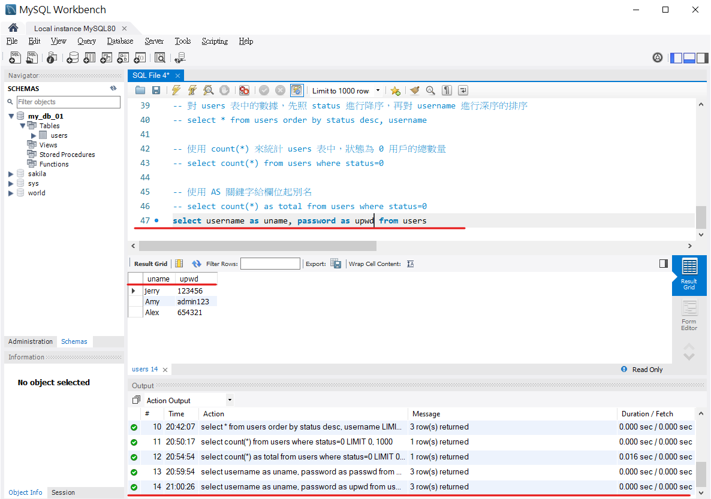
