# 安裝MySQL
## 安裝步驟
### 1. 到官方網站
[官方網站](https://dev.mysql.com/downloads/installer/)

### 2. 點擊下載
* 注意 : 這裡有兩種版本，一個是網頁版，我們需要的是普通版本。
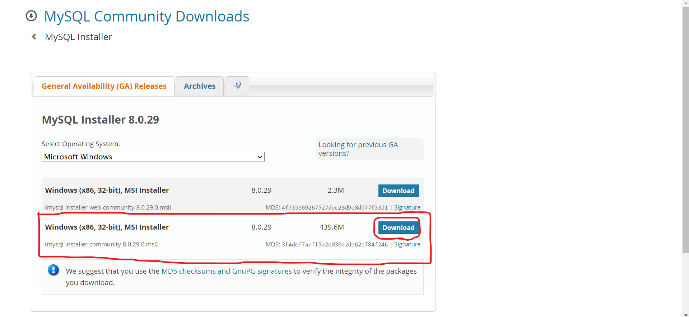

* 注意 : 這裡會問你要不要註冊、登入等等的問題，我們點擊下方紅框的文字就可以了。
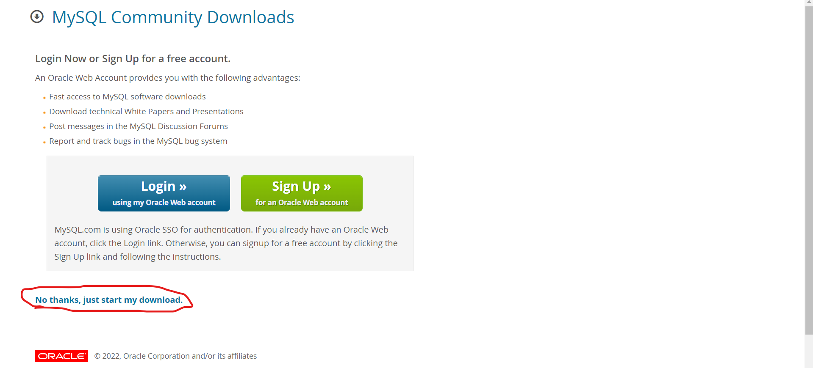

### 3. 點擊執行檔
點擊圖中的執行檔，執行該文件，或到 **檔案總管** --> **下載** --> **雙擊執行檔**。
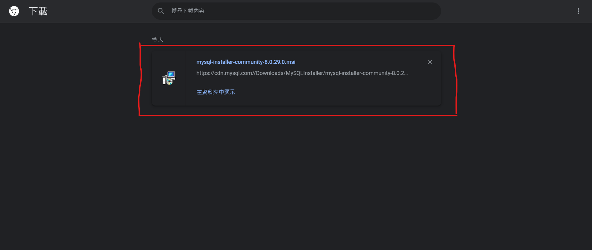

### 4. 選擇類型
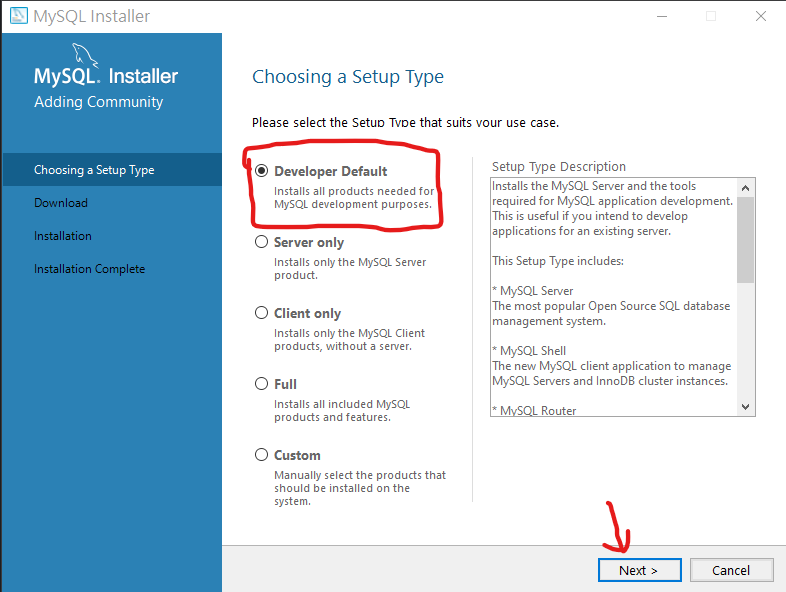

### 5. 檢查依賴套件
* 如果你有`Execute`按鈕，請選擇它，因為我先前安裝過，所以不會有`Execute`選項，安裝好請按`Next`。
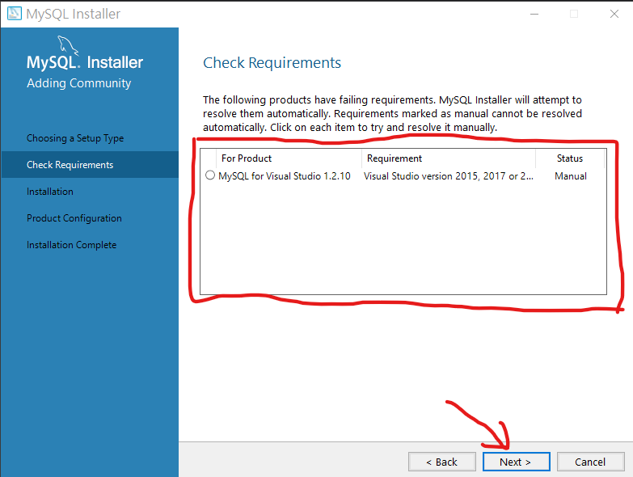

* 如果跳出以下畫面，請按`YES`，有些手動安裝的套件不是那麼必要!
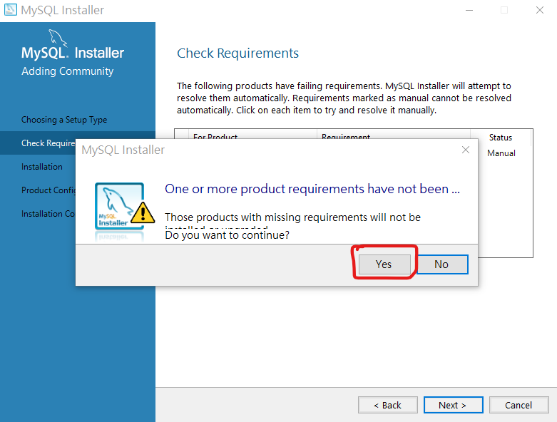

### 6. 安裝主要套件
直接點擊`Execute`下載，主要的套件就行了，下載好點擊`Next`。
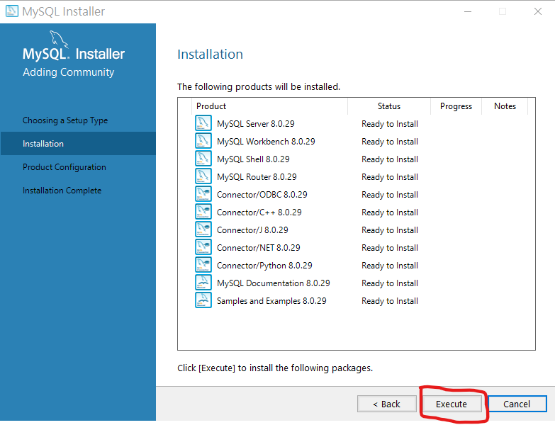

### 7. 配置
1. 以下的畫面，直接點擊`Next`就行。
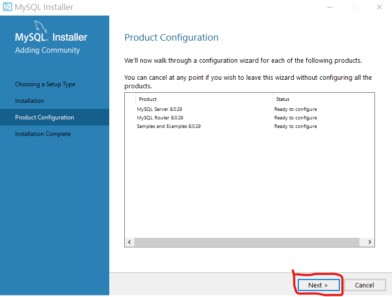

2. 以下是選擇網絡類型，無須更動!

3. 下圖選擇驗證方法
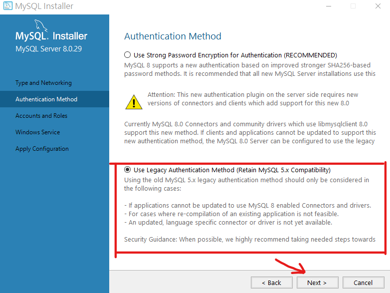

4. 設置root密碼
* 必須要自己記得住的!
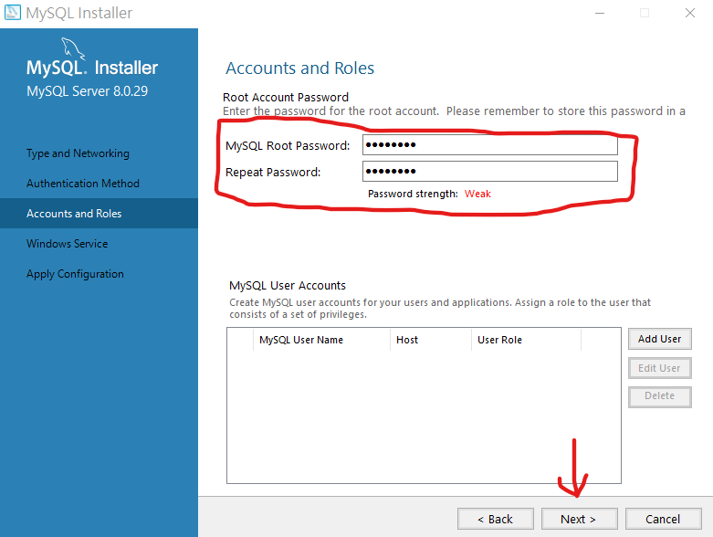

5. 配置成 windows類型的服務
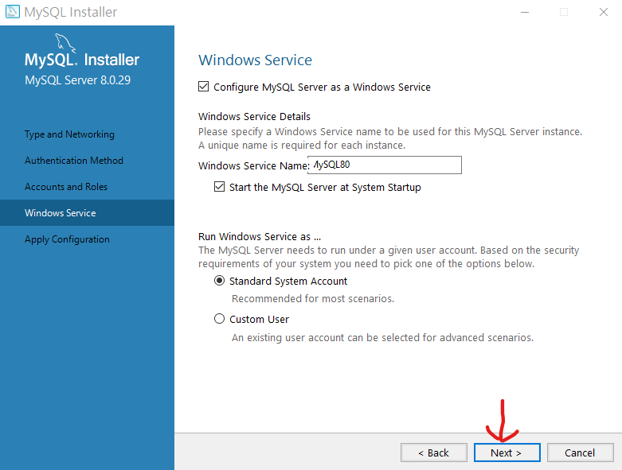

### 8. 保存以上的配置
1. 這裡會對剛剛 **step7** 的配置進行保存，直接`Execute`就行。
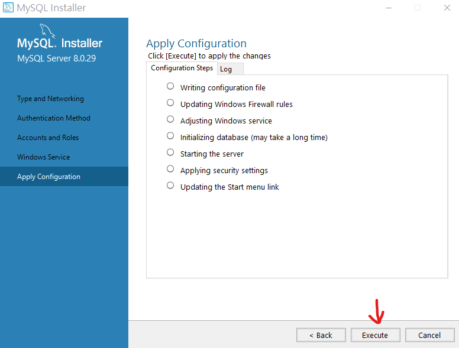

2. 保存完點擊`Finish`按鈕。
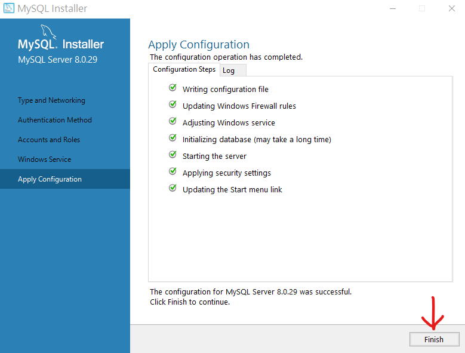

### 9. 產品配置
直接點擊`Next`按鈕。
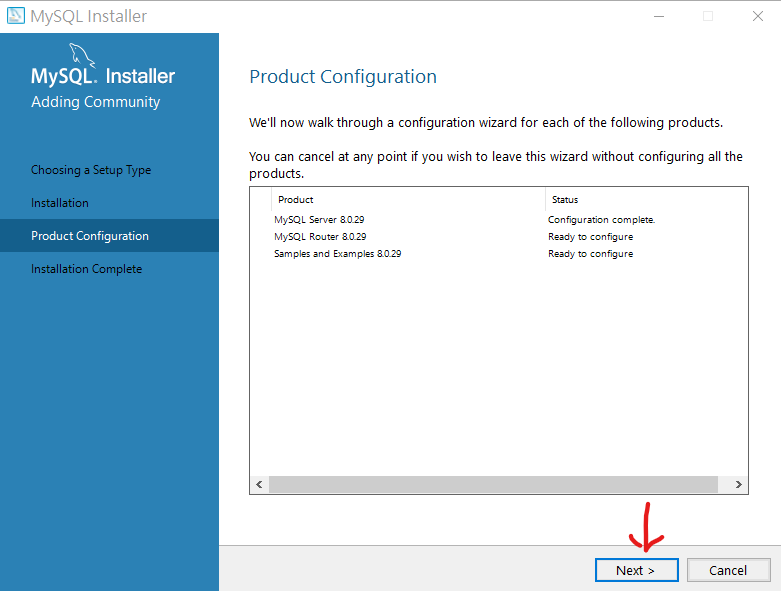

### 10. 路由配置
直接點擊`Finish`
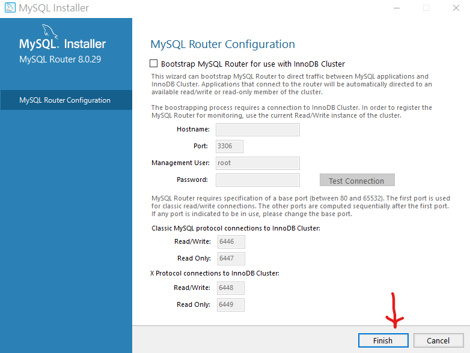

### 11. 如上相同的配置
* 此畫面跟上面步驟雷同，所以直接`Next`。

### 12. 測試畫面
該畫面在測試 **MySQL** 資料庫，能否正常的連接。
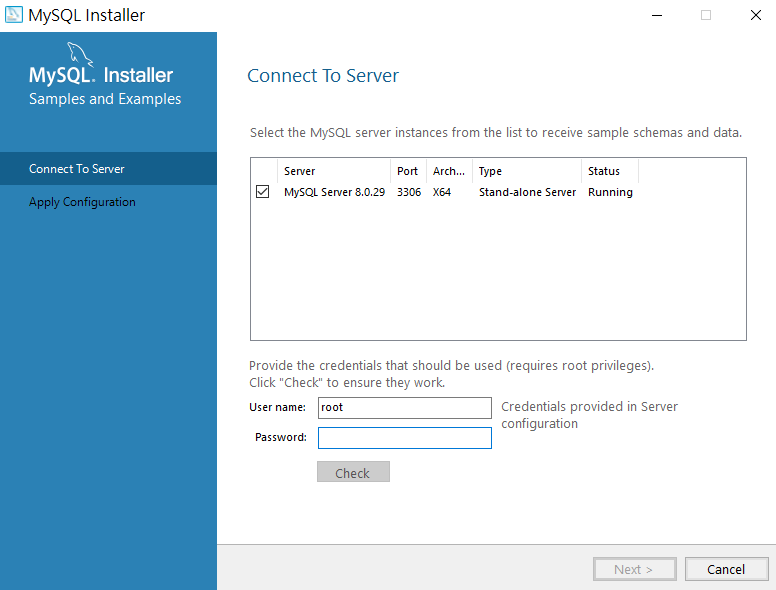

1. 填入之前配置的密碼
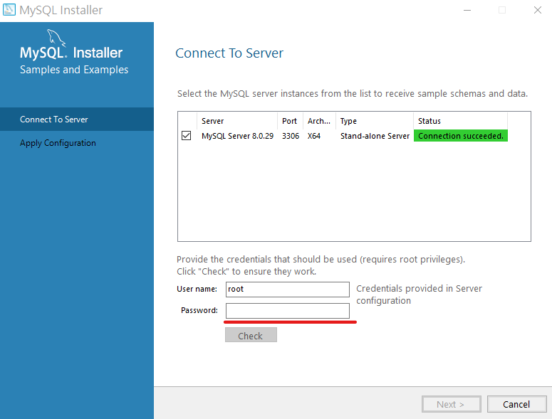

2. 填入後檢查
* 檢查是否如下圖一樣，打勾且亮綠色，如果有表示可以正常的連接到 **MySQL** 資料庫。

3. 下一步
* 如果跟上圖一樣檢查通過，直接`Next`。
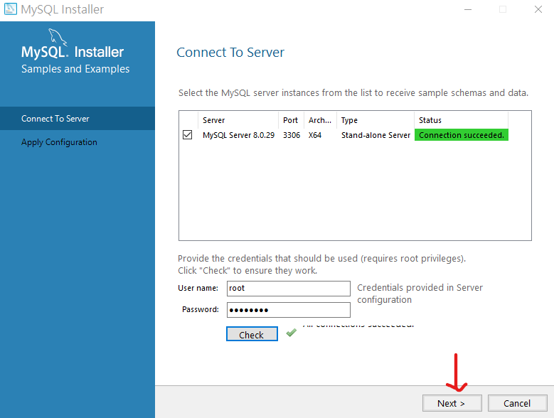

### 13. 保存剛剛配置
* 保存完成，請點擊`Finish`。
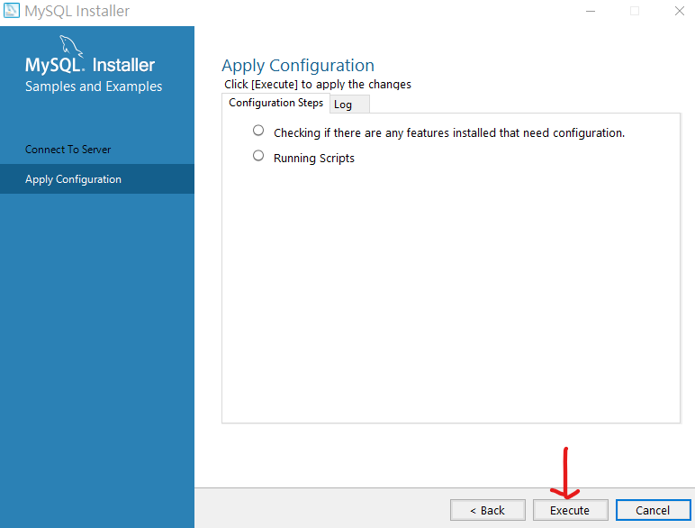

### 14. 又是產品配置
* 直接`Next`
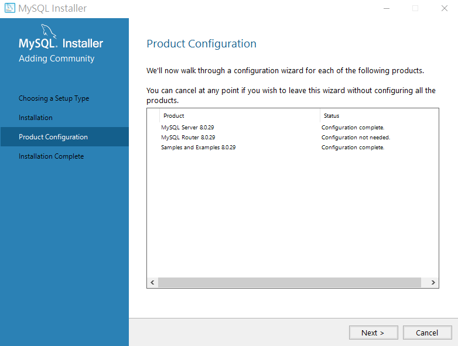

### 15. 最後安裝步驟
* 下圖的兩個選項，可勾可不勾，我選擇打勾。
1. 第一個選項 : 安裝完後，自動開啟 **MySQL Workbench**。
2. 第二個選項 : 安裝完後，自動開啟 **MySQL Shell**。
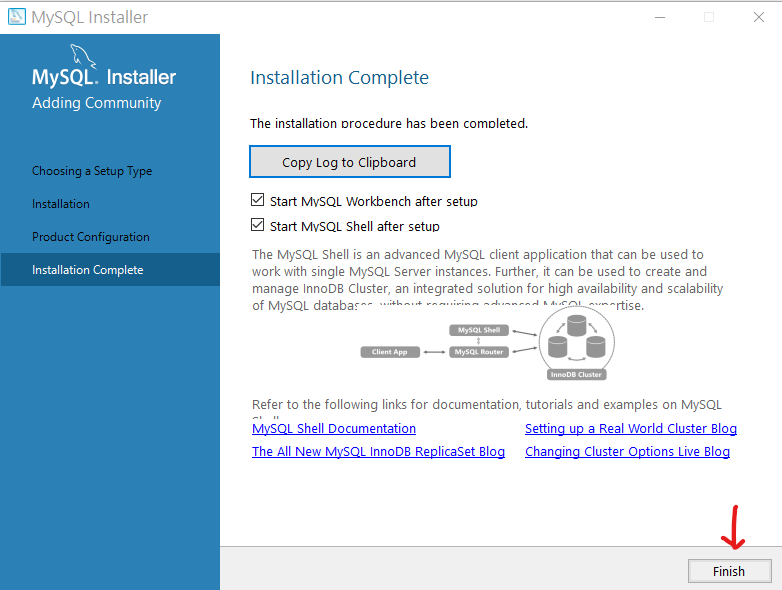
