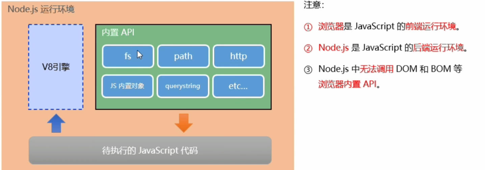
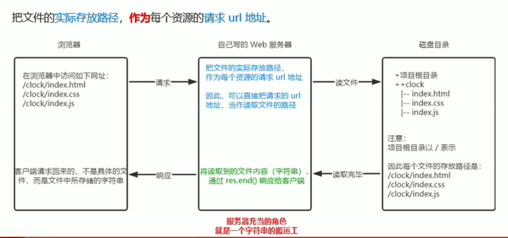

# Node.js和Javascript基礎
* ### 前端概略描述
主要是針對網頁的前端開發，所謂的前端可以想像成，你點開網站呈現的網頁的文字、圖片和樣式等等的效果。
若要在瀏覽器中，成功的運行JS代碼，必須要該瀏覽器有提供內置的API可供調用；如: DOM、BOM、Canvas等等。
然後再寫JS代碼去調用這些API，去實現你想要的功能再由瀏覽器的解析引擎，去解析JS代碼讓瀏覽器可以去執行JS代碼寫出來的功能；現今大部分的前端都有免費樣板可以去使用。

 
>(擷取自bilibili的黑馬程序員-Node.js)

---

* ### 後端的概略描述

在Node.js中寫的javascript代碼主要是針對網站的後端開發，所謂的後端可能是前端(客戶)對後端(伺服器)的功能的請求或伺服器對伺服器的請求，如轉跳網頁、圖片儲存的路徑、資料庫的連接等等的功能，而且後端也達到一定的隱蔽性，相信我你不會想把重要的資料都放在前端，因為你只要在網頁點擊滑鼠右鍵點選檢視網頁原始碼就可以看到了。
然而可以寫Javascript代碼去調用Node.js的API去實現以上的這些功能。

* ___補充 : Node.js無法調用瀏覽器的內置API；如: DOM、BOM等等。___

> (擷取自擷取自bilibili的黑馬程序員-Node.js)

---

## [1. fs模組](#1-fs語法)
* fs模組是Node.js官方提供，用來對文件操作的模組，他提供一系列的方法和屬性，來讓使用者對文件操作的需求。
#### [1. fs模組路徑拼接問題](#dirname)
在寫程式時應該盡量避免使用`./`或`../`，因為這些都是***相對路徑***，且並不是每個人的電腦的路徑名稱都相同；
> **所謂的*相對路徑*就是系統會動態拼接該檔案，在該電腦的所在目錄的完整路徑；**
>> ***例如:***
>>>1. `./example.txt`  #當前目錄內的文件。
>>>2. C:\User\username\Desktop\CurrentDir\  #`example.txt`所存在的目錄，`./` 會自動拼接起這段路徑

雖然可以直接使用***絕對路徑***，但是不利於維護且移植性較差；
> **所謂*絕對路徑*就是文件所在位置的完整路徑**
>> ***例如:***
>>> C:\User\username\Desktop\CurrentDir\example.txt

要想解決以上兩種方法的缺點，可以使用`__dirname`
>`__dirname` : 表示當前文件所處的目錄。

## [2. path路徑模組](#2-path語法)
* path模組是由Node.js官方提供，用來***處理路徑問題***的模組，用來滿足使用者對路徑處理的需求。

1. `../`的字符串，代表會回到前一個路徑，如同在終端機輸入`cd ..`一樣。
> ***例如***
>>* console.log(path.join('/a', '/b/c', '../', './d', '/e'))
>>* 輸出: /a/b/d/e

2. 今後凡是涉及到路徑拼接的操作，都要使用`path.join()`的方法進行處理，並應該盡量避免使用`+`號來拼接路徑，因為會導致拼接錯誤。
> ***例如***
>>* fs.readFile(__dirname + './a/b/c/index.html', [options], callback)
>>* 輸出: C:\Users\username\Desktop .\a\b\c\index.html

## [3. http模組](#3-http語法)
* ***http模組*** : 是由Node.js官方提供，用來創建***web服務氣***的模組，可以透過***http模組***內的`http.createServer()`方法，就可以把一台電腦，變成***web服務器***`，從而對外提供Web資源服務。
* 在Node.js中，我們不需要使用***IIS***、***Apache***等等的第三方web服務器軟體，因為我們可以Node.js中的**http模組**，寫入一些代碼，就能輕鬆的創建一個服務器，從而對外提供Web服務。
   > 服務器和普通電腦的區別在於，服務器上安裝了web服務器軟體，例如 : IIS、Apache等，通過安裝這些服務器軟體， 就能把一台普通的電腦變成一台web服務器。

### 瀏覽過程 :

瀏覽網址時**請求url地址**，透過自己寫的`web服務器`，讀取文件實際存放的路徑，將讀取到的文件內容透過`res.end()`響應給客戶端，而客戶端請求回來的，不是具體的文件而是文件中所存儲的字符串。
> **request 請求** : 客戶端在瀏覽網頁時，向伺服器發出，通常會是`URL`地址。
> 
> **response響應** : 伺服器回應客戶端的請求。

> (擷取自擷取自bilibili的黑馬程序員-Node.js)
---

## ___方法 :___

### 1. fs語法

   1. `fs.readFile('讀取文件的路徑' , [options], callback)` : 用來讀取指定文件中的內容。

   * > ___補充 : 往後看到帶有中括號('[]')的函數可有可無。___

  2. `fs.writeFile('存放文件的路徑', 'data', [option], 'callback')` : 用來向指定文件中寫入內容。
   
  3. <a id = dirname>[`fs.readFile(__dirname + '讀取文件的路徑' , [options], 'callback')` : 此方法雖然可用但盡量避免。](./day1/05.演示路徑問題.js)</a>

### 2. path語法
   
   1. `path.join('...paths')` : 拼接路徑。
   2. `path.basename('/a/b/c/d/index.html')` : 只返回最後的路徑，`index.html`。
   3. `path.basename('/a/b/c/d/index.html', ['.html'])` : 把最後的路徑的副檔名移除，`index`。
   4. `path.extname('/a/b/c/d/e/index.html')` : 返回最後路徑的副檔名，`.html`。

### 3. http語法

   1. `http.createServer()` ; 創建web服務
   2. `server.on('even', 'callback')` ;  指定事件，即回呼方法，[其他事件及函數](https://nodejs.org/dist/latest-v16.x/docs/api/http.html)
   3. `server.listen('port', 'callback')` ; 啟動監聽服務器。
   4. `res.end()` ; 向客戶端響應一些內容，也代表不再有東西寫入`res`內。