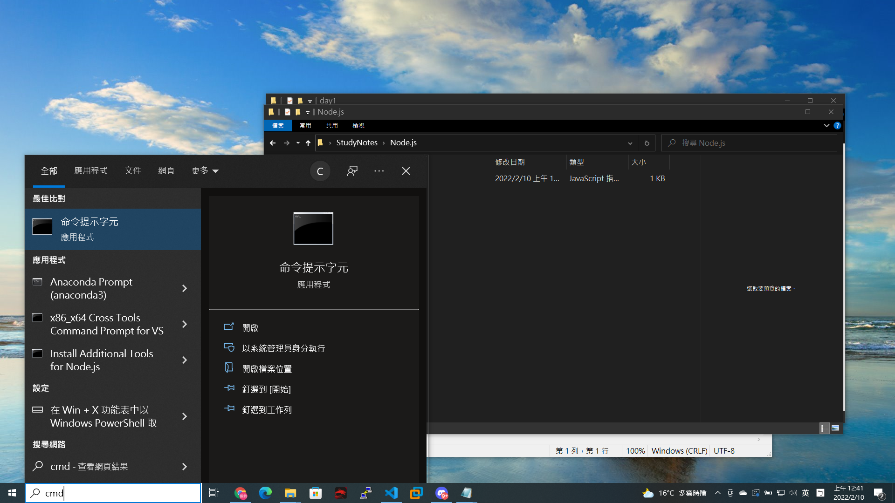
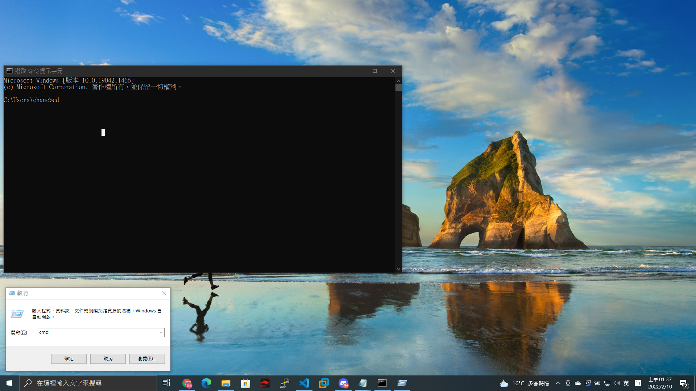
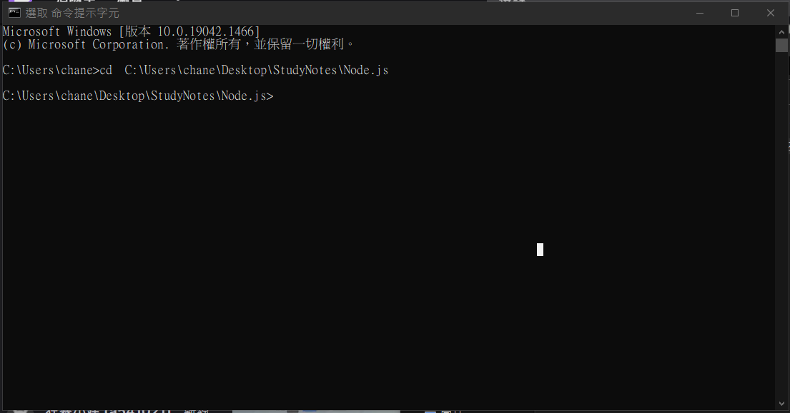
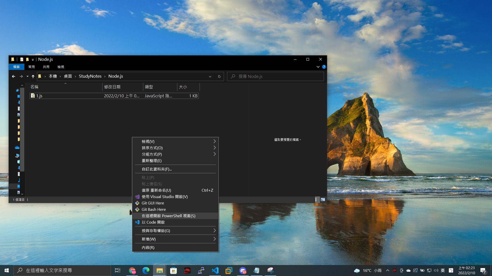

# Node.js的第一天。

* ### 我的程式運行環境是在`VScode`，如果要在`cmd`運行如下；使用搜尋框搜尋cmd或用`win鍵+R`使用執行視窗搜尋`cmd`如下;

---
切換到程式存放位置。

---
之後可以在該程式檔存放位置使用，`左shift+滑鼠右鍵`，點擊`開啟Powershell視窗`，直接定位到程式檔存放位置，省的每次都到`cd [程式檔存放位置]`的麻煩

