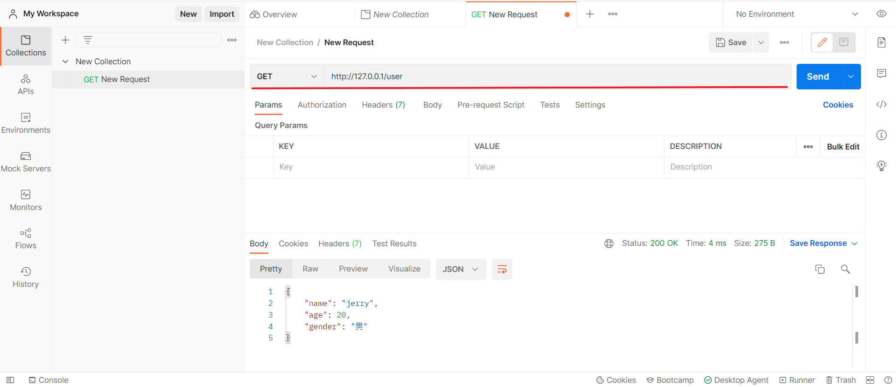
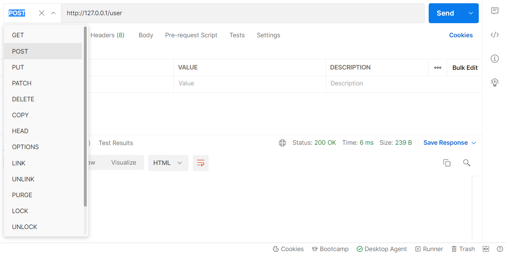

# day4
## [01.使用express創建最基本的服務器.js](./01.使用express創建最基本的服務器.js)
* ### 若想查看結果可以使用 [Postman](https://www.postman.com/)，需要註冊和下載桌面代理。
執行下方程式碼，並打開 **Postman** 查看，並將網址如下圖的方式輸入到 **Postman** 的網址欄中。



* 並且欄位左邊的下拉選單可以選擇使用的方法



```js

// 1. 導入 express
const express = require('express')

// 2. 創建 Web 服務器
const app = express()

// 4. 監聽客戶端的 GET 和 POST 請求，並向客戶端響應具體的內容
app.get('/user', (req,res) => {
    // 調用 express 提供的 res.send() 方法，向客戶端響應一個 JSON 對象
    res.send({name:'jerry',age:20,gender:'男'})
})

app.post('/user', (req,res) => {
    // 調用 express 提供的 res.send() 方法，向客戶端響應一個 文本字符串
    res.send('請求成功')
})

// 寫入README.md : 一樣對 Postman 欄位寫入 `http:/127.0.0.1/?name=jerry&age=20`，
// 就可以看到`req.query`的效果，如下圖
app.get('/', (req,res) => {
    // 通過 req.query 可以獲取到客戶端發送過來的查詢參數
    // 注意: 默認情況下，req.query() 是一個空對象
    console.log(req.query)
    res.send(req.query)
})

// 注意: 這裡的 :id 是一個動態的參數
// 例如 : 可以在瀏覽器的搜尋欄輸入 http://127.0.0.1/user/2/jerrey 測試
app.get('/user/:ids/:name', (req,res) => {
    // req.params 是動態匹配到的 URL 參數，默認也是一個空對象
    console.log(req.params)
    res.send(req.params)
})

// 3. 啟動 Web 服務器
app.listen(80, () => {
    console.log('express server running at http://127.0.0.1')
})
```