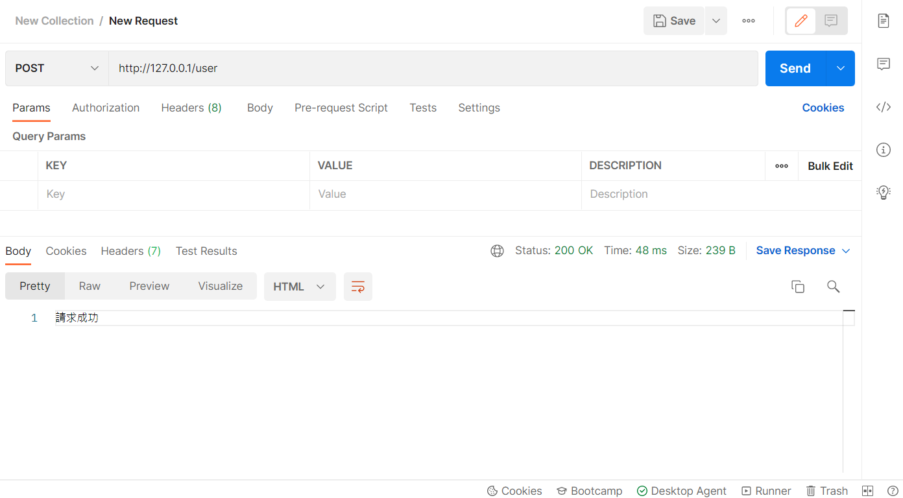
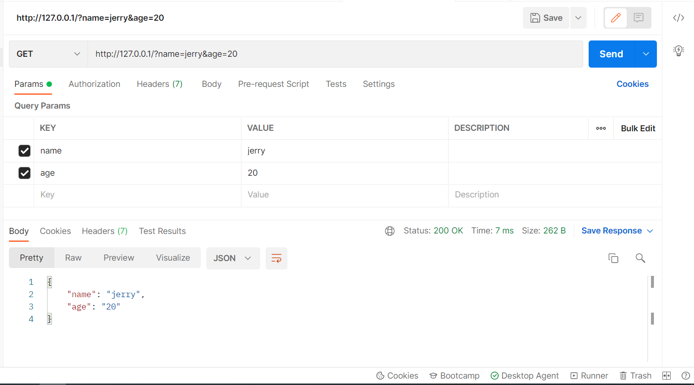
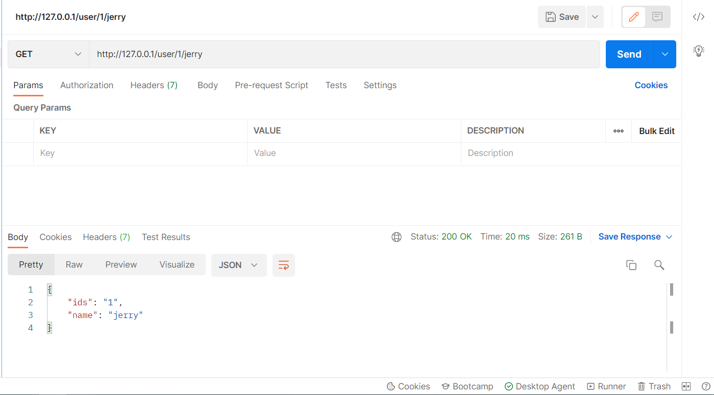
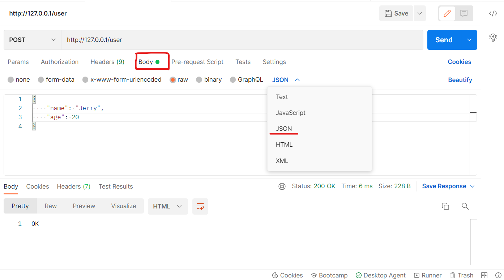
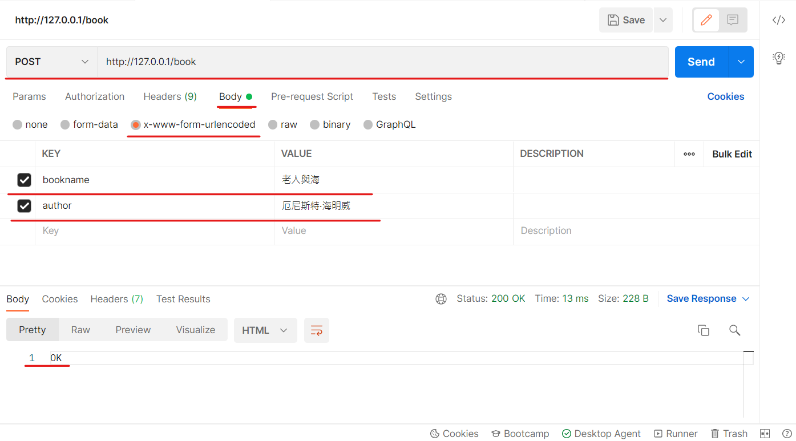

# day4
## [01.使用express創建最基本的服務器.js](./01.使用express創建最基本的服務器.js)
* ### 若想查看結果可以使用 [Postman](https://www.postman.com/)，需要註冊和下載桌面代理。
執行下方程式碼，並打開 **Postman** 查看，並將網址如下圖的方式輸入到 **Postman** 的網址欄中。


* 並且欄位左邊的下拉選單可以選擇使用的方法


---
1. `const express = require('express')` : 導入 express。
2. `const app = express()` : 創建 Web 服務器。
3. `app.get('/user', (req,res) => {}` : 監聽客戶端的 GET 和 POST 請求，並向客戶端響應具體的內容。
4. `res.send({name:'jerry',age:20,gender:'男'})` : 調用 express 提供的 res.send() 方法，向客戶端響應一個 **JSON** 對象，該對象內擁有 **name、age、gender** 三種屬性。
5. `app.post('/user', (req,res) => {}` : 跟上面的 `app.get()` 同原理，只不過這裡監聽的是 **POST** 方法。
6. `res.send('請求成功')` : 調用 **express** 提供的 `res.send()` 方法，向客戶端響應一個 **文本字符串**。
7. `console.log(req.query)` : 在終端介面打印出，通過 `req.query()` 獲取到客戶端發送過來的查詢字符串(`?`)之後的參數。
    * 注意 : 默認情況下，`req.query()` 是一個空對象。

8. `res.send(req.query)` : 將查詢字符串(`?`)之後的參數，響應回給客戶端。
9. `app.get('/user/:ids/:name', (req,res) => {}` : 可以通過下面的 `req.params()`，獲取到冒號(`:`)之後的[動態參數](../Express基礎.md#4-獲取url中的動態參數day401使用express創建最基本的服務器js)。
    * 注意 : `req.params()` 默認是一個空對象。
10. `console.log(req.params)` : 將獲取到的動態參數，打印在終端介面上。
11. `res.send(req.params)` : 將獲取到的動態參數，響應回客戶端上。
12. 啟動 Web 服務器 :
    ```js
    app.listen(80, () => {
        console.log('express server running at http://127.0.0.1')
    })
    ```
---
```js
const express = require('express')

const app = express()

app.get('/user', (req,res) => {
    res.send({name:'jerry',age:20,gender:'男'})
})

app.post('/user', (req,res) => {
    res.send('請求成功')
})

app.get('/', (req,res) => {
    console.log(req.query)
    res.send(req.query)
})

app.get('/user/:ids/:name', (req,res) => {
    console.log(req.params)
    res.send(req.params)
})

app.listen(80, () => {
    console.log('express server running at http://127.0.0.1')
})
```
---
* 以下為使用 **POST** 方法的效果
```js
app.post('/user', (req,res) => {
    res.send('請求成功')
})
```

 

*  一樣對 Postman 欄位寫入 `http:/127.0.0.1/?name=jerry&age=20`，就可以看到`req.query`的效果，如下圖。
```js
app.get('/', (req,res) => {
    console.log(req.query)
    res.send(req.query)
})
```




* 可以在瀏覽器的搜尋欄輸入 `http://127.0.0.1/user/2/jerrey` 測試，就可以看到`req.params`的效果，如下圖。
```js
app.get('/user/:ids/:name', (req,res) => {
    console.log(req.params)
    res.send(req.params)
})
```

---

## [02.使用express.static對外提供靜態資源.js](./02.使用express.static對外提供靜態資源.js)
1. `app.use(express.static('./clock'))` : 在這裡，調用 `express.static()` 方法，快速的對外提供靜態資源，這樣我們就可以快速瀏覽 **clock** 目錄內的所有檔案。
```js
const express = require('express')
const app = express()

app.use(express.static('./clock'))

app.listen(80, () => {
    console.log('express server running http://127.0.0.1')
})
```

## [03.託管多個靜態資源.js](./03.託管多個靜態資源.js)
1. 要想託管多個靜態資源，只要重複調用 `express.static()` 即可。

2. 但這會涉及到 **優先順序問題**，因 **files 和 clock** 目錄內都有 `index.html` 檔，但 **files** 目錄先被 `express.static()` 讀取，所以會先顯示 **files** 目錄內的 `index.html`。

3. 要想解決這問題可以使用 [**04.在express.static前掛載路徑前綴.js**](./04.在express.static前掛載路徑前綴.js) 內的寫法解決；介紹將會在下面的主題講解。
```js
const express = require('express')
const app = express()

app.use(express.static('./files'))
app.use(express.static('./clock'))

app.listen(80, () => {
    console.log('express server running http://127.0.0.1')
})
```

## [04.在express.static前掛載路徑前綴.js](./04.在express.static前掛載路徑前綴.js)
加上前綴名可以解決 **優先順序問題**，因使用 `express.static()` 託管的靜態資源，在路徑上是一樣的，為了 **區分不同目錄**，但 **同路徑的資源**，所以我們可以 **加上前綴名**，這樣我們就可以 **訪問到不同路徑上的不同目錄中的資源** 了。

---

1. `app.use('/files',express.static('./files'))` : 為 **files** 目錄，加上前綴名。
```js
const express = require('express')
const app = express()

app.use('/files',express.static('./files'))
app.use(express.static('./clock'))

app.listen(80, () => {
    console.log('express server running http://127.0.0.1')
})
```
* 執行上方代碼，在瀏覽器搜尋欄分別訪問`http://127.0.0.1`、`http://127.0.0.1/files`查看效果。

## [05.最簡單的路由用法.js](./05.最簡單的路由用法.js)
這與 [**01.使用express創建最基本的服務器.js**](./01.使用express創建最基本的服務器.js) 沒有太大差異，與此不再贅述。
```js
const express = require('express')
const app = express()

app.get('/', (req,res) => {
    res.send('Hello World!')
})

app.post('/', (req,res) => {
    res.send('Post Request!')
})

app.listen(80, () => {
    console.log('express server running http://127.0.0.1')
})
```

## [06.模塊化路由.js](./06.模塊化路由.js)
* 注意 : `app.use()` 函數的作用，就是來註冊[全局中間件](../Express基礎.md#8-中間件概念day408定義最簡單的中間件js)

將 **Express** 路由模塊化，可以使我們的代碼更加精簡，如何將路由模塊化可以看 [**07.Route.js**](./07.Route.js)。

---
1. `const router = require('./07.Route')` : 導入路由模塊。
2. `app.use('/api',router)` : 註冊路由模塊，並統一加上前綴名(`/api`)。

```js
const express = require('express')
const app = express()

const router = require('./07.Route')

app.use('/api',router)

app.listen(80, () => {
    console.log("server running http://127.0.0.1")
})
```
* 執行該代碼後，請使用 **Postman** 操作查看效果，`http://127.0.0.1/api/user/list`、`http://127.0.0.1/api/user/add`。
  
## [07.Route.js](./07.Route.js)

* 該模塊的展示請在 [06.模塊化路由.js](./06.模塊化路由.js) 執行，這是路由模塊。

1. `const router = express.Router()` : 創建路由對象。
2. `router.get('/user/list', (req, res) => {res.send("Get User List!")}` : 掛載具體的路由，並響應客戶端字符串。
3. `router.post('/user/add', (req, res) => {res.send('Add New User!')}` : 同上原理，但獲取 **POST** 方法。
4. `module.exports = router` : 向外導出路由對象。

```js
const express = require('express')

const router = express.Router()


router.get('/user/list', (req, res) => {
    res.send("Get User List!")
})

router.post('/user/add', (req, res) => {
    res.send('Add New User!')
})

module.exports = router
```

## [08.定義最簡單的中間件.js](./08.定義最簡單的中間件.js)
* 更多的中間件介紹可以看[這裡](../Express基礎.md#8-中間件概念day408定義最簡單的中間件js)。
* 注意 : 若是一個中間件，**記得要在路由之前，並加上 `next()`**。


1. 定義一個最簡單的中間件函數 :
    ```js
    const mw = function(req, res, next){
        console.log('這是最簡單的中間件函數')
        
        next()
    }
    ```
    > **next()** :
    >> 把流轉關係，轉交給下一個中間件或路由
    >
    > 簡單說明 : 
    >> 中間件享有共同的 `req`、`res` 函數，也就是說在中間件處理過的 `req`、`res` 函數，會轉交給下個中間件或路由，就像推積木一樣，一層層的推積。

2. `app.use(mw)` : 將 `mw` 註冊為全局生效的中間件。
```js
const express = require('express')
const app = express()

const mw = function(req, res, next){
    console.log('這是最簡單的中間件函數')
    
    next()
}

app.use(mw)

app.get('/', (req, res) => {

    console.log('調用了 / 這個路由')

    res.send('Home page')
})

app.get('/user', (req, res) => {

    console.log('調用了 /user 這個路由')

    res.send('User page')
})

app.listen(80, () => {
    console.log('server running http://127.0.0.1')
})
```
---
* 上方代碼可以再精簡，如下方代碼所示。
```js
const express = require('express')
const app = express()

app.use((req, res, next) => {
    console.log('這是最簡單的中間件函數')
    next()
})

app.get('/', (req, res) => {

    console.log('調用了 / 這個路由')

    res.send('Home page')
})

app.get('/user', (req, res) => {

    console.log('調用了 /user 這個路由')

    res.send('User page')
})

app.listen(80, () => {
    console.log('server running http://127.0.0.1')
})
```

## [09.體驗中間件的作用.js](./09.體驗中間件的作用.js)

1. `const time = Date.now()` : 獲取到當前的時間值(毫秒)。
2. `req.startTime = time` : 使用`req.startTime`儲存獲取的時間。
3. `res.send('Home page' + req.startTime)` : 向客戶端響應字符串和`req.startTime`儲存的時間值。

```js
const express = require('express')
const app = express()

app.use((req, res, next) => {

    const time = Date.now()
    req.startTime = time

    next()
})

app.get('/', (req, res) => {

    res.send('Home page' + req.startTime)
})

app.get('/user', (req, res) => {

    res.send('User page' + req.startTime)
})

app.listen(80, () => {
    console.log('server running http://127.0.0.1')
})
```

## [10.定義多個全局中間件.js](./10.定義多個全局中間件.js)
若想每次都對 `req` 或 `res` 做不一樣的預處理，只要重複調用 `app.use((req,res,next) => {/*處理函數*/ next()})` 就行了。
* ### 以下代碼執行過程 :
    當我訪問路由時(`http://127.0.0.1/user`)，會先通過第一個全局中間件，該中間件會在終端介面打印(`'調用了第一個全局中間件'`)，在通過第二個中間件，該中間件也會再終端介面打印(`'調用了第二個全局中間件'`)，然後才響應客戶端字符串(`'User page.'`)
---
1. 定義第一個全局中間件 :
    ```js
    app.use((req, res, next) => {
        console.log('調用了第一個全局中間件')
        next()
    })
    ```
2. 定義第二個全局中間件 :
    ```js
    app.use((req, res, next) => {
        console.log('調用了第二個全局中間件')
        next()
    })
    ```
---
```js
const express = require('express')
const app = express()

app.use((req, res, next) => {
    console.log('調用了第一個全局中間件')
    next()
})

app.use((req, res, next) => {
    console.log('調用了第二個全局中間件')
    next()
})

app.get('/user', (req, res) => {
    res.send('User page.')
})


app.listen(80, () => {
    console.log('server running http://127.0.0.1')
})
```

## [11.局部生效的中間件.js](./11.局部生效的中間件.js)

* 注意 : `mw1` 並不會影響 `app.use('/user', (req,res) => {})` 這個路由，因為 `mw1` 沒有被該路由調用，所以訪問該路由時(`http://127.0.0.1/user`)，並不會在終端介面打印字符串(`'調用局部生效的中間件'`)。

局部中間件，顧名思義只發生在局部代碼才生效，`mw1` 這個中間件，只在訪問 **當前的路由(`http://127.0.0.1/`)** 中才生效，這種用法屬於 **局部生效中間件**。

1. 定義局部生效中間件 :
    ```js
    const mw1 = (req, res, next) => {
        console.log('調用局部生效的中間件')
        next()
    }
    ```
2. 創建路由，並通過局部生效中間件處理該路由函數 :
    ```js
    app.get('/', mw1, (req, res) => {
        res.send('Home Page')
        
    })
    ```
---
```js
const express = require('express')
const app = express()

const mw1 = (req, res, next) => {
    console.log('調用局部生效的中間件')
    next()
}

app.get('/', mw1, (req, res) => {
    res.send('Home Page')
    
})

// mw1 這個中間件不會影響下面這個路由
app.get('/user', (req, res) => {
    res.send('user Page')
})

app.listen(80, () => {
    console.log('server running http://127.0.0.1')
})
```

## [12.同時使用多個局部中間件.js](./12.同時使用多個局部中間件.js)

1. 有時候我們想對個別的路由，處理不同的預處理，這時我們可以調用多個局部中間件，並對不同的路由做不同的處理。

2. 若多個中間件只處理單一的路由可以使用逗號(`,`)隔開，繼續填充局部中間件名。

1. 多個局部中間件處理單一路由 :
    ```js
    app.get('/', mw1, mw2, (req, res) => {
        res.send('Home Page')
        
    })
    ```
2. 針對不同路由，使用不同局部中間件 :
    ```js
    app.get('/user',mw2, (req, res) => {
        res.send('user Page')
    })
    ```
---
```js
const express = require('express')
const app = express()

const mw1 = (req, res, next) => {
    console.log('調用了第一個局部生效的中間件')
    next()
}

const mw2 = (req, res, next) => {
    console.log('調用了第二個局部生效的中間件')
    next()
}

app.get('/', mw1, mw2, (req, res) => {
    res.send('Home Page')
    
})

app.get('/user',mw2, (req, res) => {
    res.send('user Page')
})

app.listen(80, () => {
    console.log('server running http://127.0.0.1')
})
```

## [13.演示錯誤級別中間件.js](./13.演示錯誤級別中間件.js)
* ### 注意 : 時刻謹記，錯誤級別中間件一定寫在所有路由之後。

1. `throw new Error('服務器內部發生了錯誤')` : 人為的制造錯誤。
    > `new Error()` 構造如下 :
    >> new Error([message[, fileName[, lineNumber]]])

2. 定義錯誤級別中間件，捕獲整個項目的異常錯誤，從而防止程序的崩潰 :
    ```js
    app.use((err, req, res, next) => {
        console.log('發生了錯誤\n' + err.message)
        res.send('Error : ' + err.message)
    })
    ```
    > `err.message` :
    >> 捕獲從 `throw new Error()` 產生的 `message`(錯誤訊息)。
---

```js
const express = require('express')
const app = express()

app.get('/', (req,res) => {
    throw new Error('服務器內部發生了錯誤')

    res.send('Home page')
})


app.use((err, req, res, next) => {
    console.log('發生了錯誤\n' + err.message)
    res.send('Error : ' + err.message)
})


app.listen(80, () => {
    console.log('server running http://127.0.0.1')
})
```

## [14.演示內置中間件的使用.js](./14.演示內置中間件的使用.js)
* ### 注意 : 除了錯誤級別中間件，其他中間件，必須在路由之前進行配置。
* 注意 : 默認情況下，如果不配置解析表單數據的中間件，則 `req.body` 默認等於 `undefined`。

1. `app.use(express.json())` : 通過 `express.json` 這個中間件，解析表單中的 **JSON格式** 的數據。
2. `app.use(express.urlencoded({extended: false}))` : 通過 `express.urlencoded()` 這個中間件，來解析表單中的 **url-encoded格式** 的數據。
3. 使用 `req.body`，來獲取 **JSON格式** 的表單數據和 **url-encoded格式** 的數據 :
    ```js
    app.post('/user', (req, res) => {

        console.log(req.body)
        res.send('OK')
    })
    ```

---

```js
const express = require('express')

const app = express()

app.use(express.json())

app.use(express.urlencoded({extended: false}))

app.post('/user', (req, res) => {

    console.log(req.body)
    res.send('OK')
})

app.post('/book', (req, res) => {
    console.log(req.body)
    res.send('OK')
})


app.listen(80, () => {
    console.log('server running http://127.0.0.1')
})
```
* 以上 **JSON格式** 的效果可以在 **Postman** ，使用下圖的方式呈現 :


* 以上 **url-encoded格式** 的效果可以在 **Postman**，使用下圖的方式呈現 :


## [15.演示第三方中間件.js](./15.演示第三方中間件.js)
這裡會簡單帶過，因為跟 [**14.演示內置中間件的使用.js**](./14.演示內置中間件的使用.js) 效果是一樣的。

1. `const parser = require('body-parser')` : 導入解析表單數據的中間件 body-parser。
2. `app.use(parser.urlencoded({extended: false}))` : 等同於`app.use(express.urlencoded({extended: false}))`。

```js
const express = require('express')

const app = express()

const parser = require('body-parser')

app.use(parser.urlencoded({extended: false})) 

app.post('/user', (req, res) => {
    console.log(req.body)
    
    res.send('OK')
})

app.listen(80, () => {
    console.log('server running http://127.0.0.1')
})
```

## [16.自訂義解析表單數據的中間件.js](./16.自訂義解析表單數據的中間件.js)
1. `const qs = require('querystring')` : 導入 Node.js 內置的 querystring 模塊。
2. `let str = ''` : 定義一個 `str` 字符串，專門用來儲存客戶端發送過來的請求體數據。
3. 監聽 req 的 data 事件 :
   ```js
    req.on('data', (chunck) => {
        str += chunck
    })
   ```
   > 我們的資料在傳輸時，不一定是整段傳輸，有可能會將資料分割成片段，這時我們需要重新串接起這些資料。
   
4. 監聽 req 的 end 事件 :
    ```js
    req.on('end', () => {
        const body = qs.parse(str)
        req.body = body
        next()
    }) 
    ```
    > `const body = qs.parse(str)`
    >> 把字符串格式的請求體數據，解析成對象格式。
---
```js
const express = require('express')

const qs = require('querystring')

const app = express()

app.use((req, res, next) => {
    let str = ''

    req.on('data', (chunck) => {
        str += chunck
    })

    req.on('end', () => {
        const body = qs.parse(str)
        req.body = body
        next()
    })
})

app.post('/user', (req, res) => {
    res.send(req.body)
})


app.listen(80, (req, res) => {
    console.log('server running http://127.0.0.1')
})
```

## [17.對自訂義的中間件進行模塊化的拆分.js](./17.對自訂義的中間件進行模塊化的拆分.js)
我們將把 [**16.自訂義解析表單數據的中間件.js**](./16.自訂義解析表單數據的中間件.js) 的解析表單的功能，單獨抽離開來，額外寫成一個模塊，[**18.custom-body-parser.js**](./18.custom-body-parser.js)。

1. `const customBodyParser = require('./18.custom-body-parser')` : 導入自己封裝的中間件模塊。
2. `app.use(customBodyParser)` : 將自訂義的中間件函數，註冊為全局可用的中間件。

```js
const express = require('express')
const app = express()

const customBodyParser = require('./18.custom-body-parser')

app.use(customBodyParser)

app.post('/user', (req, res) => {
    res.send(req.body)
})

app.listen(80, (req, res) => {
    console.log('server running http://127.0.0.1')
})
```

## [18.custom-body-parser.js](./18.custom-body-parser.js)
請執行 [**17.對自訂義的中間件進行模塊化的拆分.js**](./17.對自訂義的中間件進行模塊化的拆分.js) 查看效果。

這與 [**16.自訂義解析表單數據的中間件.js**](./16.自訂義解析表單數據的中間件.js) 解析表單的方式差異不大，差在把它以變數儲存，並對外公開該變數。

```js
const qs = require('querystring')

const bodyParser = (req, res, next) => {
    let str = ''

    req.on('data', (chunck) => {
        str += chunck
    })

    req.on('end', () => {
        const body = qs.parse(str)
        req.body = body
        next()
    })

}

module.exports = bodyParser
```

## [19.使用express寫接口.js](./19.使用express寫接口.js)
[**19.使用express寫接口.js**](./19.使用express寫接口.js) 的路由，由 [**20.apiRouter.js**](./20.apiRouter.js) 來統一處理。

1. `app.use(express.urlencoded({extended: false}))` : 配置表單數據的中間件。
2. `const router = require('./20.apiRouter')` : 導入路由模塊。 

```js
const express = require('express')
const app = express()

app.use(express.urlencoded({extended: false}))
app.use(express.json())

const router = require('./20.apiRouter')

app.use('/api', router)

app.listen(80, () => {
    console.log('server running http://127.0.0.1')
})
```

## [20.apiRouter.js](./20.apiRouter.js)
[**20.apiRouter.js**](./20.apiRouter.js) 只處理 [**19.使用express寫接口.js**](./19.使用express寫接口.js) 的路由，請執行 [**19.使用express寫接口.js**](./19.使用express寫接口.js) 來展示效果。

1. 調用 `res.send()` 方法，向客戶端響應處理的結果 :
   ```js
   res.send({
       status: '0',
       msg: "GET 請求成功",
       data: query
   })
   ```
   > `status: '0'` :
   >> 0 表示處理成功，1 表示處理失敗。
   >
   > `msg: "GET 請求成功"` :
   >> 狀態的描述。
   >
   > `data: query` :
   >> 需要響應給客戶端的數據。

2. 向客戶端響應 **HTTP狀態碼為200** 的結果 :
    ```js
    res.status(200).send({
        status: '0',
        msg: 'POST 請求成功!',
        data: body
    })
    ```
---
```js
const express = require('express')

const router = express.Router()

router.get('/get', (req, res) => {
    const query = req.query

    res.send({
        status: '0',
        msg: "GET 請求成功",
        data: query
    })
    // console.log(query)
})

router.post('/post', (req, res) => {
    const body = req.body
    res.status(200).send({
        status: '0',
        msg: 'POST 請求成功!',
        data: body
    })
    // console.log(body)
})

module.exports = router
```
* 更多HTTP狀態碼，可以看[維基百科詳列的資訊](https://zh.wikipedia.org/zh-tw/HTTP%E7%8A%B6%E6%80%81%E7%A0%81)。