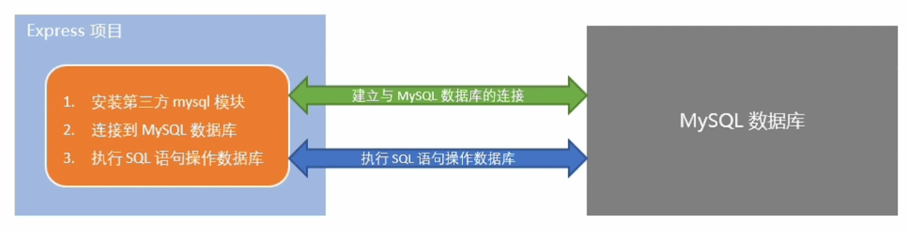
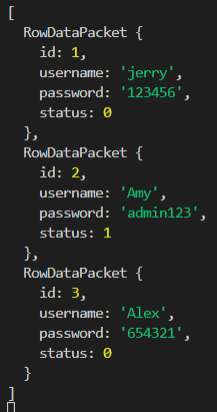
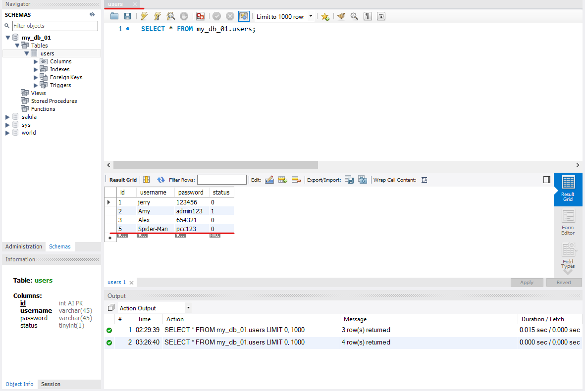
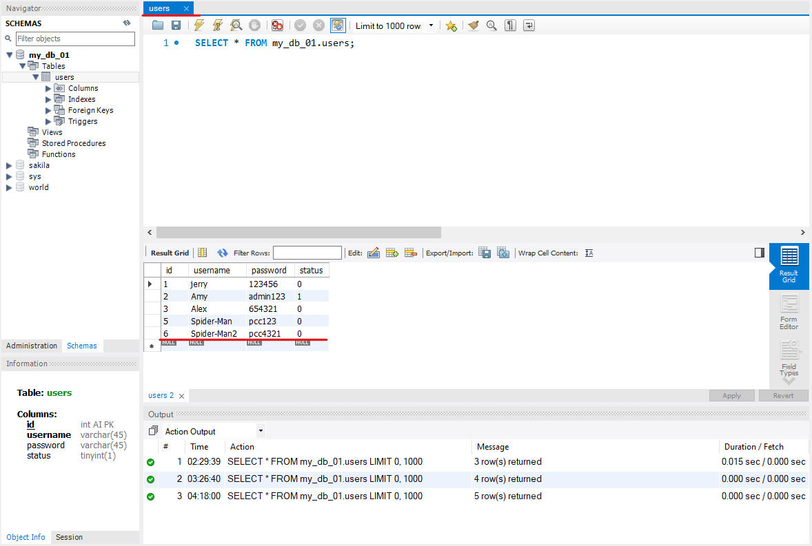

# [使用 CORS 達到跨域共享資源](../CORS.md)
## [01.使用express寫接口.js](./01.使用express寫接口.js)
* 附註 : 該主題會搭配 [**02.apiRouter.js**](./02.apiRouter.js) 這個 **路由模塊**，來取得 [**03.測試接口跨域問題.html**](./03.測試接口跨域問題.html) 這個網頁中 的 **請求的方法和路由**，再寄送對應內容回 [**03.測試接口跨域問題.html**](./03.測試接口跨域問題.html)。
```js
const express = require('express')
const app = express()

app.use(express.urlencoded({extended: false}))

app.get('/api/jsonp', (req, res) => {
    const funcName = req.query.callback
    const data = {name:'jerry', age: 20}
    const scriptStr = `${funcName}(${JSON.stringify(data)})`
    res.send(scriptStr)
})

const cors = require('cors')
app.use(cors())

const router = require('./02.apiRouter')
app.use('/api', router)

app.listen(80, () => {
    console.log('server running http://127.0.0.1')
})
```

* ### 說明
    #### 1. 使用 JSONP 接口
    * 注意 : 必須在配置 **cors** 中間件之前，配置 **JSONP** 的接口，否則會視為 **cors** 接口。
    ```js
    app.get('/api/jsonp', (req, res) => {
    const funcName = req.query.callback
    const data = {name:'jerry', age: 20}
    const scriptStr = `${funcName}(${JSON.stringify(data)})`
    res.send(scriptStr)
    })
    ```
    > `const funcName = req.query.callback` : 獲取客戶端發送過來的回調函數的名字。
    >
    > `const data = {name:'jerry', age: 20}` : 定義要發送到客戶端的數據對象。
    > 
    > `const scriptStr =${funcName}(${JSON.stringify(data)})` : 拼接出一個函數調用的字符串。
    #### 2. 將 cors 註冊為全局中間件
    * 注意 : 一定要在路由之前，配置 cors 這個中間件，從而解決接口跨域的問題
    ```js
    const cors = require('cors')    //導入 CORS模塊
    app.use(cors())
    ```
    #### 3. 註冊路由模塊，且統一路由前綴名為 `api`
    * 附註 : 先前說過 `app.use()` 就是註冊全局中間件，所以在這邊可以認為 `router` 就是一個中間件
    ```js
    const router = require('./02.apiRouter') //導入自訂義的路由模塊
    app.use('/api', router)
    ```

## [02.apiRouter.js](./02.apiRouter.js)
```js
const express = require('express')
const router = express.Router()

router.get('/get', (req, res) => 
    const query = req.query
    res.send({
        status: '0',
        msg: "GET 請求成功",
        data: query
    })
    // console.log(query)
})

router.post('/post', (req, res) => {
    const body = req.body
    res.status(200).send({
        status: '0',
        msg: 'POST 請求成功!',
        data: body
    })
    // console.log(body)
})

router.delete('/delete', (req, res) => {
    res.send({
        status: '0',
        msg: 'DELETE 請求成功!',
    })
})

module.exports = router
```

* ### 說明
    #### 1. 定義 GET 接口
    * 注意 : 只當 **請求的路由** 為 `http://127.0.0.1/api/get` 時，才會觸發該接口。
    ```js
    router.get('/get', (req, res) => 
        const query = req.query
        res.send({
            status: '0',
            msg: "GET 請求成功",
            data: query
        })
        // console.log(query)
    })
    ```
    > `const query = req.query` : 通過 req.query 獲取客戶端通過查詢字符串，發送到服務器的數據。
    > 
    > `res.send({})` : 調用 `res.send()` 方法，向客戶端**響應處理的結果**。
    >> `status: '0'` : 0 表示處理成功，1 表示處理失敗。
    >> 
    >> `msg: "GET 請求成功"` : 狀態的描述。
    >> 
    >> `data: query` : 需要響應給客戶端的數據。

    #### 2. 定義 POST 接口
    * 注意 : 只當 **請求的路由** 為 `http://127.0.0.1/api/post` 時，才會觸發該接口。
    ```js
    router.post('/post', (req, res) => {
        const body = req.body
        res.status(200).send({
            status: '0',
            msg: 'POST 請求成功!',
            data: body
        })
        // console.log(body)
    })
    ```
    > `const body = req.body` : 通過 req.body 獲取請求體中包含的 url-encoded 格式的數據。
    >
    > `res.status(200).send({})` : 當請求的狀態為 **200** 時，才向向客戶端響應結果。
    >> `status: '0'` : 0 表示處理成功，1 表示處理失敗。
    >> 
    >> `msg: "GET 請求成功"` : 狀態的描述。
    >> 
    >> `data: body` : 需要響應給客戶端的數據。
    
    #### 3. 定義 DELETE 接口
    * 注意 : 只當 **請求的路由** 為 `http://127.0.0.1/api/delete` 時，才會觸發該接口。
    ```js
    router.delete('/delete', (req, res) => {
        res.send({
            status: '0',
            msg: 'DELETE 請求成功!',
        })
    })
    ```
    #### 4. 對外公開 router，好讓 [01.使用express寫接口.js](./01.使用express寫接口.js) 可以存取 router 下的所有接口
    ```js
    module.exports = router
    ```
## [03.測試接口跨域問題.html](./03.測試接口跨域問題.html)
* ### 附註 : 該 html網頁 主要用於展示各個接口中跨域請求的效果，所以不會加以說明 html 中的各個使用方法和用意。

# 項目中操作MySQL
## 項目中操作資料庫的概略步驟
### step1. 安裝操作MySQL資料庫的第三方模塊。
```
npm i mysql
```
### step2. 通過 mysql 模塊連接到 MySQL 資料庫
### step3. 通過模塊執行 SQL 語句
* 以上步驟可以達到如下圖的效果。

> 圖片截自 : BiliBili黑馬程序員-Node.js

## [04.簡易測試MySQL模塊.js](./04.簡易測試MySQL模塊.js)
### 配置 mysql 模塊
當我們安裝好後，在 **使用 mysql 模塊操作 MySQL 資料庫之前，必須先對 mysql 模塊進行必要的配置**，如下所示。
```js
const mysql = require('mysql')
const db = mysql.createPool({
    host: '127.0.0.1',
    user: 'root',
    password: 'admin123',
    database: 'my_db_01'
})
```
1. `const mysql = require('mysql')` : 導入 mysql模塊。
2. 通過 mysql 模塊連接到 MySQL 資料庫 :
    ```
    const db = mysql.createPool({
    host: '127.0.0.1',
    user: 'root',
    password: 'admin123',
    database: 'my_db_01'
    })
    ```
    > `host` : 資料庫的 IP 地址。
    >
    > `user` : 登入資料庫的帳號。
    >
    > `password` : 登入資料庫的密碼。
    >
    > `database` : 指定操作的資料庫的名稱。
### 測試 mysql 模塊
調用 `db.query()` 函數，指定要執行的 SQL 語句，通過回調函數拿到執行的結果 :
```js
db.query('SELECT 1', (err,results) => {
     if(err) return console.log(err.message)
     console.log(results)
})
```

## [05.查詢數據-使用 mysql 模塊](./05.查詢數據-使用mysql.js)
* 注意 : 如果執行的是 select 查詢語句，則執行結果是數組。
如果想要查詢數據，語法結構如下 :
```js
db.query('[sql語法]', (err, results) => {
     if(err) return console.log(err.message)
    console.log(results)
})
```

### 1. 查詢 users 表中所有數據
```js
const sqlStr = 'select * from users'
db.query(sqlStr, (err, results) => {
    if(err) return console.log(err.message)
    console.log(results)
})
```
1. `const sqlStr = 'select * from users'` : 預先寫好的 SQL語句，並儲存到 `sqlStr` 變量中。
2. `if(err) return console.log(err.message)` : 若 mysql 模塊工作期間報錯了，就打印錯誤訊息。
3. `console.log(results)` : 若查詢成功印出查詢結果。

    

* 謹記 : 在 **查詢、插入、更新、刪除** 等等的動作之前，**一定要配置資料表的各項設定**，目的是讓 **mysql模塊 匹配指定的資料表**。
```js
const mysql = require('mysql');
const db = mysql.createPool({
    host: '127.0.0.1', 
    user: 'root',
    password: 'admin123',
    database: 'my_db_01',
})

const sqlStr = 'select * from users'
db.query(sqlStr, (err, results) => {
    if(err) return console.log(err.message)
    console.log(results)
})
```

## [06.插入數據-使用 mysql 模塊](./05.查詢數據-使用mysql.js)
### 插入數據
* 語法結構跟上面的主題一樣，只不過 **sql語法** 不同而已。
* 注意 : 如果執行的是 **insert into** 插入語句，則 `results` 是一個 **對象**，可以通過 `affectedRows` 屬性，來判斷是否插入數據成功。

#### 1. 向 users 表中新增數據，其中 username = Spider-man，passowrd = pcc123 :
在 **sql語句** 中，可以通過 **問號(`?`)**，問號的方式當作佔位符，也就是當下我不指名具體數據，但我之後必須填上具體數據。
```js
const user = {username: 'Spider-Man', password: 'pcc123'}
const sqlStr = 'insert into users(username, password) values(?, ?)'
db.query(sqlStr, [user.username, user.password], (err, results) => {
    if(err) return console.log(err.message)
    if(results.affectedRows === 1){
        console.log("插入數據成功~!")
    }
})
```


* 附註 : 這裡可能會有疑問，上圖的 `id` 為什麼是 5?因為先前我在 [**SQL基本語法**](./SQL基本語法.md) 的章節中，有刪除 `id = 4` 的用戶，且 `id` 具有唯一性的特性，所以即便被刪除的數據，該 `id` 也不會被占用。 

### [插入數據的便捷方式](./07.便捷插入數據-使用mysql.js)
#### 2. 向 users 表中新增數據，其中 username = Spider-man2，passowrd = pcc4321 :
在上面小節中，可以發現我是逐個打出欄位名，但這有個問題，就是如果當欄位名越來越多時，我必須打出每個欄位的名稱，且 `values()` 後面的 **問號(`?`)** 會越來越多，這樣不利於開發，所以當向表中新增數據時，如果 **數據對象的每個屬性** 和 **數據表的欄位** 一一對應，則可以通過如下方式快速插入數據 :

* 注意 :  `SET ?` : 代表將 `user` 物件中的所有屬性，和屬性對應的值，作為數據，插入到表中。
```js
const user = {username: 'Spider-Man2', password: 'pcc4321'}
const sqlStr = 'insert into users set ?'

db.query(sqlStr, user, (err, results) => {
    if(err) return console.log(err.message)
    if(results.affectedRows === 1){
        console.log("插入數據成功~!")
    }
})
```


## [更新數據 - 使用 mysql 模塊](./08.更新數據-使用mysql.js)
### 更新數據
* 注意 : 執行了 update 語句之後，執行的結果，也是一個對象，可以通過 `affectedRows` 判斷是否更新成功。
可以通過以下的方式，更新表中的數據。
* 注意 : 如果不加 `WHERE` 條件的話，會將整張表更新。
#### 1. 更新 id=9 的數據，其中 username = Allison，password = summer :
```js
const updateOBJ = {username: 'Allison', password: 'summer', id: 9}
const updateStr = 'update users set username=?, password=? where id=?'

db.query(updateStr, [updateOBJ.username, updateOBJ.password, updateOBJ.id], (err, results) => {
    if(err) return console.log(err.message)
    if(results.affectedRows === 1){
        console.log("更新數據成功")
    }
})
```
### [更新數據的便捷方式](./09.便捷更新數據-使用mysql.js)
#### 2. 更新 id=9 的數據，其中 username = Ashy，password = shiny :
原理如同上個主題的 ***[插入數據的便捷方式](#2-插入數據的便捷方式)***，更新資料表的數據時，如果 **數據對象的每個屬性 和 資料表的欄位** 一一對應的話，則可以通過如下的方式快速更新資料表的數據。
```js
const updateOBJ = {username: 'Ashy', password: 'shiny', id: 9}
const updateStr = 'update users set ? where id=?'

db.query(updateStr, [updateOBJ, updateOBJ.id], (err, results) => {
    if(err) return console.log(err.message)
    if(results.affectedRows === 1){
        console.log('更新數據成功!~')
    }
})
```
