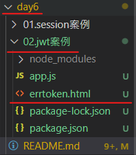

# [01.session案例](./01.session%E6%A1%88%E4%BE%8B/app.js)
## step1. [安裝 express-session 中間件](./指令.md)
```
npm install express-session
```
## step2. 配置 express-session 中間件
express-session 中間件安裝成功後，需要通過 `app.use()` 來註冊 session 中間件。
```js
app.use(session({
    secret: '[可以為任何字符串]',
    resave: false,
    saveUninitialized: true,
}))
```
其中，`resave: false` 和 `saveUninitialized: true` 是固定的寫法。

## step3. 向 session 中存數據
* 注意 : `req` 本身並沒有 `session` 屬性，只有當配置了 [**express-session 中間件**](#step2-配置-express-session-中間件) 後，才能使用 `req.session`。

當 `express-session`中間件 配置成功後，即可通過 `req.session` 來訪問和使用 `session` 對象，從而儲存用戶的關鍵信息，其中 `req.session.user` 儲存了包含 `req.body.username` 和 `req.body.password` 的數據，即 **admin、000000**。
```js
app.post('/api/login', (req, res) => {
  if (req.body.username != 'admin' || req.body.password != '000000') {
    return res.send({ status: 1, msg: '登錄失敗' })
  }
  
  req.session.user = req.body  // 存儲用戶的信息
  req.session.islogin = true   // 紀錄用戶的登入狀態

  res.send({ status: 0, msg: '登錄成功' })
})
```

## step4. 從 session 中取數據
可以直接從 `req.session` 對象上獲取之前儲存的數據。
```js
app.get('/api/username', (req, res) => {
    if(!req.session.islogin){
        res.send({status: '1', msg: 'fail'})
    }
    res.send({
        status: '0',
        msg: 'success',
        username: req.session.user.username
    })
})
```
## step5. 清空session
* 注意 : 調用`req.session.destory()` 函數，只清除當前用戶的session信息，並不會清除其他用戶的信息。
可以調用`req.session.destory()` 函數，即可清空服務器保存的 session信息。
```js
app.post('/api/logout', (req,res) => {
    req.session.destroy()
    res.send({
        status: '0',
        msg: '退出成功'
    })
})
```

# [在Express中使用JWT](./02.jwt%E6%A1%88%E4%BE%8B/app.js)
## step1. [安裝 JWT 相關的包](./指令.md)
```
npm i jsonwebtoken express-jwt
```
* #### *jsonwebtoken* : 用於將用戶信息加密並 **生成 JWT 字符串**。
* #### *express-jwt* : 用於 **將 JWT 字符串解析還原成 JSON 對象**。

## step2. 導入 JWT 相關的套件
```js
const jwt = require('jsonwebtoken')
const expressJwt = require('express-jwt')
```

## step3. 定義secret密鑰
為了 **保證 JWT 字符串的安全性**，防止 JWT 字符串在網路傳輸過程中被別人破解，需要專門定義一個用於 **加密 和 解密** 的 secret 密鑰，其中目的有兩個作用。
1. 當生成 JWT 字符串的時候，需要使用 secret 密鑰對用戶信息進行加密，最終得到加密好的 JWT 字符串。
2. 當把 JWT 字符串解還原成 JSON 對象的時候，需要使用 secret 密鑰進行解密。
```js
const secretKey = '[任意字符串]'
```

## step4. 在登入成功後生成 JWT 字符串
* 注意 : 在加密生成 Token 的時候，**千萬不要帶入密碼相關的屬性**。

調用 jsonwebtoken 套件提供的 `sign()` 方法，將用戶的信息加密成 JWT 字符串，並響應給客戶端；格式如下 :
```js
const token = jwt.sign({username: userinfo.username}, secretKey, {expiresIn: '30s'})
```
1. `username: userinfo.username` : 用戶的信息。
2. `secretKey` : 加密的密鑰。
3. `expiresIn: '30s'` : 當前配置的 token 有效期；為30秒。

## step5. 將 JWT 字符串還原為 JSON對象
客戶端每次在訪問那些有權限接口的時候，都需要主動通過 **請求標頭中的 Authorization 字段**，將 Token 字符串發送到服務器進行身分認證，此時服務器可以通過 **express-jwt** 這個中間件，自動將客戶端發送過來的 **Token 解析還原成 JSON 對象**。
```js
app.use(expressJwt.expressjwt({secret: secretKey, algorithms: ['HS256']}).unless({path: [/^\/api\//]}))
```
1. `expressJWT({secret: secretKey})` : 用來解析 Token 的中間件。
2. `.unless({path: [/^\/api\//]})` : 用來指定哪些接口不需要訪問權限，也就是說訪問網站的 **url 路徑的開頭為  `/api/` 都不要訪問權限，其他的路徑需要**。

## step6. 使用 `req.user` 獲取用戶信息
* 注意 : 一般來說 `req` 是沒有 `auth` 屬性的，但只要配置成功了 **expressJwt** 這個中間件，就可以把解析出來的用戶信息，掛載到 `req.auth` 屬性上。

當 **expressJwt** 這個中間件配置成功後，即可在那些有權限的接口中，使用 `req.auth` 對象，來訪問從 JWT 字符串中解析出來的用戶信息了，示範代碼如下 :
```js
app.get('/admin/getinfo', (req, res) => {
    console.log(req.auth)
    res.send({
        status: 200,
        message: '獲取用戶信息成功!',
        data: req.auth
    })
})
```
## step7. 捕獲解析 JWT 失敗後產生的錯誤
當使用 express-jwt 解析 token 字符串時，如果客戶端發送過來的 Token 字符串 **過期 或 不合法**，會產生一個 **解析失敗** 的錯誤，影響項目的正常運行，我們可以通過 **Express的錯誤中間件**，捕獲這個錯誤並進行相關的處理，範例代碼如下 :
```js
app.use((err, req, res, next) => {
  if(err.name === 'UnauthorizedError'){
    return res.status(401).send({
      message: '無效的token!'
    })
  }
  res.status(500).send({
    message: '未知的錯誤!'
  })
})

```

## step8. 返回 error page (可選)
該主題是 [**捕獲解析 JWT 失敗後產生的錯誤**](#step7-捕獲解析-jwt-失敗後產生的錯誤) 的額外應用，若是以上個主題的 `message` 傳輸錯誤訊息的話，
會是以 ***JSON*** 的形式傳輸訊息到 **client端**，若想以 **html** 的形式，傳輸 **錯誤網頁** 可以使用下面方法。
```js
  if(err.name === 'UnauthorizedError'){
    return res.status(401).sendFile('errtoken.html', {root: __dirname})
  }
```
<p align="center"></a>