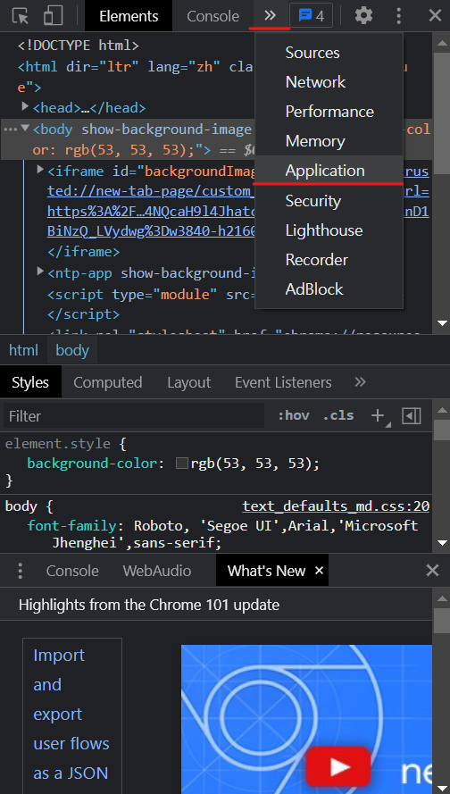

# [前後端的身分驗證](./day6/README.md)

## Web開發模式
* ### 目前主流的 Web 開發模式為一下兩種。
### 1. 基於服務端渲染的傳統的 Web 開發模式
#### 服務器端渲染的概念 :

服務器發送給客戶端的 HTML 頁面，是 **在服務器通過字符串的拼接**，**動態生成的**，
因此客戶端不需要使用 **Ajax** 這樣的技術額外請求網頁的數據，例如以下代碼。

```js
app.get('/index.html', (req, res) => {
     const user = {username : "jerry", age: 20}

     // 如同下行代碼，通過拼接寫出 html
     const html = `<h1>姓名: ${user.username}，年齡: ${user.age}</h1>`

     // 再將上方的 html，響應給客戶端
     res.send(html)
})
```
#### 服務端渲染的優缺點 :
* **優點 :**
1. **前端耗時**；因為服務端負責動態生成 **HTML** 內容，瀏覽器只需要直接渲染頁面即可，尤其是移動端更省電。
2. **有利於 SEO**；因為服務端響應的是完整的 **HTML** 網頁內容，所以爬蟲更容易爬取獲得信息，更有利於 **SEO**。
* **缺點 :**
1. **占用服務器端資源**；即服務端完成 **HTML** 頁面內容的拼接，如果請求較多，會對服務器造成一定的訪問壓力。
2. **不利於前後端分離**，且開發效率低；使用服務端渲染，則無法進行分工合作，尤其對於前端複雜度高的項目，不利於項目高效率開發。

### 2. 基於前後端分離的新型 Web 開發模式
#### 前後端分離的概念 :

前後端分離的開發模式，依賴於 **Ajax技術** 的廣泛應用，簡而言之，前後端分離的 Web 開發模式，
就是 **後端只負責提供 API 接口**，**前端使用 Ajax 調用接口** 的開發模式。

#### 前後端分離的優缺點 :
* **優點 :**
1. **開發體驗好**；前端專注於 UI 頁面的開發，後端專注於 API 的開發，且前端有更多的選擇性。
2. **用戶體驗好**；**Ajax技術** 的廣泛應用，極大的提高了用戶的體驗，可以輕鬆實現局網頁的部刷新。
3. 減輕服務端的渲染壓力；因為頁面最終是在每個用戶的瀏覽器中生成的。

* **缺點 :**
1. **不利於 SEO**；因為完整的 **HTML網頁** 需要在客戶端動態拼接完成，所以爬蟲無法爬取網頁的有效信息。
* 解決方案 :  利用 **Vue、React** 等等的前端框架的 **SSR(server side render)** 技術能夠很好的解決 **SEO** 的問題! 

## 如何選擇 Web 開發模式
* 注意 : 一定要知道該業務性較偏向於哪一種，而不是盲目的選擇使用開發模式，可以參考以下兩種性質做選擇。另外，具體使用何種開發模式並不是絕對的，為了同時兼顧 **首頁的渲染速度** 和 **前後端分離的開發效率**，
一些網站採用了 **首屏服務器端渲染 + 其他頁面前後端分離** 的開發模式；比如 **淘寶、天貓** 等等。
> 首屏概略說明 : 簡單來說就是，當我點擊進到該網站就可以看到當期活動，或直接切入主題的大版面或全版面的網站。

### 1. 網站需要較強的展示性質
主要功能是展示而沒有複雜的交互，並且需要良好的 **SEO**，讓網站有更多的 **曝光度、較高排名、更多點閱** 等等的展示性質，則這時我們就需要 **使用服務器渲染**；
比如 **IKEA、原價屋** 等等的銷售網站，和 **捷安特、TOYOTA** 等等的企業級網站。

### 2. 網站需要管理和交互性質
這類不需要考慮 **SEO**，反而需要有較好的管理環境和交互性比較強，類似於後台管理項目，那麼就可以使用前後端分離的開發模式；
比如 **Netflix、巴哈姆特** 等等的這類型的網站。

## 身分認證
* ### 什麼是身分認證
身分認證(Authentication) 又稱 **身分驗證、鑒權**，是指通過一定的手段，完成對用戶身分的確認；
在日常生活中的身分認證隨處可見，例如 : 搭飛機的機票、手機的密碼或指紋解鎖等等；
在 Web 開發中，也涉及到用戶身分的認證，例如 : 各大網站的手機驗證碼登入、Email登入、QRcode登入等等。
* ### 為什麼需要身分認證
身分認證的目的，是為了 **確認當前你所聲稱的用戶，確實是妳本人**，例如 : 超商取貨時，店員會問你取貨人姓名手機後三碼；
在互聯網項目開發中，如何對用戶的身分進行驗證，是一個值得深入探討的問題，例如 : 如何才能確保網站不會錯誤將 **貝佐斯的存款數額** 顯示到 **你的帳戶** 上。
* ### 不同開發模式下的身分認證
對於 **服務段渲染** 和 **前後端分離** 這兩種開發模式來說，分別有著不同的身分認證方案。
1. **服務端渲染** 推薦使用 **Session認證機制**。
2. **前後端分離** 推薦使用 **JWT認證機制**。

## Session認證機制
### 1. HTTP協議的無狀態姓
* 了解 **HTTP協議**的無狀態性是進一步學習 **Session** 認證機制必要前提。

**HTTP協議的無狀態性**，指的是客戶端的**每次HTTP請求都是獨立**的，連續多個請求之間沒有直接的關係，**服務器不會主動保留每次HTTP請求的狀態**；也就是說當你登入過一個網站，你下次再登入的時候，該網站是不會記住你的。
> 舉個現實生活中的例子 :
>> **當我(`客戶端`)**進到一個**賣場(`服務器`)**，**該賣場(`服務器`)** 人流非常大，**賣場(`服務器`)** 不會記住誰是會員誰不是，除非出示 **會員卡(`Cookie`)**，證明你曾經來過該 **賣場(`服務器`)**。

* 注意 : 現實生活中會員卡身分認證方式，在 Web 開發中的專業術語角做 **Cookie**。

### 2. Cookie
* 查看 **Cookie** : 打開Chrome瀏覽器 --> 鍵盤按下 F12 鍵 --> 頂部欄位找到`Application` --> 左側下拉選單找Cookie，這樣就可以看到了。

<p align="center"></a>


**Cookie** 是儲存在用戶瀏覽器中的一段不超過 4KB 的字符串，它由一個 **名稱(`Name`)、一個值(`Value`)** 和其他幾個用於控制 **Cookie有效期、安全性、使用範圍** 的可選屬性所組成。

不同網域名下的 **Cookie** 各自獨立，每當客戶端發起請求時，會自動把當前相同網域名下的所有未過期的 Cookie 一同發送到服務器。

客戶端**第一次請求服務器**時，服務器 **通過響應頭的形式**，向客戶端發送一個身分認證的 Cookie，客戶端會**自動將 Cookie 保存在瀏覽器中**，**隨後**當客戶端瀏覽器**每次請求服務器時**，瀏覽器會**自動將身分認證相關的 Cookie**，**通過請求頭的形式** 發送給服務器，服務器即可驗證客戶端的身分。


> 圖片截自 :BiliBile黑馬程序員-Node.js

* #### Cookie的特性 :
   1. 自動發送。
   2. 網域名獨立。
   3. 過期限制。
   4. 4KB限制。

### 3. Cookie不具有安全性
* 注意 : **千萬不要使用 Cookie 儲存重要且隱私的數據!** 比如用戶的身分信息、密碼等等。由於 **Cookie 是儲存在瀏覽器中** 的，而且 **瀏覽器也提供了讀寫 Cookie的API**，因此 **Cookie 很容易被偽造**，不具有安全性，所以 **不建議** 服務器將重要的隱私數據，通過 Cookie 的形式發送給瀏覽器。

#### 提高身分認證的安全性 :
為了防止 **客戶(`客戶端`)** 偽造 **會員卡(`Cookie`)**，**賣場(`服務器`)** 拿到 **客戶(`客戶端`)** 出示的 **會員卡(`Cookie`)** 之後，可以 **在收銀機上進行刷卡認證**，只有收銀機確認存在的 **會員卡(`Cookie`)**，才能被正常使用；這種 **會員卡(`Cookie`) + 刷卡認證** 的設計理念，就是 **Session認證機制** 的精隨。

也就是說 **客戶端** 不能只是提供 **Cookie**，**服務器** 就讓 **客戶端** 通過，**服務器** 必須要認證 **Cookie** 的有效性，才能夠讓 **客戶端** 通過。

> **會員卡** : 指的就是 **Cookie**。
> **刷卡認證** : 指的就是 **Session認證機制**。

### 4. Session認證的侷限性
Session認證機制 **需要配合Cookie才能實現**，由於Cookie默認不支持跨域訪問，
所以當涉及到前端跨域請求後端接口時，**需要做很多額外的配置**，才能實現跨域Session認證。

#### 注意:
* 當前端請求後端街口 **不存在跨域問題** 的時候，**推薦使用 Session** 身分認證機制。
* 當前端 **需要跨域請求後端接口** 的時候，不推薦使用 Session 身分認證機制，**推薦使用 JWT** 認證機制。

### 4. Session 的工作原理

> 圖片截自 :BiliBile黑馬程序員-Node.js
