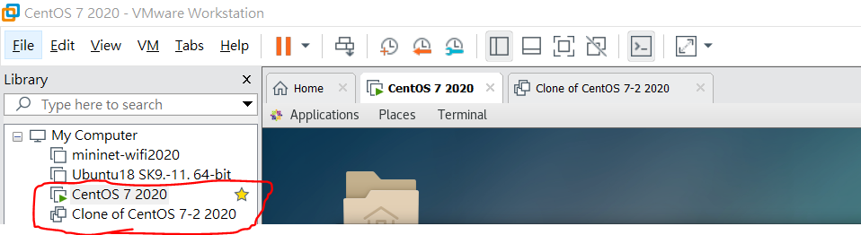
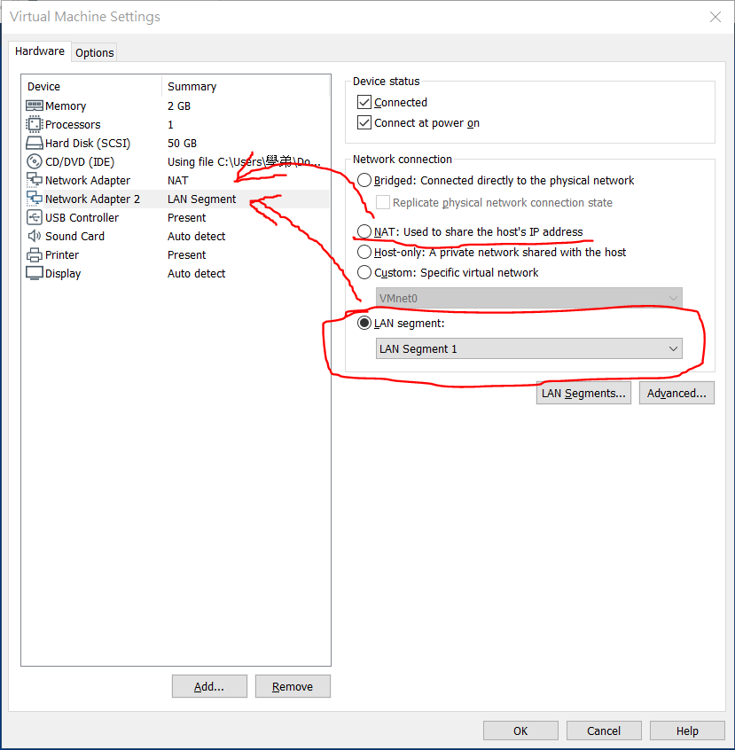
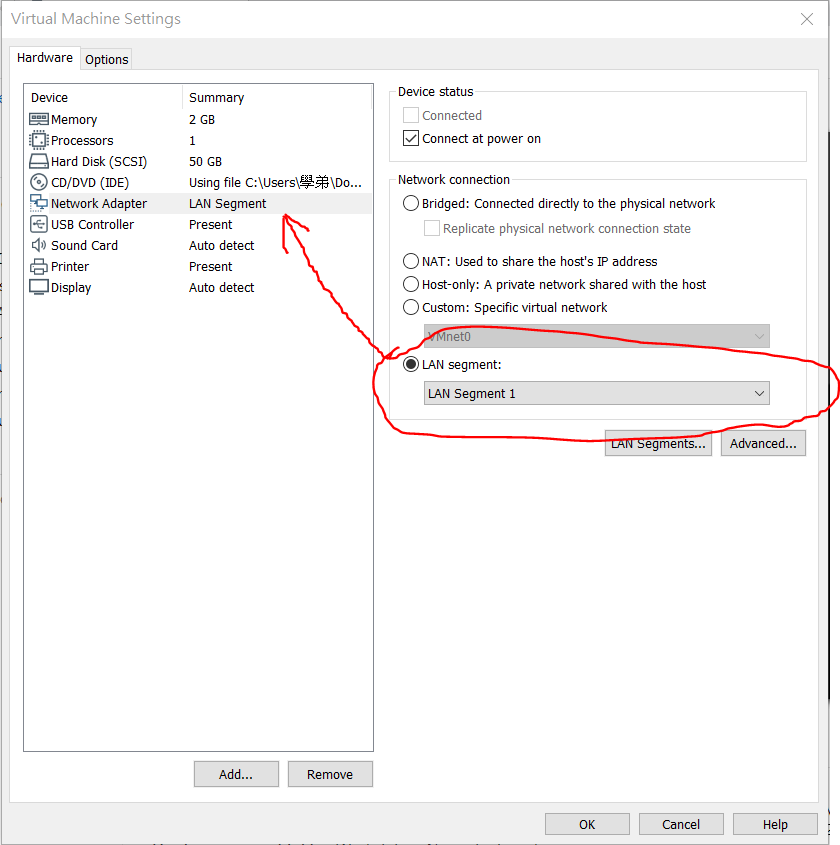
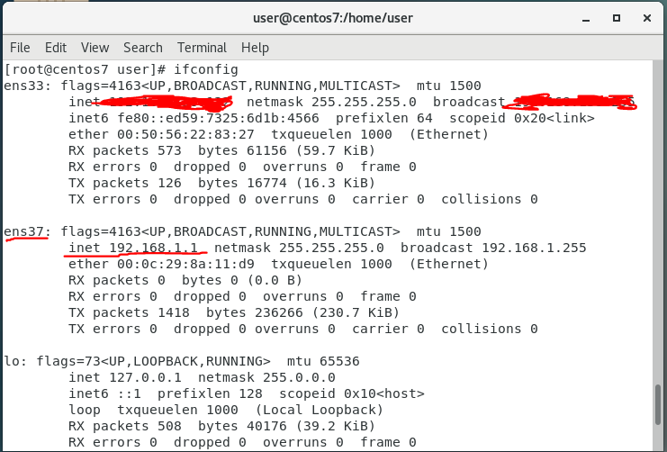
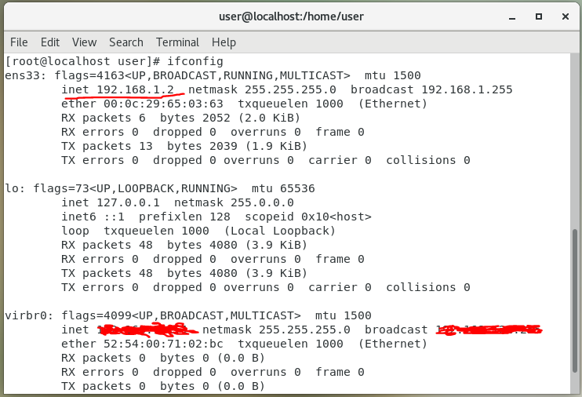

# 設置DHCP伺服器

### 1. 首先需要兩台虛擬機

### 2. 設置第1台的網卡

### 3. 設置第2台的網卡

### 4. 在設置DHCP前可以先測試看看內網可不可以通。

1. 為第1台虛擬機的`ens37`網卡配置IP

        ip add addr 192.168.1.1/24 brd + dev ens37

    

2. 為第2台虛擬機的`ens33`網卡配置IP

        ip addr add 192.168.1.2/24 brd + dev ens33
    
    

3. 設置好兩台虛擬機後互`ping`試試

        //在第二台ping

        [root@localhost user]# ping 192.168.1.1
        PING 192.168.1.1 (192.168.1.1) 56(84) bytes of data.
        64 bytes from 192.168.1.1: icmp_seq=1 ttl=64 time=1.35 ms
        64 bytes from 192.168.1.1: icmp_seq=2 ttl=64 time=0.313 ms

4. 測試成功後清除

    清除第1台IP

        ifconfig ens37 0        //清除IP指令

    清除第2台IP

        ifconfig ens33 0

---

## 開始加入DHCP

1. 下載DHCP

        yum install dhcp

2. 配置第1台的IP

        ip addr add 192.168.100.254/24 brd + dev ens37

3. 編譯`/etc/dhcp/dhcpd.conf`檔

        [root@centos7 user]# gedit /etc/dhcp/dhcpd.conf

        ddns-update-style            interim;
        ignore client-updates;
        default-lease-time           259200;        //默認的租用時間為3天
        max-lease-time               518400;        //最大租用時間為6天

        subnet 192.168.100.0 netmask 255.255.255.0 {
        range 192.168.100.101 192.168.100.200;      //範圍從192.168.100.102開始分配，最多到192.168.100.200
        option routers               192.168.100.254;       //路由器的窗口，其實就是我們的第1台虛擬機
        option domain-name-servers   8.8.8.8, 9.9.9.9;
        }

4. 所有配置都完成後，要重啟DHCP

        systemctl restart dhcpd

5. 回到第2台的虛擬機，向路由器請求IP

        dhclient ens33

    若發現請求有被占用，可以使用以下指令

        ps -ef | grep dhclient      //查詢佔用的pid
        kill -9 [pid]               //殺掉佔用的pid
        

