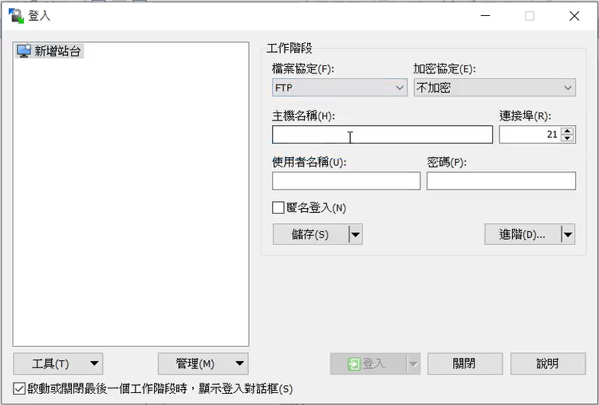

# FTP檔案傳輸

### Windows與Linux間的檔案傳輸

1. 先在windows下載winscp

2. 回到虛擬機下載vsftpd

        yum install -y vsftpd

3. 編輯vsftpd.conf檔

        gedit /etc/vsftpd/vsftpd.conf
        ---
        anonymous_enable=YES      //測試可以用YES，否則建議用NO

4. 查看配置檔的設置

        cat /etc/vsftpd/vsftpd.conf | grep -v ^#

5. 切換到ftp目錄底下做測試

        cd /var/ftp

        echo "Hi" > hi.txt

6. 更改檔案擁有者

        chown ftp:ftp pub

7. 在window下開啟winscp

        檔案協定 : [選擇FTP]
        主機名稱 : [虛擬機的IP]
        使用匿名登入

    

8. 連線失敗的狀況，可以先關閉防火牆，再重新啟用

        systemctl stop firewalld
        systemctl restart vsftpd

9. 如果要將檔案放進`pub`目錄內，但檔案權限不夠的狀況

        chmod -R 777 pub  //777是開放所有權限給pub目錄

---

### Linux與Linux間的檔案傳輸

1. 在第1台和第2台虛擬機安裝ftp

        yum install -y ftp

2. 在第2台虛擬機創建測試資料

        touch b{1..3}

3. 在第2台虛擬機使用ftp連到第1台虛擬機

        ftp [第1台虛擬機IP]
        ---
        Name : anonymous        //使用匿名登入
        password : a@a          //用電指信箱的格式登入就可以了

4. 傳輸資料
    
    |指令|說明|
    |:--:|:--:|
    |get|下載伺服器上的檔案至用戶端|
    |mget|將多個檔案下載至用戶端|
    |put|將用戶端的檔案上傳至伺服器端|
    |mput|將多個檔案上傳至伺服器端|
    |asc|設定傳輸格式為ASCII文字模式|
    |bin|設定傳輸格視為二進制binary模式|

        bin
        mput b*