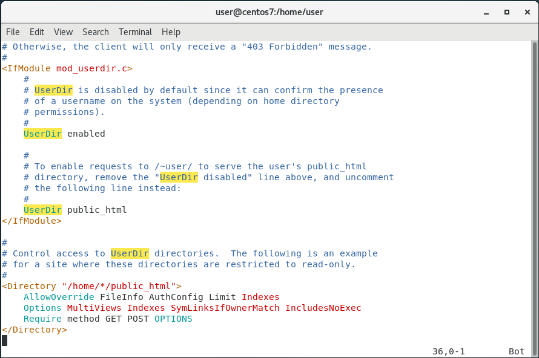

# 使用PHP

1. 安裝php和httpd

        yum -y install php
        yum -y install httpd

2. 安裝各種依賴包

        yum -y install php-gd php-ldap php-odbc php-pear php-xml php-xmlrpc php-mbstring php-snmp php-soap curl curl-devel

3. 關閉防火牆

        systemctl stop firewalld

4. 到html目錄下創建測試檔

        cd /var/www/html
        ----------------
        gedit info.php
        ----------------
        檔案內容
        <?php  phpinfo(); ?>

5. 重啟httpd

        systemctl restart httpd

6. 到瀏覽器搜尋虛擬機的`IP`

---

### Userdir個人網頁

1. 編輯

        gedit /etc/httpd/conf.d/userdir.conf

2. 修改內容

    

3. 重啟httpd

        systemctl restart httpd

4. 創建網頁目錄與設定權限

        mkdir /home/[使用者名稱]/public_html
        chmod 755 /home/[使用者名稱]
        chown [使用者名稱]:[使用者名稱] /home/[使用者名稱]/public_html
        chmod 755 /home/[使用者名稱]/public_html

5. 編輯網頁目錄內容

        echo ‘userdir test’ >> /home/[使用者名稱]/public_html/index.html

6. 開啟SELinux和設定httpd_sys_content_t

        setsebool -P httpd_enable_homedirs true
        chcon -R -t httpd_sys_content_t /home/[使用者名稱]/public_html

7. 在瀏覽器搜尋

        [虛擬機IP]/~[使用者名稱]/