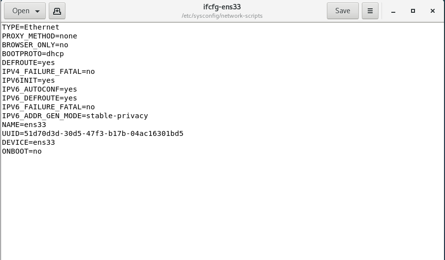
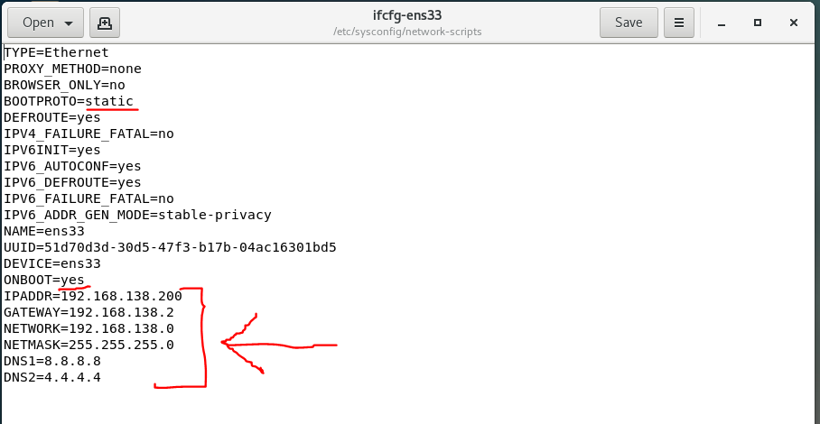

# Apache存取控制

1. 配置`httpd.conf`檔，在檔案最後面加入下面行段

        gedit /etc/httpd/conf/httpd.conf
        ------------
        //新增此行
        <Directory /var/www/html>
            Order allow,deny
            Allow from all
            Deny from [想要拒絕的IP]
        </Directory>
    
    1. * Order : 決定順序，上面例子是先允許再拒絕
    2. * Allow : 允許存取
    3. * Deny  : 拒絕存取
    4. * 決定順序很重要，倘若先拒絕再允許，等於沒有拒絕

---

# 靜態網路設定

* #### 動態網路和靜態網路是互斥的，所以當動態網路開啟，靜態網路就得關閉

1. 關閉動態網路，開啟動態網路

        systemctl disable NetworkManager
        systemctl stop NetworkManager
        systemctl start network
        systemctl enable network

2. 配置網路設定檔，修改內容如下圖

        cd /etc/sysconfig/network-scripts
        gedit ifcfg-ens33
    
    1. * 原本的內容

        
        
    2. * 修改的內容

        

3. 可以試著ping

        ping tw.yahoo.com
