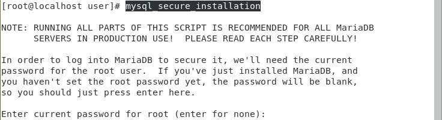
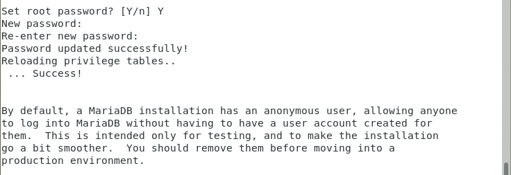
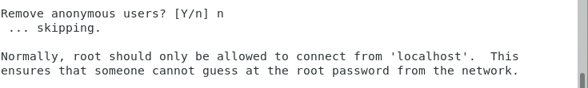
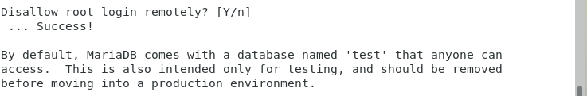
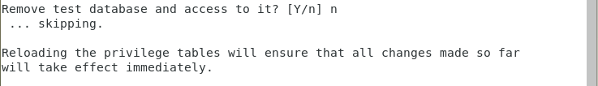
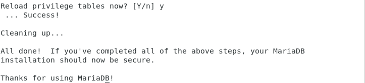
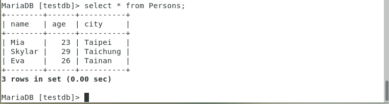
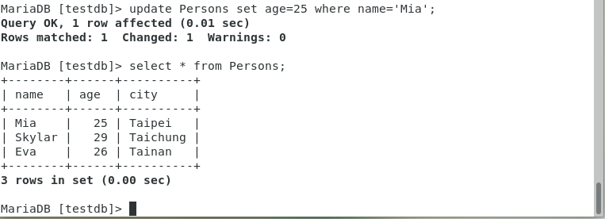
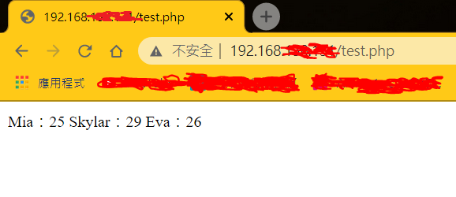

# Centos安裝MySQL資料庫

1. 下載資料庫

        yum install mariadb-server

2. 啟用和檢查

        systemctl start mariadb
        systemctl status mariadb

3. 安全相關設定

        mysql_secure_installation

    1. * 剛進入設定環境，是沒有設定密碼的，所以先按Enter

        

    2. * 是否設定root密碼 ? 設定自己記得住就好

        

    3. * 是否移除匿名使用者 ? 因為我只是練習所以我選NO

        

    4. * 不允許root從遠端登入嗎 ? 看個人我選NO

        
    
    5. * 是否刪除測試資料庫 ?

        

    6. * 是否現在重新載入 ? 

        

4. 用root登入

        mysql -u root -p

5. 顯示當前資料庫

        show databases;
        //一定要用分號結尾，很重要。

6.  新增資料庫

        create database [資料庫名稱];

7. 使用資料庫

        use [資料庫名稱];

8. 創建測試用資料表

        //資料表格式
        create table Persons(name char(11), age int(10), city varchar(255));
        ----------------------
        //輸入3筆資料到資料表中
        insert into Persons(name, age, city) values ("Mia", 23, "Taipei");
        insert into Persons(name, age, city) values ("Skylar", 29, "Taichung");
        insert into Persons(name, age, city) values ("Eva", 26, "Tainan");
        ----------------------
        //選擇資料表並顯示該內容
        select * from Persons;

    * **完成圖**

        

9. 若想修改資料表內容可以使用以下指令

        update Persons set age=25 where name='Mia';

    1. * set : 想要更改的欄位
    2. * where : 哪一列的資料

    * **修改過後**

        

10. 刪除資料表

        drop table [資料表名稱];

---

# MySQL結合PHP伺服器

1. 下載`php-mysql`

        yum install php-mysql -y

2. 創建測試用`php`檔，檔案內容如下

        gedit test.php
        ---------------
        <?php
        $server = "localhost";
        $dbuser = "root";
        $dbpassword = "[資料庫密碼]";
        $dbname = "testdb";

        $connection = new mysqli($server, $dbuser, $dbpassword, $dbname);

        if ($connection->connect_error) {
          die("Connection failed:" . $connection->connect_error);
        }

        $sqlQuery ="SELECT * from Persons;";

        if ($result = $connection->query($sqlQuery)) {
          while ($row = $result->fetch_row()) {
            printf ("%s：%d\n", $row[0], $row[1]);
          }

          $result->close();
        } else {
          echo "Execution failed:" . $connection->error;
        }

        $connection->close();
        ?>

3. 重啟http伺服器

        systemctl restart httpd

4. 到chrome瀏覽器搜尋虛擬機IP，成功如下圖。

   