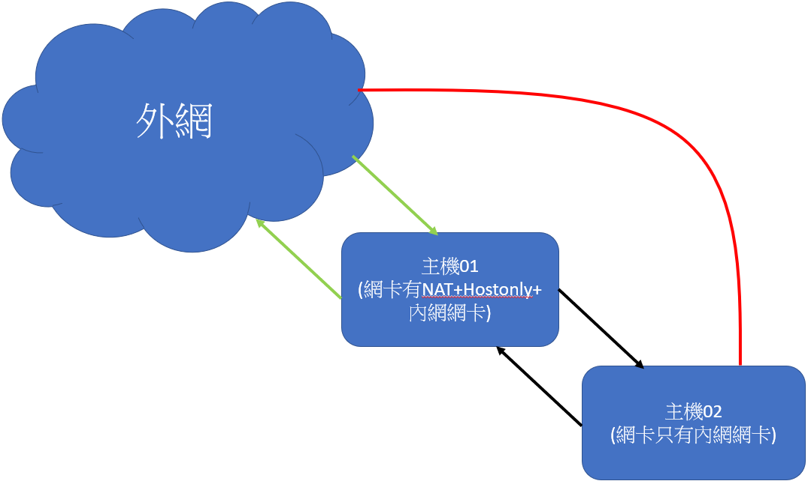

# 內網透過主機連外網

* 示意圖如下

說明上圖內容

>* 紅線：主機02不可以直接連向外網，必須透過主機01。
>* 黑線：主機01和主機02可以互ping，互連。
>* 綠線：主機01可以直接連向外網，外網也可以看到主機01。

---

### 1.設定主機02

先切到管理員模式

    su

設定主機02的內網網卡IP

    ip addr add 192.168.1.2/24 brd + dev enp0s3
    ip addr add 192.168.1.3/24 brd + dev enp0s3
    ip addr show    //檢查ip是否有設定成功

測試IP可不可以`ping`

    ping 192.168.1.2
    ping 192.168.1.3

設定靜態路由IP

    ip route add default via 192.168.1.1
    ip route show       //檢查路由設定是否成功

若設錯的話用以下指令清除

    ifconfig enp0s3 0

### 2.設定主機01

先切到管理員模式

    su

手動向DHCP serve取得IP

    dhclient enp0s3

測試看看可不可以`ping`到外網

    ping 8.8.8.8
    ping tw.yahoo.com

設定內網網卡IP

    //此IP就是主機02設定的路由IP
    ip addr add 192.168.1.1/24 brd + dev enp0s9

### 3.測試內網可不可以互連

從主機01`ping`主機02

    ping 192.168.1.2
    ping 192.168.1.3

從主機02`ping`主機01

    ping 192.168.1.1

### 4.讓主機02可以連到外網

