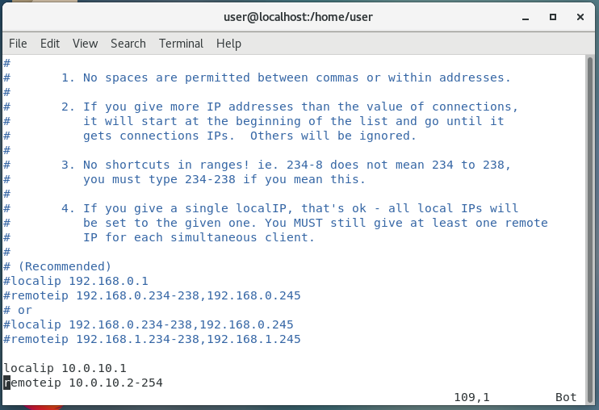
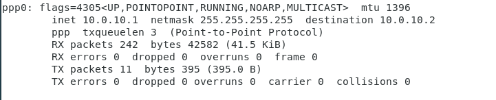

# 安裝VPN PPTP，並互連

切到管理員模式

    su

安裝EPEL套件，此為第三方套件

    yum install epel-release -y
    tum clean all -y        /清除快取

安裝PPTP

    yum install ppp pptp -y

之後使用以下指令配置

    vim /etc/pptpd.conf

並新增以下兩行

    localip 10.0.10.1
    remoteip 10.0.10.2-254
完成如下

之後使用以下指令更改`ms-dns`

    vim /etc/ppp/options.pptpd
    ms-dns 8.8.8.8
    ms-dns 8.8.4.4

設置帳號密碼

    vim /etc/ppp/chap-secrets

    內容配置
    # Secrets for authentication using CHAP
    # client        server  secret                  IP addresses
    使用者名稱 pptpd 密碼 連線IP(也可以用*號)

啟用pptpd

    systemctl start pptpd
    systemctl stauts pptpd

檢查連線是否有成功，成功會多出以下圖片的這行

    ifconfig

## 設置可對外連線

* 目前的VPN配置完後，會是一個死循環，若要對外連線必須使用以下步驟。

