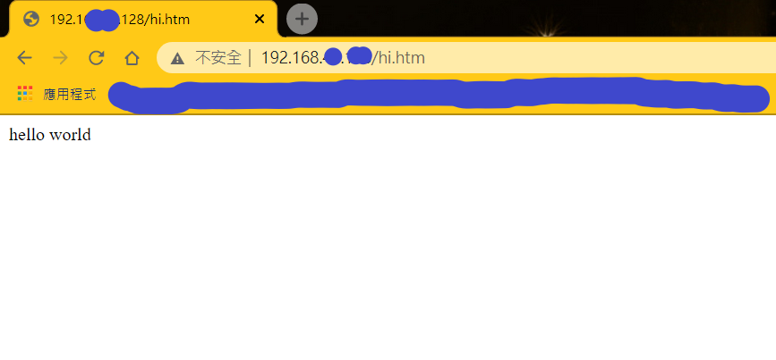
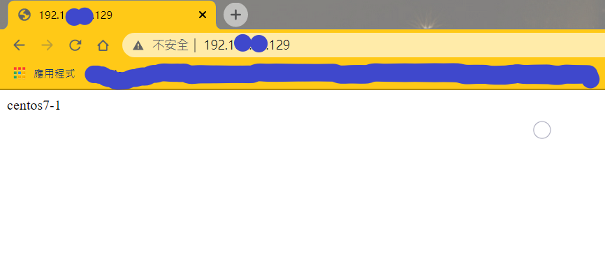
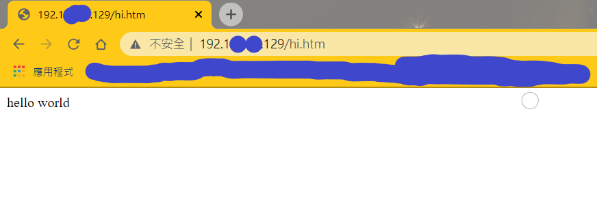

# 使用NFS使檔案可以分享
*   檔案分享顧名思義是有兩台主機共同分享一個檔案，先從主機01開始配置。

---

### 1. 主機01 

切換管理員

    su

安裝NFS伺服器

    yum install nfs-utils

啟用NFS和rpc-bind

    systemctl start nfs
    systemctl start rpcbind

將nfs和rpc-bind加入防火牆的白名單

    firewall-cmd --zone=public --permanent --add-service={rpc-bind,mountd,nfs}
    firewall-cmd --reload

創建一個目錄

    mkdir -p /data      //-p的意思即便存在此目錄也不會回報錯誤。
    chmod 755 /data

配置導出目錄

    /data/     192.168.0.0/24(rw,sync,no_root_squash,no_all_squash)
    /data       //共享目錄位置
    192.168.0.0/24      //客戶端IP，也可以使用 * ，但這會導致所有IP都可以。

配置完後要重啟NFS伺服器

    systemctl restart nfs

使用以下指令檢查共享目錄

    showmount -e localhost

---

### 2. 主機02

* 在使用檔案分享時，建議兩台主機的防火牆都關閉。
    
        systemctl stop firewalld
        su      //記得切換管理員

安裝NFS

    yum install nfs-utils

啟用NFS

    systemctl start rpcbind

創建目錄

    mkdir /mydata

掛載

    mount -t nfs 192.168.49.0:/data /mydata

    192.168.49.0        //這IP應該要是你的主機01的IP
    /data               //主機01創建的目錄
    /mydata             //主機02剛剛創建的目錄

可以使用以下指令檢查是否有掛載

    mount       //通常會在最底下

 * 測試

    在主機02時切換到`mydata`，創建檔案
    
        cd /mydata
        touch {a..f}
    
    回到主機01，查看是否有增加

        cd /data
        ls

---

# 利用NFS服務器管理http

* 會建議先關閉防火牆，測試成功後再加入白名單

        systemctl stop firewalld
        su      //記得切換到管理員

### 1. 主機01

先在載httpd

    yum install httpd -y

掛載http

    mount -t nfs 192.168.49.0:/data /var/www/html

切換到html目錄

    cd /var/www/html
    rm *        //若裡面有其他檔案可以先用此指令刪除

創建測試檔案

    echo "centos7-1" > index.html
    echo "helloworld" > hi.htm

開啟瀏覽器測試，打上主機01的IP

### 2. 主機02

先在載httpd

    yum install httpd -y

掛載

    mount -t nfs 192.168.49.0:/data /var/www/html

    IP應該要跟主機01的IP一樣

開啟瀏覽器測試，打上主機02的IP，成功如下圖

