# 磁碟分割與配置

 * 在做磁碟分割時，在安裝時就必須先分配好磁碟空間。分配如下圖

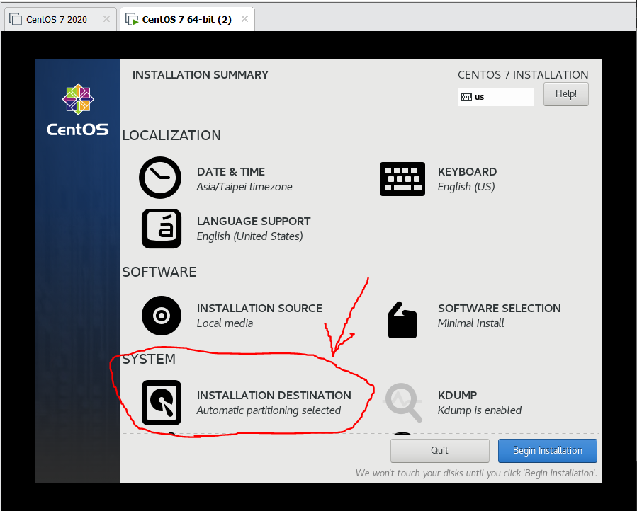
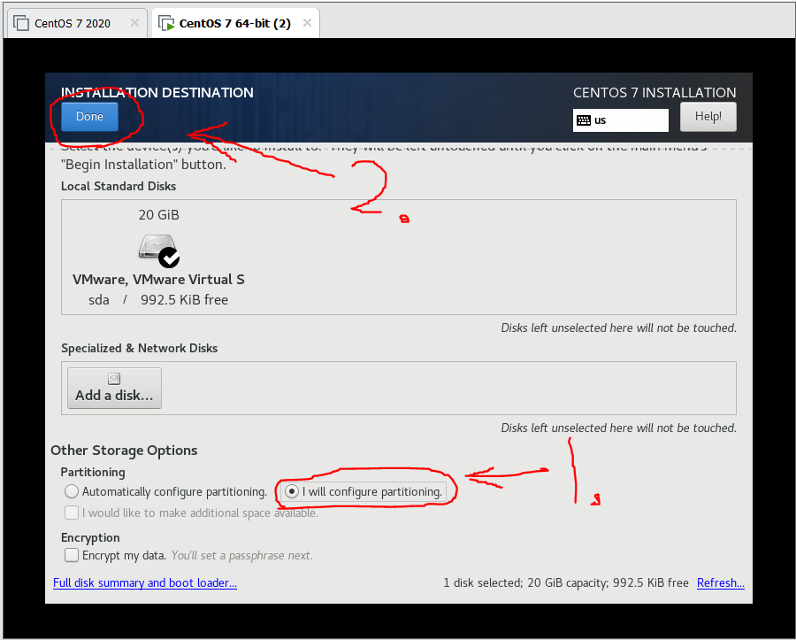
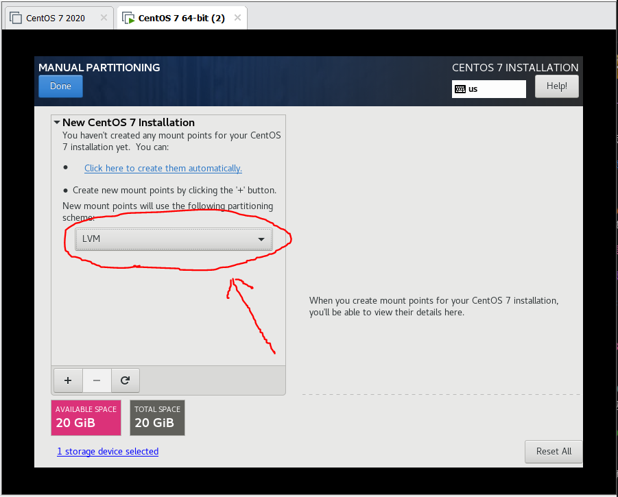
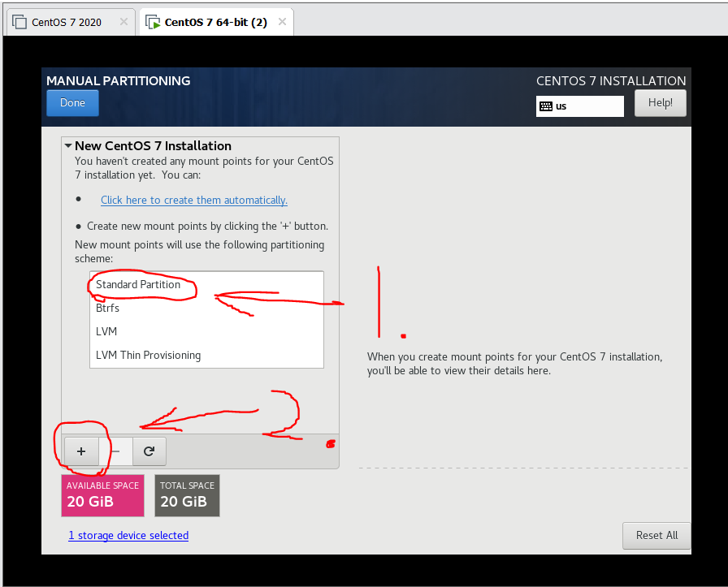
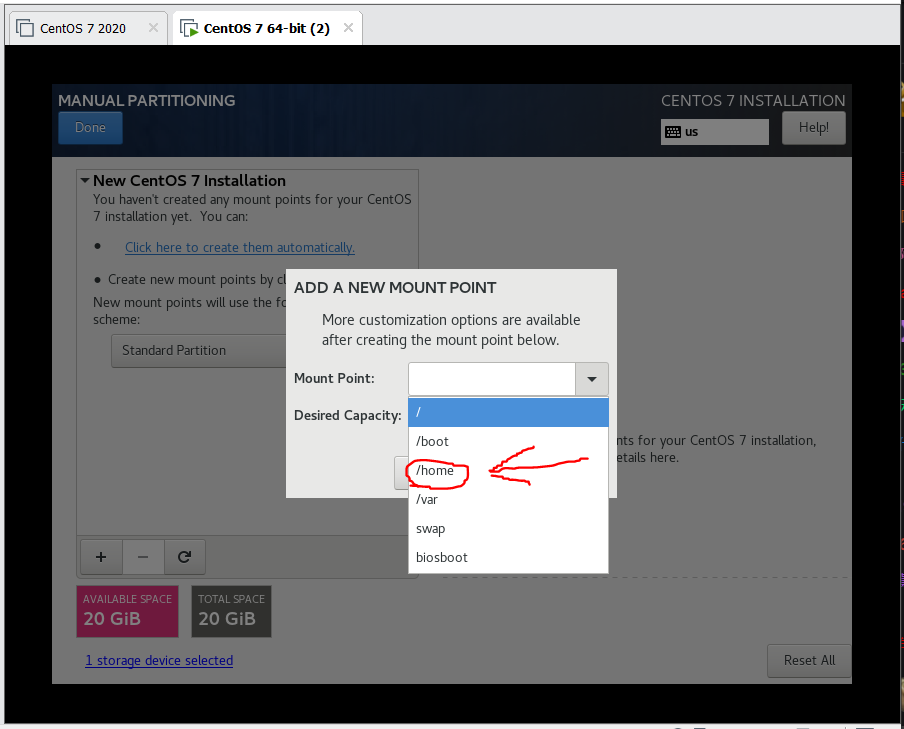

* 我們主要測試的配置目錄是home目錄

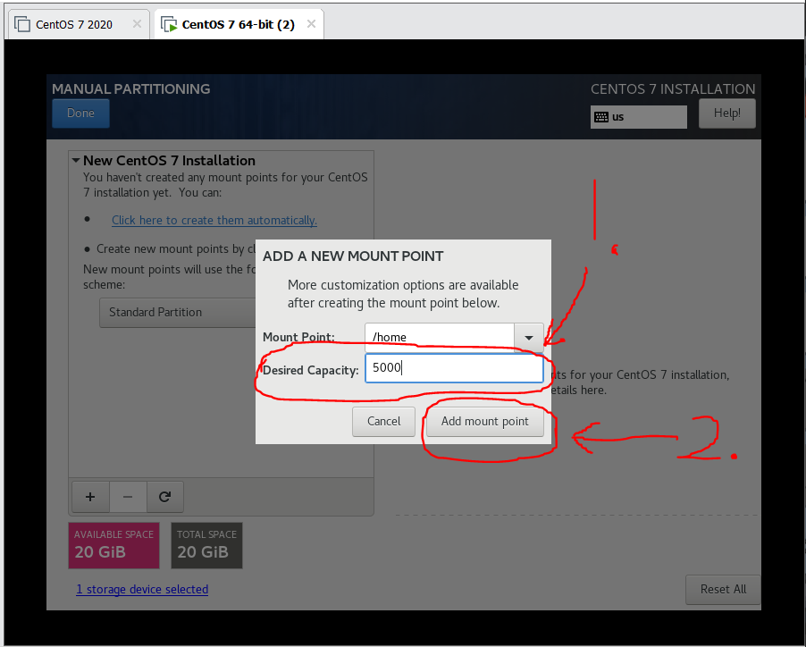

* 在這邊linux預設的配置單位是MB，所以是5000MB也可以打5GB。

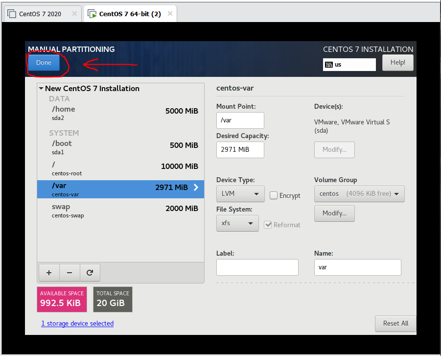

* 其他的`/, /boot, /var, /swap`的配置大小就隨便。

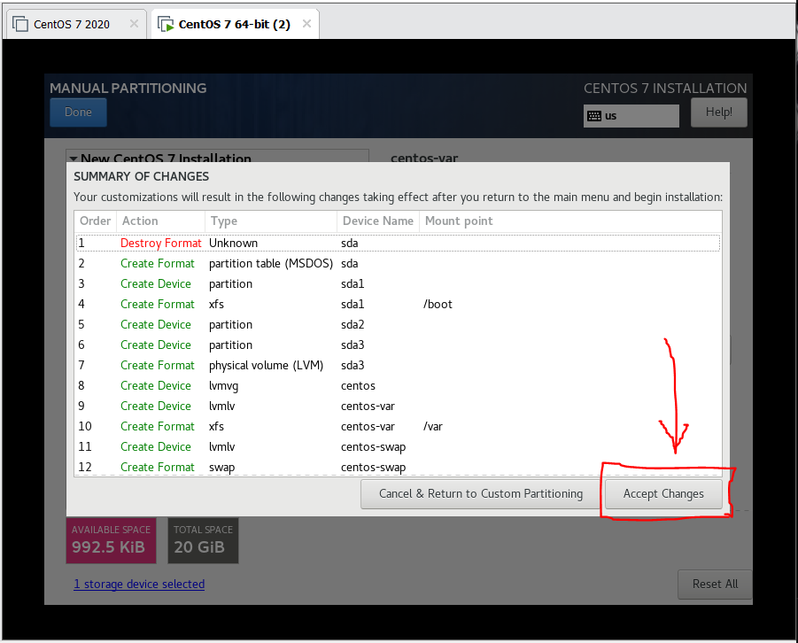
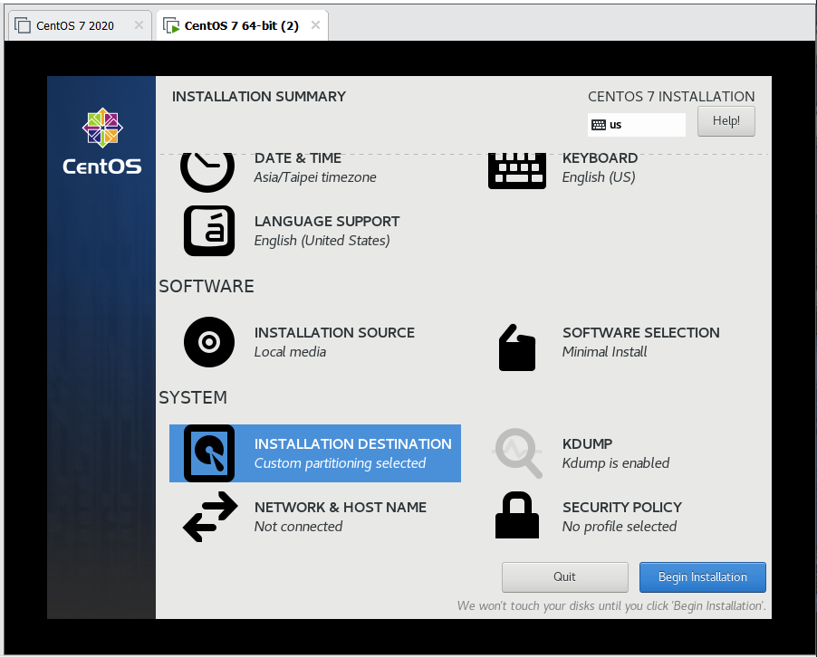

* 剩下的安裝步驟就照一般的程序走就好。

### 磁碟分配到這邊結束。

---

## BIOS設定quota

先進到選單畫面，之後按下鍵盤上的E鍵，編輯選擇項目。
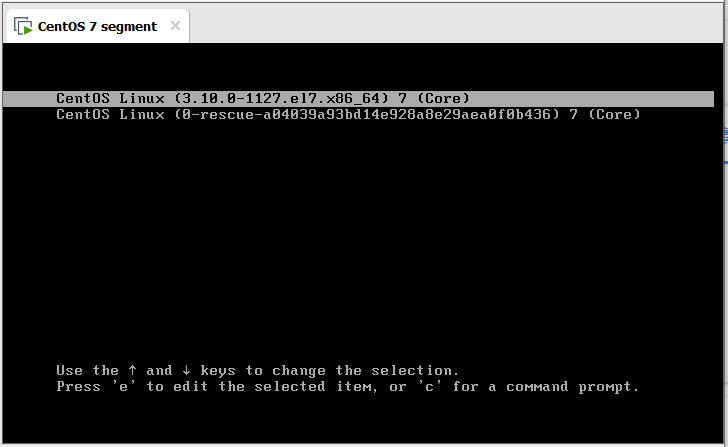

往下捲動，並在`quiet`後面加上`1`，加好後按下F10。
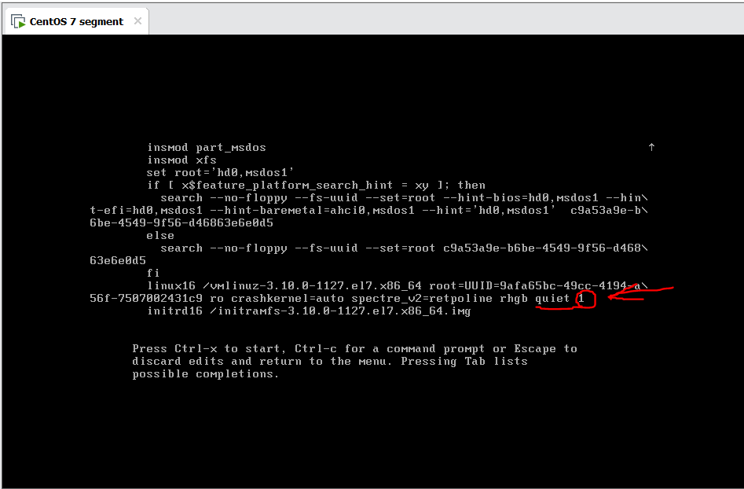

這邊就打上你的root密碼

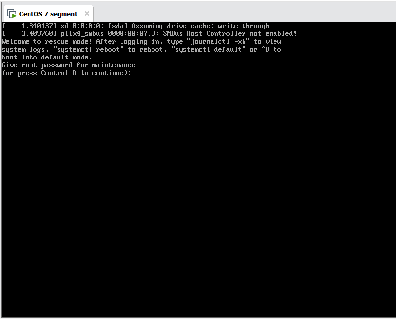

在dos視窗打以下指令，編輯fstab檔

    vim /etc/fstab

並在`/home`的defaults後面加上`usrquota`，儲存後`reboot`，如下圖
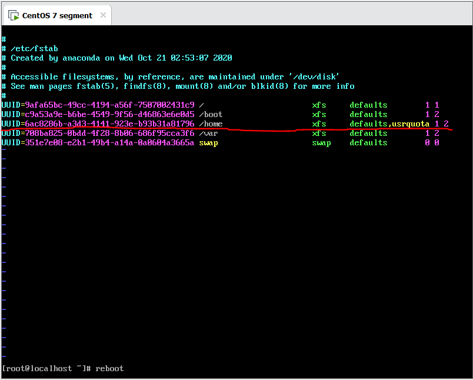

重啟後可以依照上面的步驟，到dos視窗後打以下指令，檢查是否有修改成功，成功如下圖

    cat /etc/fstab

* 若有成功會多出`usrquota`，如紅色圈起來的地方

---
## 磁碟配額設定工具

若想查看指定目錄的磁碟配額，可以使用以下指令，這邊`/home`是指定目錄

    xfs_quota -xc 'report -h' /home

若想查看指定目錄的磁碟使用情形，可以使用以下指令

    xfs_quota -xc 'free -h' /home

若想針對某群組或使用者列出其使用情形，可以使用以下指令，但在使用此指令前必須有群組或其他使用者。

    useradd tom         //新增使用者
    passwd tom          //為使用者設定密碼
    xfs_quota -xc 'limit bsoft=10m bhard=12m tom' /home         //為使用者設定配額
    xfs_quota -xc 'quota -h tom' /home

測試配額超載，要測試必須先切換使用者

    su - tom

再使用以下指令

    dd if=/dev/zero of=testfile bs=1M coun=13

