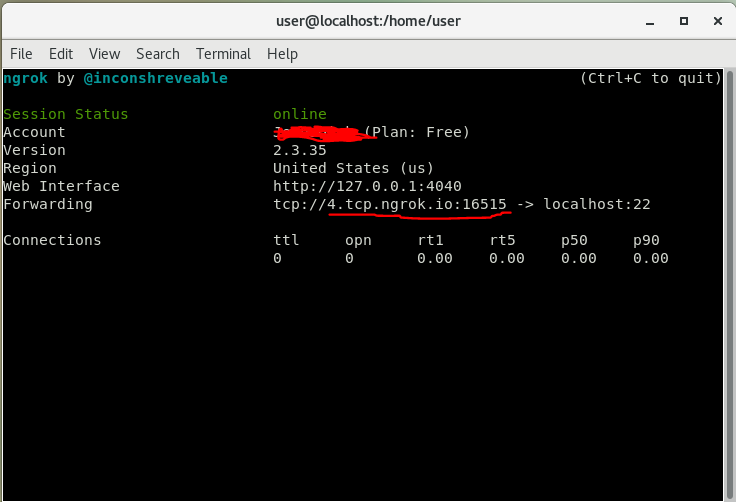
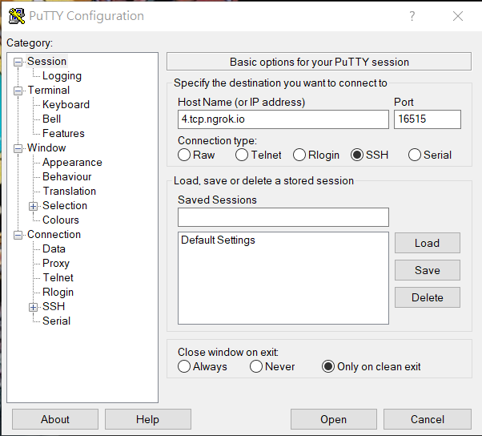

# ngrok安裝及設定
* Ngrok通過安全隧道將位於NAT和防火牆後面的本地伺服器公開到公共Internet。

## 1.安裝

透過以下網址安裝

    wget https://bin.equinox.io/c/4VmDzA7iaHb/ngrok-stable-linux-amd64.zip

解壓縮

    unzip /path/to/ngrok.zip

## 2. 設定

設定token

    ./ngrok authtoken *

透過ngrok啟用http轉發到80埠

    ./ngrok http 80

透過ngrok連上ssh

    ./ngrok tcp 22

複製紅底線的地方

再使用putty

替Web加密

    ./ngrok http --auth=admin:12345 80
                        ^     ^    ^
                        |     |    |
                (使用者帳號) (密碼) (http的預設埠)

如果不能啟用可以先試試

    killall ngrok       //砍掉目前有在執行的ngrok

---

# 安裝htop及設定

下載相關套件

    yum -y install epel-release
    yum -y update

安裝Htop

    yum -y install htop