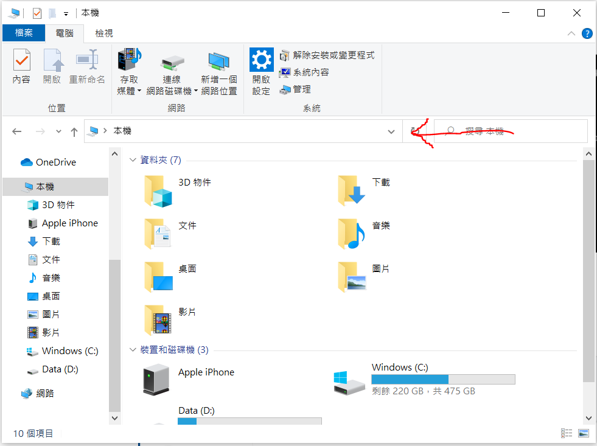
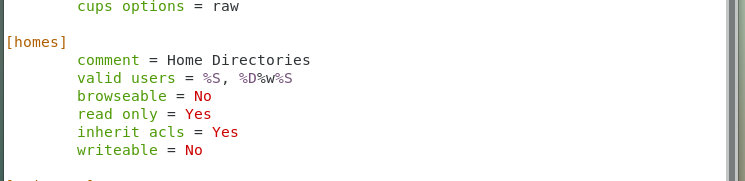
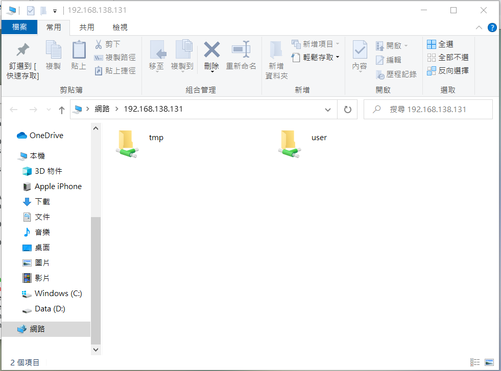
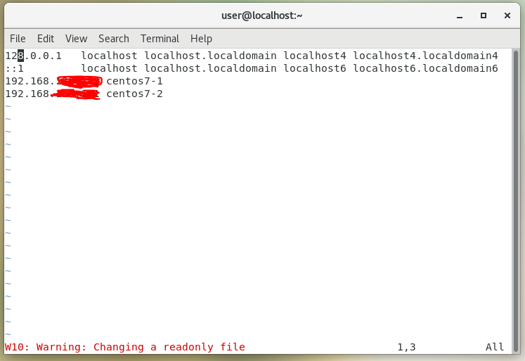

# samba網路芳鄰
## 1.安裝及使用
下載samba

    yum install samba samba-client samba-common -y

建立Samba帳號，在建立Samba帳號時，必須有此使用者帳號。

    smbpasswd -a user

啟用Samba

    systemctl start smb
    systemctl start nmb

允許Samba通過防火牆

    firewall-cmd --permanent --zone=public --add-service=samba
    firewall-cmd --reload

查詢ip

    ifconfig

在紅色箭頭輸入剛剛查詢的IP

    \\192.168.***.***

---

## 2. Samba設定

使用以下指令設定可以共用的目錄。

    vim /etc/samba/smb.conf

說明下圖

    該圖片說明，在使用網路芳鄰時，/home/user此目錄的使用權限

    read only = Yes     //表示該目錄只能讀
    writeable = No      //表示該目錄不能寫

---

加入tmp資料夾使其可以共用

    [tmp]
        comment = Temporary file space
        path = /tmp
        read only = No
        public = Yes

#### 說明下圖

#### 若沒有加入`tmp`的話，就只會有`user`這個資料夾看得到。

---

# 編輯hosts文件與設定ssh金鑰

若想要簡短或以不同形式輸入IP，可以設定`hosts`文件檔內的資料，如下圖

    vim /etc/hosts
    -------------------------------
    192.168.***.*** centos7-1
                        ︽
                        ||
            //輸入此名稱等同於輸入此IP
                        ||   
                        ︾
    192.168.***.*** centos7-2

若不想每次使用ssh時，都必須輸入使用者密碼的話，可以使用以下方法

    ssh-keygen      //按Enter使用預設配置
    
切到跟目錄再切到`.ssh`

    cd ~
    cd .ssh

將公開金鑰傳送給對方主機，這樣以後登入就免輸入密碼

    copy-ssh-id user@centos7-2
                      ^
                      |
                //上一步驟加入的替代名稱
    