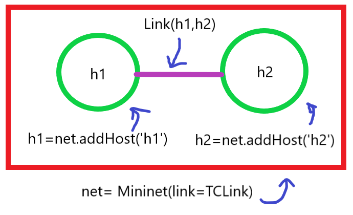
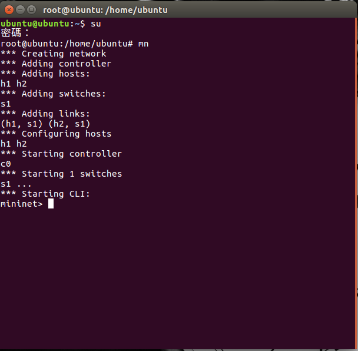
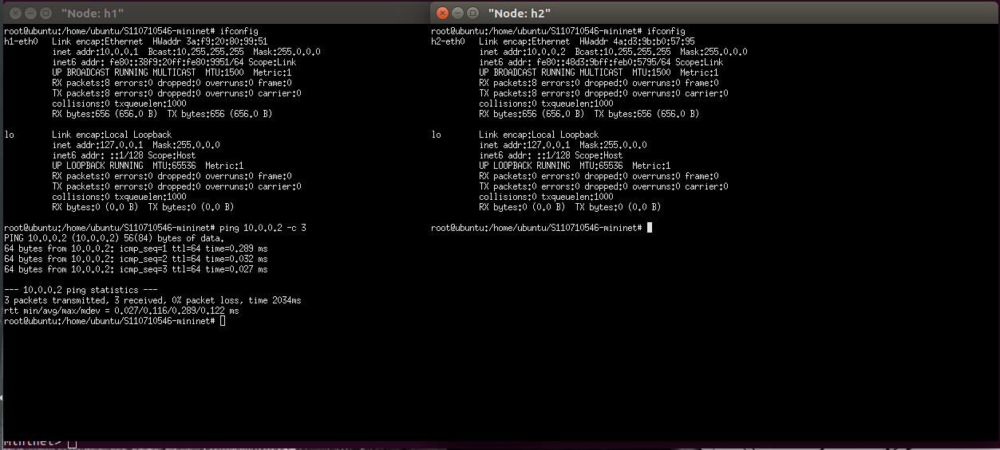
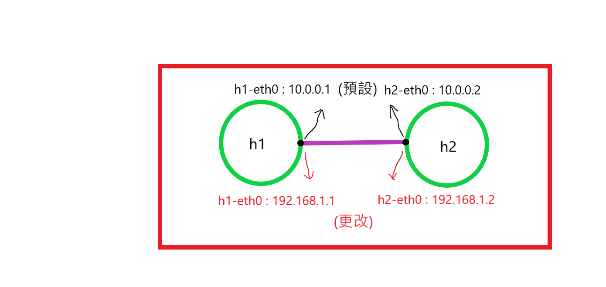
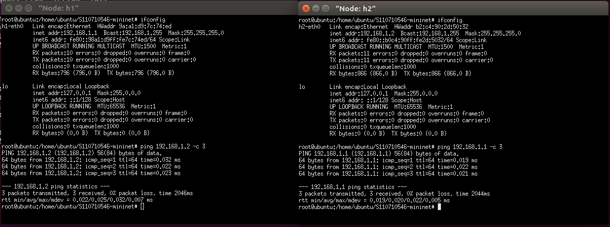
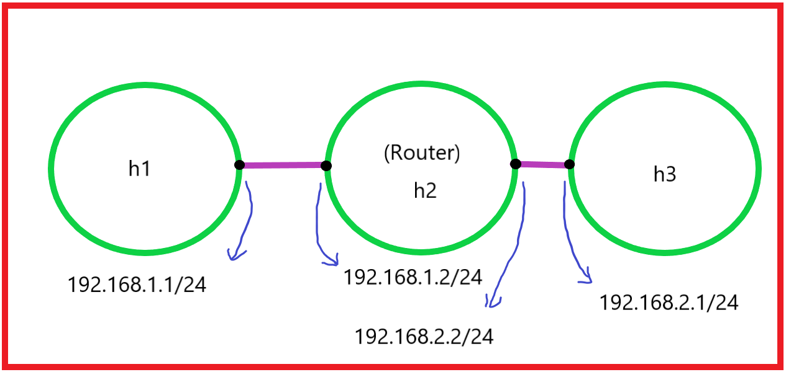
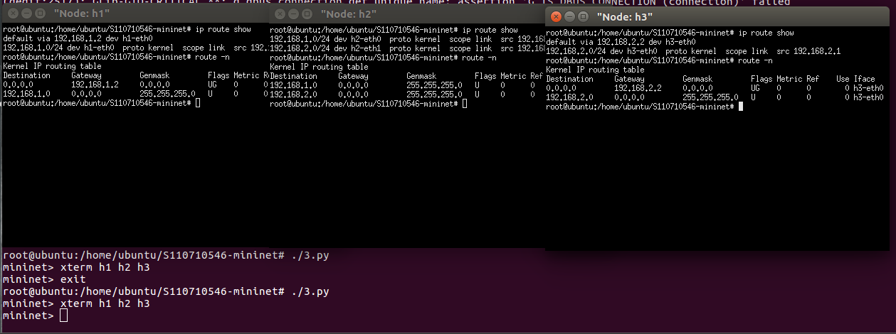
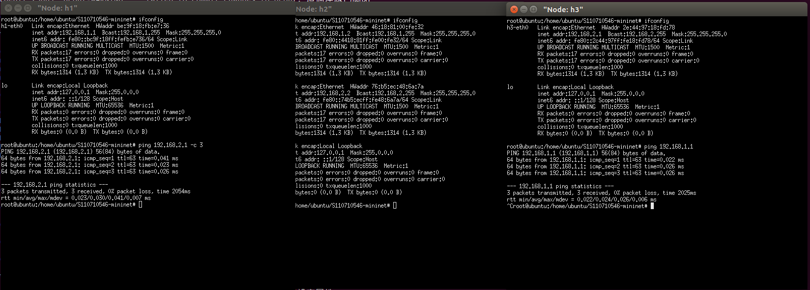
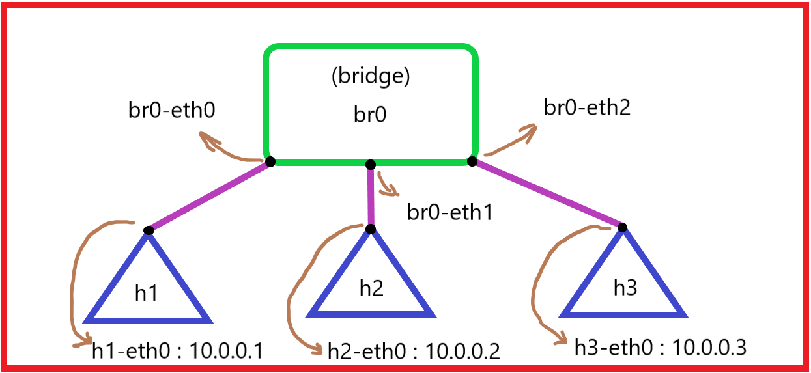
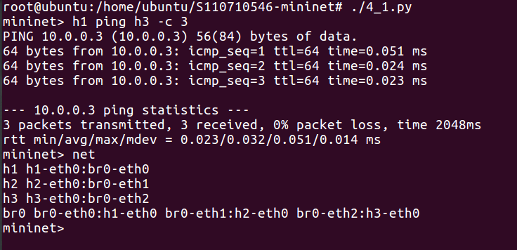

# 使用 mininet 創造網路空間，以下我們會使用腳本的方式，來設定網路空間規格
* 這次我們不像[week03](../week03/README.md)那樣，一一用命令來建立網路空間。

## 第一個程式
* 創造網路環境，將兩個節點加入，並互相連通；想像圖如下。


### 1. 創建資料夾
        
        root@ubuntu:/home/ubuntu# mkdir test
### 2. 創建代碼

        root@ubuntu:/home/ubuntu/S110710546-mininet# gedit 1.py

---
1. `from mininet.cli import CLI` : command line interface(CLI)，命令列介面。
   
    

2. `from mininet.net import Mininet` : 最主要是讓我們可以創造網路環境的模組。
3. `from mininet.link import Link, TCLink, Intf` : 可以幫我們創造點跟點之間的連線。
    > `Link` : 
    >> 此函數的連線速度，取決於你的硬體，你的電腦跑多快連線就多快，如果無需設定的話使用此就好。
    >
    > `TCLink` : 
    >> 這個函數可以讓我們對連線進行客製化，
    >>
    >>如 : 這條線的限速多少Mb或Gb、傳輸延遲、封包遺失等等的設定
    >
    > `Intf` :
    >> 可以自行配置的基本接口對象。
4. `net= Mininet(link=TCLink)` : 創造`mininet`空白環境。
5. `h1=net.addHost('h1')` : 加入名為`h1`的節點。
6. `h2=net.addHost('h2')` : 跟上面一樣的效果。
7. `Link(h1,h2)` : 將`h1`和`h2`兩個節點連接。
8. `net.build()` : 編譯網路環境。
9. `CLI(net)` : 建立成功會顯示命令列介面，好讓我們可以做額外的操作，如下圖。

    

10.  `net.stop()` : 使用`exit`離開命令，觸發此函數

```
#!/usr/bin/python

from mininet.cli import CLI
from mininet.net import Mininet
from mininet.link import Link, TCLink, Intf

if '__main__'==__name__:
  net= Mininet(link=TCLink)
  h1=net.addHost('h1')
  h2=net.addHost('h2')
  Link(h1,h2)
  net.build()
  CLI(net)
  net.stop()
```
---
### 3. 把程式變成可執行檔

    root@ubuntu:/home/ubuntu/S110710546-mininet# chmod +x 1.py

### 4. 執行程式
    
    root@ubuntu:/home/ubuntu/S110710546-mininet# ./1.py

### 5. 查看網路拓墣
    
    mininet> net

### 6. 開啟節點終端介面

    mininet> xterm h1 h2

### 7.測試



---

## 第二個程式
* 延伸第一個程式，將預設的ip客製化。



### 1. 複製
* 因為我們是將**第一個程式**的檔案格式完整複製，所以不需要再更改成可執行檔。
```
root@ubuntu:/home/ubuntu/S110710546-mininet# cp 1.py 2.py
```

### 2. 編寫
    root@ubuntu:/home/ubuntu/S110710546-mininet# gedit 2.py
---
1. `h1.cmd("ifconfig h1-eth0 0")` : 將網路卡的設定清除。
2. `h2.cmd("ifconfig h2-eth0 0")` : 跟上面一樣。
3. `h1.cmd("ip addr add 192.168.1.1/24 brd + dev h1-eth0")` : 加入新的`IP`設定。
4. `h2.cmd("ip addr add 192.168.1.2/24 brd + dev h2-eth0")` : 跟上面一樣。
* 注意 : 一定要先清除網卡的設定，才能加入新的`IP`否則會報錯。

```
#!/usr/bin/python

from mininet.cli import CLI
from mininet.net import Mininet
from mininet.link import Link, TCLink, Intf

if '__main__'==__name__:
  net= Mininet(link=TCLink)
  h1=net.addHost('h1')
  h2=net.addHost('h2')
  Link(h1,h2)
  net.build()
  h1.cmd("ifconfig h1-eth0 0")
  h1.cmd("ip addr add 192.168.1.1/24 brd + dev h1-eth0")
  h2.cmd("ifconfig h2-eth0 0")
  h2.cmd("ip addr add 192.168.1.2/24 brd + dev h2-eth0")
  CLI(net)
  net.stop()

```
---
### 3. 執行

    root@ubuntu:/home/ubuntu/S110710546-mininet# ./2.py

### 4. 開啟節點終端

    mininet> xterm h1 h2

### 5.測試



---

## 第三個程式
* 延伸第二個程式，加入路由節點。



### 1. 複製
    root@ubuntu:/home/ubuntu/S110710546-mininet# cp 2.py 3.py

### 2. 編寫
    
    root@ubuntu:/home/ubuntu/S110710546-mininet# gedit 3.py

---
1. `h1.cmd("ip route add default via 192.168.1.2")` : 加入內定路由。
2. `h3.cmd("ip route add default via 192.168.2.2")` : 跟上面一樣。
* 如果不加內定路由，當`h1 ping h3`時，封包不會由`h2`轉交給`h3`。
    > 我的認知(非專業非喜勿噴) :
    >> 可以想像成`h2`是個郵差，`h2`以前只送`h1`這一家的信，但之後`h2`要多送`h3`、`h4`、`h5`這幾家的信，那`h2`不知道哪家住在哪，所以索性要`h1`、`h3 ...`這幾家把***郵遞區號 + 住址***給`h2`，這樣`h2`就知道這封信該送去哪了。[更清楚的路由實現可以這篇](https://www.itsfun.com.tw/%E9%BB%98%E8%AA%8D%E8%B7%AF%E7%94%B1/wiki-918974-931354)

 3. `h2.cmd("echo 1 > /proc/sys/net/ipv4/ip_forward")` : 開啟路由功能。

```
#!/usr/bin/python

from mininet.cli import CLI
from mininet.net import Mininet
from mininet.link import Link, TCLink, Intf

if '__main__'==__name__:
  net= Mininet(link=TCLink)
  h1=net.addHost('h1')
  h2=net.addHost('h2')
  h3=net.addHost('h3')
  Link(h1,h2)
  Link(h2,h3)
  net.build()
  h1.cmd("ifconfig h1-eth0 0")
  h1.cmd("ip addr add 192.168.1.1/24 brd + dev h1-eth0")
  h2.cmd("ifconfig h2-eth0 0")
  h2.cmd("ip addr add 192.168.1.2/24 brd + dev h2-eth0")
  h2.cmd("ifconfig h2-eth1 0")
  h2.cmd("ip addr add 192.168.2.2/24 brd + dev h2-eth1")
  h3.cmd("ifconfig h3-eth0 0")
  h3.cmd("ip addr add 192.168.2.1/24 brd + dev h3-eth0")
  h1.cmd("ip route add default via 192.168.1.2")
  h3.cmd("ip route add default via 192.168.2.2")
  h2.cmd("echo 1 > /proc/sys/net/ipv4/ip_forward")
  CLI(net)
  net.stop()
```
### 3. 執行

    root@ubuntu:/home/ubuntu/S110710546-mininet# ./3.py

### 4. 開啟節點終端
    
    mininet> xterm h1 h2 h3

### 5. 對每個節點終端查看路由設定

* `ip route show`、`route -n`都可以查看。
    
    > `default`和`0.0.0.0`都是內定路由的意思。



### 6. 測試



---

## 第四個程式
* 使用用腳本建立橋接網路，將`br0`變成一台橋接器。



### 1. 編寫

    root@ubuntu:/home/ubuntu/S110710546-mininet# gedit 4_1.py

---
1. `br0.cmd("brctl addbr mybr")` : 建立橋接網路。
2. `br0.cmd("brctl addif mybr br0-eth0")` : 將`br0-eth0`網卡加入到橋接網路。
3. `br0.cmd("ifconfig mybr up")` : 啟動橋接網路功能

   * 當網卡加入到橋接網路後，該網卡就具有 ***[混雜模式](https://zh.wikipedia.org/wiki/%E6%B7%B7%E6%9D%82%E6%A8%A1%E5%BC%8F)*** 了，所以不需要配置IP。
4. `br0.cmd("brctl setageing mybr 0")` : 設置沒有老化時間，(可寫可不寫)
5. `h1.cmd("ifconfig h1-eth0 hw ether 00:00:00:00:00:01")` : 更改網卡卡號，(可寫可不寫)

```
#!/usr/bin/python

from mininet.cli import CLI
from mininet.net import Mininet
from mininet.link import Link, TCLink, Intf

if '__main__'==__name__:
  net= Mininet(link=TCLink)
  h1=net.addHost('h1')
  h2=net.addHost('h2')
  h3=net.addHost('h3')
  br0=net.addHost('br0')
  Link(h1,br0)
  Link(h2,br0)
  Link(h3,br0)
  net.build()
  br0.cmd("brctl addbr mybr")
  br0.cmd("brctl addif mybr br0-eth0")
  br0.cmd("brctl addif mybr br0-eth1")
  br0.cmd("brctl addif mybr br0-eth2")
  #br0.cmd("brctl setageing mybr 0")
  br0.cmd("ifconfig mybr up")
  h1.cmd("ifconfig h1-eth0 down")
  h1.cmd("ifconfig h1-eth0 hw ether 00:00:00:00:00:01")
  h1.cmd("ifconfig h1-eth0 up")
  h2.cmd("ifconfig h2-eth0 down")
  h2.cmd("ifconfig h2-eth0 hw ether 00:00:00:00:00:02")
  h2.cmd("ifconfig h2-eth0 up")
  h3.cmd("ifconfig h3-eth0 down")
  h3.cmd("ifconfig h3-eth0 hw ether 00:00:00:00:00:03")
  h3.cmd("ifconfig h3-eth0 up")
  CLI(net)
  net.stop()

```
---
### 2. 執行

    root@ubuntu:/home/ubuntu/S110710546-mininet# ./4_1.py

### 3. 測試
* 注意 : 該方法只能在**mininet的命令列介面**使用。
```
mininet> h1 ping h3 -c 3
```


---

## ARP欺騙

***ARP*** : 

在區域網路中`h1`透過交換機或路由器丟封包給`h3`時，會先查看***ARP表***，
若表內沒有`h3`的ip位址對應的MAC位址，會先暫存此封包，且交換機或路由器會發出一個***ARP請求***的封包(該請求會使用廣播的方式)
在此區域網路中的`h1, h2, h3...`都會收到該ARP封包，但只有跟該ARP封包中的IP位址相同的主機，會發出***ARP回應***的封包，而回應的封包內就包含IP位址 + MAC位址，
這樣`h1`就會提取IP + MAC位址並記錄到ARP表內。

### 1. 下載arpspoof

    root@ubuntu:/home/ubuntu/S110710546-mininet# apt-get install dnsiff

### 2. 開啟`h3`終端輸入以下操作
* `h1` : 10.0.0.1、`h2` : 10.0.0.2、`h3` : 10.0.0.3
```
root@ubuntu:/home/ubuntu/S110710546-mininet# arpspoof -i h3-eth0 -t 10.0.0.1 10.0.0.2
```
> `-t 10.0.0.1 10.0.0.2` : 攻擊`h1`，告訴`h1`我就是`h2`。
>
>這樣我們就可以收到`ping request`的封包，但我們還需要`ping reply`的封包給`h1`。

```
root@ubuntu:/home/ubuntu/S110710546-mininet# arpspoof -i h3-eth0 -t 10.0.0.2 10.0.0.1
```
>同理，這樣我們就可以把`h2`給`h1`的`ping reply`封包轉交給`h1`了。

### 3. 開啟`h3`路由功能。

    root@ubuntu:/home/ubuntu/S110710546-mininet# echo 1 > /proc/sys/net/ipv4/ip_forward

## ARP欺騙防範

### 1. 開啟`h1`終端介面輸入
    
    root@ubuntu:/home/ubuntu/S110710546-mininet# arp -s 10.0.0.2 00:00:00:00:00:02

### 2. 開啟`h2`終端介面輸入

    root@ubuntu:/home/ubuntu/S110710546-mininet# arp -s 10.0.0.1 00:00:00:00:00:01
### 總結
* `arp -d [IP]` : 刪除ARP紀錄

簡單來說就是綁定ARP紀錄，直接告訴***網橋*** `h2`和`h1`的IP + 網卡卡號，這樣 ***網橋*** 就會把封包直接傳過去。
不會再發一個***ARP請求***出來。