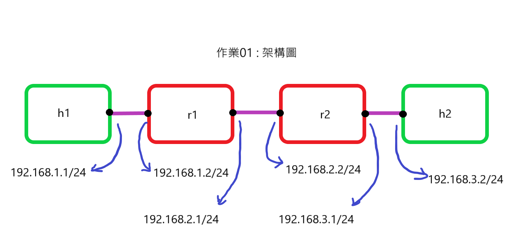
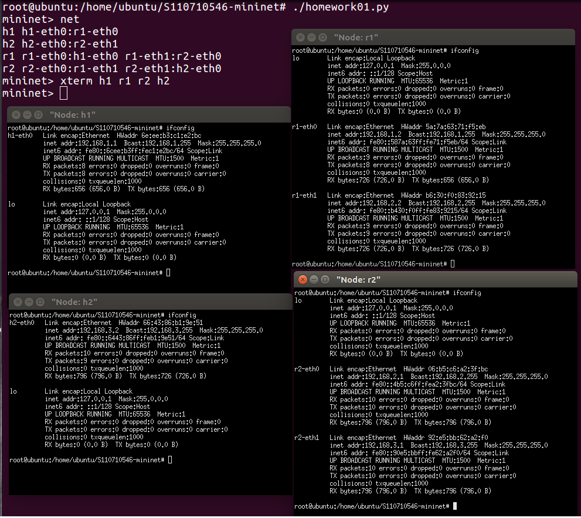
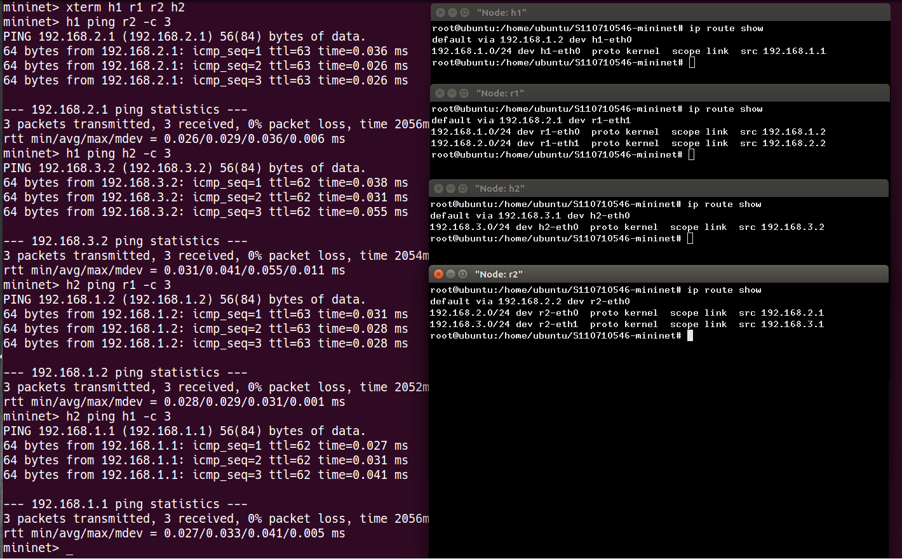

# 作業01

## 網路架構圖



## 程式碼
```
#!/usr/bin/python

from mininet.cli import CLI
from mininet.net import Mininet
from mininet.link import Link, TCLink, Intf

if '__main__'==__name__:
  net= Mininet(link=TCLink)
  h1=net.addHost('h1')
  h2=net.addHost('h2')
  r1=net.addHost('r1')
  r2=net.addHost('r2')
  Link(h1,r1)
  Link(r1,r2)
  Link(r2,h2)
  net.build()
  h1.cmd("ifconfig h1-eth0 0")
  h1.cmd("ip addr add 192.168.1.1/24 brd + dev h1-eth0")
  r1.cmd("ifconfig r1-eth0 0")
  r1.cmd("ip addr add 192.168.1.2/24 brd + dev r1-eth0")
  r1.cmd("ifconfig r1-eth1 0")
  r1.cmd("ip addr add 192.168.2.2/24 brd + dev r1-eth1")
  r2.cmd("ifconfig r2-eth0 0")
  r2.cmd("ip addr add 192.168.2.1/24 brd + dev r2-eth0")
  r2.cmd("ifconfig r2-eth1 0")
  r2.cmd("ip addr add 192.168.3.1/24 brd + dev r2-eth1")
  h2.cmd("ifconfig h2-eth0 0")
  h2.cmd("ip addr add 192.168.3.2/24 brd + dev h2-eth0")
  h1.cmd("ip route add default via 192.168.1.2")
  r1.cmd("echo 1 > /proc/sys/net/ipv4/ip_forward")
  r1.cmd("ip route add default via 192.168.2.1")
  r2.cmd("echo 1 > /proc/sys/net/ipv4/ip_forward")
  r2.cmd("ip route add default via 192.168.2.2")
  h2.cmd("ip route add default via 192.168.3.1")
  CLI(net)
  net.stop()
```

## 查看網路設定



## 測試


