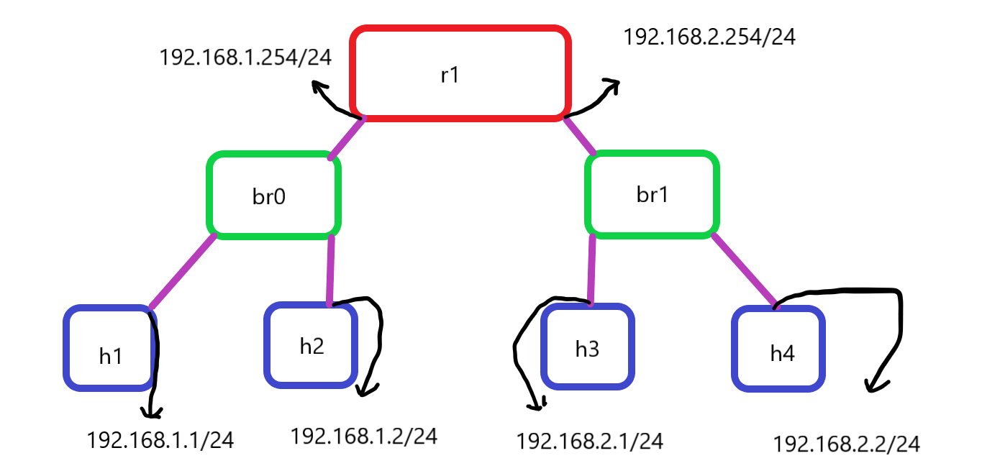
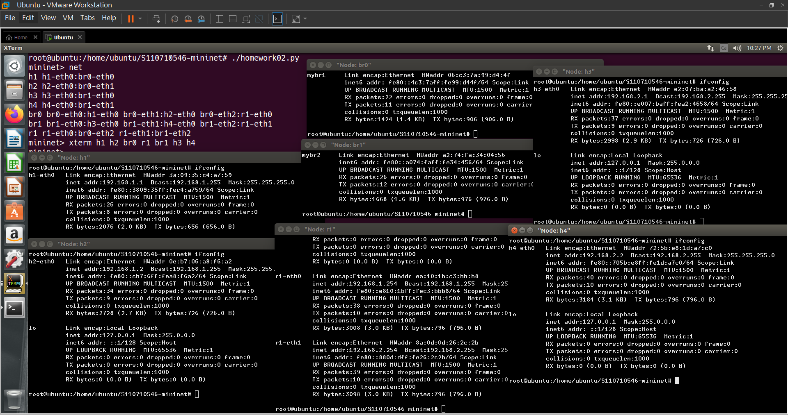
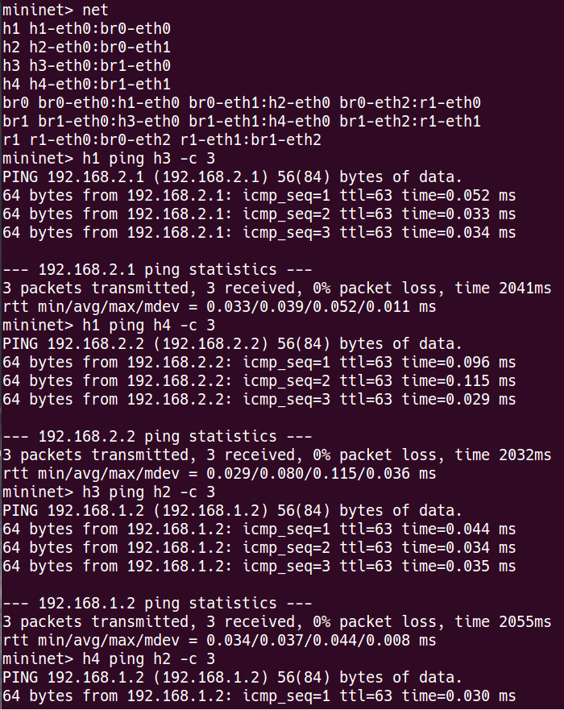

# 作業02
## 網路架構圖



## 程式碼
```
#!/usr/bin/python

from mininet.cli import CLI
from mininet.net import Mininet
from mininet.link import Link, TCLink, Intf

if '__main__'==__name__:
  net= Mininet(link=TCLink)
  h1=net.addHost('h1')
  h2=net.addHost('h2')
  h3=net.addHost('h3')
  h4=net.addHost('h4')
  br0=net.addHost('br0')
  br1=net.addHost('br1')
  r1=net.addHost('r1')
  Link(h1,br0)
  Link(h2,br0)
  Link(br0,r1)
  Link(h3,br1)
  Link(h4,br1)
  Link(br1,r1)
  net.build()
  h1.cmd("ifconfig h1-eth0 0")
  h1.cmd("ip addr add 192.168.1.1/24 brd + dev h1-eth0")
  h2.cmd("ifconfig h2-eth0 0")
  h2.cmd("ip addr add 192.168.1.2/24 brd + dev h2-eth0")
  h3.cmd("ifconfig h3-eth0 0")
  h3.cmd("ip addr add 192.168.2.1/24 brd + dev h3-eth0")
  h4.cmd("ifconfig h4-eth0 0")
  h4.cmd("ip addr add 192.168.2.2/24 brd + dev h4-eth0")
  br0.cmd("brctl addbr mybr1")
  br0.cmd("brctl addif mybr1 br0-eth0")
  br0.cmd("brctl addif mybr1 br0-eth1")
  br0.cmd("brctl addif mybr1 br0-eth2")
  br1.cmd("brctl addbr mybr2")
  br1.cmd("brctl addif mybr2 br1-eth0")
  br1.cmd("brctl addif mybr2 br1-eth1")
  br1.cmd("brctl addif mybr2 br1-eth2")
  br0.cmd("ifconfig mybr1 up")
  br1.cmd("ifconfig mybr2 up")
  r1.cmd("ifconfig r1-eth0 0")
  r1.cmd("ip addr add 192.168.1.254/24 brd + dev r1-eth0")
  r1.cmd("ifconfig r1-eth1 0")
  r1.cmd("ip addr add 192.168.2.254/24 brd + dev r1-eth1")
  r1.cmd("echo 1 > /proc/sys/net/ipv4/ip_forward")
  h1.cmd("ip route add default via 192.168.1.254")
  h2.cmd("ip route add default via 192.168.1.254")
  h3.cmd("ip route add default via 192.168.2.254")
  h4.cmd("ip route add default via 192.168.2.254")
  CLI(net)
  net.stop()
  ```

## 查看路由



## 測試

