# 這周的課程有，mininet圖形化、iperf介紹與使用、線路的設定、擷取iperf的資料、使用ettercap。
## mininet網路圖形化介面
### 1. 切到mininet的目錄中
   
* 通常在該路徑
```
root@ubuntu:/home/ubuntu# cd /home/ubuntu/mininet
```
### 2. 進到example目錄
    
    root@ubuntu:/home/ubuntu/mininet# cd examples/

### 3. 執行圖形化介面檔

    root@ubuntu:/home/ubuntu/mininet/examples# ./miniedit.py

### 4. 建構簡易網路拓樸
* 雖然這樣設定方便，但是細節設定還是得自己編譯。


---

## iperf 介紹與使用
* 我將會使用上禮拜[第三個程式](https://github.com/JesusDick/StudyNotes/tree/master/%E7%B6%B2%E8%B7%AF%E5%88%86%E6%9E%90%E8%88%87%E6%A8%A1%E6%93%AC/week04#第三個程式)，進行測試。
***iperf***最主要的目的是用來進行效能的量測、比較，
我們可以用來測試，將封包從`h1`傳到`h3`有多快，`h2`是路由。

### 1. 首先切到目錄、執行、開啟`h1`，`h3`的節點終端。

```
root@ubuntu:/home/ubuntu# cd S110710546-mininet/
root@ubuntu:/home/ubuntu/S110710546-mininet# ./3.py
mininet> xterm h1 h3
```

### 2. 設定***iperf***接收端和發送端
1. 讓`h3`成為接收端(server端)
   
* 預設似乎就是接收**TCP**，**UDP**需要特別設置`-u`的選項
```
root@ubuntu:/home/ubuntu/S110710546-mininet# iperf -s -i 1
```
> `-s` : 成為server端，也就是接收端。
> 
> `-i 1` : 每一秒的間隔，`-i` = interval(間隔)

2. 讓`h1`成為發送端(client端)
```
root@ubuntu:/home/ubuntu/S110710546-mininet# iperf -c 192.168.2.1 -t 10
```
> `-c [server IP]` : 設置為client端(發送端)，發送封包給`h3`
> 
> `-t [time]` : 封包發送的時間，假設server端設`-i 2`client端`-t 10`那就會傳送5個封包左右。

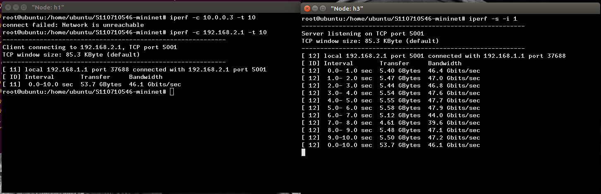

### 2-1. iperf改用UDP接收，並指定埠號和頻寬
* h3的終端機
```
root@ubuntu:/home/ubuntu/S110710546-mininet# iperf -s -i 1 -u -p 6666
```
> `-u` : 接收UDP封包
> 
> `-p [n]` : 使用指定的埠號接收，預設5001

* h1的終端機
```
root@ubuntu:/home/ubuntu/S110710546-mininet# iperf -c 192.168.2.1 -u -b 100M -t 100 -p 6666
```
> `-u` : 使用UDP的方式傳送封包。
> 
> `-b [n(M | K)]` : 當你使用UDP傳送時，需要告訴UDP要傳多快，預設1Mb。
> 
> `-p [n]` : 指定傳送的埠號。

---

## 線路的設定
* 我將從上禮拜的[第三個程式](https://github.com/JesusDick/StudyNotes/tree/master/%E7%B6%B2%E8%B7%AF%E5%88%86%E6%9E%90%E8%88%87%E6%A8%A1%E6%93%AC/week04#第三個程式)，去進行修改。
### 1. 複製
    
    root@ubuntu:/home/ubuntu/S110710546-mininet# cp 3.py 3-1.py

### 2. 編譯
    root@ubuntu:/home/ubuntu/S110710546-mininet# gedit 3-1.py
---
1. `h1r={'bw':100,'delay':'1ms','loss':0}` : 將線路參數的頻寬改成100M，延遲改成1毫秒，遺失率0%。
2. `net.addLink(h1,h2,cls=TCLink,**h1r)` : 取代原本的`Link(h1,h2)`，節點`h1`連`h2`且連接類型為**TCLink**，連接參數為`h1r`。
3. `h2r={'bw':100,'delay':'1ms','loss':0}` : 同上原理。
4. `net.addLink(h3,h2,cls=TCLink,**h2r)` : 同上原理。

```
#!/usr/bin/python

from mininet.cli import CLI
from mininet.net import Mininet
from mininet.link import Link, TCLink, Intf

if '__main__'==__name__:
  net= Mininet(link=TCLink)
  h1=net.addHost('h1')
  h2=net.addHost('h2')
  h3=net.addHost('h3')
  h1r={'bw':100,'delay':'1ms','loss':0}
  net.addLink(h1,h2,cls=TCLink,**h1r)
  h2r={'bw':100,'delay':'1ms','loss':0}
  net.addLink(h3,h2,cls=TCLink,**h2r)
  net.build()
  h1.cmd("ifconfig h1-eth0 0")
  h1.cmd("ip addr add 192.168.1.1/24 brd + dev h1-eth0")
  h2.cmd("ifconfig h2-eth0 0")
  h2.cmd("ip addr add 192.168.1.2/24 brd + dev h2-eth0")
  h2.cmd("ifconfig h2-eth1 0")
  h2.cmd("ip addr add 192.168.2.2/24 brd + dev h2-eth1")
  h3.cmd("ifconfig h3-eth0 0")
  h3.cmd("ip addr add 192.168.2.1/24 brd + dev h3-eth0")
  h1.cmd("ip route add default via 192.168.1.2")
  h3.cmd("ip route add default via 192.168.2.2")
  h2.cmd("echo 1 > /proc/sys/net/ipv4/ip_forward")
  CLI(net)
  net.stop()
```
---
### 3. 執行

    root@ubuntu:/home/ubuntu/S110710546-mininet# ./3-1.py

### 4. 開啟節點終端
    
    mininet> xterm h1 h3

### 5. 用**iperf**測試線路設定

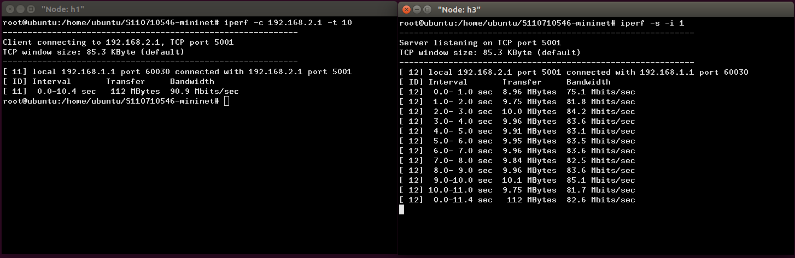

---

## 擷取iperf的資料
### 1. 執行
    
    root@ubuntu:/home/ubuntu/S110710546-mininet# ./3-1.py

### 2. 開啟節點終端

    mininet> xterm h1 h3

### 3. 導出資料數據
* 把`h3`作為接收端(server端)，並將資料數據結果導出
```
root@ubuntu:/home/ubuntu/S110710546-mininet# iperf -s -i 1 | tee result
```
> `tee [filename]` : 將結果同時輸出到螢幕和檔案

### 4. 傳送封包到接收端
* 把`h1`作為傳送端(client端)，將封包傳送至`h3`
```
root@ubuntu:/home/ubuntu/S110710546-mininet# iperf -c 192.168.2.1 -t 10
```

### 5. 擷取特定的資料數據，並導出
* 如果查結果圖，會發現我們只想要某些欄位的數據，如`Interval`欄位和`Bandwith`欄位

    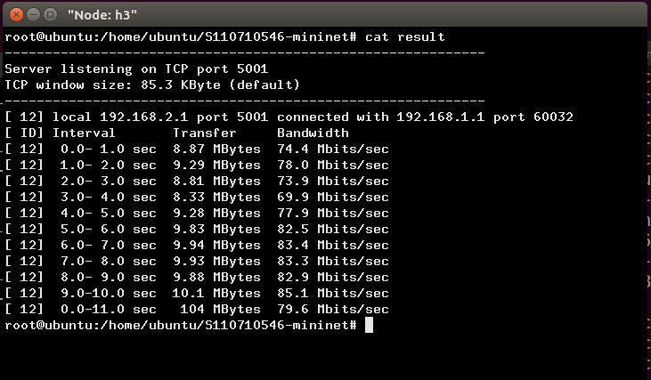

* 此操作在本機終端上操作，或節點終端上操作都可以。
```
root@ubuntu:/home/ubuntu/S110710546-mininet# cat result | grep sec | head -n 10 | tr "-" " " | awk '{print $4,$8}' > tcp
```
> `grep sec` : 把跟`sec`無關的列都過濾掉
> 
> `heand -n 10` : 只印出頭10行
> 
> `tr "-" " "` : 把`-`取代換成` `(空白)，target(`t`)、replace(`r`)
> 
> `awk '{print $4,$8}'` : 只顯示第4欄和第8欄，以空格隔開算一欄。
> 
> `> tcp` : 導出且檔名為`tcp`

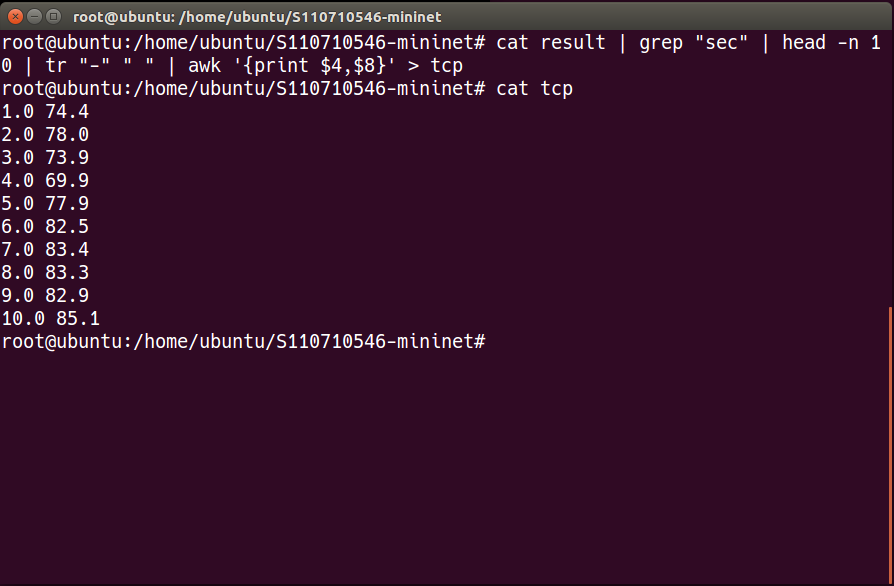

---

## 將擷取資料以圖表方式呈現

### 1. 編譯程式
    root@ubuntu:/home/ubuntu/S110710546-mininet# gedit gnuplot.plt
---
```
plot "tcp" with linespoints		#繪製tcp檔以點跟線的方式
set xlabel "time (sec)"		    #設置x軸標籤為time (sec)
set ylabel "throughput (Mbps)"	#設置y軸標籤為throughput (Mbps)
set title "TCP Flow Throughput"	#設置標題為TCP Flow Throughput
set xrange [1:10]			    #設置x軸的範圍
set xtics 1,1,10			    #設置間隔，從1到10每隔間隔為1
set yrange [0:100]			    #設置y軸的範圍
set ytics 0,10,100			    #設置間隔，從0到100每隔間隔為10
set terminal gif			    #設置為gif圖檔
set output "tcp.gif"			#輸出檔名為tcp.gif
replot
```
### 2. 執行
    
    root@ubuntu:/home/ubuntu/S110710546-mininet# gnuplot gnuplot.plt

### 3. 到該層目錄下查看


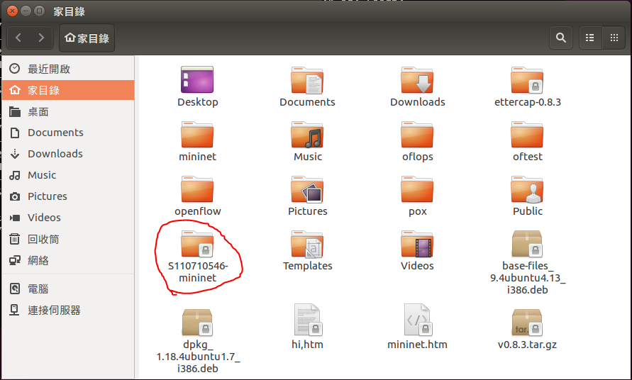

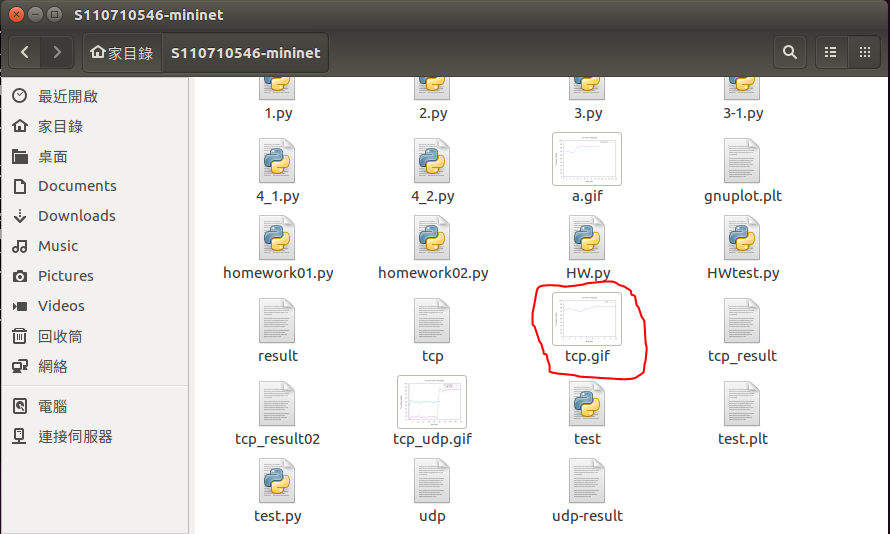

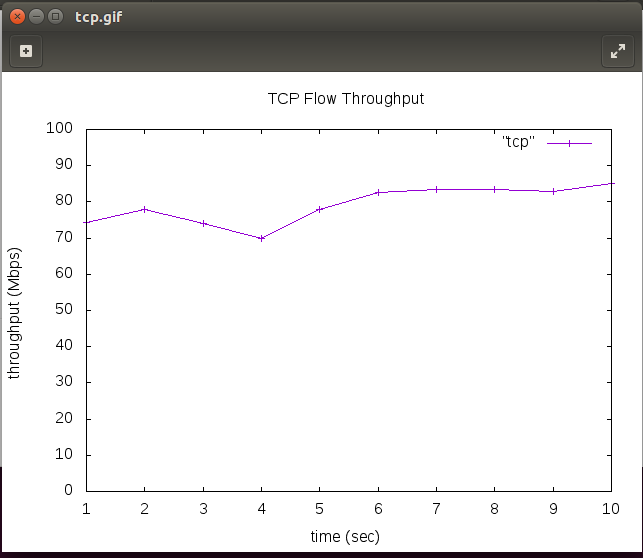

---

## 進階應用

### 1. 執行

    root@ubuntu:/home/ubuntu/S110710546-mininet# ./3-1.py

### 2. 開啟節點終端

    mininet> xterm h1 h1 h3 h3

### 3. UDP、TCP接收端配置
* h3有兩個，分別配置
```
root@ubuntu:/home/ubuntu/S110710546-mininet# iperf -s -i 1 -p 5555 | tee tcp-result
```
```
root@ubuntu:/home/ubuntu/S110710546-mininet# iperf -s -i 1 -u -p 6666 | tee udp-result
```

### 4. UDP、TCP傳送端配置
* h1有兩個分別配置，並同時開始但UDP先
```
root@ubuntu:/home/ubuntu/S110710546-mininet# iperf -c 192.168.2.1 -t 50 -p 5555
```
```
root@ubuntu:/home/ubuntu/S110710546-mininet# iperf -c 192.168.2.1 -u -b 50M -t 30 -p 6666
```

### 5. 擷取資料數據
```
root@ubuntu:/home/ubuntu/S110710546-mininet# cat tcp-result | grep sec | head -n 50 | tr "-" " " | awk '{print $4,$8}' > tcp-result02
```
```
root@ubuntu:/home/ubuntu/S110710546-mininet# cat udp-result | grep sec | grep -v out-of-order | head -n 30 | tr "-" " " | awk '{print $4,$8}' > udp-result02
```
> `grep -v out-of-order` : 將有`out-of-order`的數據行排除

### 6. 繪成圖表
* 程式碼要稍微改一下
```
plot "tcp-result02" with linespoints, "udp-result02" with linespoints
set xlabel "time (sec)"
set ylabel "throughput (Mbps)"
set title "TCP/UDP Flow Throughput"
set xrange [1:50]
set xtics 0,5,50
set yrange [0:100]
set ytics 0,10,100
set terminal gif
set output "tcp_udp.gif"
replot
```
---
    root@ubuntu:/home/ubuntu/S110710546-mininet# gnuplot gnuplot.plt

* 可以看到當UDP在跑時，TCP幾乎吃不到流量的，等到UDP跑完後TCP流量往上升。

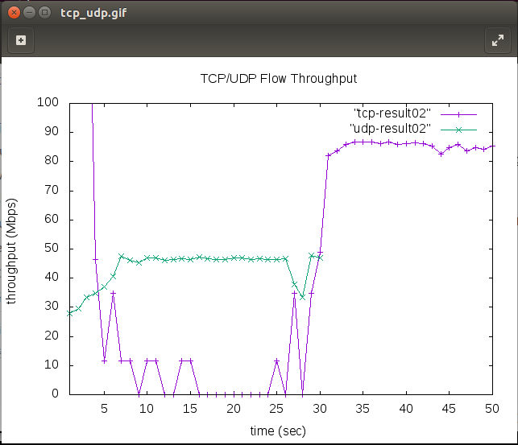

---

## 使用ettercap達到Portstealing
* 我會有1台Bridge、3台Host(h1、h2、h3)，h3扮演攻擊者

### 講解 : 
**h1** `ping` **h2**，此時 **h3** 是收不到封包的，可以用 **Portstealing** 去騙 **Bridge**，讓 **Bridge** 以為 **h3** 是 **h1** 和 **h2**，從而把封包丟給 **h3**，使用**ARP綁定** 是沒辦法防範的，因為 **h1** 的 **ARP紀錄** 是 **h2**，但 **Bridge** 沒有綁定，防範的話要讓 **Bridge** 將3台機器的 **IP + MAC位址** 給綁定起來就行了。

### 實操 :

### 1. 編譯程式

    root@ubuntu:/home/ubuntu/S110710546-mininet# gedit Portstealing.py

---
```
#!/usr/bin/python

from mininet.cli import CLI
from mininet.net import Mininet
from mininet.link import Link, TCLink, Intf

if '__main__'==__name__:
  net= Mininet(link=TCLink)
  h1=net.addHost('h1')
  h2=net.addHost('h2')
  h3=net.addHost('h3')
  br0=net.addHost('br0')
  Link(h1,br0)
  Link(h2,br0)
  Link(h3,br0)
  net.build()
  br0.cmd("brctl addbr mybr")
  br0.cmd("brctl addif mybr br0-eth0")
  br0.cmd("brctl addif mybr br0-eth1")
  br0.cmd("brctl addif mybr br0-eth2")
  #br0.cmd("brctl setageing mybr 0")
  br0.cmd("ifconfig mybr up")
  h1.cmd("ifconfig h1-eth0 0")
  h1.cmd("ip addr add 192.168.10.1/24 brd + dev h1-eth0")
  h1.cmd("ifconfig h1-eth0 hw ether 00:00:00:00:00:01")
  h2.cmd("ifconfig h2-eth0 0")
  h2.cmd("ip addr add 192.168.10.2/24 brd + dev h2-eth0")
  h2.cmd("ifconfig h2-eth0 hw ether 00:00:00:00:00:02")
  h3.cmd("ifconfig h3-eth0 0")
  h3.cmd("ip addr add 192.168.10.3/24 brd + dev h3-eth0")
  h3.cmd("ifconfig h3-eth0 hw ether 00:00:00:00:00:03")
  CLI(net)
  net.stop()
```
---
### 2. 執行
    
    root@ubuntu:/home/ubuntu/S110710546-mininet# ./Portstealing.py

### 3. 開啟節點終端

    mininet> h1 h2 h3 h3

### 4. 其中一個h3開啟wireshark監看
    
    root@ubuntu:/home/ubuntu/S110710546-mininet# wireshark

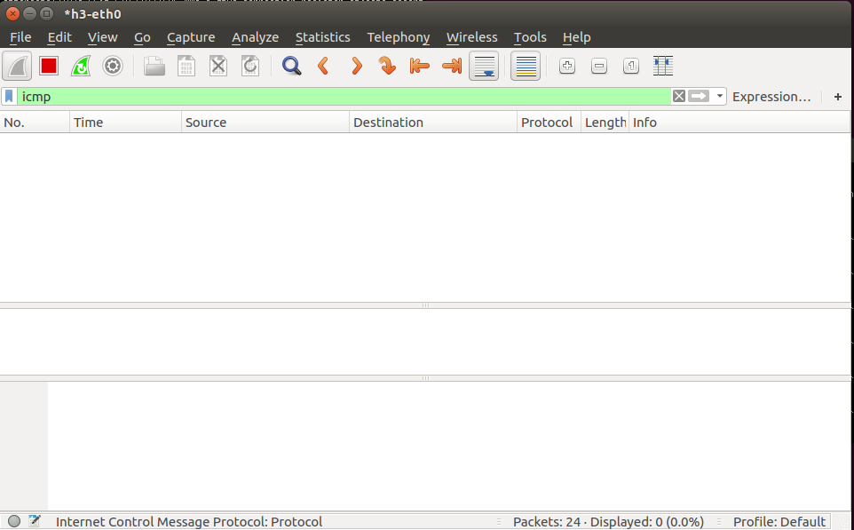

### 5. 綁定arp紀錄

* 在h1終端機上
```
root@ubuntu:/home/ubuntu/S110710546-mininet# arp -s 192.168.10.2 00:00:00:00:00:02
```
* 在h2終端機上
```
`root@ubuntu:/home/ubuntu/S110710546-mininet# arp -s 192.168.10.1 00:00:00:00:00:01
```

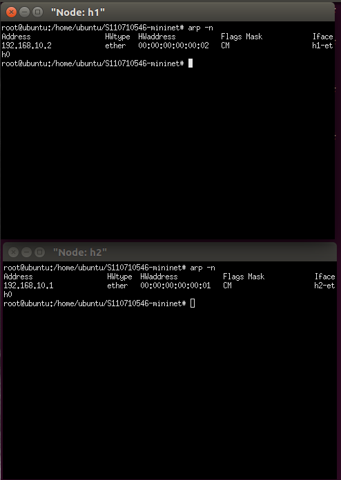

### 6. h1`ping`h2

    root@ubuntu:/home/ubuntu/S110710546-mininet# ping 192.168.10.2

### 7. h3開啟ettercap

    root@ubuntu:/home/ubuntu/S110710546-mininet# ettercap -G

### 8. 開始攻擊
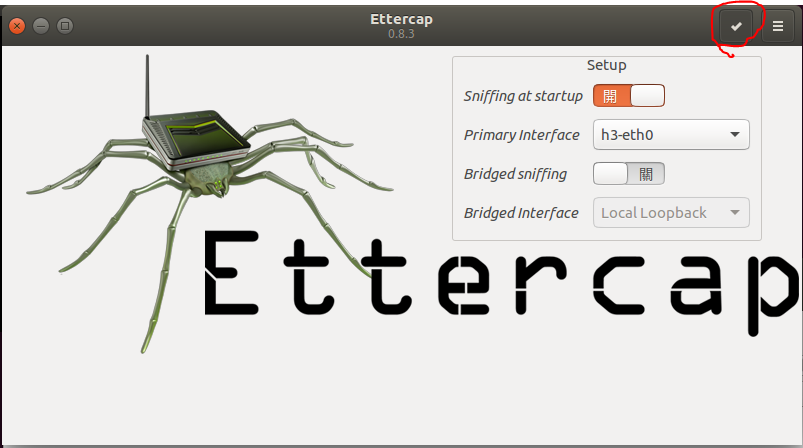

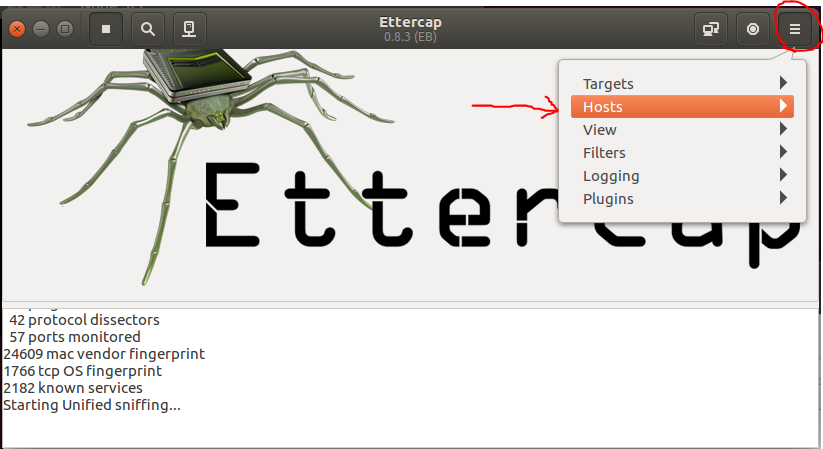

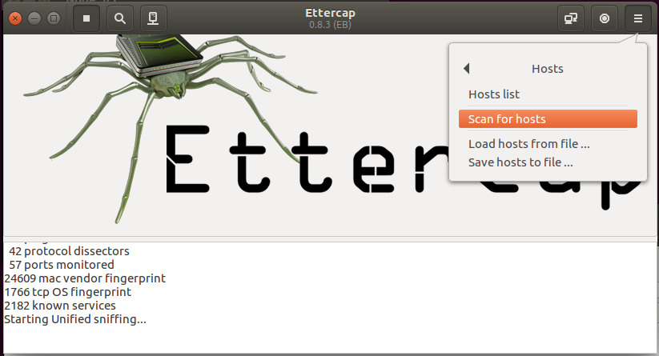

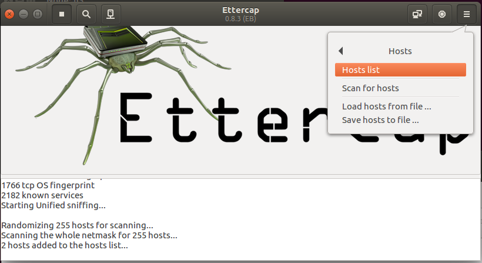

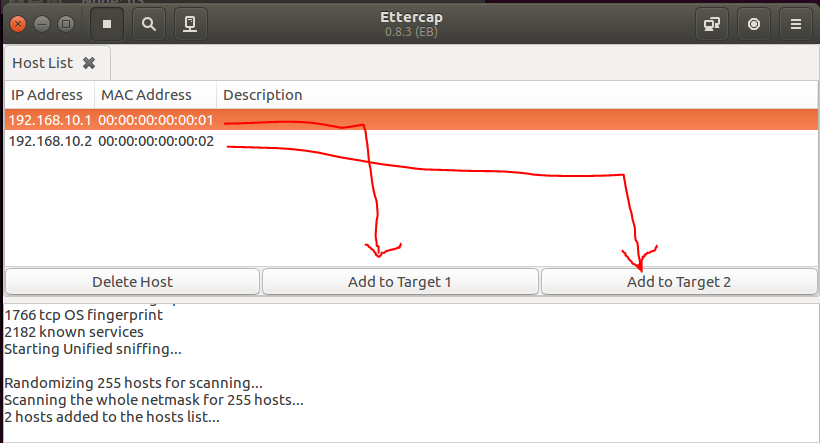

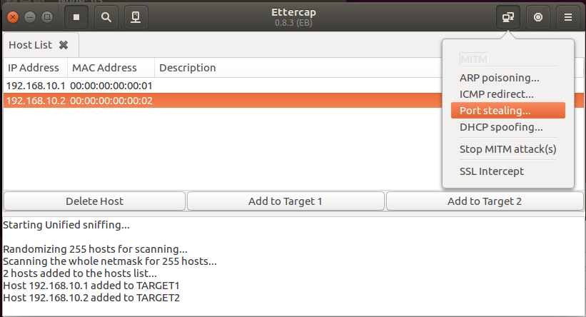

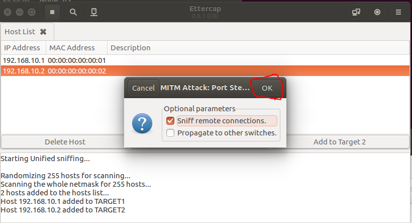

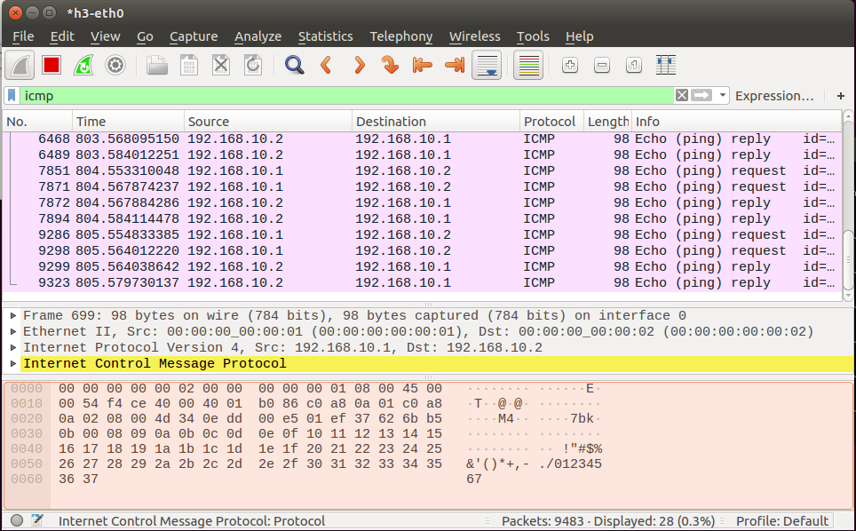