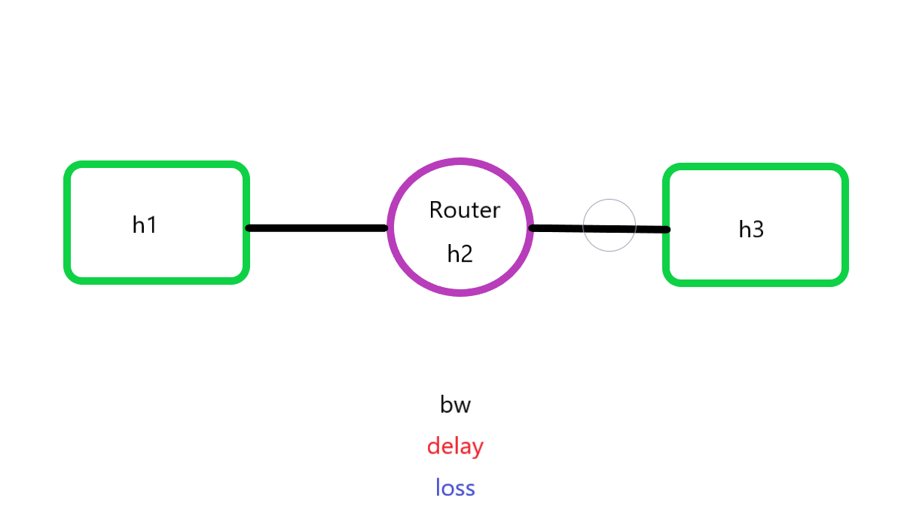
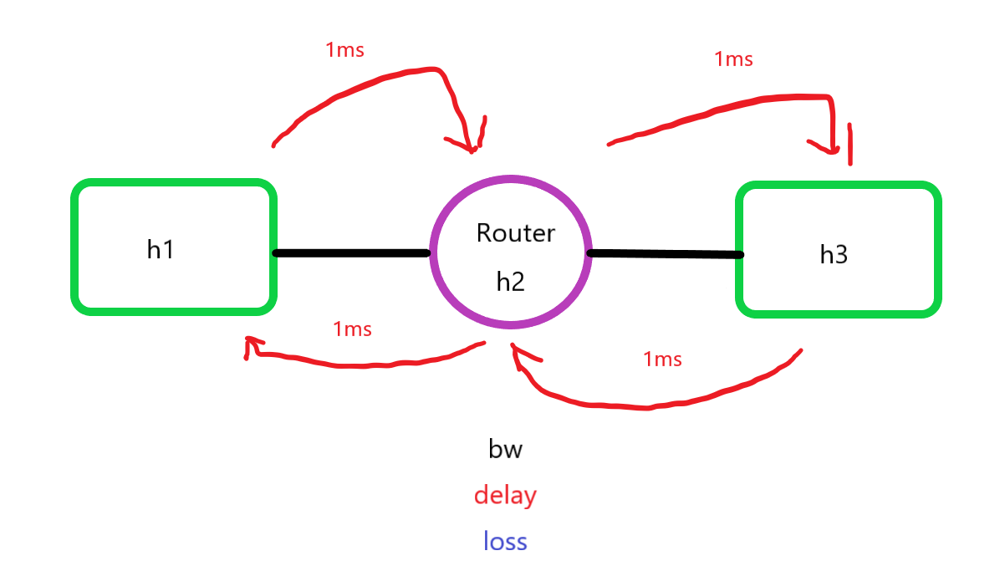
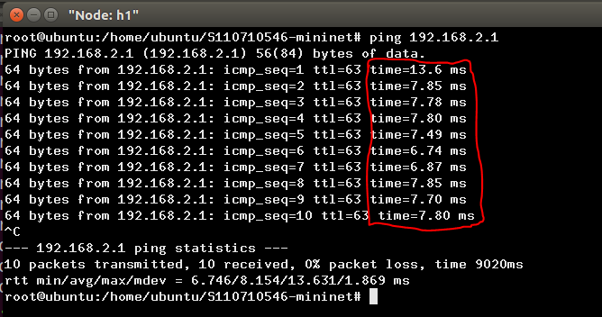
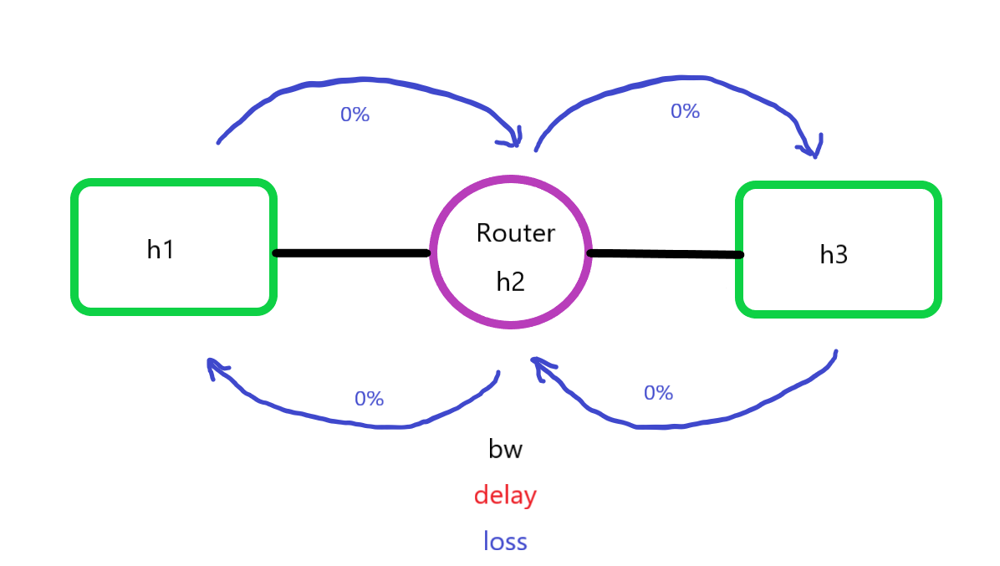
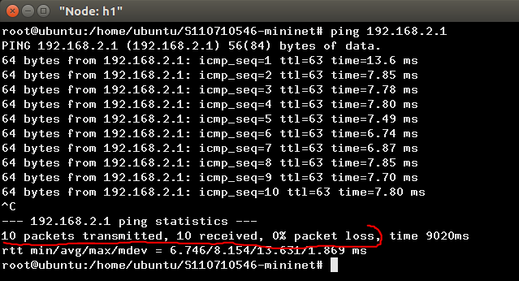

# 介紹網路設定、動態繪圖

## 網路設定的算法，以第五週的[線路設定](https://github.com/JesusDick/StudyNotes/tree/master/%E7%B6%B2%E8%B7%AF%E5%88%86%E6%9E%90%E8%88%87%E6%A8%A1%E6%93%AC/week05#%E7%B7%9A%E8%B7%AF%E7%9A%84%E8%A8%AD%E5%AE%9A)

### 網路構造圖



1. `bw` : 頻寬，也就是在該線路上可以傳輸的最大流量，設定成100Mbs通常會是接近100Mbs，並不會真的跑到100Mbs。

2. `delay` : 延遲，也就是在傳輸過程中要延遲多久才會傳到下一個節點，設定成1ms

3. `loss` : 損失，也就是到下一個節點封包的遺失率，設定成0%
    > 以影片來說，遺失率過高會造成影片嚴重失真的狀況，詳細點說的話，就是A影格的封包已送達，但B影格的封包遺失了，影格遺失將會停留在上一個畫面，如果影片中有一半畫面的影格已送達，一半畫面的影格遺失，就會造成影片不一致的狀況。

```
#!/usr/bin/python

from mininet.cli import CLI
from mininet.net import Mininet
from mininet.link import Link, TCLink, Intf

if '__main__'==__name__:
  net= Mininet(link=TCLink)
  h1=net.addHost('h1')
  h2=net.addHost('h2')
  h3=net.addHost('h3')
  h1r={'bw':100,'delay':'1ms','loss':0}
  net.addLink(h1,h2,cls=TCLink,**h1r)
  h2r={'bw':100,'delay':'1ms','loss':0}
  net.addLink(h3,h2,cls=TCLink,**h2r)
  net.build()
  h1.cmd("ifconfig h1-eth0 0")
  h1.cmd("ip addr add 192.168.1.1/24 brd + dev h1-eth0")
  h2.cmd("ifconfig h2-eth0 0")
  h2.cmd("ip addr add 192.168.1.2/24 brd + dev h2-eth0")
  h2.cmd("ifconfig h2-eth1 0")
  h2.cmd("ip addr add 192.168.2.2/24 brd + dev h2-eth1")
  h3.cmd("ifconfig h3-eth0 0")
  h3.cmd("ip addr add 192.168.2.1/24 brd + dev h3-eth0")
  h1.cmd("ip route add default via 192.168.1.2")
  h3.cmd("ip route add default via 192.168.2.2")
  h2.cmd("echo 1 > /proc/sys/net/ipv4/ip_forward")
  CLI(net)
  net.stop()
```
---
### delay的過程如下圖



因為設定成1ms，所以至少會延遲4ms，才會收到回來的包
在傳輸過程中會有***propagation delay(傳播延遲)***、***queuing delay(排隊時延)***、***processing time(處理時間)***

1. ***propagation delay(傳播延遲)*** : 基本上就是我們代碼內的設定1ms

2. ***queuing delay(排隊時延)*** : 一個封包進入到該節點時，必須等待前一個封包被傳遞出去，如果該節點內的封包過多，就會造成queuing delay延遲越嚴重

3. ***processing time(處理時間)*** : [此解釋看維基百科會比較好](https://en.wikipedia.org/wiki/Processing_delay)
> 而以上這些延遲，就衍生DDos攻擊，簡單來說就是在同一時點，發出大量封包到某個節點，因節點要處理傳播、排隊、處理等延遲，所以該節點封包會越來越多造成該節點崩潰。



---

### loss過程如下圖



因為設定成 **0%**，所以封包的傳送和收到基本上會是100%，但 **router節點** 有所謂的 ***queue(佇列)***，當該 **router節點** 內的封包過多，就會被丟棄。



#### <center>將loss率改為10%</center>

如果將h1到h2、h3到h2的loss設定10%，當我傳送1000個封包，平均會收到656個封包左右。

1. 成功率公式 : 1 X (1-遺失率)，每經過一個傳輸過程都必須套用該公式
2. 遺失率公式 : 1 - 成功率
* 指令 : `ping 192.168.2.1 -c 1000 -f`，如果用一般的ping會等到天荒地老。


## 動態繪圖
* 以下指令為刪除空白行，。
* `sed -i '/^$/d' process.sh`
#### 1. 編譯`process.sh`檔
`root@ubuntu:/home/ubuntu/S110710546-mininet# gedit process.sh`
---

```
filename='a'	#將`a`檔中的資料，儲存在`filename`變數裡面。
> result		#清除`result`檔裡面的資料
> a		#清除`a`檔裡面的資料
b="not"
while true
do
   if [ -s "$filename" ]	#讀取`filename`檔有沒有內容，若有為真則繼續往下執行。
   then
        #echo "$filename is NOT empty file."
        while IFS= read -r line	#讀取`filename`內的每一列資料
        do
          result=`echo "$line" | grep "sec"`	#把每一列沒有`sec`字串的資料過濾掉，並且存到`result`變數內。
          if [[ -n $result ]]	#若`result`有內容，`b = 'done'`並跳出迴圈
          then
            #echo $result
            b="done"
            break
          fi
        done < a
   fi

   if [ $b = "done" ]
   then
     break
   fi
done

while IFS= read -r line
do
  #進一步擷取，並儲存在`result`變數內。
  result=`echo "$line" | grep "sec" | tr "-" " " | awk '{print $4,$8}'`
  if [[ -n $result ]]	#如果`result`為真，繼續執行。
  then
    echo $result	#印出`result`內容。
    echo $result >> result	#將印出的內容，儲存檔名為`result`的檔內。
    sleep 1
  fi
done < a
```

#### 2. 編譯`plot-throughput.sh`檔
* 此檔案在判斷`result`內有沒有東西，如果`result`內沒東西，就畫圖會出現錯誤。
`root@ubuntu:/home/ubuntu/S110710546-mininet# gedit plot-throughput.sh`
---
```
filename='result'
while true
do
   if [ -s "$filename" ]
   then
        #echo "$filename is NOT empty file."
        break
   fi
done

gnuplot gnuplot-plot
```

#### 3. 編譯`gnuplot-plot`檔
`root@ubuntu:/home/ubuntu/S110710546-mininet# gedit gnuplot-plot`
---
`plot FILE u 1:2 every ::lPnts w lp pt 7` : 繪出`result`內容，使用第1行和第2行，lp : 用點跟線的方式繪圖，`pt 7`為點的顆粒大小為7
```
FILE = 'result'
stop = 0

N = 10
set yrange [0:100]
set ytics 0,10,100
set key off
set xlabel "time(sec)"
set ylabel "Throughput(Mbps)"

while (!stop){
    pause 0.1
    stats [*:*][*:*] FILE u 0 nooutput
    lPnts=STATS_records<N ? 0: STATS_records-N
    plot FILE u 1:2 every ::lPnts w lp pt 7
}
```

#### 4. 執行線路設定檔(3-1.py)
`root@ubuntu:/home/ubuntu/S110710546-mininet# ./3-1.py`
#### 5. 啟動節點終端
`mininet> xterm h1 h3 h3 h3`
* 在其中一個h3執行`process.sh`
`root@ubuntu:/home/ubuntu/S110710546-mininet# ./process.sh`
* 在其中一個h3執行`plot-throughput.sh`
`root@ubuntu:/home/ubuntu/S110710546-mininet# ./plot-throughput.sh`
* 在最後一個此h3接收數據資料
> 將接收到的資料儲存到檔名 : `a` 的檔案。
`root@ubuntu:/home/ubuntu/S110710546-mininet# iperf -s -i 1 > a`
* 在h1傳送測試封包
`root@ubuntu:/home/ubuntu/S110710546-mininet# iperf -c 192.168.2.1 -t 100`

#### 5. 成功之後的畫面


### linux核心介紹
1. 先到官網下載linux kernal
`wget https://cdn.kernel.org/pub/linux/kernel/v5.x/linux-5.15.32.tar.xz`
*如果不能下載可以輸入以下指令，並重新開機(`reboot`)。
`echo 'supersede domain-name-servers 8.8.8.8, 8.8.4.4;' >> /etc/dhcp/dhclient.conf`
2. 解壓縮包
`tar xfJ linux-5.15.32.tar.xz`
3. 進入核心檔
`cd linux-5.15.32`
4. 核心檔介紹
`arch` : 該檔案存放許多種CPU指令集架構，如***x86***、***arm64***、***arm***等等，表示linux支援很多種架構。
`fs` : 該檔案存放很多檔案系統，如***ext2***、***fat***、***exfat***，表示linux支援多種檔案系統。
`mm` : 稱為記憶體管理(memory management)，有關記憶體的配置都在該檔案內。
5. 編輯核心配置
* 可以先檢查自己的核心，使用 : `uname -r`
`cp /boot/config-4.15.0-142-generic .config` : 表示拿當前核心的配置，當作目前我要編譯的核心的預設配置
`make menuconfig` : 使用該指令來編譯核心。

[更詳細的內容說明可以點我](https://wiki.gentoo.org/wiki/Kernel/Configuration/zh-cn)

### 創建虛擬區域網路
1. 加載8021q模組
`modprobe 8021q`
* 查看加載的模組
`lsmod`
* 移除模組
`rmmod [模組名]`
2. 下載vlan
`apt install vlan`
3. 編譯mininet網路環境
`gedit vlan.py`
---
```
#!/usr/bin/env python
from mininet.cli import CLI
from mininet.net import Mininet
from mininet.link import Link,TCLink,Intf

if '__main__' == __name__:
  net = Mininet(link=TCLink)
  h1 = net.addHost('h1')
  h2 = net.addHost('h2')
  h3 = net.addHost('h3')
  h4 = net.addHost('h4')
  br1 = net.addHost('br1')
  r1 = net.addHost('r1')
  net.addLink(h1, br1)
  net.addLink(h2, br1)
  net.addLink(h3, br1)
  net.addLink(h4, br1)
  net.addLink(br1,r1)
  net.build()
  h1.cmd("ifconfig h1-eth0 0")
  h2.cmd("ifconfig h2-eth0 0")
  h3.cmd("ifconfig h3-eth0 0")
  h4.cmd("ifconfig h4-eth0 0")
  r1.cmd("ifconfig r1-eth0 0")
  br1.cmd("ifconfig br1-eth0 0")
  br1.cmd("ifconfig br1-eth1 0")
  br1.cmd("ifconfig br1-eth2 0")
  br1.cmd("ifconfig br1-eth3 0")
  br1.cmd("ifconfig br1-eth4 0")
  br1.cmd("vconfig add br1-eth4 10")
  br1.cmd("vconfig add br1-eth4 20")
  r1.cmd("vconfig add r1-eth0 10")
  r1.cmd("vconfig add r1-eth0 20")
  br1.cmd("brctl addbr mybr10")
  br1.cmd("brctl addbr mybr20")
  br1.cmd("brctl addif mybr10 br1-eth0")
  br1.cmd("brctl addif mybr10 br1-eth1")
  br1.cmd("brctl addif mybr10 br1-eth4.10")
  br1.cmd("brctl addif mybr20 br1-eth2")
  br1.cmd("brctl addif mybr20 br1-eth3")
  br1.cmd("brctl addif mybr20 br1-eth4.20")
  br1.cmd("ifconfig br1-eth4.10 up")
  br1.cmd("ifconfig br1-eth4.20 up")
  r1.cmd("ifconfig r1-eth0.10 up")
  r1.cmd("ifconfig r1-eth0.20 up")
  br1.cmd("ifconfig mybr10 up")
  br1.cmd("ifconfig mybr20 up")
  r1.cmd('ifconfig r1-eth0.10 192.168.10.254 netmask 255.255.255.0')
  r1.cmd('ifconfig r1-eth0.20 192.168.20.254 netmask 255.255.255.0')
  r1.cmd("echo 1 > /proc/sys/net/ipv4/ip_forward")
  h1.cmd("ip address add 192.168.10.1/24 dev h1-eth0")
  h1.cmd("ip route add default via 192.168.10.254")
  h2.cmd("ip address add 192.168.10.2/24 dev h2-eth0")
  h2.cmd("ip route add default via 192.168.10.254")
  h3.cmd("ip address add 192.168.20.1/24 dev h3-eth0")
  h3.cmd("ip route add default via 192.168.20.254")
  h4.cmd("ip address add 192.168.20.2/24 dev h4-eth0")
  h4.cmd("ip route add default via 192.168.20.254")
  CLI(net)
  net.stop()

```


