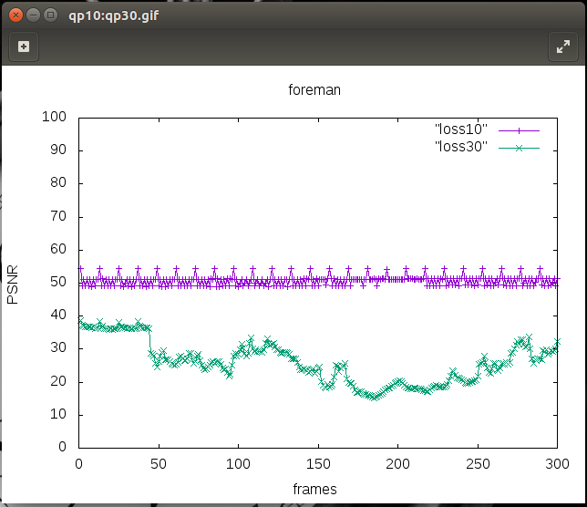
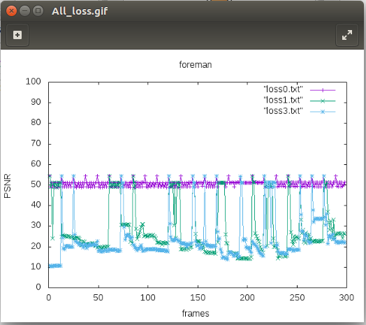

# 影像的傳輸
## FFMPEG 影像傳輸
***FFMPEG*** : 

1. 可以用作影像的壓縮。
2. 可以用作影像的串流。
3. 也可以用作影像的接收。

### 1. 安裝FFMPEG
* 當下載了 ***FFMPEG***，它也同時下載了 **ffplay**，
這功能可以在傳送影像的同時，即時輸出影像察看結果。
```
apt install ffmpeg -y
```

### 2. 下載測試用影片
1. 到該網址[https://media.xiph.org/video/derf/](https://media.xiph.org/video/derf/)
	* 做實驗時還是以較早期的影片拿來做壓縮和串流，
	因為拿高解析度的影片，壓縮時會耗費較多時間，傳輸時也需要耗費大量頻寬。

2. 複製 **foreman** 底下的 ***CIF*** 連結
   * 我是用 **foreman** ，看你自己要用什麼影片，但通常影像的 **frames** 越高，影片播放越久。


3. 下載到虛擬機上 
```
wget https://media.xiph.org/video/derf/y4m/foreman_cif.y4m
```

4. 轉換成 ***yuv*** 格式
```
ffmpeg -i foreman_cif.y4m foreman_cif.yuv
```

* ### 解說2-2小節
通用影像傳輸格式(Common Intermediate Format) :
1. ***SQCIF*** : 128 × 96 ; 影像解析度
2. ***QCIF*** : 176 × 144 ; 影像解析度
3. ***CIF*** : 352 × 288 ; 影像解析度
4. ***4CIF*** : 704 × 576 ; 影像解析度
5. ***16CIF*** : 1408 × 1152 ; 影像解析度

    [更多 CIF 資訊可以點我](https://zh.wikipedia.org/wiki/%E9%80%9A%E7%94%A8%E5%BD%B1%E5%83%8F%E5%82%B3%E8%BC%B8%E6%A0%BC%E5%BC%8F)

* ### 解說2-4小節
YUV : 
是一種顏色編碼的方法，如果直接對 ***RGB*** 進行影像的壓縮或傳輸，可能會造成太大的負擔，所以 ***YUV*** 會對每個 ***RGB*** 進行 **明亮度**、**彩度** 的轉換，
達到降低負擔。

> **Y** : 表示明亮度
>
> **U** : 表示色度
>
> **V** : 表示濃度
> 
[更詳細的 YUV 可以點我](https://zh.wikipedia.org/wiki/YUV)
* *小補充 : 在黑白影像中，因為沒有 UV， 所以Y就代表黑白影像的 RGB，這也就表示 RGB 是可以轉為黑白影像的*。

### 3. 對影像壓縮
* 對 **foreman** 影片做`-qp`質不同的壓縮，`-qp`值越高壓出來的影像顆粒感越嚴重。
```
ffmpeg -f rawvideo  -s:v 352x288 -r 30 -i foreman_cif.yuv -c:v libx264 -qp 30 -g 12 -bf 2 -f mpeg foreman_qp30.mp4
```
```
ffmpeg -f rawvideo  -s:v 352x288 -r 30 -i foreman_cif.yuv -c:v libx264 -qp 10 -g 12 -bf 2 -f mpeg foreman_qp10.mp4
```
1. `-f rawvideo` : 格式為原始影像
2. `-s:v 352x288` : 指定格式為 **352x288**
3. `-r 30` : 每秒播放 **30** 個畫面
4. `-i foreman_cif.y4m` : 目標文件為 *foreman_cif.y4m*
5. `-c:v libx264` : 影像壓縮格式
6. `-qp 30` : 壓縮比為 **30**，數值越高檔案越小畫質越不好。

### 4. 播放壓縮過的影像
```
ffplay foreman_qp10.mp4
```
```
ffplay foreman_qp30.mp4
```


## 比較壓縮影像
### 1. 對壓縮影像還原
```
ffmpeg -i foreman_qp30.mp4 qp30.yuv
```
```
ffmpeg -i foreman_qp10.mp4 qp10.yuv
```
### 2. 下載pnsr.c
1. 編譯 psnr.c
```
gcc -o psnr psnr.c -lm
```
> `-lm` : **l** 是連接到函示庫，**m** 是<math.h>的函示庫。

### 3. 使用 **psnr** 對畫面進行比較
***psnr*** : 拿原畫面的像素，和壓縮過的新畫面的像素，進行一格一格像素差距的比較，如果 ***psnr*** 算出來的質越大，表示新畫面越接近原畫面，也就是失真率越小。
```
./psnr 352 288 420 foreman_cif.yuv qp10.yuv | tee qp10.txt
```
```
./psnr 352 288 420 foreman_cif.yuv qp30.yuv | tee qp30.txt
```

### 4. 使用 **gnuplot** 繪圖
1. 編寫 **gnuplot** 代碼
```
gedit gnuplot.plt
```
---
```
plot "qp10.txt" with linespoints, "qp30.txt" with linespoints
set xlabel "frames"
set ylabel "PSNR"
set title "foreman"
set yrange [0:100]
set ytics 0,10,100
set terminal gif
set output "qp10:qp30.gif"
replot
```
2. 執行
```
gnuplot gnuplot.plt
```


## 串流影像(UDP)
* ### 我將使用 **[week05的線路設定](https://github.com/JesusDick/StudyNotes/tree/master/%E7%B6%B2%E8%B7%AF%E5%88%86%E6%9E%90%E8%88%87%E6%A8%A1%E6%93%AC/week05#%E7%B7%9A%E8%B7%AF%E7%9A%84%E8%A8%AD%E5%AE%9A)** 去進行實驗。
### 1. 執行程式
```
./3-1.py
```
### 2. 開啟節點終端
```
mininet> xterm h1 h3
```
### 3. h3當作接收端
```
ffplay -i udp://192.168.2.1:1234
```
### 4. h1當作傳送端
```
ffplay -re -i foreman_qp10.mp4 -c copy -f mpegts udp://192.168.2.1:1234
```

## 進階串流
* ### 將更改 **3-1.py** 的`loss`值，並分別查看其差異
### 1. **3-1.py** 的`loss`值為 **0**
1. 複製 **3-1.py**
* 因為原本的`loss`值就是 **0**，所以不用改
```
cp 3-1.py 3-loss0.py
```
2. 執行
```
mininet> xterm h3 h1
```
3. h3當作接收端
```
ffmpeg -i udp://192.168.2.1:1234 -c copy loss0.ts
```
4. h1當作傳送端
```
ffmpeg -re -i foreman_qp10.mp4 -c copy -f mpegts udp://192.168.2.1:1234
```
5. 播放查看
```
ffplay loss0.ts
```

### 2.  **3-1.py** 的`loss`值為 **1**
1. 複製 **3-1.py**
```
cp 3-1.py 3-loss1.py
```
2. 改寫 `loss` 值
```
gedit 3-loss1.py
```
```
h1r={'bw':100,'delay':'1ms','loss':1}
```
3. 執行
```
mininet> xterm h3 h1
```
4. h3當作接收端
```
ffmpeg -i udp://192.168.2.1:1234 -c copy loss1.ts
```
5. h1當作傳送端
```
ffmpeg -re -i foreman_qp10.mp4 -c copy -f mpegts udp://192.168.2.1:1234
```
6. 播放查看
```
ffplay loss1.ts
```

### 3. **3-1.py** 的`loss`值為 **1**
1. 複製 **3-1.py**
```
cp 3-1.py 3-loss3.py
```
2. 改寫 `loss` 值
```
gedit 3-loss3.py
```
```
h1r={'bw':100,'delay':'1ms','loss':3}
```
3. 執行
```
mininet> xterm h3 h1
```
4. h3當作接收端
```
ffmpeg -i udp://192.168.2.1:1234 -c copy loss1.ts
```
5. h1當作傳送端
```
ffmpeg -re -i foreman_qp10.mp4 -c copy -f mpegts udp://192.168.2.1:1234
```
6. 播放查看
```
ffplay loss3.ts
```

### 4. 從 ***.ts*** 檔轉為 ***.yuv***
1. loss0.ts => loss0.yuv
```
ffmpeg -i loss0.ts loss0.yuv
```
2. loss1.ts => loss1.yuv
```
ffmpeg -i loss1.ts loss1.yuv
```
3. loss3.ts => loss3.yuv
```
ffmpeg -i loss3.ts loss3.yuv
```

### 5. 使用 ***psnr*** 對各個 `loss` 值做比對
1. loss0.yuv 比對
```
./psnr 352 288 420 foreman_cif.yuv loss0.yuv | tee loss0.txt
```
2. loss1.yuv 比對
```
./psnr 352 288 420 foreman_cif.yuv loss1.yuv | tee loss1.txt
```
3. loss3.yuv 比對
```
./psnr 352 288 420 foreman_cif.yuv loss3.yuv | tee loss3.txt
```

### 6. 使用 **gnuplot** 繪出差異
1. 修改 **gnuplot.plt**
```
gedit gnuplot.plt
```
---
```
plot "loss0.txt" with linespoints, "loss1.txt" with linespoints, "loss3.txt" with linespoints
set xlabel "frames"
set ylabel "PSNR"
set title "foreman"
set yrange [0:100]
set ytics 0,10,100
set terminal gif
set output "All_loss.gif"
replot
```
2. 執行繪圖程式
```
gnuplot gnuplot.plt
```
3. 結果圖
