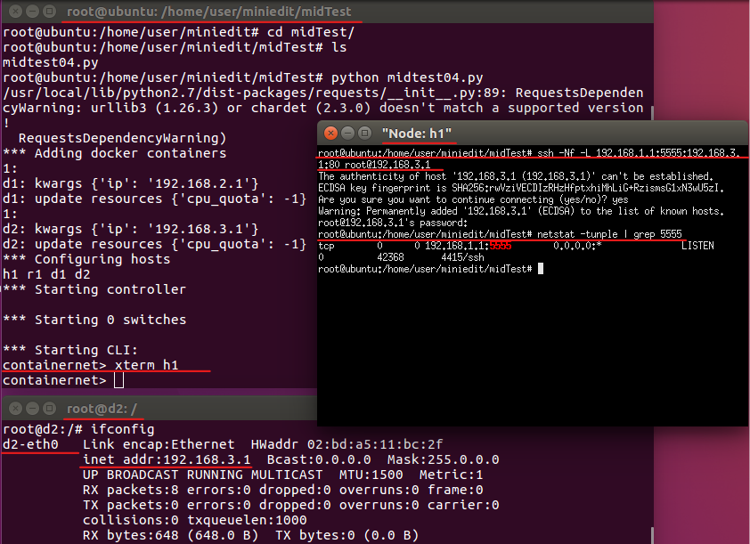

# 期中習題

## 題1. 將下圖拓撲以靜態路由的方式連接

### 以下為我的第一題代碼
* 附註 : 如果有相同的語法結構，我只會抽出一個單獨講解，因為其他相同的語法結構原理一樣。
1. `r1.cmd("ip route add 192.168.2.0/24 via 10.10.2.2")` : 代表當有封包傳到 **r1**，若封包的目的地是到 `192.168.2.0/24` 的區域網路中，就傳給`10.10.2.2`，
	這 **IP** 是 **r2** 網路介面卡為 `eth1` 的 **IP**，所以封包會傳給 **r2**。
2. ` r1.cmd("echo 1 > /proc/sys/net/ipv4/ip_forward")` : 開啟 **r1** 的路由功能，沒開啟是不會轉發封包的。
```
#!/usr/bin/python

from mininet.cli import CLI
from mininet.net import Mininet
from mininet.link import Link, TCLink, Intf

if '__main__'==__name__:
  net= Mininet(link=TCLink)
  h1=net.addHost('h1')
  h2=net.addHost('h2')
  r1=net.addHost('r1')
  r2=net.addHost('r2')
  r3=net.addHost('r3')
  Link(h1,r1)
  Link(r1,r2)
  Link(r1,r3)
  Link(r2,r3)
  Link(h2,r3)
  net.build()
  h1.cmd("ifconfig h1-eth0 0")
  h1.cmd("ip addr add 192.168.1.1/24 brd + dev h1-eth0")
  h1.cmd("ip route add default via 192.168.1.254")
  h2.cmd("ifconfig h2-eth0 0")
  h2.cmd("ip addr add 192.168.2.1/24 brd + dev h2-eth0")
  h2.cmd("ip route add default via 192.168.2.254")

  r1.cmd("ifconfig r1-eth0 0")
  r1.cmd("ip addr add 192.168.1.254/24 brd + dev r1-eth0")
  r1.cmd("ifconfig r1-eth1 0")
  r1.cmd("ip addr add 10.10.2.1/24 brd + dev r1-eth1")
  r1.cmd("ifconfig r1-eth2 0")
  r1.cmd("ip addr add 10.10.3.1/24 brd + dev r1-eth2")

  r2.cmd("ifconfig r2-eth0 0")
  r2.cmd("ip addr add 10.10.2.2/24 brd + dev r2-eth0")
  r2.cmd("ifconfig r2-eth1 0")
  r2.cmd("ip addr add 10.20.3.2/24 brd + dev r2-eth1")

  r3.cmd("ifconfig r3-eth0 0")
  r3.cmd("ip addr add 10.10.3.2/24 brd + dev r3-eth0")
  r3.cmd("ifconfig r3-eth1 0")
  r3.cmd("ip addr add 10.20.3.1/24 brd + dev r3-eth1")
  r3.cmd("ifconfig r3-eth2 0")
  r3.cmd("ip addr add 192.168.2.254/24 brd + dev r3-eth2")

  r1.cmd("ip route add 192.168.2.0/24 via 10.10.2.2")
  r2.cmd("ip route add 192.168.2.0/24 via 10.20.3.1")
  r3.cmd("ip route add 192.168.1.0/24 via 10.20.3.2")
  r2.cmd("ip route add 192.168.1.0/24 via 10.10.2.1")

  r1.cmd("echo 1 > /proc/sys/net/ipv4/ip_forward")
  r2.cmd("echo 1 > /proc/sys/net/ipv4/ip_forward")
  r3.cmd("echo 1 > /proc/sys/net/ipv4/ip_forward")

  CLI(net)
  net.stop()
```

## 題2. 使用 **Trunk技術** ，將下圖拓撲串接

### 說明 :
可以把 **Trunk技術**，想像成專用電話，也就是某些特定的號碼，只能跟某個特定的電話相通，
假如 **h1辦公室** 想打給 **h3辦公室**，就打 `123` 電話號碼，但 **h2辦公室** 打 `123` 是打不通到 **h3辦公室**，
因為 `123` 這電話號碼，被設定成只專用於 **h1辦公室** 和 **h3辦公室** 的連通；那同理上圖的拓撲，
**h1** 只能 `ping` 到 **h3**，**h1** 無法 `ping` 到 **h2**、**h4**，反之 **h2** 只能 `ping` 到 **h4**。


### 以下為我的第二題代碼
* 附註 : 必須安装 **vlan(vconfig)** 和加載 **8021q模塊**。
1. `br0.cmd("vconfig add br0-eth2 10")` : 創建虛擬乙太網路設備，到 **br0** 的網路介面 `br0-eth2` 中，該虛擬乙太網路的 `id` 為 `10`。
2. `br0.cmd("brctl addbr mybr10")` : 為 **br0** 機器增加網橋(`mybr10`)。
3. `br0.cmd("brctl addif mybr10 br0-eth2.10")` : 將虛擬乙太網路(`br0-eth2 10`)，加到網橋(`mybr10`)當中。
4. `br0.cmd("ifconfig br0-eth2.10 up")` : 啟動網路介面功能否則無法接收封包。
```
#!/usr/bin/python

from mininet.cli import CLI
from mininet.net import Mininet
from mininet.link import Link, TCLink, Intf

if '__main__'==__name__:
  net= Mininet(link=TCLink)
  h1=net.addHost('h1')
  h2=net.addHost('h2')
  h3=net.addHost('h3')
  h4=net.addHost('h4')
  br0=net.addHost('br0')
  br1=net.addHost('br1')
  Link(h1,br0)
  Link(h2,br0)
  Link(h3,br1)
  Link(h4,br1)
  Link(br0,br1)
  net.build()
  br0.cmd("ifconfig br0-eth0 0")
  br0.cmd("ifconfig br0-eth1 0")
  br0.cmd("vconfig add br0-eth2 10")
  br0.cmd("vconfig add br0-eth2 20")
  br0.cmd("brctl addbr mybr10")
  br0.cmd("brctl addbr mybr20")
  br0.cmd("brctl addif mybr10 br0-eth0")
  br0.cmd("brctl addif mybr20 br0-eth1")
  br0.cmd("brctl addif mybr10 br0-eth2.10")
  br0.cmd("brctl addif mybr20 br0-eth2.20")
  br0.cmd("ifconfig br0-eth2.10 up")
  br0.cmd("ifconfig br0-eth2.20 up")
  #br0.cmd("brctl setageing mybr 0")
  br1.cmd("ifconfig br1-eth0 0")
  br1.cmd("ifconfig br1-eth1 0")
  br1.cmd("vconfig add br1-eth2 10")
  br1.cmd("vconfig add br1-eth2 20")
  br1.cmd("brctl addbr mybr10")
  br1.cmd("brctl addbr mybr20")
  br1.cmd("brctl addif mybr10 br1-eth0")
  br1.cmd("brctl addif mybr20 br1-eth1")
  br1.cmd("brctl addif mybr10 br1-eth2.10")
  br1.cmd("brctl addif mybr20 br1-eth2.20")
  br1.cmd("ifconfig br1-eth2.10 up")
  br1.cmd("ifconfig br1-eth2.20 up")
  br0.cmd("ifconfig mybr10 up")
  br0.cmd("ifconfig mybr20 up")
  br1.cmd("ifconfig mybr10 up")
  br1.cmd("ifconfig mybr20 up")
  CLI(net)
  net.stop()
```
* 以上可能會對 `br0.cmd("brctl addif mybr10 br0-eth2.10")` 這句指令比較有疑問，我明明是增加 `br0-eth2 10`(虛擬乙太網路設備)，怎麼變成了`br0-eth2.10` ?
  
  我們在增加虛擬乙太網路設備時，系統會把相關配置自動放到 `/proc/net/vlan` 這個路徑的目錄中，我們可以去查看裡面到底存放了哪些配置，為什麼變成了 `br0-eth2.10`。

    

* 承上，原來我們在增加 `br0-eth2 10`(虛擬乙太網路設備) 時，系統會自動格式成 `br0-eth2.10`。

## 題3. 將多個主機用路由串接，並同時用 iperf 測量，再用 gnuplot 繪出測量結果，拓撲圖如下。


### 以下為第三題代碼
#### 1. 這是網路拓撲的代碼。
```
#!/usr/bin/python

from mininet.cli import CLI
from mininet.net import Mininet
from mininet.link import Link, TCLink, Intf

if '__main__'==__name__:
  net= Mininet(link=TCLink)
  h1=net.addHost('h1')
  h2=net.addHost('h2')
  h3=net.addHost('h3')
  h4=net.addHost('h4')
  h5=net.addHost('h5')
  h6=net.addHost('h6')
  r1=net.addHost('r1')
  r2=net.addHost('r2')


  h1r1={'bw':100,'delay':'1ms','loss':0}
  net.addLink(h1,r1,cls=TCLink,**h1r1)
  h2r1={'bw':100,'delay':'1ms','loss':0}
  net.addLink(h2,r1,cls=TCLink,**h2r1)
  h3r1={'bw':100,'delay':'1ms','loss':0}
  net.addLink(h3,r1,cls=TCLink,**h3r1)

  r1r2={'bw':10,'delay':'1ms','loss':0}
  net.addLink(r1,r2,cls=TCLink,**r1r2)

  h4r2={'bw':100,'delay':'1ms','loss':0}
  net.addLink(h4,r2,cls=TCLink,**h4r2)
  h5r2={'bw':100,'delay':'1ms','loss':0}
  net.addLink(h5,r2,cls=TCLink,**h5r2)
  h6r2={'bw':100,'delay':'1ms','loss':0}
  net.addLink(h6,r2,cls=TCLink,**h6r2)
  net.build()


  h1.cmd("ifconfig h1-eth0 0")
  h1.cmd("ip addr add 192.168.1.1/24 brd + dev h1-eth0")
  h2.cmd("ifconfig h2-eth0 0")
  h2.cmd("ip addr add 192.168.2.1/24 brd + dev h2-eth0")
  h3.cmd("ifconfig h3-eth0 0")
  h3.cmd("ip addr add 192.168.3.1/24 brd + dev h3-eth0")

  h4.cmd("ifconfig h4-eth0 0")
  h4.cmd("ip addr add 192.168.4.1/24 brd + dev h4-eth0")
  h5.cmd("ifconfig h5-eth0 0")
  h5.cmd("ip addr add 192.168.5.1/24 brd + dev h5-eth0")
  h6.cmd("ifconfig h6-eth0 0")
  h6.cmd("ip addr add 192.168.6.1/24 brd + dev h6-eth0")

  r1.cmd("ifconfig r1-eth0 0")
  r1.cmd("ip addr add 192.168.1.254/24 brd + dev r1-eth0")
  r1.cmd("ifconfig r1-eth1 0")
  r1.cmd("ip addr add 192.168.2.254/24 brd + dev r1-eth1")
  r1.cmd("ifconfig r1-eth2 0")
  r1.cmd("ip addr add 192.168.3.254/24 brd + dev r1-eth2")
  r1.cmd("ifconfig r1-eth3 0")
  r1.cmd("ip addr add 192.168.10.1/24 brd + dev r1-eth3")
  r1.cmd("ip route add default via 192.168.10.2")

  r2.cmd("ifconfig r2-eth0 0")
  r2.cmd("ip addr add 192.168.10.2/24 brd + dev r2-eth0")
  r2.cmd("ifconfig r2-eth1 0")
  r2.cmd("ip addr add 192.168.4.254/24 brd + dev r2-eth1")
  r2.cmd("ifconfig r2-eth2 0")
  r2.cmd("ip addr add 192.168.5.254/24 brd + dev r2-eth2")
  r2.cmd("ifconfig r2-eth3 0")
  r2.cmd("ip addr add 192.168.6.254/24 brd + dev r2-eth3")
  r2.cmd("ip route add default via 192.168.10.1")

  h1.cmd("ip route add default via 192.168.1.254")
  h2.cmd("ip route add default via 192.168.2.254")
  h3.cmd("ip route add default via 192.168.3.254")
  h4.cmd("ip route add default via 192.168.4.254")
  h5.cmd("ip route add default via 192.168.5.254")
  h6.cmd("ip route add default via 192.168.6.254")

  r1.cmd("echo 1 > /proc/sys/net/ipv4/ip_forward")
  r2.cmd("echo 1 > /proc/sys/net/ipv4/ip_forward")
  CLI(net)
  net.stop()
```
#### 2. 這是 gnuplot 的代碼。
```
plot "h4result" with linespoints, "h5result" with linespoints, "h6result" with linespoints
set xlabel "time (sec)"
set ylabel "throughput (Mbps)"
set title "h4-h5-h6 TCP Flow Throughput"
set xrange [0:20]
set xtics 0,1,20
set yrange [0:20]
set ytics 0,1,20
set terminal gif
set output "All_tcp.gif"
replot
```

### 步驟
#### step1. 將上方的網路拓撲的代碼，寫完後執行。
* 注意 : 無法執行使用請使用 : `chmod +x test03.py`
  
    ```
    gedit test03.py
    ```
    ```
    ./test03.py
    ```

#### step2. 開啟節點終端
 
    mininet> xterm h1 h2 h3 h4 h5 h6

#### step3. 將 **h4、h5、h6** 設為接收端
* 將以下指令，設在 h4。
    
    ```
    iperf -s -i 1 -p 4444 | tee h4-through
    ```

    

* 將以下指令，設在 h5。
    
    ```
    iperf -s -i 1 -p 5555 | tee h5-through
    ```

    

* 將以下指令，設在 h6。

    ```
    iperf -s -i 1 -p 6666 | tee h6-through
    ```
    

#### step4. 將 **h1、h2、h3** 設為傳送端
*  注意 : 將以下指令，預先打好在終端介面，等所有指令都預備在終端介面時，在同時 按下`ENTER鍵`(回車) 傳送。
* 將以下指令，打在 h1。
    
    ```
    iperf -c 192.168.4.1 -t 20 -p 4444
    ```

* 將以下指令，打在 h2。
    
    ```
    iperf -c 192.168.5.1 -t 20 -p 5555
    ```

* 將以下指令，打在 h3。
    
    ```
    iperf -c 192.168.6.1 -t 20 -p 6666
    ```

    

* 同時 **按下`ENTER鍵`(回車)** 傳送。

    

#### step5. 過濾資料

* 將剛剛保存的資料過濾，並重新保存成新的資料。
    
    ```
    cat h4-through | grep sec | head -n 20 | tr "-" " " | awk '{print $4, $8}' > h4result
    ```
    ```
    cat h5-through | grep sec | head -n 20 | tr "-" " " | awk '{print $4, $8}' > h5result
    ```
    ```
    cat h6-through | grep sec | head -n 20 | tr "-" " " | awk '{print $4, $8}' > h6result
    ```

#### step6. 使用上個主題的 gnuplot 代碼

```
gnuplot gnuplot.plt
```
* 以下為結果圖

    

* 附註 : 以上圖片會有往上衝的線條，並不是它的 **Mbps** 暴增，而是我在傳送時，有時會有 **Kbps** 的流量，所以那 **暴衝的數值單位是 Kbps**。

## 題4. h1可用ssh連到d2，且可用curl到d1抓網頁
* 拓樸圖如下。


### 環境代碼
```
#!/usr/bin/python
from mininet.net import Mininet
from mininet.link import Link, TCLink
from mininet.cli import CLI
from mininet.log import setLogLevel, info
from mininet.net import Containernet
from mininet.node import Controller, Docker, OVSSwitch

 
def topology():
    "Create a network."
    net = Containernet()
    h1 = net.addHost('h1', ip='192.168.1.1/24')
    r1 = net.addHost('r1')

    info('*** Adding docker containers\n')
    d1 = net.addDocker('d1', ip='192.168.2.1', dimage="ubuntu:1.0")
    d2 = net.addDocker('d2', ip='192.168.3.1', dimage="ubuntu:1.0")

    net.addLink(h1, r1)
    net.addLink(r1, d1)
    net.addLink(r1, d2)
    net.start()
 
    r1.cmd("echo 1 > /proc/sys/net/ipv4/ip_forward")
    r1.cmd("ifconfig r1-eth0 0")
    r1.cmd("ifconfig r1-eth1 0")
    r1.cmd("ifconfig r1-eth2 0")
    r1.cmd("ip addr add 192.168.1.254/24 brd + dev r1-eth0")
    r1.cmd("ip addr add 192.168.2.254/24 brd + dev r1-eth1")
    r1.cmd("ip addr add 192.168.3.254/24 brd + dev r1-eth2")

    h1.cmd("ip route add default via 192.168.1.254")
    d1.cmd("ip route add default via 192.168.2.254")
    d2.cmd("ip route add default via 192.168.3.254")

    r1.cmd("iptables -t nat -A POSTROUTING -s 192.168.1.0/24 -o r1-eth1 -j MASQUERADE")
    r1.cmd("iptables -t nat -A POSTROUTING -s 192.168.1.0/24 -o r1-eth2 -j MASQUERADE")

    d1.cmd("/etc/init.d/apache2 start")

    d2.cmd("/etc/init.d/ssh start")
 
    CLI(net)
    net.stop()
 
if __name__ == '__main__':
    setLogLevel( 'info' )
    topology()
```

### 步驟1. 執行環境代碼
```
python midtest04.py
```


### 步驟2. 在 d1 容器內創建網頁
#### 2-1 新增本地終端

#### 2-2 查詢容器ID
```
docker ps
```

#### 2-3 進入 d1 容器
```
docker exec -it 54c bash
```

#### 2-4 查詢 d1 IP
```
ifconfig
```


#### 2-5. 在 d1容器 內創建網頁
```
echo hi > hi.htm
```


### 步驟3. h1 訪問 d1 網頁
#### 3-1 開啟 h1 節點終端
```
xterm h1
```
#### 3-2 訪問 d1 網頁
```
curl 192.168.2.1/hi.htm
```


### 步驟4. 與 d2 建立反向連接
#### 4-1 再新增一個本地終端

#### 4-2 進到 d2 容器內
```
docker exec -it f20 bash
```
#### 4-3 查詢 d2 IP
```
ifconfig
```

#### 4-4 回到 h1 終端介面，輸入 ssh 反向連接指令
```
ssh -Nf -L 192.168.1.1:5555:192.168.3.1:80 root@192.168.3.1
```
#### 4-5 查詢連線是否建立成功
```
netstat -tunple | grep 5555
```

