# mininet 隔離使用 **containernet** 的技術

* 我是使用現成的虛擬機，如果想要自己安裝的話可以到這個網址
[https://github.com/containernet/containernet](https://github.com/containernet/containernet)

> 附註 : 我是使用 **金門大學資工系-柯志亨** 柯老師的虛擬機

## 建置隔離環境

### 步驟1. 檢查環境
使用該指令，如果沒有向下圖一樣，變更成 **containernet** 的環境的話，請做 **步驟2**。
```
mn
```
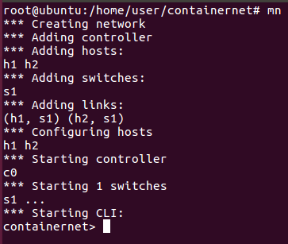

###  步驟2. 變更環境(已變更請跳過這步)
#### 2-1. 切換到 **containernet** 目錄下

```
cd [路徑]/containernet
```

#### 2-2. 執行
    
```
python3 ./setup.py install
```

###  步驟3. 創建隔離環境
#### 3-1. 編寫代碼
```
gedit dockerhost1.py
```
---
```
#!/usr/bin/python

"""
This example shows how to create a simple network and
how to create docker containers (based on existing images)
to it.
"""

from mininet.net import Containernet
from mininet.node import Controller, Docker, OVSSwitch
from mininet.cli import CLI
from mininet.log import setLogLevel, info
from mininet.link import TCLink, Link


def topology():

    "Create a network with some docker containers acting as hosts."

    net = Containernet()

    info('*** Adding hosts\n')
    h1 = net.addHost('h1',  ip='10.0.0.250')

    info('*** Adding docker containers\n')
    d1 = net.addDocker('d1', ip='10.0.0.251', dimage="ubuntu:trusty")

    info('*** Creating links\n')
    net.addLink(h1, d1)

    info('*** Starting network\n')
    net.start()

    info('*** Running CLI\n')
    CLI(net)

    info('*** Stopping network')
    net.stop()

if __name__ == '__main__':
    setLogLevel('info')
    topology()
```
#### 3-2. 執行代碼
* #### 執行成功後，終端介面先別動
    
```
python3 dockerhost1.py
```

### 步驟4. 使用 **docker**
#### 4-1. 開啟一個新的終端機

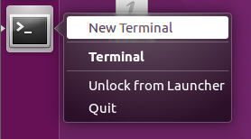

#### 4-2. 查看 **docker** 容器
* 應該可以看到有個名叫 **mn.d1** 的容器
```
docker ps
```
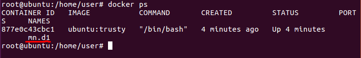

#### 4-3. 進入到該進容器內

```
docker exec -it mn.d1 bash
```

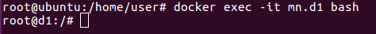

### 步驟5. 測試
#### 5-1. 回到 **步驟3** 的終端機，開啟 **h1** 機器的終端介面 
```
containernrt> xterm h1
```
#### 5-2. 在 **步驟4** 的 **docker** 的容器終端介面，使用
```
ping 10.0.0.250
```
#### 5-3. 在 **h1** 的終端機，使用
```
ping 10.0.0.251
```
#### 5-4. 成功畫面
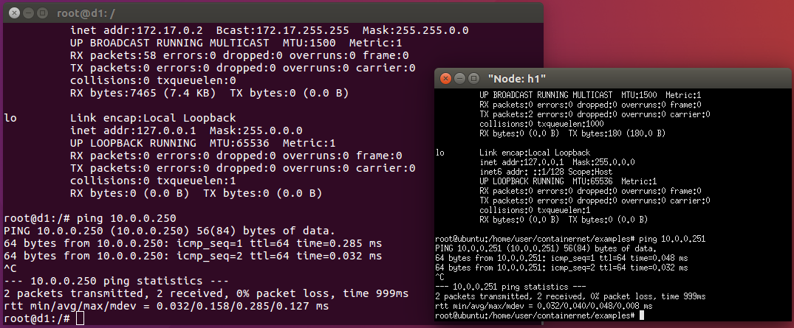

### 步驟6. 回到 **docker** 終端機
#### 6-1. 離開當前環境
```
exit
```
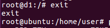
#### 6-2. 進入新環境
```
docker run -it ubuntu:trusty bash
```
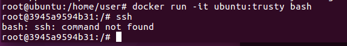

#### 6-3. 更新當前環境
```
apt update
```
#### 6-4. 安裝必要套件
```
apt install openssh-server -y
```
```
apt install vim -y
```
```
apt install apache2 -y
```
#### 6-5. 更改 **ssh root** 登入

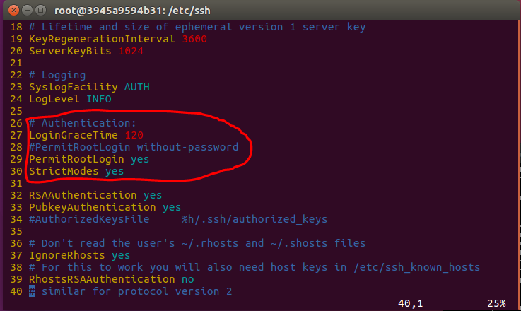

#### 6-4. 啟動 **ssh** 伺服器
```
/etc/init.d/ssh start
```
* 查看是否啟動成功
```
/etc/init.d/ssh status
```
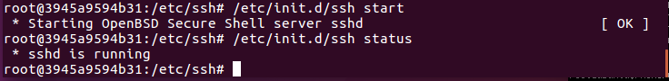

#### 6-5. 設置 **root** 密碼
```
passwd root
```
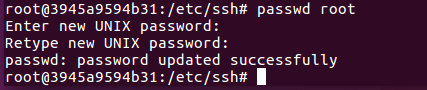

#### 6-6. 查看 IP
```
ifconfig
```
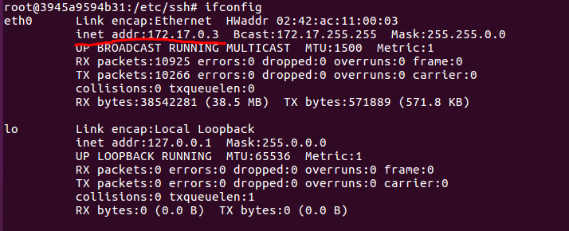

### 步驟7. 測試 **ssh** 遠端連機
#### 7-1. 開啟本機終端
* 這裡指的是 **ubuntu** 原本的終端機，而不是 **docker** 或 **h1** 的終端機。
#### 7-2. **ssh** 連線
```
ssh root@172.17.0.3
```
#### 7-3. 遇到選 **yes/no** 選 **yes**
#### 7-4. 輸入剛剛設置的 **root** 密碼
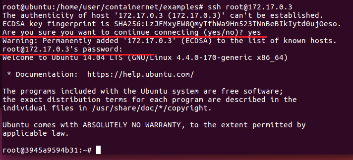

### 步驟8. 啟動網頁伺服器 **apache2**
#### 8-1. 回到 **docker** 終端機
#### 8-2. 啟動網頁伺服器
```
/etc/init.d/apache2 start
```
* 查看啟用狀況
```
/etc/init.d/apache2 status
```
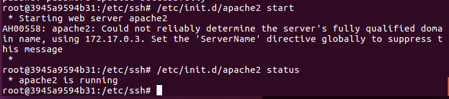

#### 8-3. 進到 **apache** 目錄內
```
cd /var/www/html
```
#### 8-4. 寫入測試網頁
```
echo hi > hi.htm
```
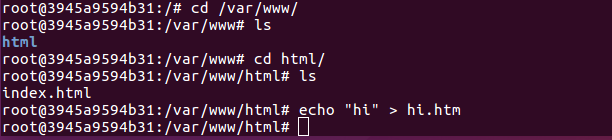

### 步驟9. 測試網頁伺服器
#### 9-1. 回到本機終端
#### 9-2. 使用以下命令測試
```
curl 172.17.0.3/hi.htm
```
#### 9-3. 成功
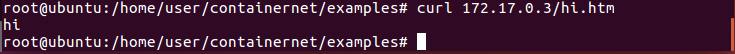

### 步驟10. 製做新鏡像
#### 10-1. 在本機終端查看 **docker** 的 **container ID**
* 注意 : 每個人的 **container ID** 都不一樣
```
docker ps
```
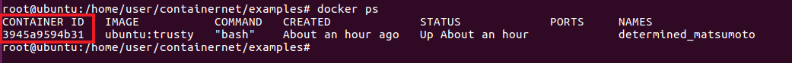

#### 10-2. 製做新的鏡像
```
docker commit 394 ubuntu:1.0
```
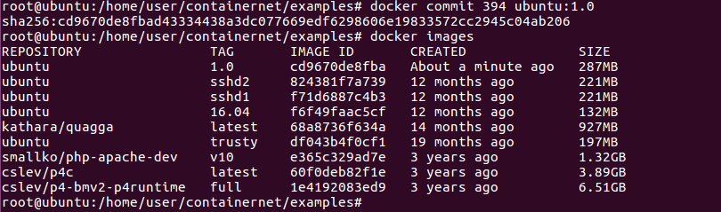

### 11. 將舊鏡像刪除
#### 11-1. 回到 **docker** 容器的終端機
#### 11-2. 離開
```
exit
```
#### 11-3. 刪除舊鏡像
* 重申 : 每個人的 **container ID** 都不一樣
```
docker rm -f 394
```
#### 11-4. 檢視圖
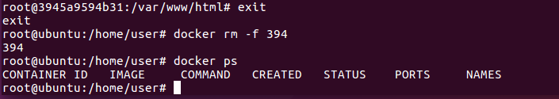


## 使用新的隔離環境
### 步驟1. 更改原先的隔離環境代碼
* 更改原先的 **dockerhost1.py** 的代碼

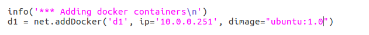

### 步驟2. 讓伺服器套件自行啟動(可加可不加)
* 好處 : 可以不用再跑進 **docker 容器** 內運行套件。
* 新增下圖的代碼到 **dockerhost1.py**
  
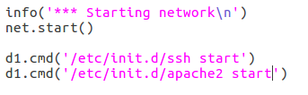

* ### 完整代碼
```
#!/usr/bin/python

"""
This example shows how to create a simple network and
how to create docker containers (based on existing images)
to it.
"""

from mininet.net import Containernet
from mininet.node import Controller, Docker, OVSSwitch
from mininet.cli import CLI
from mininet.log import setLogLevel, info
from mininet.link import TCLink, Link


def topology():

    "Create a network with some docker containers acting as hosts."

    net = Containernet()

    info('*** Adding hosts\n')
    h1 = net.addHost('h1',  ip='10.0.0.250')

    info('*** Adding docker containers\n')
    d1 = net.addDocker('d1', ip='10.0.0.251', dimage="ubuntu:1.0")

    info('*** Creating links\n')
    net.addLink(h1, d1)

    info('*** Starting network\n')
    net.start()

    d1.cmd('/etc/init.d/ssh start')
    d1.cmd('/etc/init.d/apache2 start')

    info('*** Running CLI\n')
    CLI(net)

    info('*** Stopping network')
    net.stop()

if __name__ == '__main__':
    setLogLevel('info')
    topology()
```

### 步驟3. 測試環境配置
#### 3-1. 執行配置檔
```
python3 dockerhost1.py
```

#### 3-2. 使用 **ssh** 進行測試
```
containernet> h1 ssh root@10.0.0.251
```

#### 3-3. 錯誤畫面(沒有錯誤畫面請跳過這步)
* 小提示 : 其實他有告訴你要怎麼做。
```
h1 ssh-keygen -f "/root/.ssh/known_hosts" -R 10.0.0.251
```
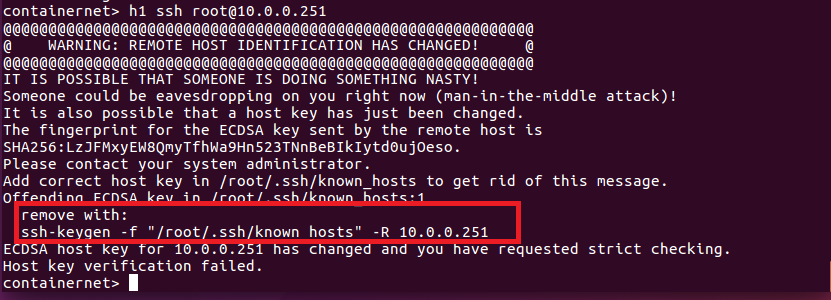

#### 3-4. 再次登入
```
h1 ssh root@10.0.0.251
```
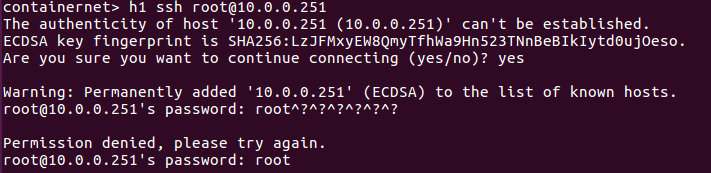

#### 3-5. 離開 **ssh** 登入
```
exit
```

#### 3-6. 測試網頁伺服器
```
h1 curl 10.0.0.251/hi.htm
```
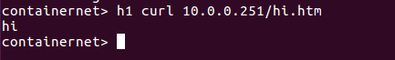

## frp解說
如果 **private network(私人網路/專用網路)** 想要對外提供服務的話，
可以在 **public network(公用網路)** 設置一台主機，當 **public network** 的陌生主機想要連進 **private network** 時
設置在 **public network** 的主機會代為轉發 **請求**、**封包** 等等，而 **private network** 在回應時，
也是透過設置在 **public network** 的主機，在跟 **public network** 的陌生主機溝通

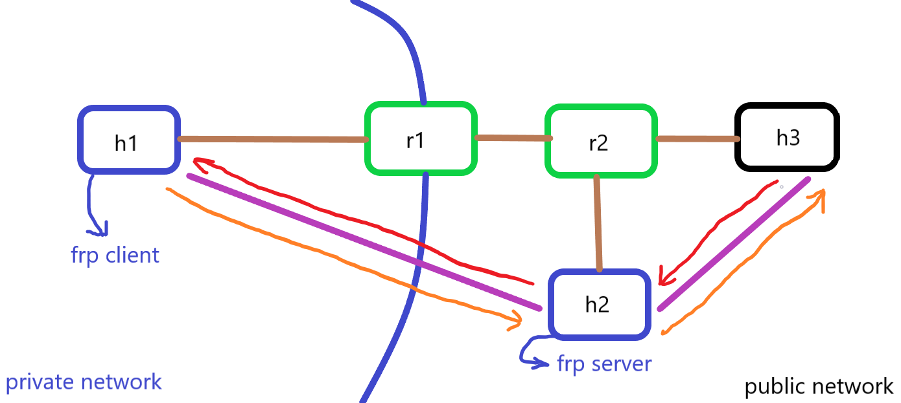

## 建置 **frp**
### 步驟1. 切換到該目錄下
```
cd /home/user/server-test/test-frp
```
### 步驟2. 解說 ***test.py*** 代碼
* 如果其他忘記或看不懂，請去翻前面幾週的 ***README.md***
1. `r1.cmd("ip route add 1.1.1.0/24 via 12.1.1.2")` : 靜態路由配置，如果 `r1` 要到 `h2` ，就會透過 `r2` 的 `r2-eth0`端口進行轉發。

2. `r1.cmd("ip route add 2.2.2.0/24 via 12.1.1.2")` : 同上原理。

3. `r1.cmd("iptables -t nat -A POSTROUTING -s 192.168.1.0/24 -o r1-eth1 -j MASQUERADE")` : 使用`nat`網路模擬私有網路。
    > `-t nat` : 指明使用`nat`的表格
    > 
    > `-A POSTROUTING` : 插入一筆紀錄在`POSTROUTING`之後
    > 
    > `-s 192.168.1.0/24` : 從`192.168.1.0/24`出去的封包
    > 
    > `-o r1-eth1` : 從`r1-eth1`輸出
    > 
    > `-j MASQUERADE` : 進行來源位置的變更
```
#!/usr/bin/python
from mininet.net import Mininet
from mininet.link import Link, TCLink
from mininet.cli import CLI
from mininet.log import setLogLevel
 
def topology():
    "Create a network."
    net = Mininet()
 
    print ("*** Creating nodes")
    h1 = net.addHost( 'h1', ip="192.168.1.1/24") #private server
    h2 = net.addHost( 'h2', ip="1.1.1.1/24") #public server
    h3 = net.addHost( 'h3', ip="2.2.2.2/24") #public node
    r1 = net.addHost( 'r1')
    r2 = net.addHost( 'r2')
 
    ####  h1 --- r1 ---r2----h3
    ####               	  |
    ####               	h2
 
    print ("*** Creating links")
    net.addLink(h1, r1)
    net.addLink(r1, r2)
    net.addLink(r2, h2)
    net.addLink(r2, h3)
 
    print ("*** Starting network")
    net.build()
 
    print ("*** Running CLI")
    r1.cmd("echo 1 > /proc/sys/net/ipv4/ip_forward")
    r2.cmd("echo 1 > /proc/sys/net/ipv4/ip_forward")
    r1.cmd("ifconfig r1-eth0 0")
    r1.cmd("ifconfig r1-eth1 0")
    r2.cmd("ifconfig r2-eth0 0")
    r2.cmd("ifconfig r2-eth1 0")
    r2.cmd("ifconfig r2-eth2 0")
    r1.cmd("ip addr add 192.168.1.254/24 brd + dev r1-eth0")
    r1.cmd("ip addr add 12.1.1.1/24 brd + dev r1-eth1")
    r2.cmd("ip addr add 12.1.1.2/24 brd + dev r2-eth0")
    r2.cmd("ip addr add 1.1.1.254/24 brd + dev r2-eth1")
    r2.cmd("ip addr add 2.2.2.254/24 brd + dev r2-eth2")
    h1.cmd("ip route add default via 192.168.1.254")
    h2.cmd("ip route add default via 1.1.1.254")
    h3.cmd("ip route add default via 2.2.2.254")
    r2.cmd("ip route add 12.1.1.0/24 via 12.1.1.1")
    r1.cmd("ip route add 1.1.1.0/24 via 12.1.1.2")
    r1.cmd("ip route add 2.2.2.0/24 via 12.1.1.2")
    r1.cmd("iptables -t nat -A POSTROUTING -s 192.168.1.0/24 -o r1-eth1 -j MASQUERADE")
 
    CLI( net )
 
    print ("*** Stopping network")
    net.stop()
 
if __name__ == '__main__':
    setLogLevel( 'info' )
    topology()
```

### 步驟3. 執行代碼
```
python3 test.py
```

### 步驟4. 開啟節點終端
```
containernet> xterm h1 h1 h2 h3
```

### 步驟5. 在其中的 **h1** 終端
#### 5-1. 寫入測試網頁
```
echo 'h1' > hi.htm
```
#### 5-2. 開啟簡易網頁伺服器
```
python -m SimpleHTTPServer 80
```
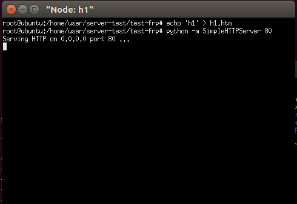

### 步驟6. 到 **h2** 終端機
* 這是設置在 **public network** 的機器
#### 6-1. 進到 **frp** 的配置檔目錄內
```
cd frp/conf/
```

#### 6-2. 解說 **frps.ini** 配置檔
* 請搭配上圖的 **[frp解說](#frp解說)** 的構造圖。
1. `bind_port = 7000` : 當`frp client`要對`frp server`進行連線，告訴`frp client`連`7000`的端口。

2. `vhost_http_port = 8080` : 當 **public network** 的陌生主機要連到 **http** 伺服器，就連到`8080`的端口。

3. 以上兩點，當 **public network** 的陌生主機要連就走`8080`，並透過`7000`端口進行轉發。
```
[common]
bind_port = 7000
vhost_http_port = 8080
```

#### 6-3. 執行配置檔
```
./frps -c frps.ini
```
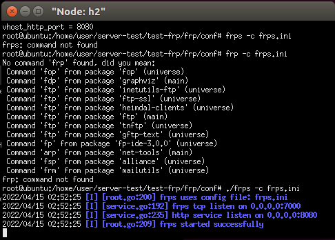

### 步驟7. 到另一個 **h1** 終端機
#### 7-1. 切換到 **frp** 配置檔目錄內
```
cd frp/conf/
```

#### 7-2. 解說 **frpc.ini** 配置檔
1. `server_addr = 1.1.1.1` : 指明 `frp server` 的 IP，此 IP 就是 **h2** 的 IP
2. `server_port = 7000` : 埠號是`7000`
3. `type = http` : 服務器類型是 **http** 服務
4. `local_port = 80` : 服務端口在`80`
5. `custom_domains = www.example.com` : 當 **public network** 的陌生主機要連進來，必須使用`www.example.com`的網域名稱連線。
```
[common]
server_addr = 1.1.1.1
server_port = 7000

[web]
type = http
local_port = 80
custom_domains = www.example.com
```
#### 7-3. 執行配置檔
```
./frpc -c frpc.ini
```
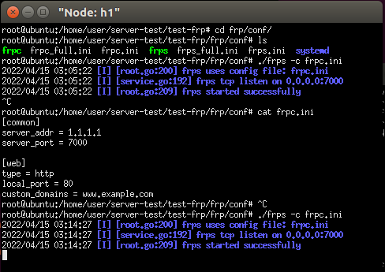

### 步驟8. 在 **h3** 的終端機
* **h3** 是在模擬 **public network** 的陌生主機
#### 8-1. 檢查連線位址
```
cat /etc/hosts
```


#### 8-2. 對網頁連線
```
curl www.example.com:8080/hi.htm
```
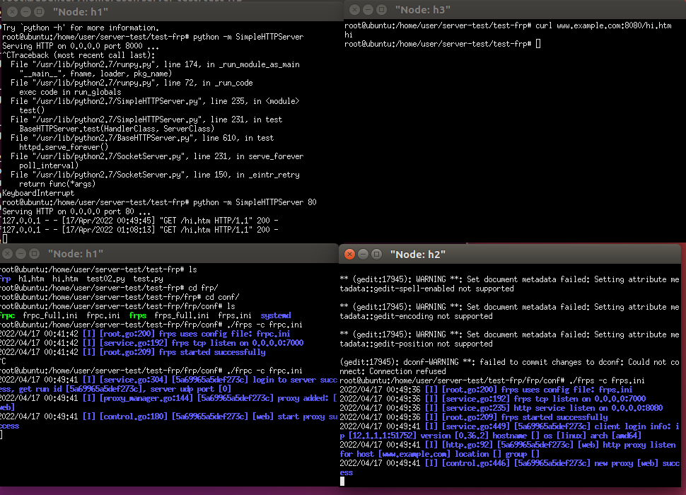

## **http** 搭載 **ssh tunnel**
### 步驟1. 切換到目錄下
```
cd /home/user/server-test/test-sshtunnel
```
### 步驟2. 稍作修改
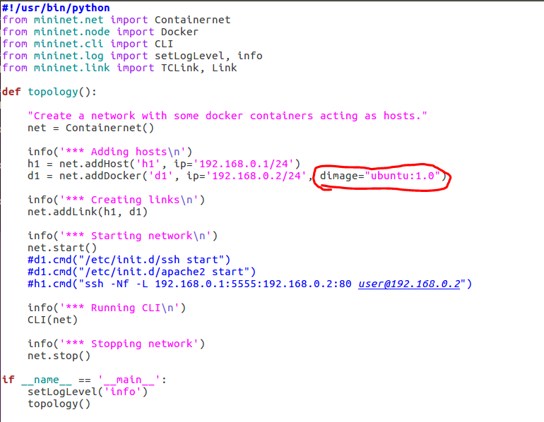

### 步驟3. 執行
```
python3 1.py
```

### 步驟4. 開啟**h1**節點終端
#### 4-1. 開啟**h1**節點終端
```
containernet> xterm h1
```
#### 4-2. 該**h1**終端啟用**wireshark**監聽
```
wireshark
```
### 步驟5. 新增本機節點終端
#### 5-1. 開啟xterm終端
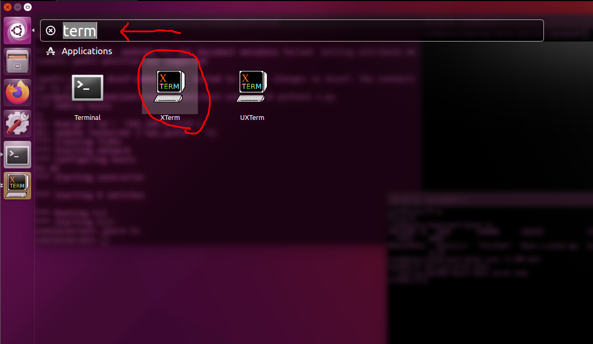
#### 5-2. 進入容器
* 檢查
```
docker ps
```
* 進入
```
docker exec -it [container ID] bash
```
#### 5-3. 啟動ssh伺服器
```
/etc/init.d/ssh start
```
#### 5-4. 啟動apache伺服器
```
/etc/init.d/apache2 start
```

### 步驟6. 測試(還未搭載**ssh tunnel**)
#### 6-1. 開啟一個新的 **h1**節點終端
```
containernet> xterm h1
```
#### 6-2. 在該終端連取**h3**的http
```
curl 192.168.0.2/hi.htm
``` 
* 可以發現未搭載**ssh tunnel**的話，資料會是以明文的方式呈現

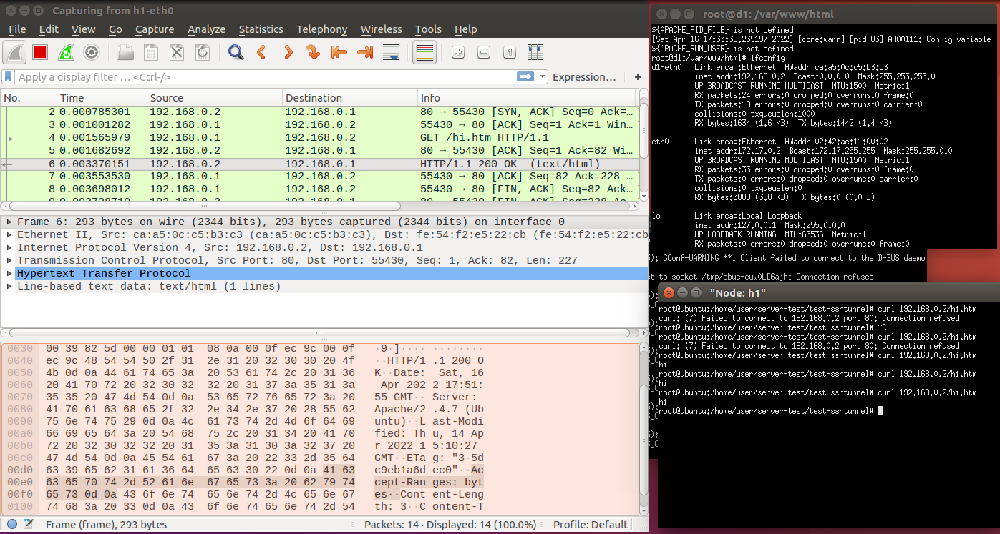

### 步驟7. 測試(搭載**ssh tunnel**)
#### 7-1. 在新開的 **h1** 終端機使用以下指令
```
ssh -Nf -L 192.168.0.1:5555:192.168.0.2:80 root@192.168.0.2
```
> `-N` : 
>>不要執行遠程命令，也就是不進入遠端主機終端。
>
> `-f` : 
>>讓 **ssh** 進入背景執行。
>
> `-L 192.168.0.1:5555:192.168.0.2:80` : 
>>**L(local)** 代表本地端。
>>
>>在本地主機開啟 **5555埠號**，跟 **ssh(22埠號)** 建立連線。
>>
>>倘若有資料傳進本地主機的 **5555埠號**，就傳進 **ssh(22埠號)** 建立的連線，並傳給 **192.168.0.2:80** 端口的服務。
>
> `root@192.168.0.2` :
>>以root登入遠端主機

#### 7-2. 檢查是否成功
```
netstat -tunple | grep 5555
```

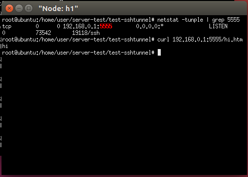

#### 7-3. 連取 **h3** 的 **http**
```
curl 192.168.0.1:5555/hi.htm
```
#### 7-4. **wireshark** 監聽加密

