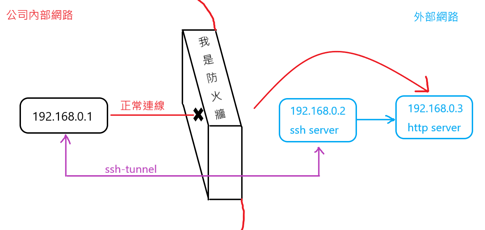
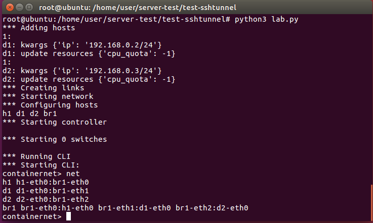
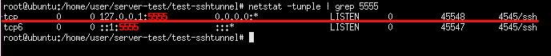
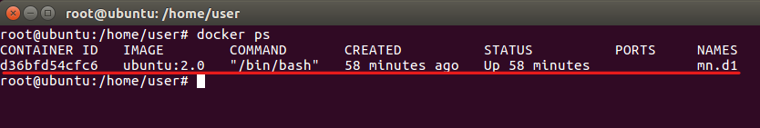

# 使用 ssh-tunnel 達到翻牆和反向連接
## 1. 使用 ssh-tunnel 翻牆
* ### 情境
* 附註 : 通常在公司內 **ssh的埠號(`22`) 和 http的埠號(`80`)** 是不會鎖的，因為方便讓公司內部的主機可以遠端的存取資料。
當你在公司內部時，公司內部要連到外網會經過防火牆，這時可能會被擋起來，導致許多網站無法瀏覽，
這時我們可以在外網設置一台主機，利用 ssh-tunnel 連上這台主機，再透過這台主機替我們轉跳到一些無法瀏覽的網站。


### 步驟1. 編譯代碼並執行
#### 1. 編譯
```
gedit lab.py
```
---
```
#!/usr/bin/python
from mininet.net import Containernet
from mininet.node import Docker
from mininet.cli import CLI
from mininet.log import setLogLevel, info
from mininet.link import TCLink, Link

def topology():

    "Create a network with some docker containers acting as hosts."
    net = Containernet()

    info('*** Adding hosts\n')
    h1 = net.addHost('h1', ip='192.168.0.1/24')
    d1 = net.addDocker('d1', ip='192.168.0.2/24', dimage="ubuntu:2.0")
    d2 = net.addDocker('d2', ip='192.168.0.3/24', dimage="ubuntu:2.0")
    br1 = net.addHost('br1')

    info('*** Creating links\n')
    net.addLink(h1, br1)
    net.addLink(d1, br1)
    net.addLink(d2, br1)

    info('*** Starting network\n')
    net.start()
    d1.cmd("/etc/init.d/ssh start")
    d2.cmd("/etc/init.d/apache2 start")
    d2.cmd("iptables -A INPUT -s 192.168.0.1 -j DROP")
    br1.cmd("ifconfig br1-eth0 0")
    br1.cmd("ifconfig br1-eth1 0")
    br1.cmd("ifconfig br1-eth2 0")
    br1.cmd("brctl addbr br1")
    br1.cmd("brctl addif br1 br1-eth0")
    br1.cmd("brctl addif br1 br1-eth1")
    br1.cmd("brctl addif br1 br1-eth2")
    br1.cmd("ifconfig br1 up")

    info('*** Running CLI\n')
    CLI(net)

    info('*** Stopping network')
    net.stop()

if __name__ == '__main__':
    setLogLevel('info')
    topology()
```
---

* 注意 : 這兩行的代碼會跟我的有所不同
```
d1 = net.addDocker('d1', ip='192.168.0.2/24', dimage="ubuntu:2.0")
d2 = net.addDocker('d2', ip='192.168.0.3/24', dimage="ubuntu:2.0")
```
#### 2. 執行
```
python3 lab.py
```


### 步驟2. 節點模擬
#### 1. 開啟 h1 節點終端
* 該終端模擬公司內部的主機
```
containernet> xterm h1
```
#### 2. h1 和 h2 建立 ssh-tunnel
* 請在 h1 終端機上執行該行指令
```
ssh -Nf -L 5555:192.168.0.3:80 root@192.168.0.2
```
#### 3. 檢查是否建立成功
```
netstat -tunple | grep 5555
```


### 步驟3. 連線測試
#### 1. 使用一般使用者
```
su - user
```
#### 2. 開啟firefox瀏覽器
```
firefox
```
#### 3. 在firefox瀏覽本地 5555埠


* ### 總結
在以上的操作步驟中，以代碼方式 **創建 3 台主機**，分別有 **內網主機(`h1`)、外網主機(`d1`)、外網欲瀏覽網站(`d2`)**,
讓 **內網主機(`h1`) 和 外網主機(`d1`) 以 ssh-tunnel 方式連接**，並讓 **外網主機(`d1`)** 以背景連接，當連接 **本地端(`127.0.0.1:5555`)** 時，
先前已經連接的 **外網主機(`d1`)**，會代替 **內網主機(`h1`)** 去連取 **外網欲瀏覽網站(`d2`)**，再透過 **ssh-tunnel** 把連取到的網站資訊傳回 **本地端(`127.0.0.1:5555`)** 上。

## 2. 使用反向連接連內網
* ### 情境
* 附註 : 通常在公司內 **ssh的埠號(`22`) 和 http的埠號(`80`)** 是不會鎖的，因為方便讓公司內部的主機可以遠端的存取資料。
現在你人在家中，若想連上公司的主機，公司的防火牆會把你擋下來，這時可以使用 ssh-tunnel 技術中的反向連接，
在公司內部的主機建立反連向連接通道，並登入在家中的主機，再讓家中主機反向連回來公司主機。
.png)

### 步驟1. 編譯並執行
#### 1. 編譯
```
gedit lab2.py
```
---
```
#!/usr/bin/python
from mininet.net import Containernet
from mininet.node import Docker
from mininet.cli import CLI
from mininet.log import setLogLevel, info
from mininet.link import TCLink, Link

def topology():

    "Create a network with some docker containers acting as hosts."
    net = Containernet()

    info('*** Adding hosts\n')
    h1 = net.addHost('h1', ip='192.168.0.1/24')
    r1 = net.addHost('r1', ip='192.168.0.254/24')
    d1 = net.addDocker('d1', ip='10.0.0.1/24', dimage="ubuntu:2.0")

    info('*** Creating links\n')
    net.addLink(h1, r1)
    net.addLink(r1, d1)

    info('*** Starting network\n')
    net.start()
    d1.cmd("/etc/init.d/ssh start")
    r1.cmd("ifconfig r1-eth1 0")
    r1.cmd("ip addr add 10.0.0.2/24 brd + dev r1-eth1")
    r1.cmd("echo 1 > /proc/sys/net/ipv4/ip_forward")
    r1.cmd("iptables -t nat -A POSTROUTING -s 192.168.0.0/24 -o r1-eth1 -j MASQUERADE")
    h1.cmd("ip route add default via 192.168.0.254")
    h1.cmd("python -m SimpleHTTPServer 80 &")

    info('*** Running CLI\n')
    CLI(net)

    info('*** Stopping network')
    net.stop()

if __name__ == '__main__':
    setLogLevel('info')
    topology()
```
---

* 注意 : 此行代碼會跟我有所不同
```
d1 = net.addDocker('d1', ip='10.0.0.1/24', dimage="ubuntu:2.0")
```
#### 2. 執行
```
python3 lab2.py
```
### 步驟2. 開啟各節點
#### 1. 開啟兩個 h1 節點終端
```
containernet> xterm h1 h1
```
#### 2. 開啟一個新的本地終端機介面


### 步驟3. 在其中的 h1 啟動網頁伺服器
* 注意 : 如果已啟動網頁伺服器，請跳過這步驟。
#### 1. 檢查是否啟動網頁伺服器
```
netstat -tunple | grep 80
```
02.png)
#### 2. 啟動網頁伺服器
```
python -m SimpleHTTPServer 80
```

### 步驟4. 在另一台 h1 建立反向連接通道
```
ssh -Nf -R 10.0.0.1:5555:192.168.0.1:80 root@10.0.0.1
```

### 步驟5. 本地終端機進入 docker
#### 1. 切換成root
```
su
```
#### 2. 檢查容器ID
```
docker ps
```



#### 3. 進入容器
```
docker exec -it d36 bash
```

### 步驟6. 檢查並測試
* 注意 : 我是讓 **h1 登入到 d1(`10.0.0.1`) 的 ssh**，再讓他返連回 **h1**，所以是在 **d1** 上檢查是否有建立通道。
#### 1. 在容器內檢查通道是否建立成功
```
netstat -tunple | grep 5555
```
03.png)

#### 2. 測試連接
```
curl 127.0.0.1:5555
```
04.png)

* #### 未建立反向連接通道
01.png)

* ### 總結
在以上的操作步驟中，利用代碼創建 3 台主機，分別去模擬 **防火牆(`r1`)、公司主機(`h1`)、家用主機(`d1`)**，
還未建立反向連接通道(ssh-tunnel reverse)時，不論用什麼方式都無法瀏覽 **公司主機(`h1`)** 的網頁的，
之後再讓 **公司主機(`h1`)** 建立反向連接通道(ssh-tunnel reverse)，**公司主機(`h1`)** 會利用 ssh 登入到 **家用主機(`d1`)**，
再讓 **家用主機(`d1`)** 反連回 **公司主機(`h1`)**，便可將通道搭建起來，這時再訪問本地端的 `127.0.0.1:5555`，便可以瀏覽 **公司主機(`h1`)** 的網頁了。
