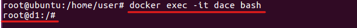

# WEEK12
* 這週會是[**week11**](./week11/README.md)的延伸或是進階。

## 反向連結到網頁
* 這裡會承接上禮拜 [**week11**](./week11/README.md) 的反向連接


* ### 情境
通常反向連結是，當外網的主機擁有內網主機的控制權，我們就可以透過這台內網主機，
替外網主機轉跳到內網的後台網頁，但內網的後台網頁必須有建立起網頁伺服器。

.png)

### 步驟1. 執行環境代碼
#### 1-1 編譯
```
gedit lab3.py
```
#### 1-2 輸入以下代碼
```
#!/usr/bin/python
from mininet.net import Containernet
from mininet.node import Docker
from mininet.cli import CLI
from mininet.log import setLogLevel, info
from mininet.link import TCLink, Link

def topology():

    "Create a network with some docker containers acting as hosts."
    net = Containernet()

    info('*** Adding hosts\n')
    h1 = net.addHost('h1', ip='192.168.0.1/24')
    h2 = net.addHost('h2', ip='192.168.0.2/24')
    br1 = net.addHost('br1')
    r1 = net.addHost('r1', ip='192.168.0.254/24')
    d1 = net.addDocker('d1', ip='10.0.0.1/24', dimage="ubuntu:2.0")

    info('*** Creating links\n')
    net.addLink(h1, br1)
    net.addLink(h2, br1)
    net.addLink(r1, br1)
    net.addLink(r1, d1)

    info('*** Starting network\n')
    net.start()
    d1.cmd("/etc/init.d/ssh start")
    r1.cmd("ifconfig r1-eth1 0")
    r1.cmd("ip addr add 10.0.0.2/24 brd + dev r1-eth1")
    r1.cmd("echo 1 > /proc/sys/net/ipv4/ip_forward")
    r1.cmd("iptables -t nat -A POSTROUTING -s 192.168.0.0/24 -o r1-eth1 -j MASQUERADE")
    h1.cmd("ip route add default via 192.168.0.254")
    br1.cmd("ifconfig br1-eth0 0")
    br1.cmd("ifconfig br1-eth1 0")
    br1.cmd("ifconfig br1-eth2 0")
    br1.cmd("brctl addbr br1")
    br1.cmd("brctl addif br1 br1-eth0")
    br1.cmd("brctl addif br1 br1-eth1")
    br1.cmd("brctl addif br1 br1-eth2")
    br1.cmd("ifconfig br1 up")

    info('*** Running CLI\n')
    CLI(net)

    info('*** Stopping network')
    net.stop()

if __name__ == '__main__':
    setLogLevel('info')
    topology()
```
#### 1-3 執行代碼
```
python3 lab3.py
```

### 步驟2. 開啟模擬節點
#### 2-1 在containernet環境下
```
containernet> xterm h1 h2
```


#### 2-2 在本機環境下新增終端介面


### 步驟3. h1節點建立反向連結
```
ssh -Nf -R 10.0.0.1:5555:192.168.0.2:80 root@10.0.0.1
```


### 步驟4. h2節點建立簡易網頁伺服器
```
python -m SimpleHTTPServer 80
```


### 步驟5. 本機新增的終端視窗
#### 5-1 檢查 docker 容器 ID
* 注意 : 每個人的 容器ID 都不一樣
```
docker ps
```

#### 5-2 進入 docker 環境內
```
docker exec -it dace bash
```


#### 5-3 訪問容器內 5555 埠號的網址
```
curl 127.0.0.1:5555
```


## 動態埠號轉發
* 這裡會承接上禮拜 [**week11**](./week11/README.md) 的 **ssh-tunnel** 翻牆

* ### 說明
上禮拜 [**week11**](./week11/README.md) 的 **ssh-tunnel** 翻牆，只能讓設置在外網的主機轉跳一個網頁，
而這次讓它可以動態的轉跳到其他的網頁，供內網的主機瀏覽。

### 步驟1. 執行環境代碼
#### 1-1 編譯
```
gedit lab4.py
```
#### 1-2 輸入以下代碼
```
#!/usr/bin/python
from mininet.net import Containernet
from mininet.node import Docker
from mininet.cli import CLI
from mininet.log import setLogLevel, info
from mininet.link import TCLink, Link

def topology():

    "Create a network with some docker containers acting as hosts."
    net = Containernet()

    info('*** Adding hosts\n')
    h1 = net.addHost('h1', ip='192.168.0.1/24')
    r1 = net.addHost('r1', ip='192.168.0.254/24')
    d1 = net.addDocker('d1', ip='10.0.0.1/24', dimage="ubuntu:2.0")
    br1 = net.addHost('br1')
    h2 = net.addHost('h2', ip='10.0.0.3/24')
    h3 = net.addHost('h3', ip='10.0.0.4/24')

    info('*** Creating links\n')
    net.addLink(h1, r1)
    net.addLink(r1, br1)
    net.addLink(d1, br1)
    net.addLink(h2, br1)
    net.addLink(h3, br1)

    info('*** Starting network\n')
    net.start()
    d1.cmd("/etc/init.d/ssh start")
    r1.cmd("ifconfig r1-eth1 0")
    r1.cmd("ip addr add 10.0.0.2/24 brd + dev r1-eth1")
    r1.cmd("echo 1 > /proc/sys/net/ipv4/ip_forward")
    r1.cmd("iptables -t nat -A POSTROUTING -s 192.168.0.0/24 -o r1-eth1 -j MASQUERADE")
    r1.cmd("iptables -A FORWARD -s 192.168.0.1 -p tcp --dport 80 -j REJECT")
    h1.cmd("ip route add default via 192.168.0.254")
    br1.cmd("ifconfig br1-eth0 0")
    br1.cmd("ifconfig br1-eth1 0")
    br1.cmd("ifconfig br1-eth2 0")
    br1.cmd("ifconfig br1-eth3 0")
    br1.cmd("brctl addbr br1")
    br1.cmd("brctl addif br1 br1-eth0")
    br1.cmd("brctl addif br1 br1-eth1")
    br1.cmd("brctl addif br1 br1-eth2")
    br1.cmd("brctl addif br1 br1-eth3")
    br1.cmd("ifconfig br1 up")

    info('*** Running CLI\n')
    CLI(net)

    info('*** Stopping network')
    net.stop()

if __name__ == '__main__':
    setLogLevel('info')
    topology()
```
#### 1-3 執行代碼
```
python3 lab4.py
```

### 步驟2. 開啟模擬節點
* 在containernet環境下
```
containernet> xterm h1 h2 h3
```


### 步驟3. h1節點建立 ssh-tunnel
```
ssh -Nf -D 127.0.0.1:8000 root@10.0.0.1
```


### 步驟4. h2和h3的節點，開啟簡易伺服器
```
python -m SimpleHTTPServer 80
```


### 步驟5. h1節點切換使用者
```
su - user
```

### 步驟6. h1開啟 firefox 瀏覽器
```
firefox
```


### 步驟7. firefox 瀏覽器各項設定
* 注意 : 以在 **h1** 節點開啟的 **firefox** ，去做設定。
#### 7-1 進到 preference


#### 7-2 滑到最下面，點選 Network Settings區塊中的 settings


### 7-3 依照下圖設定


### 步驟8. 瀏覽h2和h3的網頁


## 第12週完結