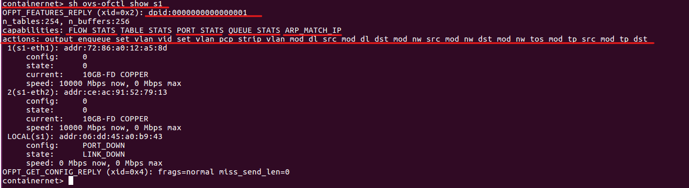
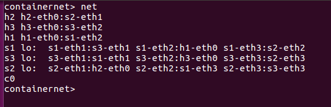
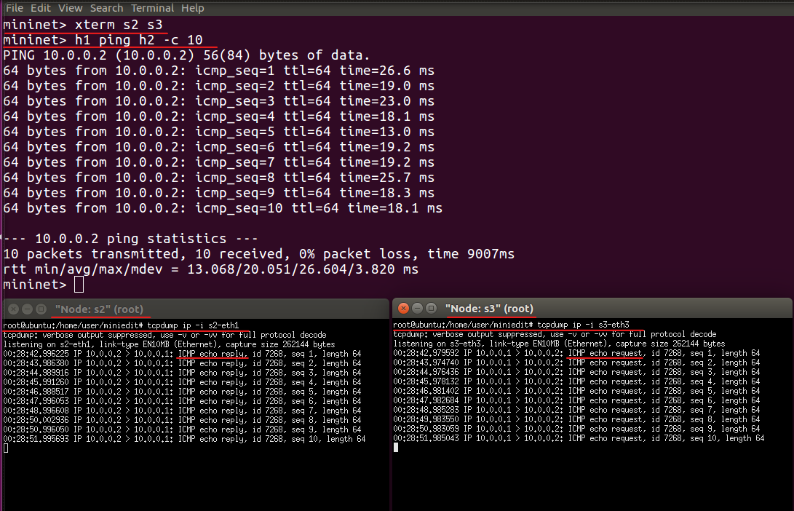

# week13

## miniEdit設定
先以 **miniEdit** 作為練習，去設定網路的拓撲，並在拓樸內設定，
為往後的網路規則做基礎的認識。
> 附註 : 我是使用國立金門大學-柯志亨，柯老師的虛擬機作為練習。

* ### 控制器介紹
在市面上控制器有非常多種，只要選自己喜歡或習慣的語言或規則就可以了，以下將介紹幾種控制器。
1. **pox** : 是用 **python語言** 去撰寫的。
2. **ryu** : 是用 **python語言** 去撰寫的。
3. **floodlight** : 是用 **java語言** 去撰寫的。
4. **onos** : 是用 **java語言** 去撰寫的。
5. **nox** : 是用 **c語言** 去撰寫的。
6. ...還有很多種。

雖然上列的控制器，每種的語言都有所不同，但在跟交換機之間在進行通訊時，
都會把所撰寫出來的規則，轉變成 **openflow** 這種通訊協定。
* 附註 : [SBI(南向接口)](https://cn.theastrologypage.com/southbound-interface#menu-1) 中有很多協定，但比較有名的是 **openflow**。

當控制器撰寫好規則，並下放到交換機上後，都會轉換成 **openflow** ，再讓 **data plane、control plane** 進行分離，這也是[SDN](附上維基百科鏈結)概念當中的核心思想；
在傳統的網路中是分散式的架構，每個網路的設備都是互相獨立的，且每個網路中的每個設備的 **data plane、control plane** 是混合在一起運行的。
* 附註 : 各有優缺點，**不一定哪個比較好**，也有半集中式的SDN。

[較詳細的內容可以看這篇](https://blog.csdn.net/weixin_51045259/article/details/114784404)

### 步驟1. 開啟miniEdit環境
#### 1-1 切換到資料夾下
```
cd /home/user/containernet/examples
```

#### 1-2 執行環境檔
```
python3 miniedit.py
```

### 步驟2. 創建拓撲環境
#### 2-1 創建一台交換機
* 注意 : 當 **不需要再創建任何節** 點或機器後，請切 **點選回滑鼠游標圖示** 。

點選完圖示後，點擊下圖中的空白處，即可創建。


#### 2-2 創建兩台主機


#### 2-3 主機和交換機連接
**點選** 下圖中網路線的 **圖示後**，**按住滑鼠左鍵**，對要 **連接的雙方** 進行連接。


#### 2-4 創建一台控制器

#### 2-5 將控制器連接交換機

#### 2-6 設定兩台主機的網路
對 h1 圖示 **按住滑鼠右鍵** --> 點選 **Properties** 選項


設定 **h1** 的 **IP**


設定 **h2** 的 **IP**


#### 2-7 設定控制器


### 3. 匯出剛剛創建的拓撲環境
* 附註 : 當我們匯出後，系統會自動生成代碼。
  


> 這邊的存放路徑沒有一定，只要你知道檔案放在哪就好。

### 4. 離開環境畫面


### 5. 細節配置匯出的環境檔
* 原本的匯出檔代碼
```
#!/usr/bin/python

from mininet.net import Mininet
from mininet.node import Controller, RemoteController, OVSController
from mininet.node import CPULimitedHost, Host, Node
from mininet.node import OVSKernelSwitch, UserSwitch
from mininet.node import IVSSwitch
from mininet.cli import CLI
from mininet.log import setLogLevel, info
from mininet.link import TCLink, Intf
from subprocess import call

def myNetwork():

    net = Mininet( topo=None,
                   build=False,
                   ipBase='10.0.0.0/8')

    info( '*** Adding controller\n' )
    c0=net.addController(name='c0',
                      controller=RemoteController,
                      ip='127.0.0.1',
                      protocol='tcp',
                      port=6633)

    info( '*** Add switches\n')
    s1 = net.addSwitch('s1', cls=OVSKernelSwitch)

    info( '*** Add hosts\n')
    h2 = net.addHost('h2', cls=Host, ip='192.168.1.2/24', defaultRoute=None)
    h1 = net.addHost('h1', cls=Host, ip='192.168.1.1/24', defaultRoute=None)

    info( '*** Add links\n')
    net.addLink(h1, s1)
    net.addLink(h2, s1)

    info( '*** Starting network\n')
    net.build()
    info( '*** Starting controllers\n')
    for controller in net.controllers:
        controller.start()

    info( '*** Starting switches\n')
    net.get('s1').start([c0])

    info( '*** Post configure switches and hosts\n')

    CLI(net)
    net.stop()

if __name__ == '__main__':
    setLogLevel( 'info' )
    myNetwork()
```

* 修改後的代碼
```
#!/usr/bin/python

from mininet.net import Mininet
from mininet.node import Controller, RemoteController, OVSController
from mininet.node import CPULimitedHost, Host, Node
from mininet.node import OVSKernelSwitch, UserSwitch
from mininet.node import IVSSwitch
from mininet.cli import CLI
from mininet.log import setLogLevel, info
from mininet.link import TCLink, Intf
from subprocess import call

def myNetwork():

    net = Mininet()

    info( '*** Adding controller\n' )
    c0=net.addController(name='c0',
                      controller=RemoteController,
                      ip='127.0.0.1',
                      protocol='tcp',
                      port=6633)

    info( '*** Add switches\n')
    s1 = net.addSwitch('s1', cls=OVSKernelSwitch)

    info( '*** Add hosts\n')
    h2 = net.addHost('h2', cls=Host, ip='192.168.1.2/24', mac='00:00:00:00:00:02', defaultRoute=None)
    h1 = net.addHost('h1', cls=Host, ip='192.168.1.1/24', mac='00:00:00:00:00:01', defaultRoute=None)

    info( '*** Add links\n')
    net.addLink(h1, s1)
    net.addLink(h2, s1)

    info( '*** Starting network\n')
    net.build()
    info( '*** Starting controllers\n')
    for controller in net.controllers:
        controller.start()

    info( '*** Starting switches\n')
    net.get('s1').start([c0])

    info( '*** Post configure switches and hosts\n')

    CLI(net)
    net.stop()

if __name__ == '__main__':
    setLogLevel( 'info' )
    myNetwork()
```
> `h2 = net.addHost()` 和 `h1 = net.addHost()` :
>> 這兩行加入了網路卡卡號。
> `net = Mininet()` :
>> 該行刪除了目前不必要的設定。

### 6. 執行環境檔
```
python test01.py
```

* `Unable to contact the remote controller at 127.0.0.1:6633` : 會出現是因為，沒將遠端的控制器跑起來，所以目前控制器是沒有規則的。

#### 6-1 檢查 h1 設定
```
containernet> h1 ifconfig
```

#### 6-1 檢查 h2 設定
```
containernet> h2 ifconfig
```


### 7. 運行控制器腳本
#### 7-1 本機開啟新視窗

#### 7-2 切換存放腳本的目錄
```
cd /home/user/pox
```
#### 7-3 運行控制器腳本規則
```
./pox.py forwarding.hub
```


* ### 第7節說明
當運行`./pox.py forwarding.hub`的腳本的時候，控制器會下放規則，這時的交換機就擁有了 **HUB** 的功能，而 **HUB** 會轉發封包到所有連上 **HUB** 上的機器，其中`INFO:forwarding.hub:Hubifying 00-00-00-00-00-01`，表示當 **有網路設備連上控制器** 時，網路 **設備的編號**，當有 **第2台網路設備連上控制器**，編號就會是`00-00-00-00-00-02`，
但這 **僅發生在 Mininet 環境** 下，才有可能依照順序編號，在真實情況下，可能會是網路設備內設定的編號，所以數字不會很好辨認。

編號的用意，是在控制器下放規則時，就以編號的方式，對跟該編號相同的設備，進行規則的制定。

## sh 相關指令及說明

* [1. 這裡有關於OpenvSwitch每個指令的說明](http://www.openvswitch.org/support/dist-docs/ovs-ofctl.8.txt)

* [2. 同上，但有些這篇寫的比較詳細](https://man7.org/linux/man-pages/man7/ovs-actions.7.html)

### 1. 顯示出有關交換機的詳細資訊
```
sh ovs-ofctl show s1(交換機名稱)
```

> **dpid** :
>> 交換機的代號。
>
> **capabilities** : 交換機具有哪一方面的能力
>> **FLOW_STATS** : 規則統計。
>>
>> **TABLE_STATS** : 統計 **flow table**。
>>
>> **PORT_STATS** : 統計埠號收發的流量和資訊。
>>
> **action** : 交換機可以執行的動作。
>> **output** : port 的轉發。
>>
>> **enqueque** : 可以設定每個 port 中的不同 queque 的資源，如 : queque頻寬、queque所對應收發的封包。
>>
>> **set_vlan_vid、set_vlan_pcp、strip_vlan** : 這三種都是用來做VLAN用的。
>>
>> **mod_dl_src** : 當 **同一個網段** 的封包在傳送時，該封包會攜帶 **目的地(dst) 和 來源(src)** 的 **MAC位址 + IP位址**，當我們需要修該來源位址時，就可以用到該動作去進行修改。
>>
>> **mod_dl_dst** : 同上原理，但是 **修改目的地位址**。
>>
>> **mod_nw_src** : 同上原理，但 **修改於不同網段之間的來源封包**，也就是修改網路層中的 IPv4 封包。
>>
>> **mod_nw_dst** : 同上原理，但 **修改於不同網段之間的目的地封包**，也就是修改網路層中的 IPv4 封包
>>。
>> **mod_tp_src** : 改變傳輸層(layer 4)上的 **來源埠號**。
>>
>> **mod_tp_dst** : 改變傳輸層(layer 4)上的 **目的地埠號**。

[這裡有篇文章是關於flow table](https://www.netadmin.com.tw/netadmin/zh-tw/technology/8244EA0CF13646ECB964DFC4B0700961)

### 2. 查看規則
* 該指令可以查看交換機上目前到底有多少條指令。
```
sh ovs-ofctl dump-flows s1(交換機名稱)
```

### 3. 刪除規則
* 該指令可以刪除交換機上的所有指令
```
sh ovs-ofctl del-flows s1(交換機名稱)
```
* 若要刪除特定規則，可以**先使用查看指令**，並從中**挑選關鍵字**刪除，就可以刪除特定規則；如下 :
```
sh ovs-ofctl del-flows s1 "in_port=1"
```
* 若要更嚴謹的刪除，可以加上 `--strict`，且一定要加上 **priority(權重)**；如下 :
```
sh ovs-ofctl --strict del-flows s1 "priority=100,in_port=1"
```

### 4. 增加規則
* 附註 : 規則寫得越詳細越好，因為在封包的轉發上越不會有衝突。
以下指令可以為交換機上增加規則
```
sh ovs-ofctl add-flow s1(交換機名稱) [增加的規則]
```
* 簡易範例如下圖
  


### 5. 下規則注意事項
* 附註 : 在寫的時候應該是以 **如果我是一台交換機的立場去思考**，這樣去想會比較好寫。

**運行新的腳本**，並從中學習其含意，操作如下圖；


> 第一條規則在處理ARP，我直接從下面的規則說起。

1. **寫規則的順序**，最好先從 **in_put** 開始寫，再寫 **mac 層** 的規則，再寫 **IP** 層規則，**tcp層** 規則，
等等的一層層寫上來，可以不難看出其實就是OSI模型，雖然新版的SDN幾乎可以不用照順序來寫!~
2. **icmp_code=0**，表示以`echo`的形式。
3. **icmp_type**，若為 **8 就表示 request**，若為 **0 表示 reply**
4. **priority(權重)**，**priority越高就越優先被採用**，當有一個封包被多條規則滿足時，就以 **priority(權重)** 較高的那條規則，對封包進行處理。
5. **idle_timeout**，若都沒有任何封包符合這條規則，**閒置的時間(以秒為單位)** 一到，就把規則給刪除。
6. **hard_timeout**，不管有沒有封包符合這條規則，時間(以秒為單位) 一到就把規則刪除。
  * 注意 : 若**idle_timeout、hard_timeout** 都等於 0；表示 **永不刪除規則**。

* 乙太網路類型可以[看維基百科](https://zh.wikipedia.org/zh-tw/%E4%BB%A5%E5%A4%AA%E7%B1%BB%E5%9E%8B)

## 練習題01
* ### 拓樸圖

* ### 代碼
```
#!/usr/bin/python

from mininet.net import Mininet
from mininet.node import Controller, RemoteController, OVSController
from mininet.node import CPULimitedHost, Host, Node
from mininet.node import OVSKernelSwitch, UserSwitch
from mininet.node import IVSSwitch
from mininet.cli import CLI
from mininet.log import setLogLevel, info
from mininet.link import TCLink, Intf
from subprocess import call

def myNetwork():

    net = Mininet()

    info( '*** Adding controller\n' )
    c0=net.addController(name='c0',
                      controller=RemoteController,
                      ip='127.0.0.1',
                      protocol='tcp',
                      port=6633)

    info( '*** Add switches\n')
    s2 = net.addSwitch('s2', cls=OVSKernelSwitch)
    s1 = net.addSwitch('s1', cls=OVSKernelSwitch)

    info( '*** Add hosts\n')
    h2 = net.addHost('h2', cls=Host, ip='192.168.1.2/24', defaultRoute=None)
    h1 = net.addHost('h1', cls=Host, ip='192.168.1.1/24', defaultRoute=None)

    info( '*** Add links\n')
    net.addLink(h1, s1)
    net.addLink(s1, s2)
    net.addLink(s2, h2)

    info( '*** Starting network\n')
    net.build()
    info( '*** Starting controllers\n')
    for controller in net.controllers:
        controller.start()

    info( '*** Starting switches\n')
    net.get('s2').start([c0])
    net.get('s1').start([c0])

    info( '*** Post configure switches and hosts\n')

    CLI(net)
    net.stop()

if __name__ == '__main__':
    setLogLevel( 'info' )
    myNetwork()
```

### 步驟1. 執行代碼
```
python3 t	est02.py
```

### 步驟2. 檢查接口連線
* 注意 : 此步驟至關重要，因為下規則時會依接口狀況去指令封包的轉發。
```
net
```


### 步驟3. s1的規則
#### 3-1. 處理 arp 封包
```
sh ovs-ofctl add-flow s1 arp,actions=flood
```
> `actions=flood` : 表示 arp 封包以廣播的方式轉發，此目的為了知道 **h1 和 h2 雙方的 MAC 位址**。

#### 3-2. 轉送來自 h1 的封包
```
sh ovs-ofctl add-flow s1 ip,nw_src=192.168.1.1,actions=output:2
```
> 說明 : 當 s1 收到 **IP來源(`nw_src`)** 為 192.168.1.1 的封包時，從 **接口2(`s1-eth2`) 轉出(`actions=output:2`)**。

#### 3-3 接收來自 h2 的封包
```
sh ovs-ofctl add-flow s1 ip,in_port=2,nw_src=192.168.1.2,actions=output:1
```
> 說明 : 當有封包從 s1 的  **接口2(`s1-eth2`) 進入(`in_port=2`)**，並且 **IP來源(`nw_src`)** 為 192.168.1.2 的封包時，就從 **接口1(`s1-eth1`) 轉出(`actions=output:1`)**。

### 步驟4. s2的規則
#### 4-1. 處理 arp 封包
```
sh ovs-ofctl add-flow s2 arp,actions=flood
```
> `actions=flood` : 表示 arp 封包以廣播的方式轉發，此目的為了知道 **h1 和 h2 雙方的 MAC 位址**。

#### 4-2. 轉送來自 h2 的封包
```
sh ovs-ofctl add-flow s2 ip,nw_src=192.168.1.2,actions=output:1
```
> 說明 : 當 s2 收到 **IP來源(`nw_src`)** 為 192.168.1.2 的封包時，從 **接口1(`s2-eth1`) 轉出(`actions=output:2`)**。

#### 4-3 接收來自 h1 的封包
```
sh ovs-ofctl add-flow s2 ip,in_port=1,nw_src=192.168.1.1,actions=output:2
```
>> 說明 : 當有封包從 s2 的 **接口1(`s2-eth1`) 進入(`in_port=1`)**，並且 **IP來源(`nw_src`)** 為 192.168.1.1 的封包時，就從 **接口2(`s2-eth2`) 轉出(`actions=output:1`)**。

### 步驟5. 檢查規則
* 附註 : 此步驟可以不做，但我通常會再檢查一次我自己下的規則。

#### 5-1 檢查 s1 的規則
```
sh ovs-ofctl dump-flows s1
```
#### 5-1 檢查 s2 的規則
```
sh ovs-ofctl dump-flows s2
```


### 步驟6. 測試
```
h1 ping h2 -c 3
```


## 練習02
* ### 拓樸圖


* ### 代碼
```
#!/usr/bin/python

from mininet.net import Mininet
from mininet.node import Controller, RemoteController, OVSController
from mininet.node import CPULimitedHost, Host, Node
from mininet.node import OVSKernelSwitch, UserSwitch
from mininet.node import IVSSwitch
from mininet.cli import CLI
from mininet.log import setLogLevel, info
from mininet.link import TCLink, Intf
from subprocess import call

def myNetwork():

    net = Mininet()

    info( '*** Adding controller\n' )
    c0=net.addController(name='c0',
                      controller=Controller,
                      protocol='tcp',
                      port=6633)

    info( '*** Add switches\n')
    s1 = net.addSwitch('s1', cls=OVSKernelSwitch)
    s3 = net.addSwitch('s3', cls=OVSKernelSwitch)
    s2 = net.addSwitch('s2', cls=OVSKernelSwitch)

    info( '*** Add hosts\n')
    h2 = net.addHost('h2', cls=Host, ip='10.0.0.2/24', defaultRoute=None)
    h3 = net.addHost('h3', cls=Host, ip='10.0.0.3/24', defaultRoute=None)
    h1 = net.addHost('h1', cls=Host, ip='10.0.0.1/24', defaultRoute=None)

    info( '*** Add links\n')
    net.addLink(s1, s3)
    net.addLink(h1, s1)
    net.addLink(h2, s2)
    net.addLink(h3, s3)
    net.addLink(s1, s2)
    net.addLink(s2, s3)

    info( '*** Starting network\n')
    net.build()
    info( '*** Starting controllers\n')
    for controller in net.controllers:
        controller.start()

    info( '*** Starting switches\n')
    net.get('s1').start([c0])
    net.get('s3').start([c0])
    net.get('s2').start([c0])

    info( '*** Post configure switches and hosts\n')

    CLI(net)
    net.stop()

if __name__ == '__main__':
    setLogLevel( 'info' )
    myNetwork()
```

### 步驟1. 執行
```
python3 test03.py
```
### 步驟2. 檢查接口連線
```
net
```


### 步驟3. s1的規則
```
sh ovs-ofctl add-flow s1 arp,actions=flood
```
```
sh ovs-ofctl add-flow s1 ip,nw_dst=10.0.0.1,actions=output:2
```
> 說明 : 若 s1 收到的封包，**IP目的地(`nw_dst`) 為 10.0.0.1**，就從 **s1 的 接口2(`s1-eth2`) 轉發(`actions=output:2`)**。
```
sh ovs-ofctl add-flow s1 ip,nw_dst=10.0.0.2,actions=output:3
```
> 說明 : 若 s1 收到的封包，**IP目的地(`nw_dst`) 為 10.0.0.2**，就從 **s1 的 接口3(`s1-eth3`) 轉發(`actions=output:3`)**，因從上圖的接口連線狀況來看，接口3(`s1-eth3`) 連接著 s2 的 接口2(`s2-eth2`)，而 s2 連接著 h2。
```
sh ovs-ofctl add-flow s1 ip,nw_dst=10.0.0.3,actions=output:1
```
> 說明 : 若 s1 收到的封包，**IP目的地(`nw_dst`) 為 10.0.0.3**，就從 **s1 的 接口1(`s1-eth1`) 轉發(`actions=output:1`)**，因從上圖的接口連線狀況來看，接口1(`s1-eth1`) 連接著 s3 的 接口1(`s3-eth1`)，而 s3 連接著 h3。

### 步驟 4. s2的規則
```
sh ovs-ofctl add-flow s2 arp,actions=flood
```
```
sh ovs-ofctl add-flow s2 ip,nw_dst=10.0.0.2,actions=output:1
```
```
sh ovs-ofctl add-flow s2 ip,nw_dst=10.0.0.1,actions=output:2
```
```
sh ovs-ofctl add-flow s2 ip,nw_dst=10.0.0.3,actions=output:3
```

### 步驟5. s3的規則
```
sh ovs-ofctl add-flow s2 arp,actions=flood
```
```
containernet> sh ovs-ofctl add-flow s3 ip,nw_dst=10.0.0.3,actions=output:2
```
```
containernet> sh ovs-ofctl add-flow s3 ip,nw_dst=10.0.0.2,actions=output:3
```
```
containernet> sh ovs-ofctl add-flow s3 ip,nw_dst=10.0.0.1,actions=output:1
```

### 步驟6. 檢查規則
```
sh ovs-ofctl dump-flows s1
```
```
sh ovs-ofctl dump-flows s2
```
```
sh ovs-ofctl dump-flows s3
```

### 步驟7. 測試


## 練習03
* ### 拓樸圖


* ### 代碼
```
#!/usr/bin/python

from mininet.net import Mininet
from mininet.node import Controller, RemoteController, OVSController
from mininet.node import CPULimitedHost, Host, Node
from mininet.node import OVSKernelSwitch, UserSwitch
from mininet.node import IVSSwitch
from mininet.cli import CLI
from mininet.log import setLogLevel, info
from mininet.link import TCLink, Intf
from subprocess import call

def myNetwork():

    net = Mininet()

    info( '*** Adding controller\n' )
    c0=net.addController(name='c0',
                      controller=RemoteController,
                      ip='127.0.0.1',
                      protocol='tcp',
                      port=6633)

    info( '*** Add switches\n')
    s2 = net.addSwitch('s2', cls=OVSKernelSwitch)
    s1 = net.addSwitch('s1', cls=OVSKernelSwitch)
    s3 = net.addSwitch('s3', cls=OVSKernelSwitch)

    info( '*** Add hosts\n')
    h2 = net.addHost('h2', cls=Host, ip='10.0.0.2/24', defaultRoute=None)
    h1 = net.addHost('h1', cls=Host, ip='10.0.0.1/24', defaultRoute=None)

    info( '*** Add links\n')
    net.addLink(s1, h1)
    net.addLink(s3, h2)
    net.addLink(s1, s2)
    net.addLink(s2, s3)
    net.addLink(s1, s3)

    info( '*** Starting network\n')
    net.build()
    info( '*** Starting controllers\n')
    for controller in net.controllers:
        controller.start()

    info( '*** Starting switches\n')
    net.get('s2').start([c0])
    net.get('s1').start([c0])
    net.get('s3').start([c0])

    info( '*** Post configure switches and hosts\n')

    CLI(net)
    net.stop()

if __name__ == '__main__':
    setLogLevel( 'info' )
    myNetwork()
```

### 步驟1. 執行代碼
```
pyhton3 test04.py
```

### 步驟2. 檢查接口連線
```
net
```


### 步驟3. s1的規則
```
sh ovs-ofctl add-flow s1 arp,actions=flood
sh ovs-ofctl add-flow s1 ip,nw_src=10.0.0.1,nw_dst=10.0.0.2,actions=output:3
sh ovs-ofctl add-flow s1 ip,in_port=2,nw_src=10.0.0.2,nw_dst=10.0.0.1,actions=output:1
```
### 步驟4. s2的規則
```
sh ovs-ofctl add-flow s2 arp,actions=flood
sh ovs-ofctl add-flow s2 ip,in_port=2,nw_src=10.0.0.2,nw_dst=10.0.0.1,actions=output:1
```
### 步驟5. s3的規則
```
sh ovs-ofctl add-flow s3 arp,actions=flood
sh ovs-ofctl add-flow s3 ip,in_port=3,nw_src=10.0.0.1,nw_dst=10.0.0.2,actions=output:1
sh ovs-ofctl add-flow s3 ip,nw_src=10.0.0.2,nw_dst=10.0.0.1,actions=output:2
```
### 步驟6. 檢查規則


### 步驟7. 測試
#### 7-1 傳送10個封包
```
h1 ping h2 -c 10
```


#### 7-2 完整結果


