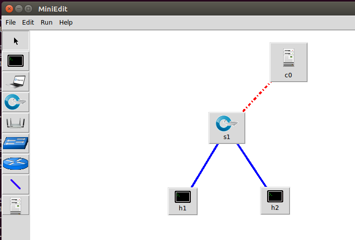
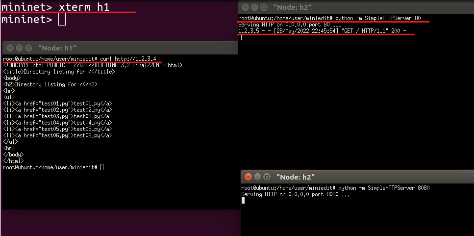

# week14

## 規則的方式將switch擁有NAT技術。

* **建議看一下**，否則接下來的步驟，會不知道為啥要這麼做!?
[NAT的相關知識-維基百科](https://zh.wikipedia.org/zh-tw/%E7%BD%91%E7%BB%9C%E5%9C%B0%E5%9D%80%E8%BD%AC%E6%8D%A2)

* ### 拓樸圖


* ### 代碼
```
#!/usr/bin/python

from mininet.net import Mininet
from mininet.node import RemoteController, OVSKernelSwitch, Host
from mininet.cli import CLI
from mininet.link import TCLink, Intf
from mininet.log import setLogLevel, info
from subprocess import call


def myNetwork():

    net = Mininet()

    info( '*** Adding controller\n' )
    c0 = net.addController(name='c0',
                           controller=RemoteController,
                           ip='127.0.0.1',
                           protocol='tcp',
                           port=6633)

    info( '*** Add switches/APs\n')
    s1 = net.addSwitch('s1', cls=OVSKernelSwitch)

    info( '*** Add hosts/stations\n')
    h1 = net.addHost('h1', cls=Host, ip='192.168.1.1/24', mac='00:00:00:00:00:01', defaultRoute=None)
    h2 = net.addHost('h2', cls=Host, ip='1.2.3.4/24', mac='00:00:00:00:00:02', defaultRoute=None)

    info( '*** Add links\n')
    net.addLink(h1, s1)
    net.addLink(h2, s1)

    info( '*** Starting network\n')
    net.build()
    info( '*** Starting controllers\n')
    for controller in net.controllers:
        controller.start()

    info( '*** Starting switches/APs\n')
    net.get('s1').start([c0])
    net.get('h1').cmd('arp -s 192.168.1.254 00:00:00:01:02:03')
    net.get('h1').cmd('ip route add default via 192.168.1.254')
    net.get('h2').cmd('arp -s 1.2.3.5 00:00:00:03:02:01')

    info( '*** Post configure nodes\n')

    CLI(net)
    net.stop()


if __name__ == '__main__':
    setLogLevel( 'info' )
    myNetwork()
```
1. ` net.get('h1').cmd('arp -s 192.168.1.254 00:00:00:01:02:03')` : 以靜態 ARP 的方式綁定主機，目的不讓 h1 處理 ARP 請求。
2. `net.get('h1').cmd('ip route add default via 192.168.1.254')` : 讓 h1 綁定 s1 的 接口1 的 IP路由。
3. `net.get('h2').cmd('arp -s 1.2.3.5 00:00:00:03:02:01')` : 同上原因。

### 步驟1. 執行代碼
```
python test05.py
```

### 步驟2. 檢查接口連線
```
net
```

### 步驟3. s1 處理 h1 請求(request) h2 的規則
```
sh ovs-ofctl add-flow s1 ip,nw_src=192.168.1.1,nw_dst=1.2.3.4,actions=mod_nw_src=1.2.3.5,mod_dl_dst=00:00:00:00:00:02,output:2
```

### 步驟4. s1 處理 h2 回應(reply) h1 的規則
```
sh ovs-ofctl add-flow s1 ip,nw_src=1.2.3.4,nw_dst=1.2.3.5,actions=mod_nw_dst=192.168.1.1,mod_dl_dst=00:00:00:00:00:01,output:1
```

### 步驟5. 檢查規則
```
sh ovs-ofctl dump-flows s1
```


### 步驟6. 測試
```
h1 ping h2 -c 3
```


* 注意 : 若測試無法 ping 的話，**善用 Wireshark** 偵查封包傳遞狀況。
  


## 以代碼的方式下規則

* ### 拓樸圖


* ### 環境代碼
```
#!/usr/bin/python

from mininet.net import Mininet
from mininet.node import RemoteController, OVSKernelSwitch, Host
from mininet.cli import CLI
from mininet.link import TCLink, Intf
from mininet.log import setLogLevel, info
from subprocess import call


def myNetwork():

    net = Mininet(topo=None,
                       build=False,
                       ipBase='10.0.0.0/8')

    info( '*** Adding controller\n' )
    c0 = net.addController(name='c0',
                           controller=RemoteController,
                           ip='127.0.0.1',
                           protocol='tcp',
                           port=6633)

    info( '*** Add switches/APs\n')
    s1 = net.addSwitch('s1', cls=OVSKernelSwitch)

    info( '*** Add hosts/stations\n')
    h2 = net.addHost('h2', cls=Host, ip='10.0.0.2', defaultRoute=None)
    h1 = net.addHost('h1', cls=Host, ip='10.0.0.1', defaultRoute=None)

    info( '*** Add links\n')
    net.addLink(h1, s1)
    net.addLink(h2, s1)

    info( '*** Starting network\n')
    net.build()
    info( '*** Starting controllers\n')
    for controller in net.controllers:
        controller.start()

    info( '*** Starting switches/APs\n')
    net.get('s1').start([c0])

    info( '*** Post configure nodes\n')

    CLI(net)
    net.stop()


if __name__ == '__main__':
    setLogLevel( 'info' )
    myNetwork()
```

* ### 控制器代碼
```
from pox.core import core
import pox.openflow.libopenflow_01 as of
from pox.lib.util import dpidToStr
 
log = core.getLogger()
 
def _handle_ConnectionUp (event):
  msg = of.ofp_flow_mod()
  msg.priority =1
  msg.idle_timeout = 0
  msg.match.in_port =1
  msg.actions.append(of.ofp_action_output(port = 2))
  event.connection.send(msg)
 
  msg = of.ofp_flow_mod()
  msg.priority =1
  msg.idle_timeout = 0
  msg.match.in_port =2
  msg.actions.append(of.ofp_action_output(port = 1))
  event.connection.send(msg)
 
def launch ():
  core.openflow.addListenerByName("ConnectionUp", _handle_ConnectionUp)
  log.info("mypox1")
```
1. `msg = of.ofp_flow_mod()` : 產生一個訊息，訊息對應的是一個 Open Flow 中的一個規則。
2. `msg.priority =1` : 預設的規則 **權重(`priority`) 為 1**。
3. `msg.idle_timeout = 0` : 預設規則 **存活時間(`idle_timeout` )為 0**，也就是說該規則 **永不刪除**，
4. `msg.match.in_port =1` : 匹配規則，從 接口1 進入。
5. `msg.actions.append(of.ofp_action_output(port = 2))` : 執行規則中的動作屬性，從 接口2 送出。
6. `event.connection.send(msg)` : 將 規則 推送回交換機。

7. 監聽交換機與控制器之間的連線，若連線 **建立成功(`ConnectionUp`)** 執行後面的 **事件規則(`_handle_ConnectionUp`)**。
    ```
    def launch ():
    core.openflow.addListenerByName("ConnectionUp", _handle_ConnectionUp)
    log.info("mypox1")
    ```

### 步驟1. 在新終端執行規則
#### 1-1 在本機開啟新的終端介面


#### 1-2 切換到 pox 控制器目錄下
```
cd /home/user/pox/ext
```
#### 1-3 新增並保存上方的 *控制器代碼*
```
gedit test.py
```

#### 1-4 執行上方代碼
```
./pox.py test
```


### 步驟2. 執行 *環境代碼*
* 注意 : 你應該要有 **兩個終端視窗**，其中一個執行控制器代碼，並監聽交換機與連線的終端視窗，另一個是執行環境代碼的視窗。
```
python test06.py
```

### 步驟3. 進行測試
```
h1 ping h2 -c 3
```


* ### 補充
倘若 **控制器與交換機斷開連線**，交換機 **仍然可以傳遞封包**，因為 **規則沒有消失**，
源於代碼中這行指令 `msg.idle_timeout = 0`，導致規則不會消失，若想設為 **10秒後規則消失**，
**將 0 改為 10**，規則就會在 **10秒後遭到刪除**，但一旦刪除就 **無法傳遞封包**。


## port forwarding 規則
* 附註 : 因為是 [主題1-規則的方式將switch擁有nat技術](#規則的方式將switch擁有nat技術) 的延伸，所以大相逕庭。

* ### 拓樸圖


* ### 環境代碼
```
#!/usr/bin/python

from mininet.net import Mininet
from mininet.node import RemoteController, OVSKernelSwitch, Host
from mininet.cli import CLI
from mininet.link import TCLink, Intf
from mininet.log import setLogLevel, info
from subprocess import call


def myNetwork():

    net = Mininet()

    info( '*** Adding controller\n' )
    c0 = net.addController(name='c0',
                           controller=RemoteController,
                           ip='127.0.0.1',
                           protocol='tcp',
                           port=6633)

    info( '*** Add switches/APs\n')
    s1 = net.addSwitch('s1', cls=OVSKernelSwitch)

    info( '*** Add hosts/stations\n')
    h1 = net.addHost('h1', cls=Host, ip='192.168.1.1/24', mac='00:00:00:00:00:01', defaultRoute=None)
    h2 = net.addHost('h2', cls=Host, ip='1.2.3.4/24', mac='00:00:00:00:00:02', defaultRoute=None)

    info( '*** Add links\n')
    net.addLink(h1, s1)
    net.addLink(h2, s1)

    info( '*** Starting network\n')
    net.build()
    info( '*** Starting controllers\n')
    for controller in net.controllers:
        controller.start()

    info( '*** Starting switches/APs\n')
    net.get('s1').start([c0])
    net.get('h1').cmd("arp -s 192.168.1.254 00:00:00:01:02:03")
    net.get('h1').cmd("ip route add default via 192.168.1.254")  
    net.get('h2').cmd("arp -s 1.2.3.5 00:00:00:03:02:01")

    info( '*** Post configure nodes\n')

    CLI(net)
    net.stop()


if '__main__' == __name__:
    setLogLevel( 'info' )
    myNetwork()
```

### 步驟1. 執行環境代碼
```
python test05.py
```

### 步驟2. h1 開啟簡易網頁伺服器
#### 2-1 開啟節點終端
```
mininet> xterm h1
```
#### 2-2 開啟網頁節點終端
```
python -m SimpleHTTPServer 80
```


### 步驟3. 加入規則
* 注意 : 在傳輸層的TCP連線時，會需要 **三項交握**，所以 **第一條規則** 在處理 h2  **送出的 Seq 和 確認Seq + ACK**，隨後的 **第二條規則在處理 h1 回給 h2 的ACK**。
#### 3-1 h2 到 h1 的 port forwarding 規則
```
sh ovs-ofctl add-flow s1 tcp,nw_src=1.2.3.4,nw_dst=1.2.3.5,tp_dst=8888,actions=mod_nw_dst=192.168.1.1,mod_dl_dst=00:00:00:00:00:01,mod_tp_dst=80,output:1
```
### 3-2 h1 回給 h2 的 port forwarding 規則
```
sh ovs-ofctl add-flow s1 tcp,nw_src=192.168.1.1,nw_dst=1.2.3.4,tp_src=80,actions=mod_nw_src=1.2.3.5,mod_dl_dst=00:00:00:00:00:02,mod_tp_src=8888,output:2
```

### 步驟4. 檢查規則
```
mininet> sh ovs-ofctl dump-flows s1
```


### 步驟5. 測試
#### 5-1 開啟 h2 的節點終端
```
mininet> xterm h2
```
#### 5-2 h2 訪問h1網頁
```
curl 1.2.3.5:8888
```


## OVS加入防火牆規則

* ### 拓樸圖


* ### 需求測試
1. h1 可以PING h2
2. h1 可以訪問 h2 的 80 埠號的網頁
3. h1 不可以訪問 h2 的 8080 埠號的網頁

* ### 環境代碼
```
#!/usr/bin/python

from mininet.net import Mininet
from mininet.node import RemoteController, OVSKernelSwitch, Host
from mininet.cli import CLI
from mininet.link import TCLink, Intf
from mininet.log import setLogLevel, info
from subprocess import call


def myNetwork():

    net = Mininet()

    info( '*** Adding controller\n' )
    c0 = net.addController(name='c0',
                           controller=RemoteController,
                           ip='127.0.0.1',
                           protocol='tcp',
                           port=6633)

    info( '*** Add switches/APs\n')
    s1 = net.addSwitch('s1', cls=OVSKernelSwitch)

    info( '*** Add hosts/stations\n')
    h1 = net.addHost('h1', cls=Host, ip='192.168.1.1/24', mac='00:00:00:00:00:01', defaultRoute=None)
    h2 = net.addHost('h2', cls=Host, ip='1.2.3.4/24', mac='00:00:00:00:00:02', defaultRoute=None)

    info( '*** Add links\n')
    net.addLink(h1, s1)
    net.addLink(h2, s1)

    info( '*** Starting network\n')
    net.build()
    info( '*** Starting controllers\n')
    for controller in net.controllers:
        controller.start()

    info( '*** Starting switches/APs\n')
    net.get('s1').start([c0])
    net.get('h1').cmd("arp -s 192.168.1.254 00:00:00:01:02:03")
    net.get('h1').cmd("ip route add default via 192.168.1.254")  
    net.get('h2').cmd("arp -s 1.2.3.5 00:00:00:03:02:01")

    info( '*** Post configure nodes\n')

    CLI(net)
    net.stop()


if '__main__' == __name__:
    setLogLevel( 'info' )
    myNetwork()
```

### 步驟1. 執行環境代碼
```
python test05.py
```

### 步驟2. 開啟節點終端
```
mininet> xterm h1 h2 h2
```

### 步驟3. h2 節點終端開啟網頁伺服器
#### 3-1 其中一個 h2 的終端機，開啟80埠的網頁伺服器
```
python -m SimpleHTTPServer 80
```
#### 3-2 另一個 h2 的終端機，開啟 8080埠 的網頁伺服器
```
python -m SimpleHTTPServer 8080
```


### 步驟4. 需求測試第 1 項的規則
#### 4-1 處理 ping request
```
sh ovs-ofctl add-flow s1 priority=10,ip,nw_src=192.168.1.1,nw_dst=1.2.3.4,actions=mod_nw_src=1.2.3.5,mod_dl_dst=00:00:00:00:00:02,output:2
```
#### 4-2 處理 ping reply
```
sh ovs-ofctl add-flow s1 priority=10,ip,nw_src=1.2.3.4,nw_dst=1.2.3.5,actions=mod_nw_dst=192.168.1.1,mod_dl_dst=00:00:00:00:00:01,output:1
```
### 步驟5. 測試第 1 項需求測試是否成立


### 步驟6. 需求測試第 2 項的規則
#### 6-1 處理傳輸層送出的封包 port forwarding
```
sh ovs-ofctl add-flow s1 priority=100,tcp,nw_src=192.168.1.1,nw_dst=1.2.3.4,tp_dst=80,actions=mod_nw_src=1.2.3.5,mod_dl_dst=00:00:00:00:00:02,output:2
```
#### 6-2 處理傳輸層回覆的封包 port forwarding
```
sh ovs-ofctl add-flow s1 priority=100,tcp,nw_src=1.2.3.4,nw_dst=1.2.3.5,tp_src=80,actions=mod_nw_dst=192.168.1.1,mod_dl_dst=00:00:00:00:00:01,output:1
```
#### 6-3 檢查規則


### 步驟7. 測試第 2 項需求是否成立
#### 7-1 開啟 h1 節點終端
```
mininet> xterm h1
```
#### 7-2 h1 訪問 h2 的在 80埠 的網頁
```
curl http://1.2.3.4
```


### 步驟8. 需求測試第 3 項規則
```
sh ovs-ofctl add-flow s1 priority=100,tcp,nw_src=192.168.1.1,nw_dst=1.2.3.4,tp_dst=8080,actions=DROP
```


### 步驟9. 測試第 3 項需求是否成立
* 注意 : 開啟 8080埠 的 h2 節點終端，沒有回應就對了，因為封包在 s1 的時候就遭到丟棄了。
```
curl http://1.2.3.4:8080
```


* ### 總測試


* ### [了解更詳細的POX控制器的各種說明](https://noxrepo.github.io/pox-doc/html/)