# week15
## 本地鏡像源提供服務(UDP)
### 說明
* 附註 : 請搭配下圖。

如果官方源距離你的目前地理位置遙遠，比如你在台灣而官方源在美國，這樣每當你在上傳下載資料時，都必須橫跨太平洋，這在傳輸的途中可能會相對壅塞，那這時如果有一個鏡像源就在台灣，它跟在美國的官方源幾乎一樣，這時這個鏡像源就可以代替官方源提供相對應的服務給客戶，因為傳輸距離變短，相對地傳輸的速度也就變快了，所以這是一種提供新型態服務的方法。
> **鏡像源** :
>> 因為就像在照鏡子一樣，鏡像源只不過是映照在本地端，一個極為相似的官方源而已。
>
> **缺點** :
>> 如果官方源更新，鏡像源是無法即時馬上同步的。
>
> **優點** :
>> 如上所述，傳輸速度變快。

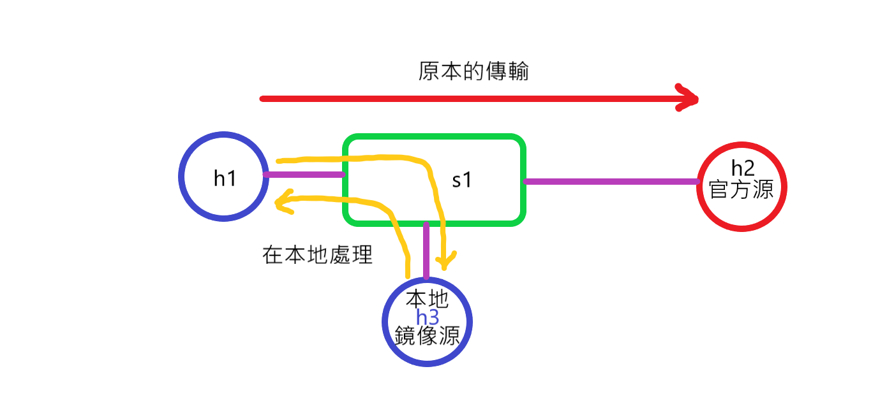

### 環境代碼
```
#!/usr/bin/env python

from mininet.net import Mininet
from mininet.node import Controller, RemoteController, OVSController
from mininet.node import CPULimitedHost, Host, Node
from mininet.node import OVSKernelSwitch, UserSwitch
from mininet.node import IVSSwitch
from mininet.cli import CLI
from mininet.log import setLogLevel, info
from mininet.link import TCLink, Intf
from subprocess import call

def myNetwork():

    net = Mininet( topo=None,
                   build=False,
                   ipBase='10.0.0.0/8')

    info( '*** Adding controller\n' )
    c0=net.addController(name='c0',
                      controller=RemoteController,
                      ip='127.0.0.1',
                      protocol='tcp',
                      port=6633)

    info( '*** Add switches\n')
    s1 = net.addSwitch('s1', cls=OVSKernelSwitch)

    info( '*** Add hosts\n')
    
    h1 = net.addHost('h1', cls=Host, ip='10.0.0.1/24', mac='00:00:00:00:00:01',defaultRoute=None)
    h2 = net.addHost('h2', cls=Host, ip='10.0.0.2/24', mac='00:00:00:00:00:02',defaultRoute=None)
    h3 = net.addHost('h3', cls=Host, ip='10.0.0.3/24', mac='00:00:00:00:00:03',defaultRoute=None)

    info( '*** Add links\n')
    net.addLink(s1, h1)
    net.addLink(s1, h2)
    net.addLink(s1, h3)

    info( '*** Starting network\n')
    net.build()
    info( '*** Starting controllers\n')
    for controller in net.controllers:
        controller.start()

    info( '*** Starting switches\n')
    net.get('s1').start([c0])
    net.get('h1').cmd('arp -s 10.0.0.3 00:00:00:00:00:03')
    net.get('h1').cmd('arp -s 10.0.0.2 00:00:00:00:00:02')

    info( '*** Post configure switches and hosts\n')

    CLI(net)
    net.stop()

if __name__ == '__main__':
    setLogLevel( 'info' )
    myNetwork()
```

### 步驟1. 執行環境代碼
```
python test07.py
```

### 步驟2. 檢查連線狀態
```
mininet> net
```

### 步驟3. s1的規則
```
sh ovs-ofctl add-flow s1 ip,nw_src=10.0.0.1,nw_dst=10.0.0.2,actions=mod_dl_dst=00:00:00:00:00:03,mod_nw_dst=10.0.0.3,output:3
```
> 說明 : 
>> 當 **s1** 接收到的 **來源IP(`nw_src`)** 是 `10.0.0.1`，且 **目的地IP(`nw_dst`)** 是 `10.0.0.2`，就將 網卡卡號 改為 `00:00:00:00:00:03`，並且將 目的地IP 改為 `10.0.0.3`，從 **接口3(`output:3`)** 轉出。

### 步驟4. 開啟節點終端
#### 4-1 開啟 h1、h2、h3的終端介面
```
mininet> xterm h1 h2 h3
```
#### 4-2 h2、h3 作為量測的接收端，在終端介面輸入以下指令
```
iperf -s -i 1 -u
```

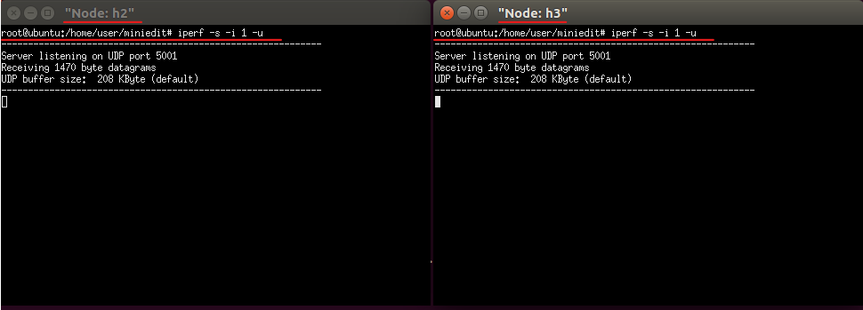

#### 4-3 h1 終端介面輸入以下指令
* 注意 : 這裡的 IP 是 h2 的IP，當輸入以下指令後，應該要 h3 接收到，因為我已經改變了它的封包 目的地IP 了!
```
iperf -c 10.0.0.2 -u -b 1M -t 20
```

### 步驟5. 測試結果圖
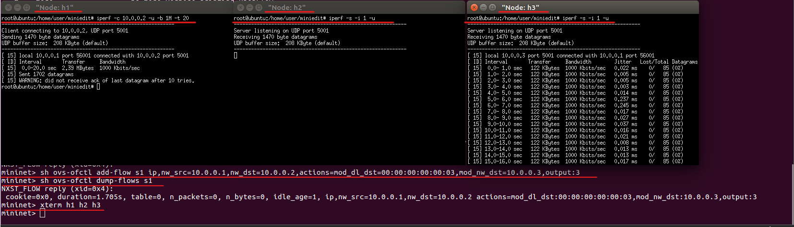


## 本地鏡像源提供服務(PING)
### 說明
跟上個主題的說明一樣，但 **上個主題是單向傳輸**，
而這個主題 PING 會有回覆的問題要解決，也就是雙向傳輸。

### 環境代碼
```
#!/usr/bin/env python

from mininet.net import Mininet
from mininet.node import Controller, RemoteController, OVSController
from mininet.node import CPULimitedHost, Host, Node
from mininet.node import OVSKernelSwitch, UserSwitch
from mininet.node import IVSSwitch
from mininet.cli import CLI
from mininet.log import setLogLevel, info
from mininet.link import TCLink, Intf
from subprocess import call

def myNetwork():

    net = Mininet( topo=None,
                   build=False,
                   ipBase='10.0.0.0/8')

    info( '*** Adding controller\n' )
    c0=net.addController(name='c0',
                      controller=RemoteController,
                      ip='127.0.0.1',
                      protocol='tcp',
                      port=6633)

    info( '*** Add switches\n')
    s1 = net.addSwitch('s1', cls=OVSKernelSwitch)

    info( '*** Add hosts\n')
    
    h1 = net.addHost('h1', cls=Host, ip='10.0.0.1/24', mac='00:00:00:00:00:01',defaultRoute=None)
    h2 = net.addHost('h2', cls=Host, ip='10.0.0.2/24', mac='00:00:00:00:00:02',defaultRoute=None)
    h3 = net.addHost('h3', cls=Host, ip='10.0.0.3/24', mac='00:00:00:00:00:03',defaultRoute=None)

    info( '*** Add links\n')
    net.addLink(s1, h1)
    net.addLink(s1, h2)
    net.addLink(s1, h3)

    info( '*** Starting network\n')
    net.build()
    info( '*** Starting controllers\n')
    for controller in net.controllers:
        controller.start()

    info( '*** Starting switches\n')
    net.get('s1').start([c0])
    net.get('h1').cmd('arp -s 10.0.0.3 00:00:00:00:00:03')
    net.get('h1').cmd('arp -s 10.0.0.2 00:00:00:00:00:02')
    net.get('h2').cmd('arp -s 10.0.0.1 00:00:00:00:00:01')
    net.get('h2').cmd('arp -s 10.0.0.3 00:00:00:00:00:03')
    net.get('h3').cmd('arp -s 10.0.0.1 00:00:00:00:00:01')
    net.get('h3').cmd('arp -s 10.0.0.2 00:00:00:00:00:02')

    info( '*** Post configure switches and hosts\n')

    CLI(net)
    net.stop()

if __name__ == '__main__':
    setLogLevel( 'info' )
    myNetwork()
```

### 步驟1. 執行環境代碼
```
python test08.py
```

### 步驟2. s1的規則
* 注意 : 原本因該要傳送給 h2 的封包，要被傳送給 h3，而從 h3 傳回的封包，要改成 h2 的 IP + MAC address
#### 2-1 對於傳送給 h2 的封包規則
```
sh ovs-ofctl add-flow s1 ip,nw_src=10.0.0.1,nw_dst=10.0.0.2,actions=mod_dl_dst=00:00:00:00:00:03,mod_nw_dst=10.0.0.3,output:3
```
#### 2-2 處理 h3 轉發回來的封包
```
sh ovs-ofctl add-flow s1 ip,nw_src=10.0.0.3,nw_dst=10.0.0.1,actions=mod_dl_src=00:00:00:00:00:02,mod_nw_src=10.0.0.2,output:1
``` 

### 步驟3. 檢查 s1 規則
```
sh ovs-ofctl dump-flows s1
```

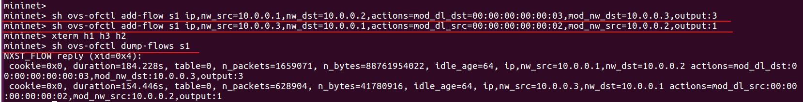

### 步驟4. 開啟節點終端
#### 4-1 開啟 h1、h2、h3 的節點終端
```
mininet> xterm h1 h2 h3
```
#### 4-2 h2、h3 作為量測的接收端，在終端介面輸入以下指令
```
tcpdump -i h3-eth0		#請在 h3 的終端機介面輸入此指令
tcpdump -i h2-eth0		#請在 h2 的終端機介面輸入此指令
```

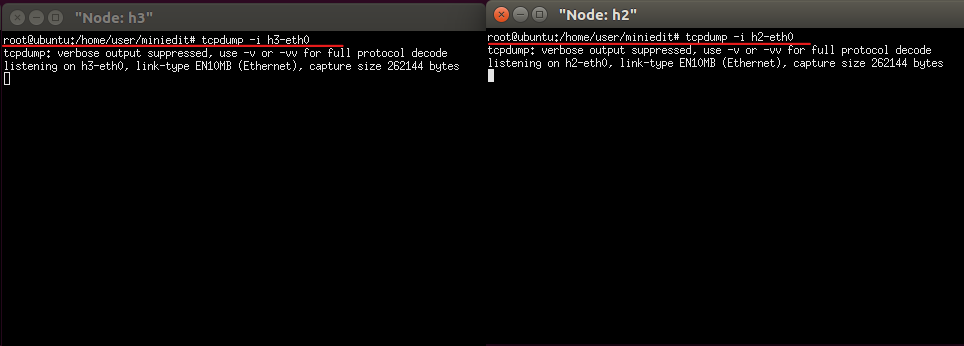

#### 4-3 h1 傳送封包給 h2
```
ping 10.0.0.2 -c 20
```

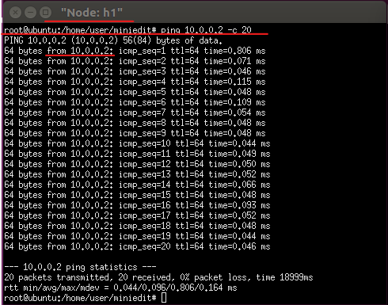

### 步驟5. 測試結果
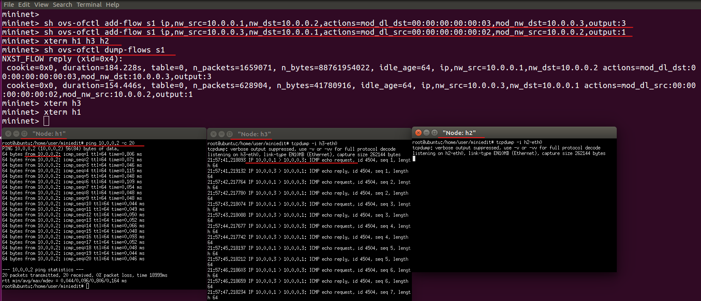


## 快速錯誤切換(fastfailover)

### 說明
* 附註 : 搭配示意圖。
  
以下圖的例子說明，當 **h1 傳輸資料給 h2** 時，s1 接收到封包後，若偵測到 **與 s2 的連線中斷**，會 **自動轉傳往 s3 的 替代路徑**，將封包給傳送給 h2，這就是 **快速錯誤切換(fastfailover)**，如果不做 **快速錯誤切換(fastfailover)** 的話，基本上就是直接斷線了，不然就是控制器去監聽每個線路，當有線路斷線的話，控制器就重新下放規則。

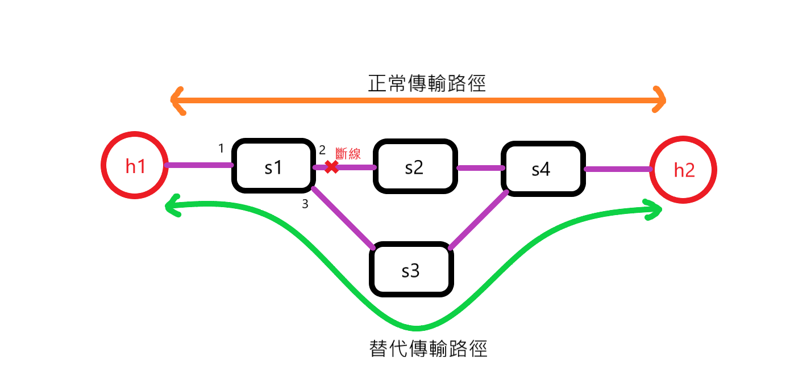

### 環境代碼
```
from mininet.net import Mininet
from mininet.node import Controller, RemoteController, OVSKernelSwitch, UserSwitch, OVSSwitch
from mininet.cli import CLI
from mininet.log import setLogLevel
from mininet.link import Link, TCLink

def topology():
        net = Mininet( controller=RemoteController, link=TCLink, switch=OVSKernelSwitch)
 
        # Add hosts and switches
        h1= net.addHost( 'h1', mac="00:00:00:00:00:01" )
        h2 = net.addHost( 'h2', mac="00:00:00:00:00:02" )

        s1 = net.addSwitch( 's1', protocols=["OpenFlow10,OpenFlow13"], listenPort=6634 )
        s2 = net.addSwitch( 's2', protocols=["OpenFlow10,OpenFlow13"], listenPort=6635 )
        s3 = net.addSwitch( 's3', protocols=["OpenFlow10,OpenFlow13"], listenPort=6636 )
        s4 = net.addSwitch( 's4', protocols=["OpenFlow10,OpenFlow13"], listenPort=6637 )

        c0 = net.addController( 'c0', controller=RemoteController, ip='127.0.0.1', port=6633 )

        net.addLink( h1, s1)
        net.addLink( h2, s4)
        net.addLink( s1, s2)
        net.addLink( s1, s3)
        net.addLink( s2, s4)
        net.addLink( s3, s4)
        net.build()
        c0.start()
        s1.start( [c0] )
        s2.start( [c0] )
        s3.start( [c0] )
        s4.start( [c0] )

        print "*** Running CLI"
        CLI( net )

        print "*** Stopping network"
        net.stop()

if __name__ == '__main__':
    setLogLevel( 'info' )
    topology()   
```
1. `net = Mininet( controller=RemoteController, link=TCLink, switch=OVSKernelSwitch)` : 控制器使用遠端的控制器(`RemoteController`)，連線使用客製化的連線(`TCLink`)
2. `s1 = net.addSwitch( 's1', protocols=["OpenFlow10,OpenFlow13"], listenPort=6634 )` : 使 s1 交換機可以同時支援 openflow1.0 和 openflow1.3，以前預設都只有1.0。

### 規則腳本
* 附註 : 以往的主題規則都是直接在終端介面輸入，**這次使用的是腳本的方式定義規則**，也可以直接寫在 **環境代碼** 裡面，這樣在建立環境時就會下好交換機的規則了。
* 注意 : 以往定義規則時，都沒有寫 `-O OpenFlow13` ，因為預設是 Openflow1.0 時可以不寫，但這次主題是使用 Openflow1.3，所以必須要寫。


```
ovs-ofctl -O OpenFlow13 add-flow s2 in_port=1,actions=output:2
ovs-ofctl -O OpenFlow13 add-flow s2 in_port=2,actions=output:1
ovs-ofctl -O OpenFlow13 add-flow s3 in_port=1,actions=output:2
ovs-ofctl -O OpenFlow13 add-flow s3 in_port=2,actions=output:1
ovs-ofctl -O OpenFlow13 add-flow s4 in_port=2,actions=output:1
ovs-ofctl -O OpenFlow13 add-flow s4 in_port=3,actions=output:1
ovs-ofctl -O OpenFlow13 add-flow s4 in_port=1,actions=output:3
ovs-ofctl -O OpenFlow13 add-flow s1 in_port=2,actions=output:1
ovs-ofctl -O OpenFlow13 add-flow s1 in_port=3,actions=output:1
ovs-ofctl -O OpenFlow13 add-group s1 group_id=4,type=ff,bucket=watch_port:2,output:2,bucket=watch_port:3,output:3
ovs-ofctl -O OpenFlow13 add-flow s1 in_port=1,actions=group:4
```
1. `ovs-ofctl -O OpenFlow13 add-flow s2 in_port=1,actions=output:2` : 當有封包從 s2 的 接口1 進來，就從 接口2 出去。
2. `ovs-ofctl -O OpenFlow13 add-flow s2 in_port=2,actions=output:1` : 原理同上。
3. 規則說明
    ```
    ovs-ofctl -O OpenFlow13 add-group s1 group_id=4,type=ff,bucket=watch_port:2,output:2,bucket=watch_port:3,output:3
    ```
    > `group_id=4` : 給該規則一個 編號4。
    > 
    > `type=ff` : 表示該規則類型擁有 fastfail 功能。
    > 
    > `bucket=watch_port:2,output:2` : 監聽 接口2，若 接口2 正常就往 接口2 送出。
    > 
    > `bucket=watch_port:3,output:3` : 監聽 接口3，若 接口3 正常就往 接口3 送出。
    >> 且因 `bucket=watch_port:2` 寫在 `bucket=watch_port:3` 前面，所以 `bucket=watch_port:2` 權重比 `bucket=watch_port:3` 大，也就是寫在越前面的權重越大。

4. `ovs-ofctl -O OpenFlow13 add-flow s1 in_port=1,actions=group:4` : 當有封包從 s1 的 接口1 進入時，就參照 **編號為4(group_id=4)** 的規則。

### 步驟1. 執行上方的環境代碼
* 附註 : 檔案名稱叫什麼無所謂。
```
python fast-fail-over.py
```

### 步驟2. 執行上方的規則腳本
#### 2-1 首先新增一個本地終端

#### 2-2 變更規則腳本為可執行權限
```
chmod +x rules01.sh
```
#### 2-3 執行規則腳本
```
./rules01.py
```

### 步驟3. 檢查規則是否添加
```
sh ovs-ofctl dump-flows s1
```
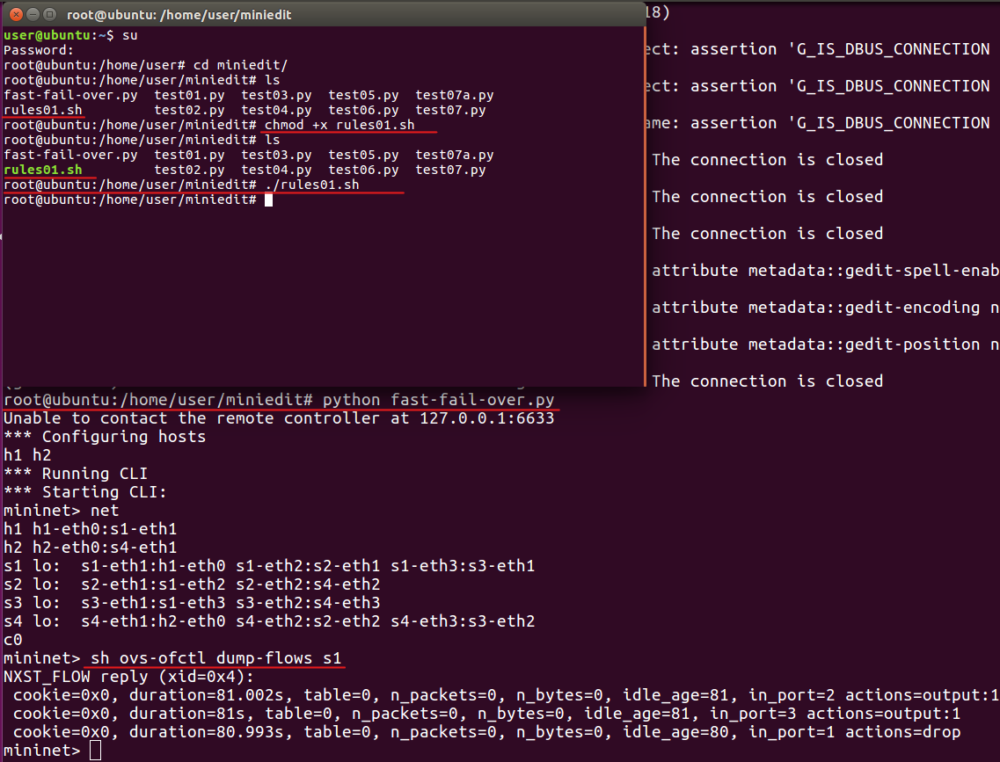

### 步驟4. 紀錄當前接口狀態
該指令可以查看，當前指定的交換機的各個接口狀態。
```
sh ovs-ofctl dump-ports s1
```
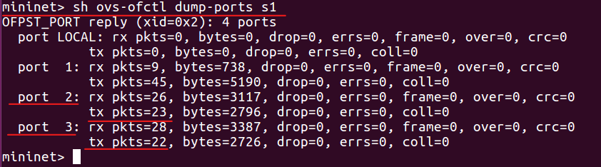

### 步驟5. 測試01(走正常的傳輸路徑)
#### 5-1 開啟 h1 的節點終端
```
mininet> xterm h1
```
#### 5-2 在 h1 的節點終端 ping h2
```
ping 10.0.0.2 -c 10
```
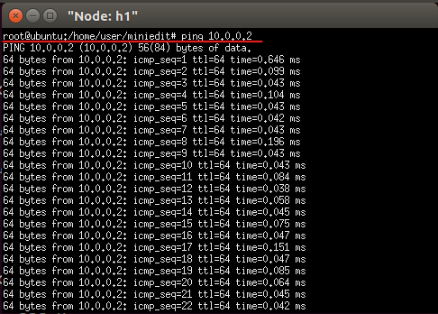
#### 5-3 再次查看 s1 的接口狀態
從下圖可以看到，s1 的 port2 的 `tx pkts` 一直遞增，表示一直有封包從 port2 送出。
```
sh ovs-ofctl dump-ports s1
```
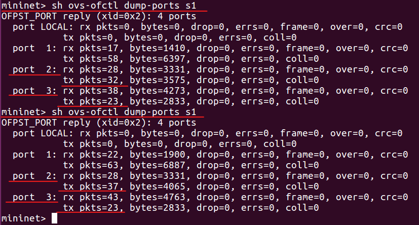

### 步驟6. 測試02(當正常路徑斷線)
#### 6-1 中斷 s1 和 s2 的連線
```
link s1 s2 down
```
#### 6-2 查看 s1 的接口狀態
這次可以看到換 s1 的 port3，在不斷地遞增，就表示原本從 port2 轉發的封包，全部改走 port3 了。
```
sh ovs-ofctl dump-ports s1
```
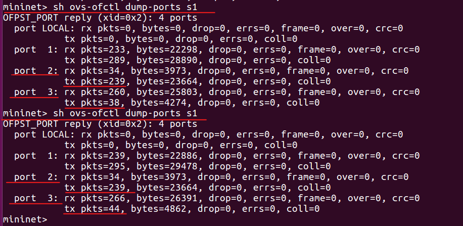


## 讓OpenVswitch 擁有附載均衡(group-select)
* 注意 : 該方法僅適用於TCP。

### 說明
當 h1 傳送封包給 h2 時，為了避免所有封包都往同一條線路傳送，導致線路的封包阻塞傳輸速度變慢，
所以可以使用附載均衡器，附載均衡器會隨機發配封包給各個線路，不會有線路是閒置狀態，從而降低封包阻塞傳輸速度變慢的情形。

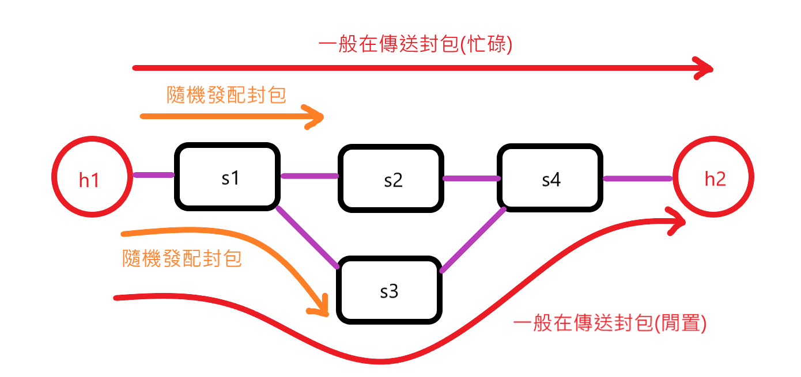

### 環境代碼
```
from mininet.net import Mininet
from mininet.node import Controller, RemoteController, OVSKernelSwitch, UserSwitch, OVSSwitch
from mininet.cli import CLI
from mininet.log import setLogLevel
from mininet.link import Link, TCLink

def topology():
        net = Mininet( controller=RemoteController, link=TCLink, switch=OVSKernelSwitch)

        # Add hosts and switches
        h1= net.addHost( 'h1', mac="00:00:00:00:00:01" )
        h2 = net.addHost( 'h2', mac="00:00:00:00:00:02" )

        s1 = net.addSwitch( 's1', protocols=["OpenFlow10,OpenFlow13"], listenPort=6634 )
        s2 = net.addSwitch( 's2', protocols=["OpenFlow10,OpenFlow13"], listenPort=6635 )
        s3 = net.addSwitch( 's3', protocols=["OpenFlow10,OpenFlow13"], listenPort=6636 )
        s4 = net.addSwitch( 's4', protocols=["OpenFlow10,OpenFlow13"], listenPort=6637 )

        c0 = net.addController( 'c0', controller=RemoteController, ip='127.0.0.1', port=6633 )

        net.addLink( h1, s1)
        net.addLink( h2, s4)
        net.addLink( s1, s2)
        net.addLink( s1, s3)
        net.addLink( s2, s4)
        net.addLink( s3, s4)
        net.build()
        c0.start()
        s1.start( [c0] )
        s2.start( [c0] )
        s3.start( [c0] )
        s4.start( [c0] )

        print "*** Running CLI"
        CLI( net )

        print "*** Stopping network"
        net.stop()

if __name__ == '__main__':
    setLogLevel( 'info' )
    topology()   
```

### 規則腳本

```
ovs-ofctl -O OpenFlow13 add-flow s2 in_port=1,actions=output:2
ovs-ofctl -O OpenFlow13 add-flow s2 in_port=2,actions=output:1
ovs-ofctl -O OpenFlow13 add-flow s3 in_port=1,actions=output:2
ovs-ofctl -O OpenFlow13 add-flow s3 in_port=2,actions=output:1
ovs-ofctl -O OpenFlow13 add-flow s4 in_port=2,actions=output:1
ovs-ofctl -O OpenFlow13 add-flow s4 in_port=3,actions=output:1
ovs-ofctl -O OpenFlow13 add-flow s4 in_port=1,actions=output:3
ovs-ofctl -O OpenFlow13 add-flow s1 in_port=2,actions=output:1
ovs-ofctl -O OpenFlow13 add-flow s1 in_port=3,actions=output:1
ovs-ofctl -O OpenFlow13 add-group s1 group_id=5,type=select,bucket=output:2,bucket=output:3
ovs-ofctl -O OpenFlow13 add-flow s1 in_port=1,actions=group:5
```
1. `ovs-ofctl -O OpenFlow13 add-group s1 group_id=5,type=select,bucket=output:2,bucket=output:3` : `type=select` 表示該規則類型擁有 附載均衡 的功能。

### 步驟1. 執行環境代碼
```
python group-select.py
```

### 步驟2. 執行上方的規則腳本
#### 2-1 首先新增一個本地終端

#### 2-2 變更規則腳本為可執行權限
```
chmod +x rules02.sh
```
#### 2-3 執行規則腳本
```
./rules02.py
```

### 步驟3. 檢查規則是否添加
```
sh ovs-ofctl dump-flows s1
```
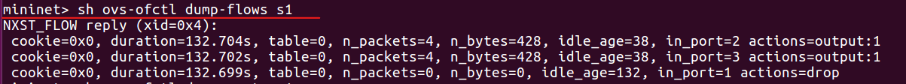

### 步驟4. 紀錄當前 s1 接口狀態
```
sh ovs-ofctl dump-ports s1
```
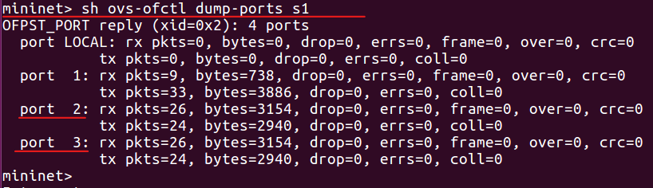

### 步驟5. 開啟節點終端
#### 5-1 開啟 h1、h2 的節點終端
```
mininet> xterm h1 h2
```
#### 5-2 h2 作為量測的接收端
```
iperf -s -i 1 -p 5555
```
#### 5-3 h1 作為量測的傳送端
```
iperf -c 10.0.0.2 -p 5555
```
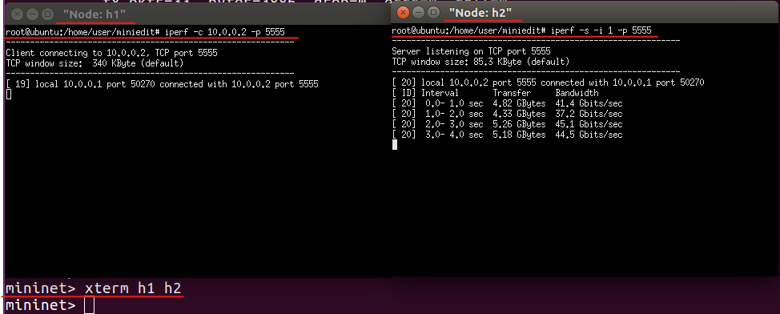

### 步驟6. 再次查看 s1 的端口狀態
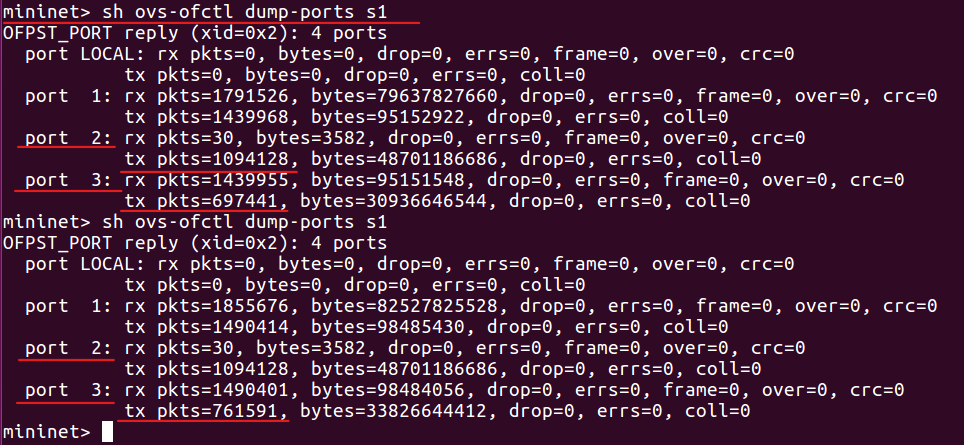