# week16
## p4交換機
### 第二代 SDN
* #### 為什麼要學第二代 SDN
1. 在第一代 SDN 的環境下，若想要去對該封包做openflow本身沒有支援的通訊協定，基本上是不行處理該封包的。
2. 讓整個網路的架構跟平台更有彈性。
* #### 特點
1. 可以自訂義封包的標頭，如 : 乙太網路、IP、TCP、UDP 等等的標頭。 
2. 可以處理各種特殊的封包。
3. 可以自己定義對封包的處理，不像第一代 SDN ，只能 丟棄、複製、flooding 等等的固定處理。
4. 支援 Runtime API，也就是當 網路設備 在運行的狀態下，可以直接改變處理封包的行為。

### 資料平面程式化(Data plane programming)
* #### 為什麼資料平面要程式化
1. 在資料平面進行程式設計，可以做很多複雜的處理
2. 在資料的傳輸上，可以更加的快速
* #### 範例
以下圖為例，當我們正常傳輸的情況下，**client端** 將資料傳輸給 **server端** 做處理時，路途是十分的遙遠，如果我們可以在傳輸資料的過程中，已經在 **網路設備** 對資料處理好了，我們就可以直接將處理好的資料，直接返傳回給 **clien端**，這不僅加快了傳輸速度也可以減少 **server端** 的負擔，而不用每次都必須傳給 **server端**，再將資料傳回來，這不僅傳輸速度較慢或丟包的風險，也會增加封包竊取的安全風險。

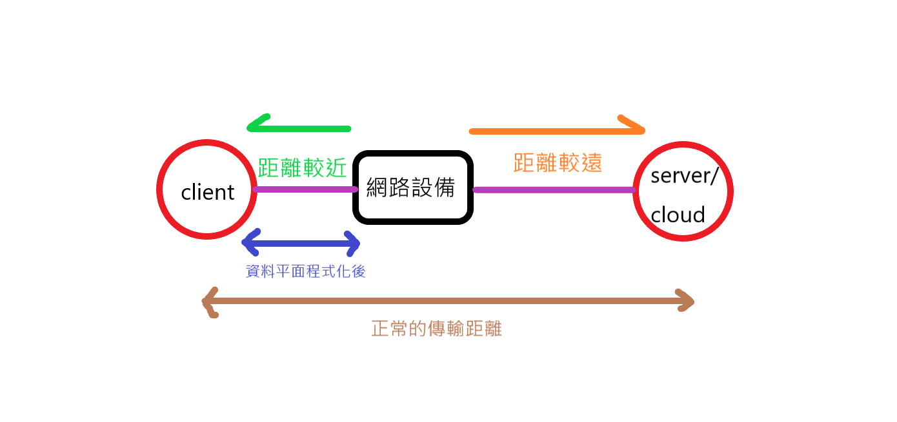

* ####  資料平面可程式化的能力
1. 新增功能。
2. 降低複雜度。
3. 資源的有效運用。
4. 更強大的可視化，如 : [telemetry(遙測)](https://www.sdnlab.com/24184.html)、etc等等。

### p4 v1 module
* 附註 : 搭配下圖解說

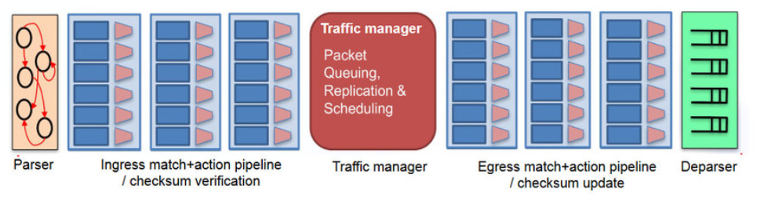
#### 1. Parser
可以自行定義，解析封包的程度，例如只解析封包內ethernet header，就會有 **網卡卡號來源(mac source)和目的地(mac destination )，剩下的都當成 payload(負載)，
或是解析封包的 IP header，這樣就會包含 ethernet header 和 IP header 內的 **來源IP(IP src) 和 目的地IP(IP dst)**，且其餘的不分都當成 payload(負載)，
並且 Parser 會將解析的各個片段拆解。
#### 2. Ingress pipline
基本上最主要的目的是，去定義 Parser 拆解的各個片段，符合哪些規則，並且去執行什麼樣的動作。
#### 3. Traffic manager
主要可以做 **佇列(quequeing)、複製封包(Replication)等等**，就如同下圖所示。
#### 4. Egress pipline
運作和 **Ingress pipline** 一樣，但不見得做一樣的事，例如 : 若要做封包抵達下一個交換機的遺失統計，就必須在出口的地方做當前封包的紀錄。
#### 5. Deparser
將 Parser 拆解的各個片段，拼接還原回一個完整的封包。


## p4 程式定義 HUB
### 說明
寫 **p4** 的程式的時候，必須要 **先寫一個 xxxx.p4(檔名隨便) 的檔**，並且需要通過編譯器，將該檔編譯成與模型相關的檔案，如 **xxxx.json**，所以此過程會相當繁瑣，在這個主題我會使用 **p4-utils 框架**，使用該框架它會自動的幫你編譯，並且自動的幫你創建出想要的網路環境，我們 **只需要擁有最基本的 xxxx.p4 和 xxxx.json** 這兩個檔就可以了，其他的相關檔案就交給 **p4-utils** 幫你解決；檔案結構如下圖。

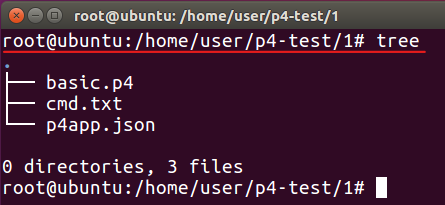

* [p4-utils連結](https://github.com/nsg-ethz/p4-utils)
* [p4-utils文獻](https://nsg-ethz.github.io/p4-utils/usage.html)

----

環境拓樸圖如下，當封包從 p4 的接口1 進入，就從 接口2 發出，若從 接口2 進入，就從 接口1 發出

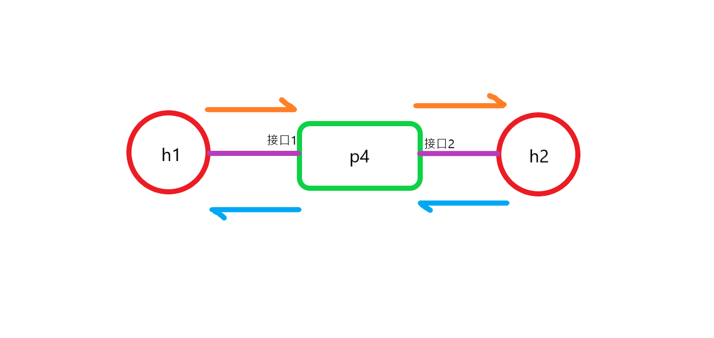

### v1model代碼(basic.p4)

```
/* -*- P4_16 -*- */
#include <core.p4>
#include <v1model.p4>

/*************************************************************************
*********************** H E A D E R S  ***********************************
*************************************************************************/
 
struct metadata {
    /* empty */
}

 

struct headers {
}

 

/*************************************************************************
*********************** P A R S E R  ***********************************
*************************************************************************/

parser MyParser(packet_in packet,
                out headers hdr,
                inout metadata meta,
                inout standard_metadata_t standard_metadata) {

    state start {
        transition accept;
    }

}

 

/*************************************************************************

************   C H E C K S U M    V E R I F I C A T I O N   *************

*************************************************************************/

 

control MyVerifyChecksum(inout headers hdr, inout metadata meta) {  
    apply {  }
}

/*************************************************************************
**************  I N G R E S S   P R O C E S S I N G   *******************
*************************************************************************/
control MyIngress(inout headers hdr,
                  inout metadata meta,
                  inout standard_metadata_t standard_metadata) {
    action drop() {
        mark_to_drop(standard_metadata);
    }

    action forward(bit<9> port) {
        standard_metadata.egress_spec = port;
    }

    table phy_forward {
        key = {
            standard_metadata.ingress_port: exact;
        }

        actions = {
            forward;
            drop;
        }
        size = 1024;
        default_action = drop();
    }

    apply {
        phy_forward.apply();
    }
}

/*************************************************************************
****************  E G R E S S   P R O C E S S I N G   *******************
*************************************************************************/

control MyEgress(inout headers hdr,
                 inout metadata meta,
                 inout standard_metadata_t standard_metadata) {
    apply {  }
}

/*************************************************************************
*************   C H E C K S U M    C O M P U T A T I O N   **************
*************************************************************************/

control MyComputeChecksum(inout headers  hdr, inout metadata meta) {
     apply {
    }
}

/*************************************************************************
***********************  D E P A R S E R  *******************************
*************************************************************************/

control MyDeparser(packet_out packet, in headers hdr) {
    apply {
    }
}

/*************************************************************************
***********************  S W I T C H  *******************************
*************************************************************************/

V1Switch(
MyParser(),
MyVerifyChecksum(),
MyIngress(),
MyEgress(),
MyComputeChecksum(),
MyDeparser()

) main;
```
---

1. `#include <core.p4>` : 匯入 p4 的核心。
2. `#include <v1model.p4>` : 匯入 v1model 的模型。
3. 告訴我們在該模型當中，有哪些部份可以供我們使用。
    ```
    /*************************************************************************
    ***********************  S W I T C H  *******************************
    *************************************************************************/

    V1Switch(
    MyParser(),
    MyVerifyChecksum(),
    MyIngress(),
    MyEgress(),
    MyComputeChecksum(),
    MyDeparser()

    ) main;
    ```
    > `MyParser()` : 解析、拆解封包。
    >
    > `MyVerifyChecksum()` : 確認該封包在之前的傳送當中是否有問題，有問題就不再做後續處理。
    >
    > `MyIngress()` : 入口規則的匹配。
    >
    > `MyEgress()` : 出口規則的匹配。
    >
    > `MyComputeChecksum()` : 封包再次檢查確認，有問題就不再做後續處理。
    >
    > `MyDeparser()` : 將封包的各個片段組合起來。

4. HEADERS架構
    ```
    /*************************************************************************
    *********************** H E A D E R S  ***********************************
    *************************************************************************/
    
    struct metadata {
        /* empty */
    }

    

    struct headers {
    }
    ```
    > `struct metadata{}` : 此欄位在該範例中用不到所以留空，但該欄位是在資料處理的當中，可能需要一些暫時性的資料去做些紀錄，就在該欄位寫入一些處理。
    > 
    > `struct headers {}` : 該範例目前也不需要對標頭做些處理，所以也留空。

5. PARSER架構
   
    基本上只會改動 `state start {}` 內裡面的內容，`parser MyParser()` 內的架構幾乎不會改。
    ```
    /*************************************************************************
    *********************** P A R S E R  ***********************************
    *************************************************************************/

    parser MyParser(packet_in packet,
                    out headers hdr,
                    inout metadata meta,
                    inout standard_metadata_t standard_metadata) {

        state start {
            transition accept;
        }

    }
    ```
    > `state start {transition accept;}` : 不在處理封包內的任何內容，直接傳輸該封包。

6. INGRESS架構
    ```
    /*************************************************************************
    **************  I N G R E S S   P R O C E S S I N G   *******************
    *************************************************************************/
    control MyIngress(inout headers hdr,
                    inout metadata meta,
                    inout standard_metadata_t standard_metadata) {
        action drop() {
            mark_to_drop(standard_metadata);
        }

        action forward(bit<9> port) {
            standard_metadata.egress_spec = port;
        }

        table phy_forward {
            key = {
                standard_metadata.ingress_port: exact;
            }

            actions = {
                forward;
                drop;
            }
            size = 1024;
            default_action = drop();
        }

        apply {
            phy_forward.apply();
        }
    }
    ```
    > `table phy_forward {}` : 定義表格的規則與動作。
    >> `key = {standard_metadata.ingress_port: exact;}` : `key` 裡面就是寫規則，當封包 **進入的 port 是完全匹配規則時**，**才做下個動作**。
    >> 
    >> `actions = {forward;drop;}` : 當規則完全匹配的時候，只做轉發或丟棄的動作。
    >> 
    >> `size = 1024;` : 該表格最多能存1024筆資料。
    >> 
    >> `default_action = drop();` : 對於沒有匹配到規則的封包，一律採用丟棄的方式。
    >
    > `action forward(bit<9> port) {standard_metadata.egress_spec = port; }` : 當封包轉發出去的時，應該丟到哪一個 port。
    >
    > `apply {phy_forward.apply();}` : 當封包傳入 p4 時，去應用上面 `phy_forward.apply()` 的表格內的規則和動作。

7. DEPARSER架構

    因為沒有拆解所以留空。
    ```
    /*************************************************************************
    ***********************  D E P A R S E R  *******************************
    *************************************************************************/

    control MyDeparser(packet_out packet, in headers hdr) {
        apply {
        }
    }
    ```

### 環境代碼(p4app.json)
基本上可以只動 `"topology{}"` 的部分，其他的目前都先不會動到。
```
{
  "program": "basic.p4",
  "switch": "simple_switch",
  "compiler": "p4c",
  "options": "--target bmv2 --arch v1model --std p4-16",
  "switch_cli": "simple_switch_CLI",
  "cli": true,
  "pcap_dump": false,
  "enable_log": false,
  "topo_module": {
    "file_path": "",
    "module_name": "p4utils.mininetlib.apptopo",
    "object_name": "AppTopoStrategies"
  },
  "controller_module": null,
  "topodb_module": {
    "file_path": "",
    "module_name": "p4utils.utils.topology",
    "object_name": "Topology"
  },
  "mininet_module": {
    "file_path": "",
    "module_name": "p4utils.mininetlib.p4net",
    "object_name": "P4Mininet"
  },
  "topology": {
    "links": [["h1", "s1"], ["h2", "s1"]],
    "hosts": {
      "h1": {
      },
      "h2": {
      }
    },
    "switches": {
      "s1": {
        "cli_input": "cmd.txt",
        "program": "basic.p4"
      }
    }
  }
}
```
> `"topology": {}` : 網路拓樸的狀態
>> `"links": [["h1", "s1"], ["h2", "s1"]]` : 連線狀況，h1 連 s1、h2 連 s1。
>> 
>> `"hosts": {"h1": {},"h2": {}}` : 拓樸內的節點主機，有 h1 和 h2。
>> 
>> `"switches": { /*內容省略*/ }` : 拓樸內的交換機有一台 s1，s1 去執行 **cmd.txt** 檔內的規則，而需要去執行的 p4 程式檔為 **basic.p4** 這支 p4 程式~.


### 定義表格規則(cmd.txt)
1. `table_add phy_forward forward 1 => 2` : 替 `phy_forward` 的表格增加規則，當封包從 port 1 進入執行 `forward` 動作，將封包從 port 2 轉出。
2. `table_add phy_forward forward 2 => 1` : 原理同上。
```
table_add phy_forward forward 1 => 2
table_add phy_forward forward 2 => 1
```

### 步驟1. 啟動 p4 程式
```
p4run
```
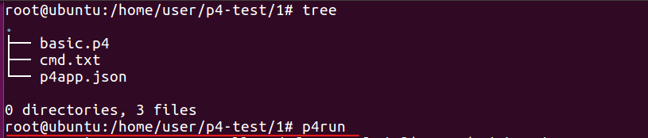

### 步驟2. 測試01
```
mininet> h1 ping h2 -c 3
```
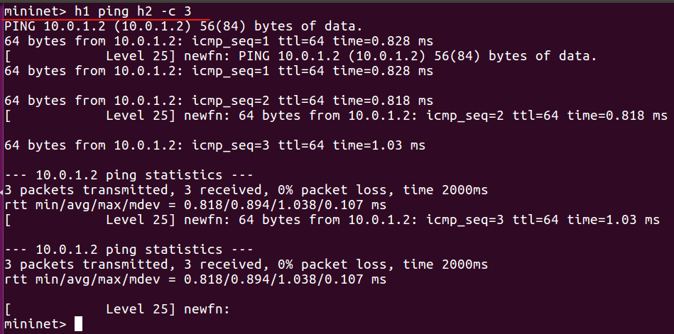

### 步驟3. 測試02(進到 s1 交換機內)
#### 3-1 新增一個本地終端機
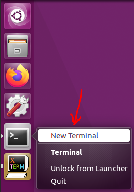

#### 3-2 查看 s1 交換機的埠號
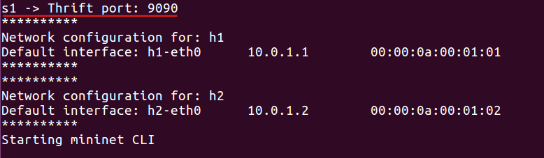

#### 3-3 查看指令提示
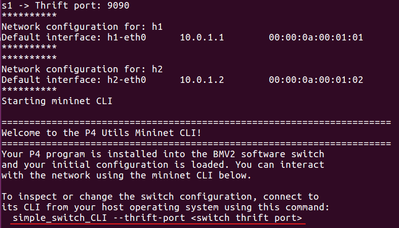

#### 3-4 執行指令進到 s1 交換機內
```
simple_switch_CLI --thrift-port 9090
```
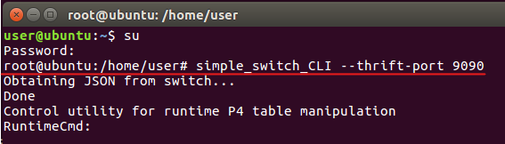

#### 3-4 查看 s1 交換機可以使用哪些指令
```
RuntimeCmd: help
```
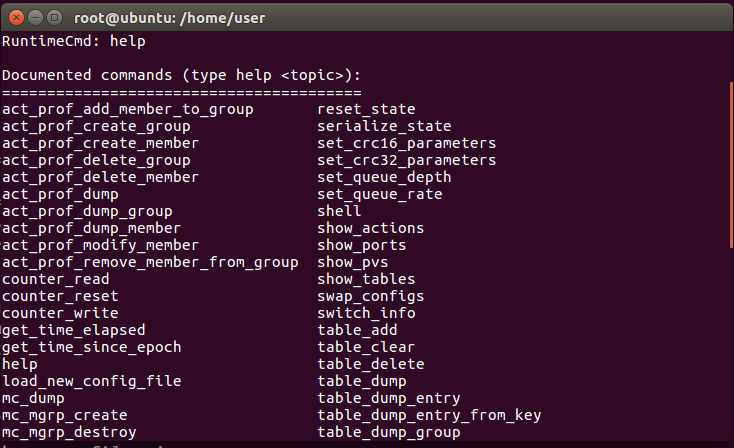

#### 3-5 查詢指令的用法
* 遇到不會用的指令，通常都可以使用該方法，來查詢使用方法。
```
help table_dump
```
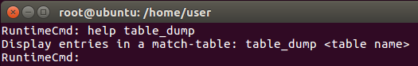

#### 3-6 查詢 s1 的所有規則
```
table_dump phy_forward
```

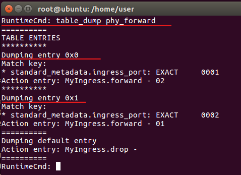

#### 3-7 刪除規則
```
table_delete phy_forward 0
```
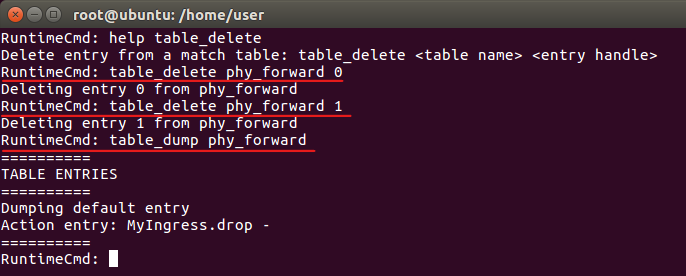

---

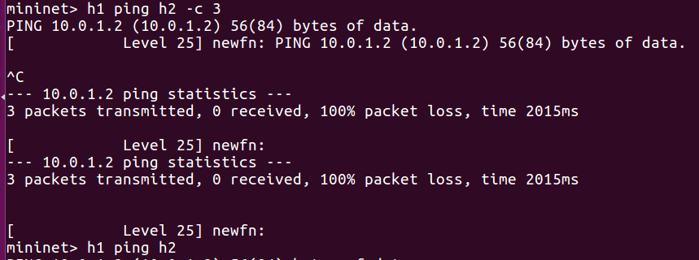

#### 3-8 添加規則
```
table_add phy_forward forward 1 => 2
table_add phy_forward forward 2 => 1
```
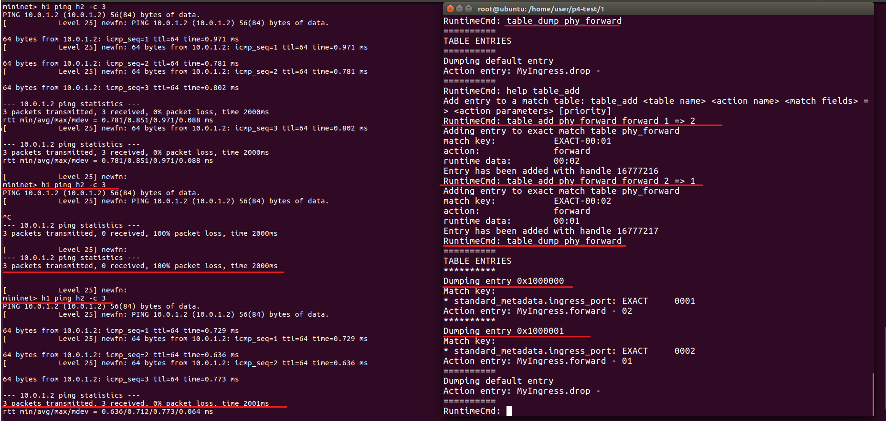

#### 3-9 離開 s1 交換機
```
EOF
```
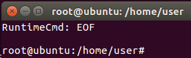


## p4 定義 HUB(兩個交換機)
* 注意 : 以下不再贅述代碼內的內容，因為結構和原理與上個主題極為相似，除非必要或特殊才會加以說明。
  
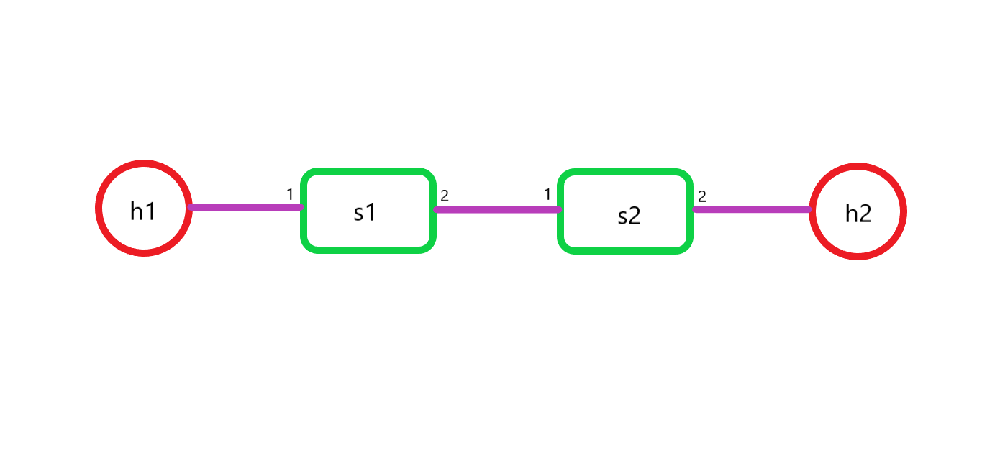

---

檔案結構

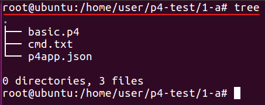

### v1model代碼(basic.p4)
```
/* -*- P4_16 -*- */
#include <core.p4>
#include <v1model.p4>

/*************************************************************************
*********************** H E A D E R S  ***********************************
*************************************************************************/
 
struct metadata {
    /* empty */
}

 

struct headers {
}

 

/*************************************************************************
*********************** P A R S E R  ***********************************
*************************************************************************/

parser MyParser(packet_in packet,
                out headers hdr,
                inout metadata meta,
                inout standard_metadata_t standard_metadata) {

    state start {
        transition accept;
    }

}

 

/*************************************************************************

************   C H E C K S U M    V E R I F I C A T I O N   *************

*************************************************************************/

 

control MyVerifyChecksum(inout headers hdr, inout metadata meta) {  
    apply {  }
}

/*************************************************************************
**************  I N G R E S S   P R O C E S S I N G   *******************
*************************************************************************/
control MyIngress(inout headers hdr,
                  inout metadata meta,
                  inout standard_metadata_t standard_metadata) {
    action drop() {
        mark_to_drop(standard_metadata);
    }

    action forward(bit<9> port) {
        standard_metadata.egress_spec = port;
    }

    table phy_forward {
        key = {
            standard_metadata.ingress_port: exact;
        }

        actions = {
            forward;
            drop;
        }
        size = 1024;
        default_action = drop();
    }

    apply {
        phy_forward.apply();
    }
}

/*************************************************************************
****************  E G R E S S   P R O C E S S I N G   *******************
*************************************************************************/

control MyEgress(inout headers hdr,
                 inout metadata meta,
                 inout standard_metadata_t standard_metadata) {
    apply {  }
}

/*************************************************************************
*************   C H E C K S U M    C O M P U T A T I O N   **************
*************************************************************************/

control MyComputeChecksum(inout headers  hdr, inout metadata meta) {
     apply {
    }
}

/*************************************************************************
***********************  D E P A R S E R  *******************************
*************************************************************************/

control MyDeparser(packet_out packet, in headers hdr) {
    apply {
    }
}

/*************************************************************************
***********************  S W I T C H  *******************************
*************************************************************************/

V1Switch(
MyParser(),
MyVerifyChecksum(),
MyIngress(),
MyEgress(),
MyComputeChecksum(),
MyDeparser()

) main;
```

### 環境代碼(p4app.json)
```
{
  "program": "basic.p4",
  "switch": "simple_switch",
  "compiler": "p4c",
  "options": "--target bmv2 --arch v1model --std p4-16",
  "switch_cli": "simple_switch_CLI",
  "cli": true,
  "pcap_dump": false,
  "enable_log": false,
  "topo_module": {
    "file_path": "",
    "module_name": "p4utils.mininetlib.apptopo",
    "object_name": "AppTopoStrategies"
  },
  "controller_module": null,
  "topodb_module": {
    "file_path": "",
    "module_name": "p4utils.utils.topology",
    "object_name": "Topology"
  },
  "mininet_module": {
    "file_path": "",
    "module_name": "p4utils.mininetlib.p4net",
    "object_name": "P4Mininet"
  },
  "topology": {
    "assignment_strategy": "l2",
    "links": [["h1", "s1"], ["s1", "s2"],["s2","h2"]],
    "hosts": {
      "h1": {
      },
      "h2": {
      }
    },
    "switches": {
      "s1": {
        "cli_input": "cmd.txt",
        "program": "basic.p4"
      },
      "s2": {
        "cli_input": "cmd.txt",
        "program": "basic.p4"
      }
    }
  }
}
```
1. `"assignment_strategy": "l2"` : IP 指派的策略是在第二層，也就是說這些節點都是在相同的區域網路。

    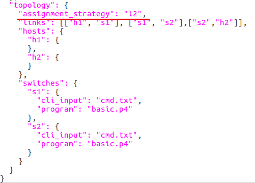

### 定義表格規則(cmd.txt)
```
table_add phy_forward forward 1 => 2
table_add phy_forward forward 2 => 1
```

### 步驟1. 啟動 p4 程式
```
p4run
```

### 步驟2. 檢查 h1、h2 IP
* 可以發現是在同一個區域網路沒錯。
```
h1 ifconfig
```
```
h2 ifconfig
```
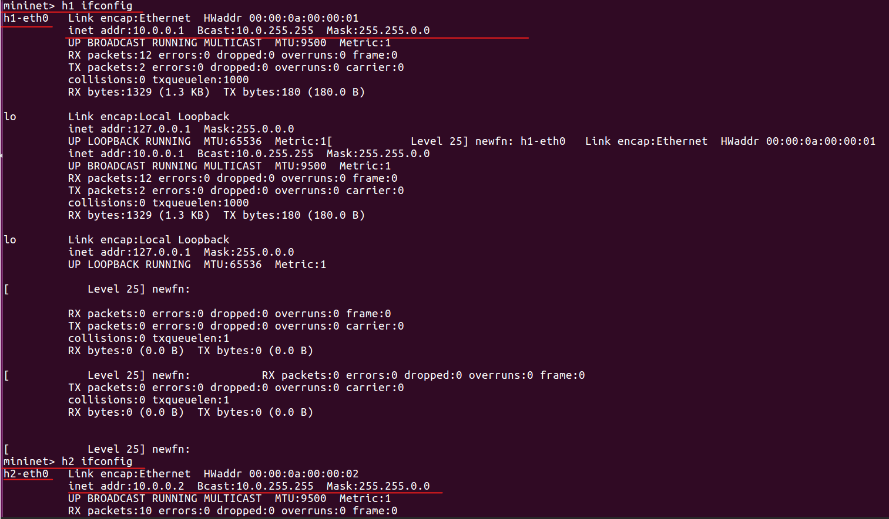

### 步驟3. 測試
```
h1 ping h2 -c 3
```
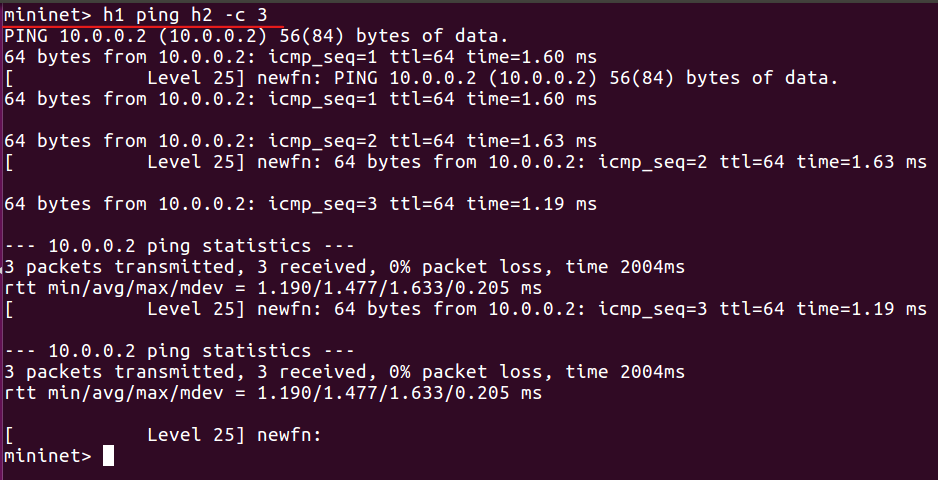


## p4 定義 layer2
### 說明
解析封包中的 **網卡目的地(mac address dst)**，以 **網卡目的地(mac address dst)** 轉發到正確的 **port**，並且讓下圖的3台主機可以互相連通。

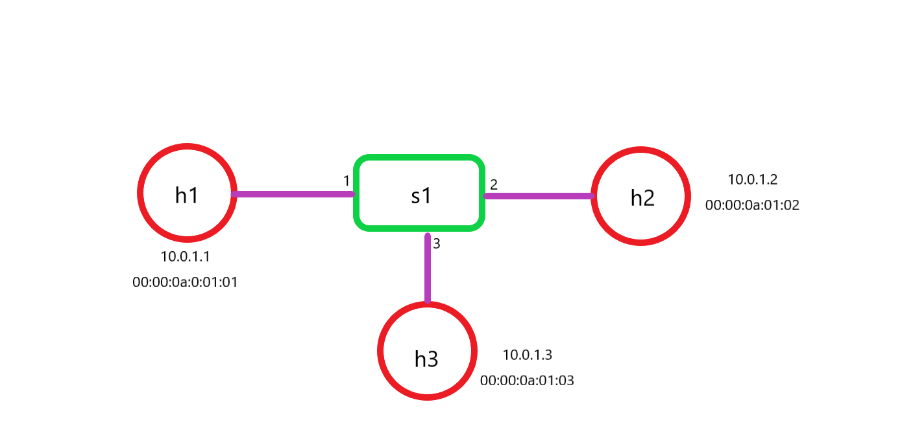

### v1model(basic,p4)
```
/* -*- P4_16 -*- */
#include <core.p4>
#include <v1model.p4>

/*************************************************************************
*********************** H E A D E R S  ***********************************
*************************************************************************/

header ethernet_t {
    bit<48> dstAddr;
    bit<48> srcAddr;
    bit<16>   etherType;
}

 
struct metadata {
    /* empty */
}

 

struct headers {
  ethernet_t   ethernet;
}

 

/*************************************************************************
*********************** P A R S E R  ***********************************
*************************************************************************/

parser MyParser(packet_in packet,
                out headers hdr,
                inout metadata meta,
                inout standard_metadata_t standard_metadata) {

    state start {
         transition parse_ethernet;
    }

     state parse_ethernet {
        packet.extract(hdr.ethernet);
        transition accept;
     }	
}

 

/*************************************************************************

************   C H E C K S U M    V E R I F I C A T I O N   *************

*************************************************************************/

 

control MyVerifyChecksum(inout headers hdr, inout metadata meta) {  
    apply {  }
}

/*************************************************************************
**************  I N G R E S S   P R O C E S S I N G   *******************
*************************************************************************/
control MyIngress(inout headers hdr,
                  inout metadata meta,
                  inout standard_metadata_t standard_metadata) {
    action drop() {
        mark_to_drop(standard_metadata);
    }

    action forward(bit<9> port) {
        standard_metadata.egress_spec = port;
    }

    table mac_forward {
        key = {
            hdr.ethernet.dstAddr: exact;
        }

        actions = {
            forward;
            drop;
        }
        size = 1024;
        default_action = drop();
    }

    apply {
        mac_forward.apply();
    }
}

/*************************************************************************
****************  E G R E S S   P R O C E S S I N G   *******************
*************************************************************************/

control MyEgress(inout headers hdr,
                 inout metadata meta,
                 inout standard_metadata_t standard_metadata) {
    apply {  }
}

/*************************************************************************
*************   C H E C K S U M    C O M P U T A T I O N   **************
*************************************************************************/

control MyComputeChecksum(inout headers  hdr, inout metadata meta) {
     apply {
    }
}

/*************************************************************************
***********************  D E P A R S E R  *******************************
*************************************************************************/

control MyDeparser(packet_out packet, in headers hdr) {
    apply {
      packet.emit(hdr.ethernet);
    }
}

/*************************************************************************
***********************  S W I T C H  *******************************
*************************************************************************/

V1Switch(
MyParser(),
MyVerifyChecksum(),
MyIngress(),
MyEgress(),
MyComputeChecksum(),
MyDeparser()

) main;
```
---
1. 定義乙太網路標頭
    ```
    header ethernet_t {
        bit<48> dstAddr;
        bit<48> srcAddr;
        bit<16>   etherType;
    }
    ```
    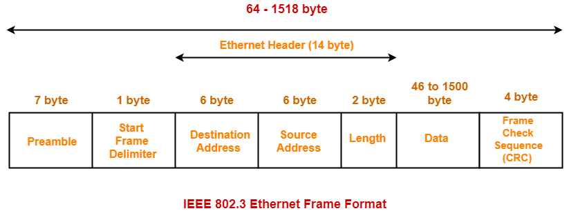

2. 宣告為 **ethernet** 的標頭
    ```
    struct headers {
    ethernet_t   ethernet;
    }
    ```

3. 分析乙太網路的標頭
    ```
        state start {
            transition parse_ethernet;
        }

        state parse_ethernet {
            packet.extract(hdr.ethernet);
            transition accept;
        }
    ```
    > ` state start {transition parse_ethernet;}` : 當執行完 **起始狀態(`state start{}`)** 後，直接轉跳到 `parse_ethernet`。
    > `state parse_ethernet {packet.extract(hdr.ethernet);transition accept;}` : 解析乙太網路的標頭，並拆分成 **hdr.ethernet.dstAddr、hdr.ethernet.srcAddr、hdr.ethernet.etherType。
    >> `hdr.ethernet.dstAddr` : 乙太網路的目的地位址。
    >>
    >> `hdr.ethernet.srcAddr` : 乙太網路的來源位址。
    >> 
    >> `hdr.ethernet.etherType` : 乙太網路的類型。

4. 當封包進入 s1 時，若封包的 **乙太網路標頭的目的地位址(ethernet header dstAddr)**，完全匹配規則中的 **乙太網路標頭的目的地位址(ethernet header dstAddr)**，才繼續往下做動作，否則丟棄該封包。
    ```
    /*************************************************************************
    **************  I N G R E S S   P R O C E S S I N G   *******************
    *************************************************************************/
    control MyIngress(inout headers hdr,
                    inout metadata meta,
                    inout standard_metadata_t standard_metadata) {
        action drop() {
            mark_to_drop(standard_metadata);
        }

        action forward(bit<9> port) {
            standard_metadata.egress_spec = port;
        }

        table mac_forward {
            key = {
                hdr.ethernet.dstAddr: exact;
            }

            actions = {
                forward;
                drop;
            }
            size = 1024;
            default_action = drop();
        }

        apply {
            mac_forward.apply();
        }
    }
    ```

5. 將在 PARSER 中拆分的 hdr.ethernet 組合回來。
    ```
    /*************************************************************************
    ***********************  D E P A R S E R  *******************************
    *************************************************************************/

    control MyDeparser(packet_out packet, in headers hdr) {
        apply {
        packet.emit(hdr.ethernet);
        }
    }
    ```

### 環境代碼(p4app.json)
```
{
  "program": "basic.p4",
  "switch": "simple_switch",
  "compiler": "p4c",
  "options": "--target bmv2 --arch v1model --std p4-16",
  "switch_cli": "simple_switch_CLI",
  "cli": true,
  "pcap_dump": true,
  "enable_log": true,
  "topo_module": {
    "file_path": "",
    "module_name": "p4utils.mininetlib.apptopo",
    "object_name": "AppTopoStrategies"
  },
  "controller_module": null,
  "topodb_module": {
    "file_path": "",
    "module_name": "p4utils.utils.topology",
    "object_name": "Topology"
  },
  "mininet_module": {
    "file_path": "",
    "module_name": "p4utils.mininetlib.p4net",
    "object_name": "P4Mininet"
  },
  "topology": {
    "links": [["h1", "s1"], ["h2", "s1"],["h3","s1"]],
    "hosts": {
      "h1": {
      },
      "h2": {
      },
      "h3": {
      }
    },
    "switches": {
      "s1": {
        "cli_input": "cmd.txt",
        "program": "basic.p4"
      }
    }
  }
}
```

### 定義表格規則(cmd.txt)
```
table_add mac_forward forward 00:00:0a:00:01:01 => 1
table_add mac_forward forward 00:00:0a:00:01:02 => 2
table_add mac_forward forward 00:00:0a:00:01:03 => 3
```
1. `table_add mac_forward forward 00:00:0a:00:01:01 => 1` : 為 `mac_forward` 表格增加規則，若 **網卡目的地(mac dst)** 是 `00:00:0a:00:01:01`，就 轉發(`forward`) 到 port1。
2. `table_add mac_forward forward 00:00:0a:00:01:02 => 2` : 同上原理
3. `table_add mac_forward forward 00:00:0a:00:01:03 => 3` : 同上原理

### 步驟1. 啟動 p4 程式
```
p4run
```

### 步驟2. 測試
```
h1 pin h3 -c 3
```
```
h2 ping h3 -c 3
```
```
h2 ping h1 -c 3
```
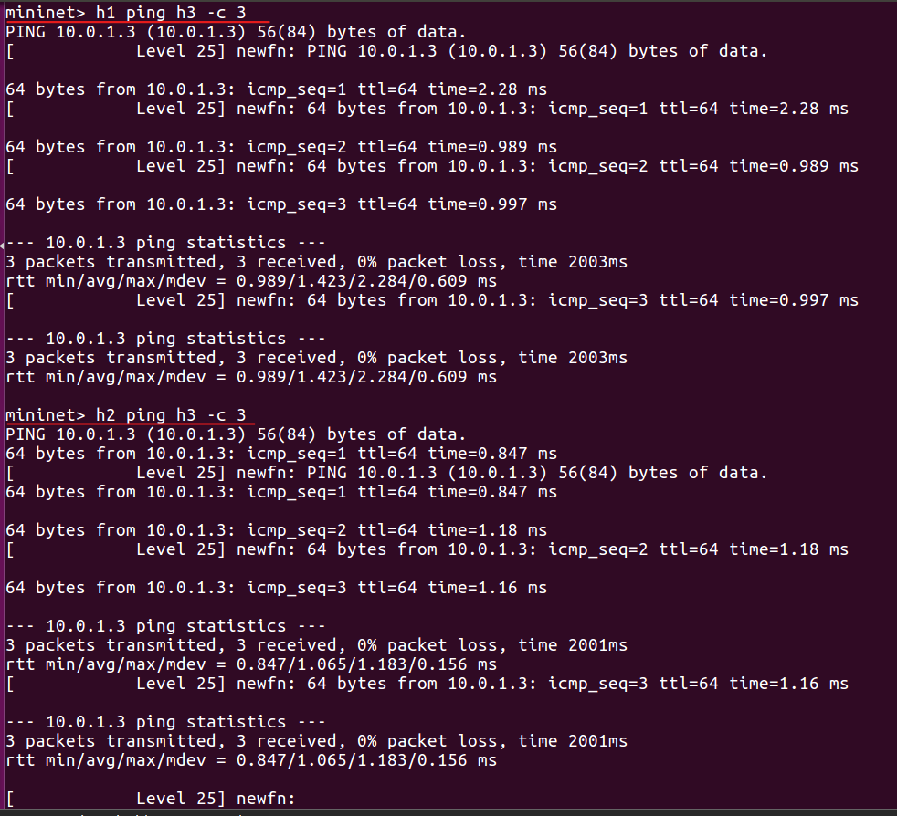
